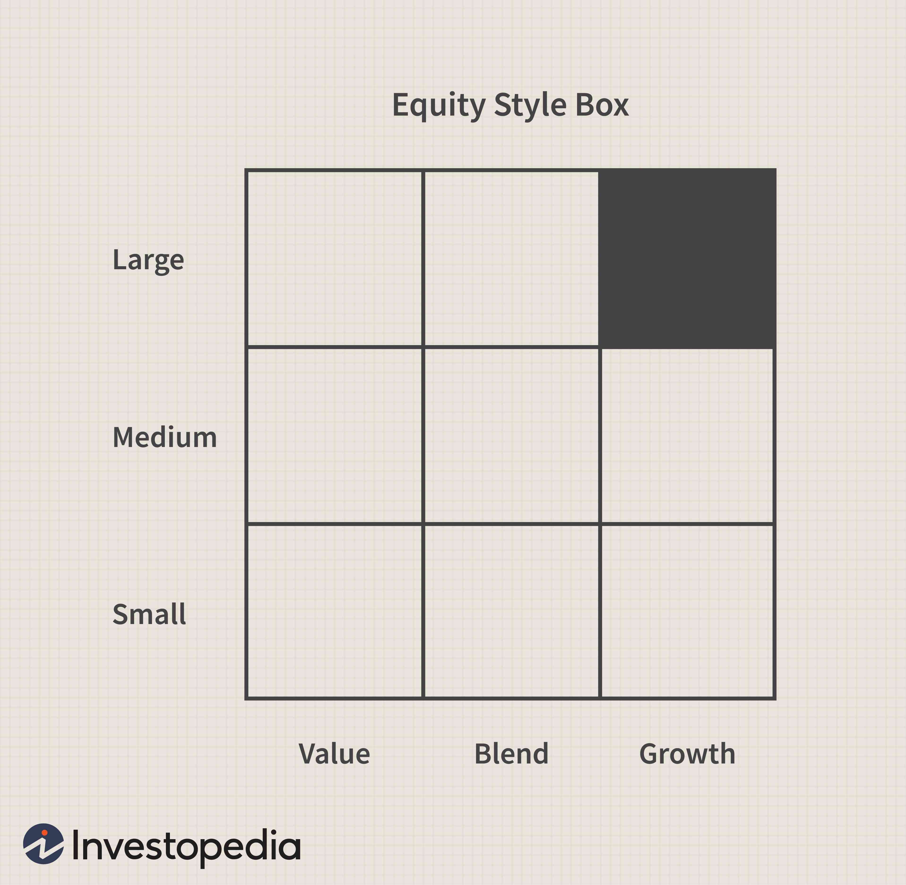

In today's fast-paced financial world, comprehending various investment styles and choosing the most suitable one for your financial strategy is essential. As investors navigate the complexities of the financial landscape, aligning investment choices with financial goals through the right strategies is paramount. Investment suitability involves matching your financial objectives with appropriate strategies, which include both traditional and modern approaches. Traditional strategies, such as value or growth investing, focus on fundamental analysis and long-term valuation. Modern strategies, including algorithmic trading (algo trading), leverage technology to enhance decision-making processes.

Algorithmic trading has become a crucial component of contemporary investment strategies. This method utilizes computer algorithms to automatically execute trades based on predefined criteria. The efficiency and speed of these algorithms can be instrumental for investors, particularly in high-frequency trading scenarios. However, integrating algo trading with traditional investment methods raises intriguing questions about strategy optimization, risk management, and potential returns.



In this article, we will explore the intricate relationship between investment styles, financial strategies, and the role of algorithmic trading. Our objective is to provide you with the insights necessary to make informed decisions that align with your personal or institutional investment goals. By understanding the various aspects of investment suitability and how different strategies can be combined, investors can better position themselves to achieve their desired financial outcomes.

## Table of Contents

## Understanding Investment Suitability

Investment suitability is the practice of aligning an investor's individual profile with appropriate investment strategies. This alignment is essential to ensure that financial decisions are made in a manner consistent with the investor's risk tolerance, investment objectives, time horizon, and overall financial situation. These elements work together to create a strategic plan tailored to the needs and preferences of the individual or entity, thereby optimizing potential returns while minimizing undue risk.

### Key Considerations for Investment Suitability

1. **Risk Tolerance**: This refers to an investor's ability and willingness to endure market volatility. Risk tolerance is subjective and varies greatly among investors. Some may prefer the steady, predictable returns of low-risk investments, while others might pursue higher-risk options with the potential for significant gains. Proper assessment of risk tolerance helps in aligning investment choices with the investor's comfort level. Financial advisors may utilize questionnaires to assess an investor's risk tolerance quantitatively, leading to more tailored recommendations.

2. **Investment Goals**: Investors are driven by specific objectives, such as wealth accumulation, income generation, capital preservation, or a blend of these goals. Clearly defined investment goals serve as a framework for selecting suitable strategies and asset allocations. For instance, an investor focused on long-term growth might prioritize equities, while someone seeking regular income may lean towards dividend-paying stocks or bonds.

3. **Time Horizon**: This element defines the duration an investor expects to hold investments before requiring access to the funds. Longer time horizons generally allow investors to weather market fluctuations and benefit from compound interest. Conversely, a shorter time horizon typically necessitates a more conservative approach to mitigate the risk of market downturns impacting the investment value at the time of withdrawal.

4. **Financial Situation**: This involves evaluating an investor’s total financial picture, including income, expenses, liabilities, and other investments. A comprehensive understanding of the financial situation can influence the amount of capital available for investment and dictate the level of risk that an investor can realistically manage. It also helps in setting realistic expectations and investment limits.

### Importance of Understanding Investment Suitability

Grasping the concept of investment suitability is critical for avoiding mismatched investment choices that could potentially yield financial distress or suboptimal portfolio performance. Aligning investments with personal profiles not only aids in meeting financial goals but also enhances the investor’s confidence and satisfaction with their investment portfolio. Suitable investments provide a sense of security and alignment with anticipated financial milestones.

### Factors Influencing Investment Suitability

Several factors can impact investment suitability, each contributing to the framework that guides investment decisions:

- **Market Conditions**: Economic cycles and market trends can affect investment strategy viability. During bull markets, growth strategies may thrive, whereas defensive strategies could be more appropriate during bear markets.

- **Regulatory Environment**: Changes in regulations can alter the attractiveness or accessibility of certain investments, pressing investors to adapt their strategies accordingly.

- **Tax Implications**: Tax efficiency is a critical component that influences investment suitability. Different asset classes have varying tax implications, impacting net returns. An investment that is suitable for one investor might not hold the same favor for another facing different tax constraints.

In summary, understanding investment suitability involves a careful assessment of personal and market factors to ensure the chosen investment strategy aligns well with the investor's profile, thereby facilitating the achievement of financial objectives with minimal unwarranted risk.

## Exploring Different Investment Styles

Investment styles are diverse and cater to a wide range of investor preferences, risk appetites, and financial objectives. These styles broadly span from conservative approaches, such as bond investing, to more aggressive strategies, including hedge funds. The selection of an appropriate investment style is pivotal, as it influences the risk-reward profile of an investor's portfolio.

### Active vs Passive Management

Active management involves selecting securities to outperform market indices, requiring frequent trading, and in-depth analysis. Portfolio managers or analysts aim to capitalize on short-term price movements and market inefficiencies. The primary advantage is the potential for higher returns; however, it comes with increased transaction costs and the risk of underperformance.

Conversely, passive management focuses on replicating the performance of a market index, such as the S&P 500, through index funds or exchange-traded funds (ETFs). This method is cost-effective, with lower transaction fees and a lesser risk of diverging from the chosen benchmark. Passive investors typically favor this strategy for its long-term stability and reduced need for regular portfolio oversight.

### Growth vs Value Investing

Growth investing targets companies expected to experience substantial earnings growth, often characterized by higher P/E ratios. Investors look for firms that reinvest earnings into expansion activities, thereby delaying immediate returns in favor of future gains. This style is inherently riskier due to reliance on the company's ability to realize forecasted growth.

In contrast, value investing seeks undervalued stocks trading below intrinsic value. Value investors analyze financial statements, dividend yields, and historical performance to identify potentially rewarding investments. This approach usually focuses on established companies with stable profits, offering a buffer against market [volatility](/wiki/volatility-trading-strategies).

### Other Key Investment Styles

Several other investment styles cater to specific financial goals and risk preferences. These include but are not limited to:

- **Income Investing:** Focuses on generating regular income through dividends or interest payments. Often involves a portfolio of dividend-paying stocks, real estate, and bonds.

- **Socially Responsible Investing (SRI):** Emphasizes ethical considerations, environmental, social, and governance (ESG) criteria in investment decisions, aiming to generate financial returns alongside positive societal impact.

- **Sector Rotation:** Involves shifting investments across sectors based on economic cycles, seeking to exploit sector-specific growth phases.

### Analyzing Historical Performance and Current Trends

Analyzing past performance and current trends is vital for selecting suitable investment styles. Historical analysis provides insight into how various styles have fared under different market conditions, while current trends reflect evolving economic landscapes and investor sentiment.

For instance, the rise of technology stocks in recent years has highlighted the potential returns from growth investing. Conversely, economic downturns often underscore the resilience of value investing when [growth stocks](/wiki/growth-stocks) underperform. 

Emerging trends, such as environmental sustainability and digital transformation, also influence investment styles, as investors increasingly seek opportunities aligned with these themes.

In conclusion, understanding the characteristics and historical performance of different investment styles, alongside current trends, is crucial in aligning them with your financial strategy. This knowledge enables investors to craft a diversified portfolio that resonates with individual risk tolerances and financial objectives.

## Crafting a Comprehensive Financial Strategy

A comprehensive financial strategy is a multifaceted approach that extends beyond the mere selection of suitable investments. It encompasses budgeting, savings, and future planning, all tailored to the investor's unique circumstances. A well-crafted strategy should be personalized, addressing both immediate financial needs and long-term aspirations. This personalization begins with a thorough assessment of one's financial situation, identifying priorities such as debt management, emergency fund establishment, and goal setting.

Incorporating diverse investment styles into a financial plan is crucial for achieving a balanced portfolio that aligns with an individual's risk tolerance and objectives. Active and passive management, growth and value investing, and other varied approaches can be combined to create a diversified investment mix. Diversification helps mitigate risk and maximize potential returns by spreading investments across different asset classes.

Adaptability and flexibility are essential attributes of an effective financial strategy. The financial landscape is dynamic, with market conditions and personal circumstances subject to change. A flexible strategy enables investors to adjust their plans proactively in response to economic shifts, regulatory changes, or new personal goals. This adaptive approach involves regular portfolio reviews and adjustments as needed, ensuring alignment with current objectives and market realities.

Budgeting forms the foundation of any financial strategy, allowing for the effective allocation of resources to meet short-term expenses while saving for future opportunities. By establishing a budget, investors can better manage cash flow, avoid unnecessary debt, and track financial progress. Savings play a critical role, providing a buffer for unexpected expenses and a reservoir for future investments. Efficient saving strategies, such as automating savings contributions and utilizing tax-advantaged accounts, can enhance an investor's financial position over time.

Future planning is another vital component, involving the projection of long-term financial goals such as retirement, education funding, and major purchases. These goals guide the strategic allocation of assets and inform investment choices. Tools like financial forecasting models can assist in estimating future needs and determining the investment growth required to meet them. Here’s a simple Python snippet to illustrate how one might model future investment growth:

```python
def future_value(principal, rate, time):
    """
    Calculate the future value of an investment.

    :param principal: Initial amount of money invested
    :param rate: Annual interest rate (in decimal form)
    :param time: Time period in years
    :return: Future value of the investment
    """
    return principal * (1 + rate) ** time

# Example usage:
principal = 10000  # $10,000 initial investment
rate = 0.05  # 5% annual interest rate
time = 10  # Investment period of 10 years

fv = future_value(principal, rate, time)
print(f"Future value of the investment: ${fv:.2f}")
```

This example demonstrates how a simple compound interest formula can be used to forecast the future value of an investment, providing valuable insights for planning.

In summary, crafting a comprehensive financial strategy involves a well-rounded approach that integrates personalized investment choices, budget management, savings discipline, and future planning. The ability to adapt to evolving circumstances ensures sustained alignment with financial objectives, facilitating progress towards both short-term and long-term goals.

## The Rise of Algorithmic Trading

Algorithmic trading, also known as algo trading, utilizes computer algorithms to execute trading orders with minimal human intervention. These algorithms can analyze various market data, identify trading opportunities, and execute trades at speeds and frequencies unattainable by human traders. The core advantage of [algorithmic trading](/wiki/algorithmic-trading) is its ability to process vast amounts of data rapidly and execute trades at optimal prices, often capitalizing on slight price discrepancies.

### Key Concepts in Algorithmic Trading

One of the primary benefits of algorithmic trading is its application in high-frequency trading ([HFT](/wiki/high-frequency-trading-strategies)), which involves executing a large number of orders at blistering speeds. Algorithms in HFT rely on sophisticated mathematical models and complex strategies to identify trading opportunities across multiple markets and exchanges. These models analyze financial markets using statistical and time-series techniques to predict price movements and potential [arbitrage](/wiki/arbitrage) opportunities.

Another significant advantage of algorithmic trading is risk management. By predefining rules for entering and exiting trades, algorithms can limit the emotional involvement of traders, leading to more disciplined and consistent trading processes. Furthermore, algorithmic systems can incorporate risk management measures such as stop-loss and take-profit levels automatically, which helps in optimizing profit potential while controlling loss exposure.

### Challenges and Risks

Despite its advantages, algorithmic trading presents several challenges. The design of sophisticated algorithms requires advanced programming skills coupled with a deep understanding of financial markets. Additionally, implementing such systems can be expensive and resource-intensive, often limiting access to larger financial institutions.

The volatility and unpredictability of the market pose inherent risks to algorithmic trading. Flash crashes, where prices plummet rapidly within a short duration due to algorithmic failures, illustrate the potential pitfalls. Moreover, technical glitches, connectivity issues, and data errors can severely impact trading performance.

Another concern is the potential for market manipulation, where unscrupulous traders might deploy manipulative strategies like spoofing or layering. Regulators continuously strive to adapt existing frameworks to curtail such activities and maintain market integrity.

### Impact on Traditional Investment Styles

Algorithmic trading has significantly influenced traditional investment methodologies. It complements modern financial strategies by enabling more dynamic and real-time decision-making processes. For instance, active portfolio managers can integrate algorithmic strategies to optimize asset allocation and rebalancing, thus improving portfolio performance amidst fluctuating market conditions.

Furthermore, algorithmic trading facilitates enhanced [liquidity](/wiki/liquidity-risk-premium) provision, tighter spreads, and more efficient price discovery, benefiting traditional investors. As markets become increasingly algorithm-driven, both retail and institutional investors adapt by incorporating algorithmic insights into their trading strategies, thereby merging classical approaches with cutting-edge technology. 

The shift towards algorithmic trading underscores a broader trend in the financial sector toward digitalization and automation. Successful integration into existing strategies requires a thoughtful approach, recognizing both the efficiencies achievable and the potential risks involved.

## Integrating Algo Trading into Your Financial Strategy

Integrating algorithmic trading into your financial strategy can serve as a significant performance optimizer for many investors. This integration requires a thoughtful approach to ensure that portfolio balance and diversity are maintained.

### Best Practices for Incorporating Algorithmic Trading

1. **Diversification**: Algorithmic trading should be used to complement, rather than replace, traditional investment strategies. By spreading investments across different asset classes and strategies, you can manage risk effectively. Algorithms could be programmed to automatically rebalance your portfolio, ensuring that diversification remains intact.

2. **Risk Management**: It's crucial to define clear risk parameters within your algorithmic strategies. Techniques like stop-loss orders and volatility filters can be included in algorithms to limit potential losses and protect your portfolio from sudden market changes.

3. **Strategy Backtesting**: Before deploying, algorithms should be rigorously backtested against historical data. This process helps in assessing the viability of the trading strategy under various market conditions. Fine-tuning the strategies based on backtesting results can enhance their performance when applied in live markets.

4. **Regular Monitoring**: Despite their automated nature, algorithms require regular monitoring. Market conditions can change rapidly, and algorithms need adjustments to adapt to new trends, regulatory changes, or shifts in market volatility.

### Selecting Algo Trading Platforms and Tools

When choosing the right algo trading platform, consider the following factors based on your investment profile:

- **Ease of Use**: Platforms with intuitive user interfaces and comprehensive support materials can accommodate beginners and advanced traders alike.

- **Customization and Flexibility**: Look for platforms that allow custom script development, enabling you to tailor algorithms to specific investment needs.

- **Data Access and Analysis**: Effective platforms provide access to a wide range of real-time data and have robust analytical tools to assess and optimize trading strategies.

- **Security and Support**: Evaluate the platform's security measures to protect sensitive data and assets. Also, consider their customer support capabilities.

### Success Stories and Case Studies

Several high-profile success stories highlight the effective integration of algorithmic trading into comprehensive financial strategies:

- **Renaissance Technologies' Medallion Fund**: Known for its impressive returns, this fund uses quantitative models to exploit market inefficiencies, integrating algorithmic trading with vast data analysis.

- **Two Sigma Investments**: This firm employs a synthesis of machine learning, distributed computing, and investor big data, demonstrating how algorithms can be seamlessly integrated into financial strategies to yield substantial returns.

These examples underscore the potential for algorithms to enhance traditional financial strategies by optimizing execution, minimizing human error, and exploiting market opportunities that are imperceptible to individual traders.

### Practical Implementation

A practical implementation may look like integrating a [momentum](/wiki/momentum)-based algorithm with a traditional buy-and-hold strategy. The algorithm can identify short-term trading opportunities based on stock momentum, while the buy-and-hold strategy focuses on long-term growth investments. Such a combination ensures continuous engagement with the market while safeguarding long-term investment objectives.

In conclusion, integrating algorithmic trading with traditional investment strategies necessitates a structured approach focusing on diversification, risk management, and continual adaptation. By selecting suitable platforms and toolsets, investors can enhance their financial strategies and achieve improved performance outcomes.

## Conclusion

Choosing the right investment styles and incorporating algorithmic trading can significantly enhance your financial strategy. Investment suitability is a critical [factor](/wiki/factor-investing); it ensures that your financial goals align with your chosen strategies, minimizing risk and maximizing returns. By carefully matching investment approaches with your risk tolerance and financial objectives, you can create a balanced portfolio that adapts to varying market conditions.

Staying informed and adaptable is paramount in today's evolving financial landscape. The rapid pace of technological advancement and market changes underscores the necessity for investors to remain agile. Knowledge of different investment strategies and the integration of cutting-edge technologies like algorithmic trading can provide a competitive edge. Algorithmic trading, with its ability to process vast amounts of data at high speed, offers precision and efficiency that can complement traditional investment methods.

Empowered with this knowledge, investors are better positioned to make strategic decisions in alignment with their financial ambitions. By incorporating both traditional and modern strategies tailored to individual profiles, diversification is achieved, and performance optimized. This strategic approach not only mitigates potential risks but also capitalizes on opportunities across different market scenarios, ultimately aiding in achieving long-term financial goals.

## References & Further Reading

[1]: Bergstra, J., Bardenet, R., Bengio, Y., & Kégl, B. (2011). ["Algorithms for Hyper-Parameter Optimization."](https://papers.nips.cc/paper/4443-algorithms-for-hyper-parameter-optimization) Advances in Neural Information Processing Systems 24.

[2]: ["Advances in Financial Machine Learning"](https://www.amazon.com/Advances-Financial-Machine-Learning-Marcos/dp/1119482089) by Marcos Lopez de Prado

[3]: ["Evidence-Based Technical Analysis: Applying the Scientific Method and Statistical Inference to Trading Signals"](https://www.amazon.com/Evidence-Based-Technical-Analysis-Scientific-Statistical/dp/0470008741) by David Aronson

[4]: ["Machine Learning for Algorithmic Trading"](https://github.com/stefan-jansen/machine-learning-for-trading) by Stefan Jansen

[5]: ["Quantitative Trading: How to Build Your Own Algorithmic Trading Business"](https://www.amazon.com/Quantitative-Trading-Build-Algorithmic-Business/dp/1119800064) by Ernest P. Chan