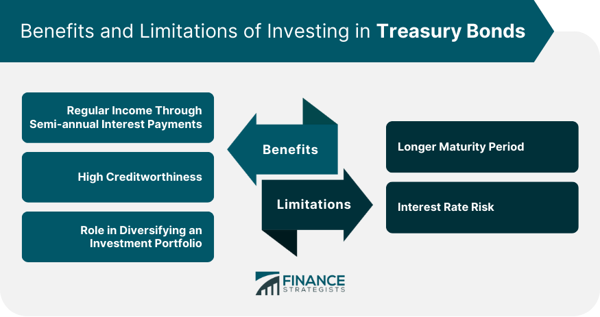

## Table of Contents

## What are Treasury bonds and how do they work?

Treasury bonds are a type of investment where you lend money to the government. They are issued by the U.S. Department of the Treasury and are considered very safe because they are backed by the full faith and credit of the U.S. government. When you buy a Treasury bond, you are essentially giving the government a loan, and in return, they promise to pay you back the full amount of the bond when it matures, which is usually in 20 or 30 years.

When you buy a Treasury bond, you also get interest payments every six months until the bond matures. The interest rate is fixed, so you know exactly how much you will earn over the life of the bond. This makes Treasury bonds a good choice for people who want a steady and predictable income from their investments. At the end of the bond's term, the government pays you back the face value of the bond, which is the amount you originally invested.

## Why might Treasury bonds be considered for retirement planning?

Treasury bonds can be a good choice for retirement planning because they are very safe and reliable. They are backed by the U.S. government, so there's almost no chance you'll lose your money. This makes them a great option if you want to keep your savings safe as you get closer to retirement. 

Another reason to consider Treasury bonds for retirement is that they provide a steady income. You get interest payments every six months, which can help cover your living expenses in retirement. Since the interest rate is fixed, you know exactly how much money you'll get, which can make planning for the future easier.

## What are the different types of Treasury bonds available for investment?

There are three main types of Treasury bonds that you can invest in: Treasury Bills, Treasury Notes, and Treasury Bonds. Treasury Bills, or T-Bills, are short-term investments that mature in a few days to one year. They are sold at a discount, which means you buy them for less than their face value, and when they mature, you get the full face value back. This difference is the interest you earn. Treasury Notes, or T-Notes, are medium-term investments that mature in 2, 3, 5, 7, or 10 years. They pay interest every six months and are a good choice if you want a steady income over a longer period.

Treasury Bonds, often just called T-Bonds, are long-term investments that mature in 20 or 30 years. Like T-Notes, they pay interest every six months. These are good if you want to invest for the long term and get regular income. All these types of Treasury securities are backed by the U.S. government, so they are very safe. Depending on your investment goals and how long you want to invest, you can choose the type that fits best for you.

## How do Treasury bonds compare to other retirement investment options like stocks or mutual funds?

Treasury bonds are different from stocks or mutual funds in a few big ways. First, they are very safe. When you buy a Treasury bond, you know you will get your money back because the U.S. government guarantees it. Stocks and mutual funds, on the other hand, can go up and down in value, and there's a chance you could lose money. This makes Treasury bonds a good choice if you want to keep your retirement savings safe and don't want to take big risks.

Second, Treasury bonds give you a steady income. You get interest payments every six months, which can help you pay for things in retirement. Stocks and mutual funds can also give you income, but it's not as predictable. Stocks might pay dividends, but they can change, and mutual funds might give you money, but it depends on how the stocks or bonds inside the fund are doing. So, if you want a reliable income in retirement, Treasury bonds can be a better choice than stocks or mutual funds.

However, stocks and mutual funds can offer higher returns over the long term. If you're okay with taking more risk, investing in stocks or mutual funds might help your retirement savings grow more. But remember, with higher potential rewards comes higher risk. Treasury bonds won't grow your money as fast, but they offer peace of mind and a steady income, which can be very important in retirement planning.

## What are the risks associated with investing in Treasury bonds for retirement?

One risk of investing in Treasury bonds for retirement is that they might not keep up with inflation. Inflation is when the prices of things go up over time. If the interest you earn on your Treasury bonds is less than the rate of inflation, your money won't be worth as much in the future. This means you might not have enough money to cover your expenses in retirement.

Another risk is that Treasury bonds have a fixed interest rate. This means you'll get the same amount of interest no matter what happens in the economy. If interest rates go up after you buy your bond, you might miss out on better returns from other investments. This is called interest rate risk. So, if you invest all your money in Treasury bonds and rates go up, you might wish you had put some of your money in other places that could give you more income.

Overall, while Treasury bonds are very safe and provide steady income, they come with these risks. It's important to think about these things when planning for retirement and maybe mix Treasury bonds with other types of investments to balance safety and growth.

## How does inflation impact the suitability of Treasury bonds for retirement savings?

Inflation can make Treasury bonds less good for retirement savings. When prices go up because of inflation, the money you get from your Treasury bonds might not buy as much as it used to. If the interest you earn is less than the rate of inflation, your savings lose value over time. This means you might not have enough money to live on in retirement, even though your bonds are safe.

To deal with inflation, you might want to mix Treasury bonds with other investments that can grow faster. Things like stocks or real estate can sometimes go up in value more than inflation. By having a mix of investments, you can protect your retirement savings from losing too much value due to inflation. But remember, these other investments can be riskier, so it's all about finding the right balance for your retirement plan.

## What is the historical performance of Treasury bonds, and how reliable is it for future planning?

Historically, Treasury bonds have been a very safe investment. They have given people a steady income with interest payments every six months. Over the years, the returns from Treasury bonds have been lower than stocks but higher than keeping money in a savings account. For example, if you had bought a 30-year Treasury bond in the past, you would have gotten back your money plus the interest at the end of those 30 years, no matter what was happening in the economy. This makes Treasury bonds a reliable choice for people who want to keep their money safe.

When planning for the future, it's good to know that past performance doesn't guarantee future results. Even though Treasury bonds have been safe and steady in the past, things like inflation and changes in interest rates can affect how much money you make from them. But because they are backed by the U.S. government, they are still seen as a very safe place to put your money. If you are planning for retirement, Treasury bonds can be part of a good mix of investments to help protect your savings and give you a steady income.

## How can Treasury bonds be integrated into a diversified retirement portfolio?

Treasury bonds can be a good part of a retirement portfolio because they are safe and give you a steady income. You can use them to balance out riskier investments like stocks. For example, if you have some of your money in stocks, which can go up and down a lot, you can also put some in Treasury bonds. This way, if the stock market goes down, you still have the steady income from the bonds to help you out.

When you are planning your retirement, you can decide how much of your money to put in Treasury bonds based on how much risk you want to take and how soon you need the money. If you are getting close to retirement, you might want to put more money in Treasury bonds to keep your savings safe. But if you are still young and have many years before you retire, you might want to have fewer Treasury bonds and more stocks to help your money grow more over time. By mixing Treasury bonds with other investments, you can have a plan that helps your savings last through your retirement.

## What are the tax implications of investing in Treasury bonds for retirement?

When you invest in Treasury bonds for retirement, you need to know about the taxes. The interest you earn from Treasury bonds is not taxed by states or local governments. This is good because it means you keep more of the money you earn. But, the interest is taxed by the federal government. You have to report this interest on your federal tax return every year, just like you would with other types of income.

If you hold your Treasury bonds in a tax-deferred retirement account, like an IRA or a 401(k), you won't have to pay taxes on the interest until you take the money out. This can be a good way to save on taxes now and let your money grow more over time. But when you do take the money out, you'll have to pay federal taxes on it. So, it's important to think about your overall tax situation when planning how to use Treasury bonds in your retirement strategy.

## How does the interest rate environment affect the investment suitability of Treasury bonds?

The interest rate environment can change how good Treasury bonds are for your investments. When interest rates go up, new Treasury bonds will have higher interest rates. This makes the older bonds you already have less valuable because they pay less interest than the new ones. If you want to sell your old bonds before they mature, you might get less money for them. This is called interest rate risk. So, if you think interest rates will go up, you might want to be careful about putting too much money in Treasury bonds.

On the other hand, when interest rates go down, the value of your existing Treasury bonds goes up. This is because the interest they pay is now higher than what you can get from new bonds. This can be good if you need to sell your bonds before they mature because you might get more money for them. But if you keep your bonds until they mature, you'll still get the same amount of interest no matter what happens with rates. So, knowing what's happening with interest rates can help you decide if Treasury bonds are a good choice for your retirement savings.

## What strategies can be used to optimize the returns from Treasury bonds in a retirement portfolio?

To make the most out of Treasury bonds in your retirement portfolio, you can use a strategy called laddering. This means you buy Treasury bonds that mature at different times. For example, you can buy some that mature in 2 years, some in 5 years, and some in 10 years. This way, you get money back at different times, which you can then use to buy new bonds at whatever the current interest rates are. Laddering helps you take advantage of different interest rates and gives you a steady flow of money, which is really helpful in retirement.

Another strategy is to mix Treasury bonds with other investments. Treasury bonds are safe and give you a steady income, but they might not grow as fast as stocks or real estate. By putting some of your money in stocks, you can balance the safety of Treasury bonds with the potential for higher returns from stocks. This mix can help your retirement savings grow more over time while still keeping some of your money safe. It's all about finding the right balance that fits your retirement goals and how much risk you're okay with taking.

## How should one assess the suitability of Treasury bonds based on individual retirement goals and timelines?

When you're thinking about using Treasury bonds for your retirement, it's important to look at your own retirement goals and how soon you'll need the money. If your goal is to keep your savings safe and you're close to retiring, Treasury bonds can be a great choice. They are backed by the U.S. government, so they're very safe, and they give you a steady income every six months. This can help you cover your living expenses in retirement without worrying about losing your money.

On the other hand, if you're younger and have many years before you retire, you might want to think about other investments that can grow your money faster. Stocks and mutual funds can offer higher returns, but they also come with more risk. You could mix some Treasury bonds with these riskier investments to balance safety and growth. By understanding your retirement timeline and how much risk you're comfortable with, you can decide how much of your money to put in Treasury bonds to help reach your retirement goals.

## What is the role of algorithmic trading in retirement investment?

Algorithmic trading is a sophisticated investment approach that employs computer programs to execute trades automatically based on specific pre-set criteria. By using [algorithmic trading](/wiki/algorithmic-trading), investors can optimize bond trading, including Treasury bonds, by leveraging advanced data analysis and identifying market trends that enhance decision-making.

One of the primary advantages of algorithmic trading in retirement investment is its ability to handle vast amounts of data with precision and speed. Algorithms can analyze market signals, economic indicators, and historical data to identify lucrative trading opportunities that might be missed by human traders. This capability is particularly beneficial in bond markets where prices fluctuate based on macroeconomic factors, interest rate changes, and geopolitical events.

For instance, consider a basic example of a moving average crossover strategy, which is commonly used in algorithmic trading. An algorithm can quickly execute trades when a short-term moving average crosses above a long-term moving average, suggesting a buying opportunity, or vice versa for a selling opportunity. The formula for a simple moving average (SMA) is given by:

$$
\text{SMA} = \frac{1}{n} \sum_{i=1}^{n} P_i
$$

where $P_i$ is the price at time $i$ and $n$ is the number of time periods. Using these calculations, algorithmic trading systems can automate the decision-making process to optimize entry and exit points in the bond market without emotional bias.

Furthermore, algorithmic trading can significantly enhance portfolio returns while managing risk effectively by implementing strategies such as mean reversion, [arbitrage](/wiki/arbitrage), and [momentum](/wiki/momentum) trading. These strategies aim to take advantage of inefficiencies in the market or capture potential price movements. 

Risk management is another crucial benefit of algorithmic trading. It allows investors to implement controls that limit exposure to unwanted risk factors, such as fixing the maximum size for a single trade or setting stop-loss orders to minimize potential losses. This level of control can be particularly advantageous for retirement portfolios, which often prioritize stability and risk minimization.

Moreover, algorithmic trading provides increased liquidity and the ability to execute trades at the best possible prices, which is a critical aspect of bond investment. By reacting swiftly to market changes and executing trades efficiently, algorithms can minimize transaction costs, which is essential for maintaining healthy returns over time.

Although algorithmic trading offers numerous benefits, it's crucial to remain vigilant about the technological risks involved, such as software malfunctions or erroneous market data, which could lead to significant losses. Therefore, ensuring robust risk management systems and continuous monitoring of algorithmic performance is vital for successful integration into retirement investment strategies. 

In conclusion, algorithmic trading can be a powerful tool for optimizing bond investments in retirement portfolios, providing enhanced returns through data-driven decision-making and advanced risk management techniques. Understanding and strategic implementation of algorithmic trading can greatly benefit those seeking sustainable, long-term portfolio growth.

## References & Further Reading

[1]: ["Investing in Treasury Securities"](https://www.forbes.com/advisor/investing/treasury-bills/) - U.S. Department of the Treasury  

[2]: ["Advances in Financial Machine Learning"](https://www.amazon.com/Advances-Financial-Machine-Learning-Marcos/dp/1119482089) by Marcos Lopez de Prado  

[3]: ["Quantitative Trading: How to Build Your Own Algorithmic Trading Business"](https://www.amazon.com/Quantitative-Trading-Build-Algorithmic-Business/dp/1119800064) by Ernest P. Chan  

[4]: ["Machine Learning for Asset Managers"](https://github.com/emoen/Machine-Learning-for-Asset-Managers) by Marcos Lopez de Prado  

[5]: Biais, B., Foucault, T., & Moinas, S. (2015). ["Equilibrium Fast Trading"](https://www.sciencedirect.com/science/article/pii/S0304405X15000288) Journal of Finance.  

[6]: ["Evidence-Based Technical Analysis: Applying the Scientific Method and Statistical Inference to Trading Signals"](https://www.amazon.com/Evidence-Based-Technical-Analysis-Scientific-Statistical/dp/0470008741) by David Aronson  