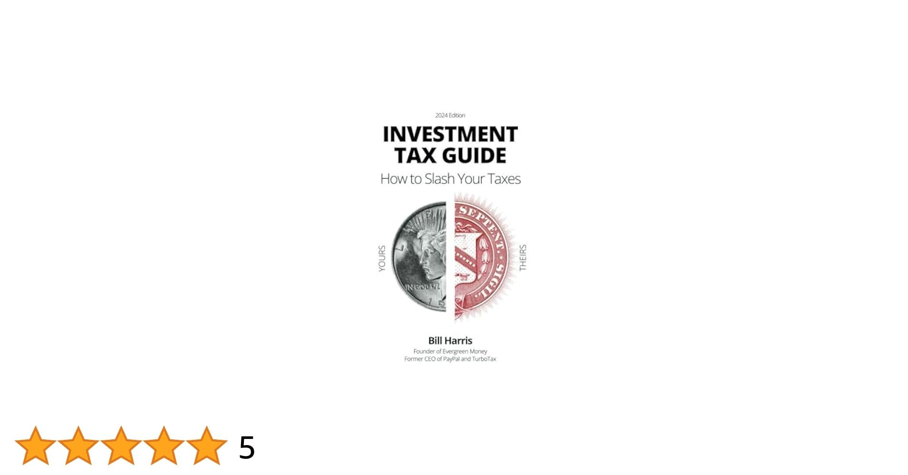

## Table of Contents

## What is investment taxation and why is it important?

Investment taxation refers to the taxes that people have to pay on the money they earn from their investments, like stocks, bonds, or real estate. When you make money from these investments, whether it's through selling them at a profit or receiving interest and dividends, the government considers this income and taxes it. The amount of tax you pay can depend on how long you held the investment, the type of investment, and your overall income.

Understanding investment taxation is important because it can affect how much money you actually keep from your investments. Knowing the tax rules can help you make smarter choices about when to buy or sell investments to minimize your taxes. For example, holding onto an investment for more than a year might qualify you for a lower tax rate on the profit. By planning your investments with taxes in mind, you can potentially increase your returns and keep more of your earnings.

## How are different types of investments taxed?

Different types of investments are taxed in different ways. When you invest in stocks, you might earn money in two ways: dividends and capital gains. Dividends are payments companies make to shareholders, and they are usually taxed at a special rate called the qualified dividend rate, which can be lower than your regular income tax rate. Capital gains are the profits you make when you sell a stock for more than you paid for it. If you hold the stock for more than a year, you pay a long-term capital gains tax, which is usually lower than the short-term capital gains tax you pay if you sell the stock within a year.

Bonds and savings accounts work a bit differently. The interest you earn from bonds and savings accounts is taxed as regular income. This means it's added to your other income and taxed at your normal income tax rate. However, some bonds, like municipal bonds, can be tax-free at the federal level, and sometimes at the state level too. Real estate investments also have their own rules. When you sell a property for a profit, you pay capital gains tax on that profit. But you can also deduct certain expenses, like mortgage interest and property taxes, which can lower your taxable income.

Understanding these differences is key to managing your investments wisely. By knowing how each type of investment is taxed, you can plan better and maybe keep more of your money.

## What are the tax implications of investing in stocks?

When you invest in stocks, you can make money in two main ways: through dividends and capital gains. Dividends are payments you get from the company for owning their stock. These dividends are usually taxed at a special rate called the qualified dividend rate, which is often lower than your regular income tax rate. But to get this lower rate, you need to hold the stock for a certain amount of time, usually more than 60 days within a 121-day period around the ex-dividend date. If you don't meet this rule, your dividends are taxed as regular income.

The other way you make money from stocks is through capital gains, which is the profit you make when you sell a stock for more than you paid for it. If you hold the stock for more than a year before selling, you pay a long-term capital gains tax, which is usually lower than your regular income tax rate. But if you sell the stock within a year, you pay a short-term capital gains tax, which is the same as your regular income tax rate. So, holding onto your stocks for more than a year can save you money on taxes. It's important to keep track of how long you own your stocks and plan your sales to minimize your tax bill.

## How does tax treatment differ for bonds and fixed income investments?

When you invest in bonds and other fixed income investments, the interest you earn is usually taxed as regular income. This means it gets added to your other income, like your salary, and you pay taxes on it at your normal income tax rate. For example, if you earn $1,000 in interest from a bond and your income tax rate is 22%, you would owe $220 in taxes on that interest. This is different from stocks, where dividends can sometimes be taxed at a lower rate.

However, there are some exceptions. Municipal bonds, which are issued by state and local governments, often have interest that is free from federal income tax. Sometimes, if you live in the state that issued the bond, the interest might also be free from state taxes. This can make municipal bonds a good choice if you're in a high tax bracket. Another type of bond, called a U.S. savings bond, can be tax-free if you use the money for qualified education expenses. Understanding these differences can help you choose the right fixed income investments to lower your tax bill.

## What are the tax considerations for real estate investments?

When you invest in real estate, you need to think about taxes in a few ways. If you sell a property for more money than you paid for it, you'll have to pay capital gains tax on the profit. How much you pay depends on how long you owned the property. If you owned it for more than a year, you'll pay a long-term capital gains tax, which is usually lower than your regular income tax. But if you sell it within a year, you'll pay a short-term capital gains tax, which is the same as your regular income tax. You can also use a strategy called a 1031 exchange to swap one property for another and delay paying capital gains tax.

There are also other tax benefits to consider with real estate. You can deduct certain expenses from your income, like mortgage interest, property taxes, and the costs of maintaining the property. These deductions can lower the amount of income tax you have to pay. If you rent out the property, you'll have to pay taxes on the rental income, but you can deduct expenses related to the rental, which can help reduce your taxable income. Understanding these tax rules can help you make smarter decisions about buying, selling, and managing real estate investments.

## How can retirement accounts affect investment taxation?

Retirement accounts like 401(k)s and IRAs can change how your investments are taxed. When you put money into these accounts, you usually don't have to pay taxes on it right away. This means you can invest more money because you're not losing some of it to taxes. The money in these accounts can grow without being taxed until you take it out when you retire. This can help your investments grow faster over time.

When you start taking money out of your retirement account, you'll have to pay taxes on it. The tax rate depends on your income at that time. But there are different types of retirement accounts. For example, with a Roth IRA, you pay taxes on the money before you put it in, but you don't pay taxes when you take it out. This can be a good choice if you think your tax rate will be higher when you retire. Understanding how retirement accounts work can help you plan your investments and save on taxes.

## What are capital gains and how are they taxed?

Capital gains are the profits you make when you sell something for more money than you paid for it. This can happen with things like stocks, bonds, or real estate. When you sell these investments and make a profit, the government considers that profit as income and taxes it. The tax you pay on capital gains is called capital gains tax.

How much tax you pay on your capital gains depends on how long you owned the investment before selling it. If you owned it for more than a year, you pay a long-term capital gains tax. This tax rate is usually lower than your regular income tax rate. But if you sell the investment within a year of buying it, you pay a short-term capital gains tax, which is the same as your regular income tax rate. Knowing these rules can help you plan when to sell your investments to pay less in taxes.

## How can tax-loss harvesting be used to manage investment taxes?

Tax-loss harvesting is a way to lower your taxes by selling investments that have lost value. When you sell an investment for less than what you paid for it, you have a capital loss. You can use this loss to reduce the taxes you owe on your capital gains. For example, if you made a profit on one investment and a loss on another, you can use the loss to cancel out the profit. This means you might not have to pay as much in taxes.

You can also use tax-loss harvesting to reduce your regular income tax. If your capital losses are more than your capital gains, you can use up to $3,000 of the extra loss to lower your taxable income each year. Any loss you can't use right away can be carried over to future years. By doing this, you can save money on taxes over time. It's a smart way to manage your investments and keep more of your money.

## What are the tax implications of dividend income?

When you own stocks, you might get money from the company in the form of dividends. Dividends are like little payments the company gives to its shareholders. The tax you pay on dividends depends on what kind of dividends they are. If they are "qualified dividends," you pay a special tax rate that is usually lower than your regular income tax rate. To get this lower rate, you need to hold the stock for a certain amount of time, usually more than 60 days within a 121-day period around the ex-dividend date. If the dividends don't meet these rules, they are taxed as regular income, which means you pay your normal income tax rate on them.

Understanding how dividends are taxed can help you plan better and maybe save money on taxes. If you know your dividends will be qualified, you can hold onto the stock long enough to get the lower tax rate. This can make a big difference in how much money you keep from your investments. By thinking about taxes when you invest, you can make smarter choices and keep more of your earnings.

## How do tax rates vary across different income levels for investments?

The tax rates on investments can change based on how much money you make. If you earn a lot of money, you might pay a higher tax rate on your investment income. For example, if you have capital gains from selling stocks or other investments, the tax rate on those gains can be different depending on your income level. People with lower incomes might pay 0% on long-term capital gains, while those with higher incomes could pay 15% or even 20%. The same goes for qualified dividends; they are taxed at the same rates as long-term capital gains, so your income level affects how much tax you pay on them too.

For regular income, like interest from bonds or savings accounts, the tax rate is based on your overall income tax bracket. If you're in a higher tax bracket, you'll pay more tax on that interest. But if you're in a lower tax bracket, you'll pay less. This means that people with different income levels will pay different amounts of tax on the same type of investment income. Knowing how these tax rates work can help you plan your investments better and maybe save money on taxes.

## What international tax considerations should investors be aware of?

When you invest in other countries, you need to think about taxes in those places too. Different countries have different tax rules. If you earn money from investments in another country, that country might take some of it as taxes. This is called withholding tax. You might also have to pay taxes on that same money in your home country. But sometimes, you can get a credit for the taxes you paid in the other country, so you don't end up paying taxes twice on the same money.

Understanding these international tax rules can be tricky. It's important to know about tax treaties between countries, which can help reduce how much tax you pay. For example, if your home country has a tax treaty with the country where you're investing, you might pay less in withholding tax. Also, some countries have different rules about capital gains, dividends, and interest. By learning about these rules, you can plan your investments better and maybe save on taxes.

## How can advanced tax strategies like opportunity zones impact investment taxation?

Opportunity zones are special areas set up by the government to encourage people to invest in them. If you invest money in an opportunity zone, you can get some tax benefits. For example, if you sell an investment and make a profit, you can put that profit into an opportunity zone and delay paying taxes on it. If you keep your money in the opportunity zone for at least five years, you can get a 10% reduction on the taxes you owe on the original profit. If you keep it in for seven years, you get a 15% reduction. And if you hold onto your investment for at least ten years, you don't have to pay any taxes on the profit you make from the opportunity zone investment itself.

Using opportunity zones can be a smart way to save on taxes and help grow certain areas of the country. But it's important to know that investing in opportunity zones can be riskier than other types of investments. The areas are often in need of development, so there's a chance your investment might not grow as much as you hope. Still, if you're willing to take that risk, opportunity zones can be a powerful tool to manage your investment taxes and make a positive impact.

## References & Further Reading

[1]: U.S. Internal Revenue Service, ["Investment Income and Expenses, IRS Publication 550, 2023."](https://www.irs.gov/publications/p550)

[2]: ["Advances in Financial Machine Learning"](https://www.amazon.com/Advances-Financial-Machine-Learning-Marcos/dp/1119482089) by Marcos Lopez de Prado

[3]: ["Quantitative Trading: How to Build Your Own Algorithmic Trading Business"](https://www.amazon.com/Quantitative-Trading-Build-Algorithmic-Business/dp/1119800064) by Ernest P. Chan

[4]: ["Machine Learning for Algorithmic Trading"](https://github.com/PacktPublishing/Machine-Learning-for-Algorithmic-Trading-Second-Edition) by Stefan Jansen

[5]: Chincarini, L. B., & Kim, D. (2006). ["Quantitative Equity Portfolio Management: Modern Techniques and Applications."](https://www.mhebooklibrary.com/doi/book/10.1036/9781264268931) McGraw-Hill.