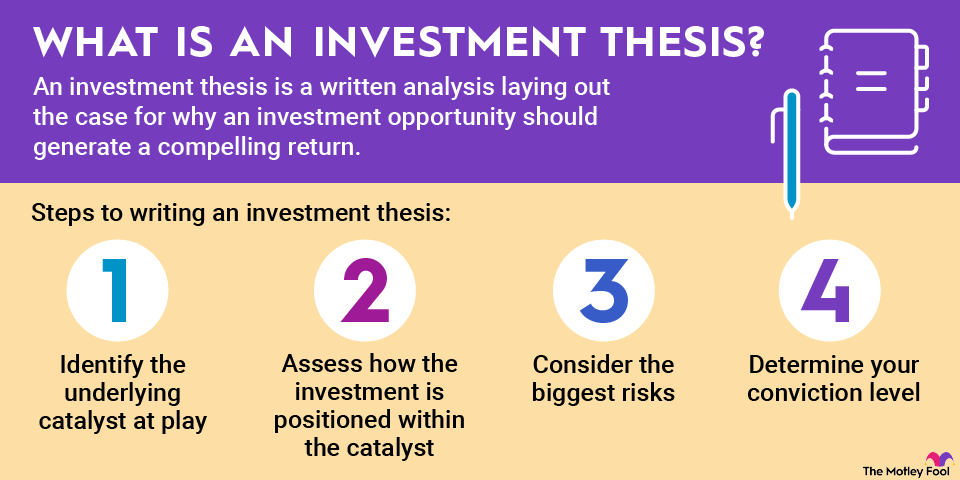

## Table of Contents

## What is an investment thesis?

An investment thesis is a clear and focused statement that explains why you believe a particular investment will be successful. It's like a roadmap that guides your investment decisions, helping you to stay on track and make informed choices based on your research and analysis. When you create an investment thesis, you are essentially laying out the reasons why you think a stock, a company, or any other type of investment is worth putting your money into.

Think of it as a story you tell yourself and others about why you are investing in something. Your investment thesis should include details like the potential for growth, the strengths of the company, and any market trends that support your decision. By having a solid investment thesis, you can better evaluate whether your investment is meeting your expectations and make adjustments if needed. It's a crucial tool for any investor looking to make smart and strategic financial decisions.

## Why is an investment thesis important in decision-making?

An investment thesis is important in decision-making because it helps you make clear and smart choices about where to put your money. It's like a plan that shows why you think an investment will do well. When you have a strong investment thesis, you can look at all the reasons you chose an investment and see if they are still true. This helps you decide if you should keep your money in that investment or if you should take it out.

Having an investment thesis also keeps you focused. It's easy to get distracted by what other people are doing or by new trends that come up. But if you have a thesis, you can stick to your plan and not get swayed by every new idea. This way, you can stay calm and make decisions based on what you believe in, not just what's popular at the moment.

## How does an investment thesis differ from an investment strategy?

An investment thesis and an investment strategy are two different things that work together to help you make smart choices with your money. An investment thesis is like a story you tell about why you think a specific investment will do well. It includes reasons like the company's growth potential, how strong the company is, and any trends in the market that support your choice. It's a detailed explanation that helps you understand why you're putting your money into something.

On the other hand, an investment strategy is more like a big plan that covers all your investments. It's about how you're going to reach your financial goals over time. Your strategy might include things like how much risk you're willing to take, how you'll spread your money across different types of investments, and how often you'll check and change your investments. While your investment thesis focuses on one specific investment, your strategy looks at your overall approach to investing.

Both the investment thesis and the investment strategy are important. The thesis helps you make a case for each individual investment, while the strategy keeps your overall plan on track. Together, they help you make better decisions and work towards your financial goals in a clear and organized way.

## What are the key components of a strong investment thesis?

A strong investment thesis starts with a clear reason for why you think an investment will do well. This reason could be because the company is growing fast, it has a strong position in its market, or there are trends in the industry that make it a good pick. You should also look at the numbers, like how much money the company is making and how fast it's growing. This helps you make sure your reasons are based on facts, not just feelings.

Another important part of a strong investment thesis is understanding the risks. Every investment has risks, so you need to know what could go wrong and how likely it is to happen. This helps you decide if the potential reward is worth the risk. Lastly, your thesis should be something you can check over time. You need to be able to see if the company is doing what you expected and if your reasons for investing are still true. If things change, you might need to change your investment too.

## How can a beginner start developing their own investment thesis?

A beginner can start developing their own investment thesis by first [picking](/wiki/asset-class-picking) a company or investment they are interested in. They should then do some research to find out why this investment might be a good choice. This could mean looking at the company's financial reports to see how much money it's making, reading news articles to understand what's happening in the industry, and even checking out what other investors are saying. The key is to gather as much information as possible to understand why the investment could be successful.

Once they have all this information, the beginner should write down their reasons for thinking the investment will do well. This could include things like the company's growth potential, its strong position in the market, or any trends that support the investment. They should also think about the risks and what could go wrong. By putting all these thoughts together, they can create a clear and focused investment thesis that explains why they believe in the investment. This thesis will help them make better decisions and stay on track with their investment goals.

## What common mistakes should be avoided when creating an investment thesis?

When creating an investment thesis, one common mistake is relying too much on emotions instead of facts. It's easy to get excited about a company or an idea, but a strong thesis needs to be based on solid research and data. For example, you might like a company because you use their products, but that's not enough to justify an investment. You need to look at the company's financial health, growth potential, and market position to make sure your reasons are sound.

Another mistake is not considering the risks enough. Every investment has risks, and ignoring them can lead to bad decisions. It's important to think about what could go wrong and how likely it is to happen. This helps you understand if the potential reward is worth the risk. Also, some beginners make the mistake of not updating their thesis as things change. The market and companies change all the time, so it's important to check your reasons regularly and adjust your thesis if needed.

## How do market conditions influence the development of an investment thesis?

Market conditions play a big role in shaping an investment thesis. When you're thinking about why a certain investment might do well, you have to look at what's happening in the market. For example, if the economy is growing and people are spending more money, that might be good for companies that sell things to consumers. On the other hand, if there's a recession and people are worried about their jobs, they might spend less, which could hurt those same companies. So, understanding the market helps you figure out if your investment reasons still make sense.

Also, market conditions can change over time, and that means you might need to update your investment thesis. If new trends start to affect the industry your company is in, like new technology or changes in what people want, you need to think about how that could change the company's future. For instance, if a new law makes it harder for a company to do business, that could be a risk you need to consider. By keeping an eye on market conditions, you can make sure your investment thesis stays relevant and helps you make better decisions.

## Can you provide examples of successful investment theses in different industries?

In the technology industry, a successful investment thesis could focus on a company like Apple. An investor might believe in Apple because it has a strong brand and loyal customers. The thesis could point out that Apple keeps coming up with new products that people want, like the iPhone and the Apple Watch. The investor might also see that Apple makes a lot of money from its services, like Apple Music and the App Store. By looking at these factors, the investor thinks Apple will keep growing and making profits, making it a good investment.

In the healthcare industry, a good example of an investment thesis could be about a company like Moderna. An investor might choose Moderna because it's at the forefront of new technology called mRNA, which was used to make the COVID-19 vaccine. The thesis could say that Moderna has a lot of potential to grow because it's working on new vaccines and treatments for other diseases too. The investor might also see that the healthcare market is big and growing, so there's a lot of room for Moderna to succeed. By considering these points, the investor believes Moderna is a smart choice for their money.

In the energy sector, a successful investment thesis might focus on a company like Tesla. An investor might believe in Tesla because it's leading the way in electric vehicles and renewable energy. The thesis could highlight that more and more people want to buy electric cars to help the environment, and Tesla is at the front of this trend. The investor might also see that Tesla is working on other things like solar panels and batteries, which could help it grow even more. By looking at these reasons, the investor thinks Tesla has a bright future and is a good investment.

## How should an investment thesis be tested and validated?

To test and validate an investment thesis, you need to start by checking if the reasons you believe in the investment are still true. This means looking at the company's latest financial reports to see if it's making as much money as you expected. You should also keep up with news about the company and its industry to see if anything has changed. For example, if you thought a company would do well because it was growing fast, you need to see if it's still growing at that rate. If the company's growth has slowed down, you might need to rethink your thesis.

Another important part of testing your investment thesis is looking at how the company is doing compared to what you thought it would do. If you expected the company to make a certain amount of money or reach a certain size, check if it's on track to meet those goals. You can also compare the company to others in the same industry to see if it's doing better or worse than its competitors. If your thesis is holding up and the company is doing well, that's a good sign. But if things aren't going as planned, you might need to change your thesis or even decide to sell your investment.

## What role does data analysis play in refining an investment thesis?

Data analysis is really important when you want to make your investment thesis better. It helps you look at the numbers and facts about a company to see if your reasons for investing are still true. For example, if you thought a company would grow a lot, you can use data to check if it's actually growing. You can look at things like how much money the company is making, how fast it's growing, and how it's doing compared to other companies in the same industry. By doing this, you can see if your investment thesis needs to change or if it's still a good reason to keep your money in the company.

Using data also helps you find new information that might make your investment thesis stronger. Maybe you find out that the company is doing even better than you thought, or maybe you see a new trend in the market that supports your investment. By keeping an eye on the data, you can update your thesis to make sure it's as good as it can be. This way, you can make smarter decisions about your investments and feel more confident that you're on the right track.

## How can an investment thesis be adapted to changing economic environments?

An investment thesis needs to change when the economy does because what works in one situation might not work in another. If the economy is doing well, people might spend more money, which could be good for companies that sell things to customers. But if there's a recession and people are worried about their jobs, they might spend less, which could hurt those same companies. So, you need to look at what's happening in the economy and see if your reasons for investing still make sense. If things have changed a lot, you might need to update your investment thesis to match the new situation.

To adapt your investment thesis, you should keep an eye on economic indicators like unemployment rates, inflation, and interest rates. These things can tell you a lot about what's happening in the economy and how it might affect your investments. If you see that the economy is getting worse, you might want to focus on companies that can still do well even when times are tough, like those that provide essential services. On the other hand, if the economy is getting better, you might want to invest in companies that can grow a lot when people are spending more. By paying attention to these changes and adjusting your thesis, you can make better decisions and keep your investments on track.

## What advanced techniques can experts use to enhance their investment thesis?

Experts can use advanced techniques like quantitative analysis to make their investment thesis better. This means using math and numbers to look at a lot of data about a company and the market. They might use things like regression analysis to see how different factors affect the company's performance. For example, they could look at how changes in interest rates or consumer spending might impact the company's profits. By doing this, experts can find patterns and make predictions that help them understand if their investment thesis is strong or if it needs to change.

Another technique experts might use is scenario analysis. This means thinking about different things that could happen in the future and how they would affect the investment. For example, they might look at what would happen if there was a big change in the economy, like a recession, or if a new law was passed that affected the company's industry. By considering these different scenarios, experts can see if their investment thesis holds up no matter what happens. This helps them make their thesis more robust and ready for any changes that might come.

## What is involved in understanding investing decisions?

Investing decisions are foundational components that can significantly influence one's financial future. Whether the aim is retirement planning or wealth accumulation, the importance of making informed investing choices cannot be overstated. These decisions should be grounded in thorough research, coupling market analysis with individual financial goals, to ensure alignment with personal objectives.

Market analysis plays a critical role in this process, offering insights into current economic conditions, industry trends, and potential investment opportunities. A sophisticated understanding of market dynamics can facilitate more strategic asset allocation and timing decisions. This involves considering variables such as interest rates, inflation, and geopolitical events, which can impact asset performance. Investors often utilize various financial models and tools to quantify risk and predict potential returns. For instance, the Capital Asset Pricing Model (CAPM) is instrumental in estimating the expected return on an investment, given the risk-free rate, the asset’s beta, and the expected market return:

$$
\text{Expected Return} = \text{Risk-Free Rate} + \beta \times (\text{Market Return} - \text{Risk-Free Rate})
$$

Personal financial goals dictate the suitability of investment choices. These goals can range from achieving short-term [liquidity](/wiki/liquidity-risk-premium) to long-term wealth creation. Understanding these objectives helps in setting the trajectory for asset selection and portfolio composition, tailoring strategies to the investor’s risk tolerance and time horizon.

The influence of emotional discipline cannot be ignored, particularly during periods of market [volatility](/wiki/volatility-trading-strategies). Emotional reactions to market fluctuations, like fear during downturns or greed during rallies, can lead to impulsive decisions that undermine long-term strategy. Maintaining a disciplined approach requires adherence to pre-set investment theses and strategies, evaluated based on objective criteria rather than emotional response. Behavioral finance recognizes common psychological biases, such as loss aversion and overconfidence, which can skew judgement and decision-making.

Ultimately, the key to effective investing decisions lies in integrating comprehensive research with a disciplined approach to emotional management. By balancing these elements, investors can make choices that align with their financial goals, potentially enhancing their financial well-being across different tenures.

## References & Further Reading

[1]: Bergstra, J., Bardenet, R., Bengio, Y., & Kégl, B. (2011). ["Algorithms for Hyper-Parameter Optimization."](https://papers.nips.cc/paper/4443-algorithms-for-hyper-parameter-optimization) Advances in Neural Information Processing Systems 24.

[2]: ["Advances in Financial Machine Learning"](https://www.amazon.com/Advances-Financial-Machine-Learning-Marcos/dp/1119482089) by Marcos Lopez de Prado

[3]: ["Evidence-Based Technical Analysis: Applying the Scientific Method and Statistical Inference to Trading Signals"](https://www.amazon.com/Evidence-Based-Technical-Analysis-Scientific-Statistical/dp/0470008741) by David Aronson

[4]: ["Machine Learning for Algorithmic Trading"](https://github.com/stefan-jansen/machine-learning-for-trading) by Stefan Jansen

[5]: ["Quantitative Trading: How to Build Your Own Algorithmic Trading Business"](https://www.amazon.com/Quantitative-Trading-Build-Algorithmic-Business/dp/1119800064) by Ernest P. Chan