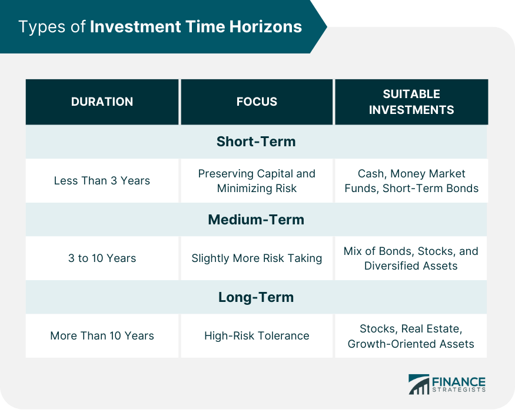

## Table of Contents

## What is an investment time horizon?

An investment time horizon is the length of time someone plans to keep their money invested before they need to use it. It's like setting a timeline for when you want to reach your financial goals. For example, if you're saving for a down payment on a house in five years, your investment time horizon is five years.

Understanding your investment time horizon is important because it helps you choose the right types of investments. If your time horizon is short, you might want to pick safer investments that won't lose value quickly. But if your time horizon is long, like saving for retirement many years away, you can take more risks because you have more time to recover from any losses. Knowing your time horizon helps you make smarter investment choices.

## Why is the investment time horizon important for investors?

The investment time horizon is important for investors because it helps them decide how to invest their money. If someone knows they will need their money soon, like in a few years, they will choose safer investments. This is because they can't afford to lose money right before they need it. For example, if you're saving for a car in two years, you wouldn't want to invest in something risky that might lose value quickly.

On the other hand, if an investor has a long time horizon, like saving for retirement that's many years away, they can choose riskier investments. This is because they have more time to recover from any losses. Over a long period, riskier investments can often grow more than safer ones. Knowing your investment time horizon helps you pick the best way to grow your money based on when you'll need it.

## How does the length of the time horizon affect investment choices?

The length of the time horizon affects investment choices because it tells investors how much risk they can take. If someone needs their money soon, like in a few years, they will choose safer investments. This is because they can't afford to lose money right before they need it. For example, if you're saving for a new laptop in two years, you wouldn't want to invest in something that might lose a lot of value quickly.

On the other hand, if an investor has a long time horizon, like saving for retirement that's many years away, they can choose riskier investments. This is because they have more time to recover from any losses. Over a long period, riskier investments can often grow more than safer ones. Knowing your investment time horizon helps you pick the best way to grow your money based on when you'll need it.

## What are the different categories of investment time horizons?

Investment time horizons can be broken down into three main categories: short-term, medium-term, and long-term. Short-term horizons are usually up to three years. This means you plan to use the money in a short amount of time, like saving for a vacation or an emergency fund. Because the time is short, you'll want to pick investments that are safe and won't lose much value quickly.

Medium-term horizons last from three to ten years. This could be for goals like buying a house or funding a child's education. With a medium-term horizon, you might be willing to take on a bit more risk than with short-term investments, but you still need to be careful because the time frame is not very long.

Long-term horizons are more than ten years. This is often for goals like retirement or leaving money to your family. Because you have a lot of time, you can choose riskier investments that might have bigger rewards. Over many years, these investments can grow a lot, even if they go up and down along the way.

## How can a short-term time horizon impact investment strategy?

A short-term time horizon means you need your money soon, like in less than three years. When your time horizon is short, you want to pick investments that are safe. You don't want to lose money because you'll need it soon. For example, if you're saving for a new computer next year, you wouldn't want to invest in something that might lose a lot of value quickly. So, you might choose to put your money in a savings account or a money market fund where it's safe and you can get it back easily.

Because you need the money soon, you can't take big risks. If you pick something risky and it loses value, you won't have time to wait for it to go back up. That's why short-term investments usually don't grow as much as long-term ones. But they're good for when you need to be sure your money will be there when you need it.

## What are the risks associated with a long-term investment time horizon?

Having a long-term investment time horizon means you plan to keep your money invested for many years, like saving for retirement. One risk is that the value of your investments can go up and down a lot over time. Even though you have time to recover from losses, it can be scary to see your money go down. Also, things like inflation can make your money worth less over time. If the prices of things go up faster than your investments grow, you might not have as much money as you thought when you need it.

Another risk is that your life plans might change. You might need your money sooner than you thought, and if your investments are in risky things, you might have to sell them when they're not worth much. Also, you might miss out on better investment opportunities that come up later. If you've put all your money in one type of investment and something better comes along, you might not be able to switch easily. So, even with a long-term horizon, it's important to check your investments now and then to make sure they still fit your goals.

## How should one adjust their investment portfolio as their time horizon changes?

As your time horizon changes, you need to adjust your investment portfolio to match your new goals. If your time horizon gets shorter, you might need to switch from riskier investments to safer ones. For example, if you were saving for retirement but now you need the money in five years to buy a house, you should move your money from stocks to something like bonds or a savings account. This way, you won't lose a lot of money right before you need it.

On the other hand, if your time horizon gets longer, you can take on more risk. If you thought you'd retire in ten years but now you plan to work for another twenty years, you might want to put more money into stocks or other investments that could grow a lot over time. This gives your money more time to recover from any losses and grow bigger. Always keep an eye on your investments and adjust them as your plans change.

## Can you explain the relationship between time horizon and risk tolerance?

The time horizon and risk tolerance are closely linked when it comes to investing. Your time horizon is how long you plan to keep your money invested before you need it. If your time horizon is short, like a few years, you can't take big risks with your money. You need to pick safe investments because you won't have time to wait if they lose value. For example, if you're saving for a new car in two years, you wouldn't want to invest in something that might go down a lot.

On the other hand, if your time horizon is long, like saving for retirement many years away, you can take more risks. This is because you have more time to recover from any losses. Over many years, riskier investments can grow more than safe ones. So, if you don't need your money for a long time, you might choose to invest in stocks or other things that could go up a lot. Your risk tolerance, or how much risk you're willing to take, should match your time horizon to make the best investment choices.

## What role does the investment time horizon play in retirement planning?

The investment time horizon is really important when you're planning for retirement. It's all about how long you have until you need to start using your retirement savings. If you're young and retirement is a long way off, you can pick riskier investments like stocks. These can go up and down a lot, but over many years, they usually grow more than safer investments. Because you have so much time, you can wait out the ups and downs and still end up with more money.

As you get closer to retirement, your time horizon gets shorter. This means you should start moving your money into safer investments. You don't want to lose a lot of money right before you need it. Things like bonds or savings accounts are good choices because they don't change in value as much. By adjusting your investments as your time horizon changes, you can make sure you have enough money when you retire.

## How do financial advisors typically assess a client's investment time horizon?

Financial advisors usually start by asking their clients about their financial goals and when they need to reach them. They want to know things like if you're saving for a house, a child's education, or retirement. By understanding your goals, they can figure out how long you have before you need the money. For example, if you're saving for a vacation in two years, your time horizon is short. But if you're saving for retirement that's 30 years away, your time horizon is long.

Once they know your time horizon, financial advisors help you pick the right investments. If your time horizon is short, they'll suggest safer options like savings accounts or bonds. These won't grow as much, but they're less likely to lose value quickly. If your time horizon is long, they might recommend riskier investments like stocks. These can go up and down a lot, but over many years, they usually grow more. By matching your investments to your time horizon, advisors help you reach your financial goals.

## What are some advanced strategies for optimizing returns based on varying time horizons?

One advanced strategy for optimizing returns based on different time horizons is called "laddering." This is when you spread out your investments over different time periods. For example, if you're saving for retirement, you might buy bonds that mature at different times, like one year, three years, and five years from now. This way, you can take advantage of different interest rates and have money coming in at different times. It's like having a safety net because you're not putting all your money into one thing at one time. Laddering can help you balance risk and reward, especially if your time horizon is medium to long.

Another strategy is "dynamic asset allocation." This means changing your investments as your time horizon gets shorter or longer. If you're young and saving for retirement, you might start with a lot of stocks because they can grow a lot over time. But as you get closer to retirement, you'll slowly move your money into safer things like bonds. This way, you can keep growing your money when you're young and protect it when you're older. Dynamic asset allocation helps you adjust to changes in your life and the market, making sure your investments match your needs at different times.

## How does the concept of time horizon integrate with modern portfolio theory?

Modern portfolio theory is all about picking the right mix of investments to get the best return for the amount of risk you're willing to take. The time horizon is a big part of this because it helps you decide how much risk you can handle. If you need your money soon, like in a few years, you'll want to pick safer investments. This is because you can't afford to lose money right before you need it. Modern portfolio theory helps you figure out the best way to spread your money across different types of investments to keep it safe when your time horizon is short.

On the other hand, if you have a long time before you need your money, like saving for retirement many years away, you can take more risks. Modern portfolio theory says that over a long time, riskier investments like stocks can grow more than safer ones. So, if you don't need your money for a long time, you might choose to put more of it into stocks. By understanding your time horizon, modern portfolio theory helps you build a mix of investments that can grow a lot over time while still matching your risk level.

## What is the key to understanding investment strategy?

An investment strategy is a comprehensive plan that directs both individual and institutional investors toward achieving their financial and investment objectives. At its core, an investment strategy involves selecting the most suitable asset classes that align with the investor's risk tolerance and investment horizon, which can vary widely based on personal goals and prevailing market conditions.

Different investment strategies accentuate various asset types, such as stocks, bonds, exchange-traded funds (ETFs), or alternative investments, including cryptocurrencies and derivatives. For instance, a risk-averse investor might opt for bonds and dividend-paying stocks designed to provide steady income and lower [volatility](/wiki/volatility-trading-strategies). Conversely, a risk-tolerant investor might pursue aggressive strategies involving high-[growth stocks](/wiki/growth-stocks) or speculative assets like cryptocurrencies and derivatives, anticipating higher returns at the cost of increased volatility.

The selection of an investment strategy begins with a thorough assessment of personal financial goals. These may include wealth accumulation, income generation, or capital preservation. A crucial component of this process is understanding one's risk tolerance, which defines the degree of uncertainty an investor is willing to withstand in pursuing their financial goals. Risk tolerance is influenced by factors such as age, income level, financial obligations, and psychological comfort with market fluctuations.

Market conditions also play a pivotal role in investment strategy selection. Economic indicators, including interest rates, inflation, and economic growth forecasts, are integral in shaping the investment landscape. Analyzing these indicators allows investors to anticipate market trends and tailor their strategies accordingly. For example, in low-interest-rate environments, equities and real estate might become more attractive as they provide better potential returns compared to fixed-income securities.

For a practical approach, investors often turn to models like the Modern Portfolio Theory (MPT), which emphasizes diversification to maximize returns for a given level of risk. The formula for portfolio variance, a measure of risk, in the context of two assets is given by:

$$
\sigma_p^2 = w_1^2 \sigma_1^2 + w_2^2 \sigma_2^2 + 2w_1w_2 \sigma_1 \sigma_2 \rho_{12}
$$

where:
- $\sigma_p$ is the portfolio standard deviation,
- $w_1$ and $w_2$ are the weights of assets 1 and 2 in the portfolio,
- $\sigma_1$ and $\sigma_2$ are the standard deviations of assets 1 and 2,
- $\rho_{12}$ is the correlation coefficient between the returns of the assets.

By employing such models and continuously revisiting their strategies, investors can adapt to changing economic conditions and enhance their investment returns while managing risks effectively. This strategic approach forms the foundation of creating a resilient portfolio that aligns with long-term financial objectives.

## References & Further Reading

[1]: Lowenstein, R. (2000). ["When Genius Failed: The Rise and Fall of Long-Term Capital Management."](https://www.amazon.com/When-Genius-Failed-Long-Term-Management/dp/0375758259) Random House.

[2]: Schroeder, A. (2009). ["The Snowball: Warren Buffett and the Business of Life."](https://www.amazon.com/Snowball-Warren-Buffett-Business-Life/dp/0553384619) Bantam Books.

[3]: Malkiel, B. G. (2019). ["A Random Walk Down Wall Street: The Time-Tested Strategy for Successful Investing."](https://www.amazon.com/Random-Walk-Down-Wall-Street/dp/1324002182) W. W. Norton & Company.

[4]: Chan, E. P. (2013). ["Algorithmic Trading: Winning Strategies and Their Rationale."](https://github.com/ftvision/quant_trading_echan_book) Wiley.

[5]: Cuthbertson, K., & Nitzsche, D. (2004). ["Quantitative Financial Economics: Stocks, Bonds and Foreign Exchange."](https://www.amazon.com/Quantitative-Financial-Economics-Foreign-Exchange/dp/0470091711) Wiley.

[6]: Varian, H. R. (1987). ["The Arbitrage Principle in Financial Economics."](https://www.sfu.ca/~kkasa/Varian_87.pdf) Journal of Economic Perspectives, 1(2), 55-72.