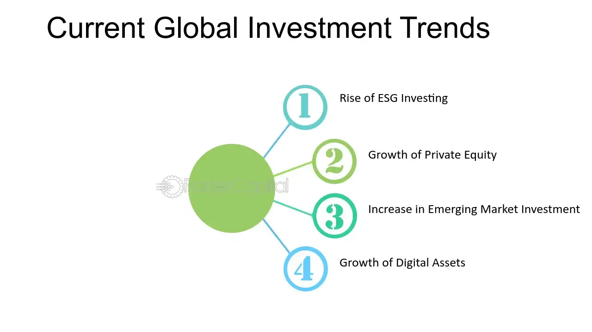

## Table of Contents

## What is an investment and why is it important?

An investment is when you use your money to buy something that you hope will grow in value or give you more money over time. It can be things like stocks, bonds, real estate, or even starting a business. When you invest, you are putting your money into something with the goal of making more money in the future.

Investing is important because it helps your money grow over time. Instead of keeping your money in a savings account where it might not grow much, investing can help you beat inflation and increase your wealth. This is important for things like saving for retirement, buying a home, or funding your children's education. By investing wisely, you can reach your financial goals and secure a better future for yourself and your family.

## What are the basic types of investments available to beginners?

For beginners, there are a few basic types of investments that are easy to understand and get started with. One common type is stocks, which are shares in a company. When you buy stocks, you own a small piece of that company. If the company does well, the value of your stocks can go up, and you might also get dividends, which are like little payments from the company. Another type is bonds, which are like loans you give to a government or a company. They promise to pay you back with interest over time. Bonds are usually safer than stocks but might not grow as much.

Another simple investment for beginners is mutual funds. These are collections of stocks, bonds, or other investments managed by professionals. When you buy into a mutual fund, you're buying a piece of all the investments in that fund, which helps spread out your risk. Exchange-traded funds (ETFs) are similar to mutual funds but can be bought and sold like stocks. They often have lower fees and can be a good way to invest in a broad market or specific sector. Starting with these types of investments can help beginners learn about investing while building their portfolios.

## How do stocks and bonds differ as investment options?

Stocks and bonds are two different ways to invest your money. When you buy stocks, you're buying a piece of a company. If the company does well, the value of your stock can go up, and you might also get dividends, which are like little payments from the company. Stocks can be exciting because they have the potential to grow a lot, but they can also go down in value if the company doesn't do well. This makes stocks riskier but with the chance for bigger rewards.

On the other hand, when you buy bonds, you're lending money to a company or government. They promise to pay you back with interest over time. Bonds are usually safer than stocks because you know you'll get your money back as long as the borrower doesn't go bankrupt. But because they're safer, they usually don't grow as much as stocks. So, bonds are good if you want a steady, predictable return, but they won't make you as much money as stocks might.

Choosing between stocks and bonds depends on how much risk you're willing to take and what your financial goals are. If you want to grow your money a lot over time and are okay with some ups and downs, stocks might be better for you. If you want something safer and more predictable, bonds could be the way to go. Many people find a good balance by having a mix of both in their investment portfolio.

## What are mutual funds and how do they work?

Mutual funds are a way to invest your money by pooling it together with money from other people. When you buy into a mutual fund, you're buying a piece of a big collection of stocks, bonds, or other investments. These funds are managed by professionals who decide what to buy and sell. This means you don't have to pick individual stocks or bonds yourself, which can be easier and less stressful, especially if you're new to investing.

The way mutual funds work is pretty simple. You put your money into the fund, and the managers use it to buy a variety of investments. Because your money is spread out over many different things, it's less risky than putting all your money into just one stock or bond. At the end of each day, the value of the mutual fund changes based on how well the investments inside it are doing. You can then buy more shares or sell your shares based on this value. Mutual funds are a popular choice because they offer a way to diversify your investments and have professionals manage your money for you.

## What role do ETFs play in modern investment portfolios?

ETFs, or exchange-traded funds, have become very popular in modern investment portfolios. They are like mutual funds but can be bought and sold like stocks on a stock exchange. This makes them easy to trade and gives you more flexibility. ETFs often track a specific index, like the S&P 500, which means they try to match the performance of that index. This can be a good way to invest in a whole market or a specific sector without having to pick individual stocks.

ETFs are also known for their low costs. They usually have lower fees than mutual funds because they are passively managed, meaning they don't need as much work to keep them running. This can save you money over time, which is great for growing your investments. Many people use ETFs to build a diversified portfolio, mixing them with other investments like stocks and bonds to spread out their risk and reach their financial goals.

## How can one start investing with a small amount of money?

Starting to invest with a small amount of money is easier than you might think. One great way to begin is by using a micro-investing app. These apps let you invest small amounts of money, even just a few dollars at a time. They often round up your everyday purchases to the nearest dollar and invest the change for you. This makes it easy to start investing without needing a lot of money upfront.

Another option is to look into ETFs or index funds. These are types of investments that let you own a little bit of a lot of different companies all at once. Because they are spread out over many stocks, they can be a safer way to start investing. Many brokers now offer these funds with no minimum investment, so you can start with whatever amount you have, even if it's small. Over time, as you save more, you can add to your investments and watch them grow.

## What are the current trends in the investment world?

One big trend in the investment world right now is the focus on sustainable and responsible investing. More and more people want to put their money into companies that are good for the environment or help society. This is called [ESG](/wiki/esg-investing) investing, which stands for Environmental, Social, and Governance. People like this because it lets them make money and also support causes they care about. Companies that are doing well in these areas are becoming more popular with investors.

Another trend is the rise of technology in investing. Apps and online platforms are making it easier for anyone to start investing, even with small amounts of money. Robo-advisors are a big part of this. They use computers to help pick investments for you based on what you want and how much risk you're okay with. This makes investing less scary for beginners and helps people manage their money better.

Cryptocurrencies are also a big trend. These are digital currencies like Bitcoin and Ethereum. More people are investing in them because they can grow a lot in value, but they can also be very risky. Because of this, some people are using them as a small part of their overall investment plan, hoping to make big gains while keeping most of their money in safer investments.

## How do robo-advisors work and what benefits do they offer?

Robo-advisors are a type of online service that helps you invest your money. They use computers to pick investments for you based on what you want and how much risk you're okay with. You tell the robo-advisor about your goals, like saving for retirement or buying a house, and how much risk you want to take. Then, the robo-advisor creates a plan for you and picks a mix of investments, like stocks and bonds, to help you reach your goals. It's all done automatically, so you don't have to spend a lot of time figuring out what to buy and sell.

The main benefit of using a robo-advisor is that it makes investing easy and affordable. Because they use computers to manage your money, robo-advisors usually charge less than human financial advisors. This can save you money and help your investments grow more over time. Also, robo-advisors take the guesswork out of investing. They keep your money spread out in a smart way and make changes to your investments as needed, so you don't have to worry about it. This is great for people who are new to investing or don't have a lot of time to manage their money.

## What are alternative investments and how do they fit into a diversified portfolio?

Alternative investments are things you can invest in that are different from the usual stocks, bonds, and cash. They can be things like real estate, gold, art, or even cryptocurrencies. These investments can be riskier than traditional ones, but they can also give you bigger rewards. Because they don't always move the same way as stocks and bonds, they can help spread out your risk and make your investments more stable.

Putting alternative investments into your portfolio can help you diversify, which means not putting all your eggs in one basket. If you have a mix of stocks, bonds, and some alternative investments, your money is safer because if one type of investment goes down, the others might still do well. This can help you reach your financial goals more smoothly. Just remember, alternative investments can be harder to understand and might need more work to manage, so it's good to learn about them before you start investing.

## How can one analyze market trends to make informed investment decisions?

To analyze market trends and make informed investment decisions, it's important to look at different kinds of information. One way is to check economic indicators, like unemployment rates or how fast the economy is growing. These can tell you if the economy is doing well or not, which can affect how stocks and other investments do. Another way is to read news about companies and industries you're interested in. If a company is doing something new or if there are big changes in an industry, it can change how that company's stock price moves. You can also use charts and graphs to see how prices have changed over time. This is called technical analysis, and it helps you spot patterns that might tell you when to buy or sell.

Another important part of analyzing market trends is understanding what other people are thinking and doing. This is called market sentiment. You can get a feel for this by reading what experts are saying, looking at social media, or even seeing what people are talking about in the news. If a lot of people are feeling good about the market, they might buy more, which can push prices up. But if they're worried, they might sell, and prices can go down. By putting all this information together, you can make better guesses about where the market might be going and make smarter choices about when to invest your money.

## What advanced strategies exist for managing and optimizing an investment portfolio?

One advanced strategy for managing and optimizing an investment portfolio is called asset allocation. This means deciding how much of your money to put into different types of investments, like stocks, bonds, and alternative investments. The goal is to spread out your risk and make sure your money is working hard for you. You can change your asset allocation based on how old you are, what you want to achieve, and how much risk you're okay with. For example, if you're young and saving for retirement, you might put more money into stocks because they can grow a lot over time. But if you're closer to retiring, you might want to move more money into bonds because they're safer.

Another strategy is called rebalancing. Over time, some parts of your portfolio might grow faster than others, which can throw off your original plan. Rebalancing means selling some of the investments that have grown a lot and buying more of the ones that haven't, to get back to your original mix. This helps keep your risk level where you want it and can help you buy low and sell high. A third strategy is tax optimization. This means trying to keep as much of your money as possible by using smart ways to manage your taxes. For example, you might put some investments into tax-advantaged accounts like IRAs or 401(k)s, or you might sell investments that have lost money to offset gains from other investments. By using these strategies, you can make your portfolio work better and reach your financial goals more easily.

## How do global economic factors influence investment trends and mechanisms?

Global economic factors play a big role in shaping investment trends and how people invest their money. Things like interest rates, inflation, and how well different countries' economies are doing can change what investments look good or bad. For example, if interest rates go up in one country, it might make borrowing money more expensive, which can slow down that country's economy. This might make investors move their money to other countries where interest rates are lower and the economy is doing better. Also, if a big event happens, like a war or a natural disaster, it can shake up the whole world's economy and make investors change their plans.

Another way global economic factors influence investments is through currency exchange rates. If one country's currency gets stronger compared to another, it can make investments in that country more or less attractive. For example, if the U.S. dollar gets stronger, it might make American goods more expensive for people in other countries, which can hurt U.S. companies that sell a lot overseas. This might make investors think twice about buying stocks in those companies. On the other hand, if a country's currency gets weaker, it might make its exports cheaper and more competitive, which could be good for companies that sell a lot abroad. By keeping an eye on these global factors, investors can make smarter choices about where to put their money.

## What are some strategies to avoid falling for fads?

To successfully navigate away from the allure of investment fads, investors can benefit greatly from seeking guidance from fiduciary advisors. Fiduciary advisors have a legal and ethical obligation to act in the best interest of their clients, emphasizing long-term investment strategies over short-term gains. This focus helps mitigate risks associated with transient investment opportunities that may not be sustainable.

**Diversification** is a core strategy that reduces the risk associated with unpredictable market movements. By spreading investments across various asset classes, sectors, and geographies, investors can protect themselves from significant losses due to a single underperforming asset. The principle behind diversification is to minimize the systemic risk, which can be quantified using the formula:

$$
\sigma^2_p = \sum_{i=1}^{n}\left(w_i^2 \sigma_i^2\right) + \sum_{i=1}^{n-1}\sum_{j=i+1}^{n}\left(2w_iw_j\sigma_i\sigma_j\rho_{ij}\right)
$$

where:
- $\sigma^2_p$ is the portfolio variance,
- $w_i$ and $w_j$ are the weights of assets $i$ and $j$ in the portfolio,
- $\sigma_i$ and $\sigma_j$ are the standard deviations of assets $i$ and $j$,
- $\rho_{ij}$ is the correlation coefficient between the returns of assets $i$ and $j$.

A **solid investment plan** tailored to an individual's financial goals and risk tolerance is another essential strategy. Such a plan is built on [fundamental analysis](/wiki/fundamental-analysis) and often includes a mix of stocks, bonds, and other asset types that align with an investor's long-term objectives. By adhering to this plan, investors can avoid the emotional pitfalls of reacting to market noise and the temptations of volatile fads.

Fiduciary advisors play a pivotal role in implementing personalized investment strategies. They assess the unique financial circumstances of each client, considering factors such as income level, financial obligations, and future objectives. With this information, they craft strategies that effectively balance risk and return, ensuring that investment decisions are consistent with the client's long-term financial aspirations.

In sum, avoiding the pitfalls of investment fads requires a disciplined approach centered on well-established financial principles. Diversification, a well-considered investment plan, and professional advisory guidance are key to maintaining focus on sustainable, long-term financial growth. By prioritizing these elements, investors can better withstand market fluctuations and achieve steady progress towards their financial goals.

## References & Further Reading

[1]: "The Real Story of the Internet Bubble’s Heyday", The Wall Street Journal, 2020.

[2]: "How Crocs Survived Bankruptcy to Become a Star Performer Again", Bloomberg, 2018.

[3]: ["Robo-Advisors: A Portfolio Management Perspective"](https://economics.yale.edu/sites/default/files/2023-01/Jonathan_Lam_Senior%20Essay%20Revised.pdf), Financial Analysts Journal.

[4]: ["Advances in Financial Machine Learning"](https://www.amazon.com/Advances-Financial-Machine-Learning-Marcos/dp/1119482089) by Marcos Lopez de Prado

[5]: ["Quantitative Trading: How to Build Your Own Algorithmic Trading Business"](https://www.amazon.com/Quantitative-Trading-Build-Algorithmic-Business/dp/1119800064) by Ernest P. Chan