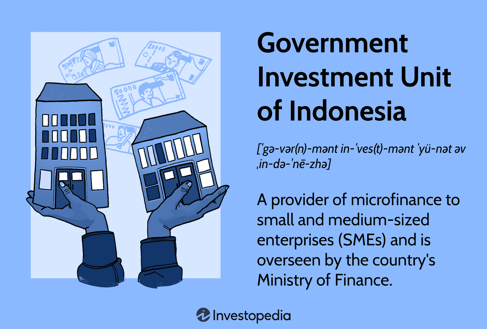

Indonesia, as the largest economy in the Association of Southeast Asian Nations (ASEAN), offers a vast array of opportunities for both local and international investors. This potential is particularly evident within the context of its burgeoning technological sector, where government-backed initiatives have played a pivotal role in driving growth. Among these initiatives, algorithmic trading, which employs automated systems and mathematical models for executing trades, has witnessed significant advancement.

The Indonesian government has made concerted efforts to enhance its digital infrastructure and foster innovation in the financial markets, which is crucial for supporting algorithmic trading. By investing in technology and providing a favorable regulatory environment, the government aims to stimulate economic growth and position Indonesia as a leader in financial technology within Southeast Asia. This strategic focus has not only encouraged the proliferation of algorithmic trading but has also bolstered the overall ecosystem, attracting foreign investments and facilitating job creation.

This article will explore the impact of government investment on Indonesia’s algorithmic trading market and its broader implications for economic growth. By examining these dynamics, we aim to provide insights into the opportunities for investors to engage with and benefit from Indonesia’s expanding economic landscape.

## Table of Contents

## Government Investment in the Indonesian Economy

Indonesia's government has long recognized the significance of targeted economic development to bolster its position as ASEAN's largest economy. Central to this strategy is government investment, which plays a pivotal role in advancing infrastructure, technology, and financial services sectors. By prioritizing these areas, the government aims to lay a solid foundation for sustainable economic growth while promoting innovation and competitiveness.

One of the primary objectives of government investment in Indonesia is to enhance infrastructure. Improvements in transportation, energy, and telecommunications are crucial for supporting the country's economic activities and facilitating trade and investment. By investing in infrastructure, the government seeks to bridge regional disparities, reduce logistical costs, and attract both domestic and international investors.

In addition to infrastructure, technology is a focal point of government investment. Efforts are being made to cultivate a digital economy, as Indonesia aims to become a regional hub for technological innovation. By investing in technology, the government is fostering an environment conducive to the growth of financial technology (fintech) and algorithmic trading, sectors that have witnessed substantial growth in recent years.

Furthermore, the financial services sector is integral to Indonesia's economic development strategy. Government investment in this sector aims to broaden financial inclusivity and accessibility, empowering more individuals and businesses to participate in the economic system. This includes support for the development of microfinance institutions and initiatives aimed at increasing the availability of credit to small and medium enterprises (SMEs).

SMEs are fundamental to Indonesia's economic landscape, contributing significantly to employment and local economic activities. Recognizing their importance, the government has placed a strong emphasis on fostering SME growth through targeted investment initiatives. These initiatives are designed to provide financial support, capacity-building, and access to markets for SMEs, thereby enabling them to thrive and expand.

The Indonesian government's strategic investment in infrastructure, technology, and financial services is a testament to its commitment to driving economic development. By focusing on SMEs and leveraging investment to enhance key sectors, Indonesia is positioning itself for sustained economic growth and increased global competitiveness. As the country continues to evolve, these targeted investments will play a crucial role in building a resilient and dynamic economy.

## Role of the Government Investment Unit

The Government Investment Unit (GIU) of Indonesia, known locally as the Pusat Investasi Pemerintah, plays a pivotal role in bolstering the nation's economic foundation by providing essential financial support to small and medium enterprises (SMEs). Established in 2006, the GIU was formed to address infrastructural and economic development needs, primarily through facilitating microfinance loans aimed at nurturing SMEs, which are significant contributors to Indonesia's economic landscape.

As a governmental body, the GIU operates under the Ministry of Finance, focusing primarily on enhancing accessibility to financial resources for SMEs. The organization enables these enterprises to overcome financial barriers and stimulate local economic activities, which are crucial for sustainable development and employment generation. Between its inception and 2022, the GIU has evolved into a vital financial mechanism, impacting over 2.8 million beneficiaries by providing them with the necessary capital to succeed in a competitive market.

The GIU's model of microfinance loans is tailored to the unique needs of Indonesian SMEs, which often struggle to secure funding through traditional financial institutions, due to a lack of collateral or high perceived risk. This approach ensures that even the smallest enterprises can access finance, promote entrepreneurship and innovation, and ultimately enhance the country's economic resilience. The unit's focus on SME support is aligned with the national policy to encourage economic inclusivity and expand the formal credit market to previously underbanked sectors.

Moreover, the GIU's financial interventions are designed to complement other governmental strategies aimed at strengthening Indonesia's economic fabric, including technological advancements in financial services. By fostering a more robust SME sector, the GIU contributes not only to immediate economic benefits but also to long-term economic stability and growth, positioning Indonesia as a competitive player in the regional and global markets.

 to Algorithmic Trading in Indonesia

Algorithmic trading is a sophisticated trading method that employs automated systems and mathematical models to execute trades. These systems analyze various market conditions and execute buy or sell orders based on pre-defined criteria. The demand for [algorithmic trading](/wiki/algorithmic-trading) in Indonesia is on the rise, largely driven by advancements in financial technology. This modern approach to trading allows for rapid and efficient market transactions, minimizing human intervention and reducing the potential for emotional trading errors.

In Indonesia, the burgeoning financial technology sector has catalyzed the adoption of algorithmic trading practices. As more financial institutions and private investors recognize the benefits of algorithmic trading, there has been a noticeable shift towards integrating these systems into their operations. The use of algorithms enables traders to process large volumes of data quickly, identify patterns or trends, and execute trades with optimal timing and accuracy.

The rise of algorithmic trading can be attributed to several factors. First, the proliferation of high-speed internet has allowed for real-time data analysis, which is critical for the success of algorithmic strategies. Second, the development of sophisticated trading platforms and tools has made it easier for traders to implement and manage algorithmic strategies. These platforms often provide advanced features such as back-testing, which allows traders to test their strategies against historical data to assess potential effectiveness.

Furthermore, regulatory advancements and enhancements in market infrastructure in Indonesia have supported the growth of algorithmic trading. Regulatory bodies have been proactive in ensuring that trading practices are ethical and transparent, reducing barriers for investors considering algorithmic trading.

In essence, algorithmic trading offers several advantages, including improved trading efficiency, reduced transaction costs, and enhanced market [liquidity](/wiki/liquidity-risk-premium). The ability to react rapidly to market events and execute trades precisely creates a competitive edge in the financial markets. As Indonesia continues to embrace financial technology, algorithmic trading is poised to play a pivotal role in shaping the future of the financial markets in the country.

## Growth Drivers of Indonesia's Algorithmic Trading Market

Indonesia's algorithmic trading market has witnessed robust growth, influenced by several key drivers that enhance both market efficiency and profitability. The adoption of automated and high-frequency trading capabilities is central to this evolution, enabling market participants to execute trades at speeds and volumes previously unimaginable with traditional manual methods. These technologies allow traders to react to market changes in microseconds, exploiting even the smallest inefficiencies for potential profit.

The COVID-19 pandemic further accelerated the demand for data-driven trading solutions. As global markets experienced heightened [volatility](/wiki/volatility-trading-strategies), algorithmic trading systems capable of processing vast amounts of data quickly became indispensable. Algorithms analyze financial data, news, and other relevant information, enabling traders to make informed decisions rapidly. This adaptability proved crucial during the uncertain pandemic period, allowing firms to navigate market fluctuations with greater precision.

Collaboration initiatives have also played a significant role in promoting the uptake of algorithmic trading in Indonesia. Partnerships between financial institutions, technology firms, and academic bodies foster an environment of innovation and shared expertise. These collaborations contribute to the development of sophisticated trading algorithms and the integration of cutting-edge technologies such as [machine learning](/wiki/machine-learning) and [artificial intelligence](/wiki/ai-artificial-intelligence), optimizing trading strategies for better outcomes.

Technological innovation, supported by the Indonesian government's commitment to digital transformation, further propels the algorithmic trading market. The continual evolution of computational power and network infrastructures facilitates the implementation of complex trading algorithms capable of analyzing multi-dimensional data sets in real time. This progress, coupled with improved financial regulations, provides a stable and secure environment for algorithmic trading to thrive.

In conclusion, the convergence of technological advancement, heightened demand during market turbulence, and supportive policy frameworks collectively drive the burgeoning growth of algorithmic trading in Indonesia. These factors not only enhance trading efficiency and profitability but also position Indonesia as a competitive player in the global financial market landscape.

## Challenges in Indonesia's Algorithmic Trading Landscape

Indonesia's burgeoning algorithmic trading landscape is not without its challenges. As the country seeks to integrate sophisticated trading technologies within its financial ecosystem, several operational, ethical, and regulatory hurdles must be addressed.

Firstly, the integration of technology into what has traditionally been a manual trading system presents substantial operational challenges. Historically, Indonesia's financial markets have relied heavily on manual processes. The transition to automated systems necessitates extensive infrastructure upgrades and workforce training to ensure seamless operation and prevent disruptive breakdowns. Legacy systems can hinder the efficient implementation of advanced trading algorithms, resulting in latency issues or execution errors.

Moreover, ensuring the ethical use of data while complying with local financial regulations is critical. The rapid advancement of financial technologies requires robust data governance frameworks. These frameworks must ensure data privacy and security, aligning with Indonesia's regulatory standards. The financial sector must navigate complex regulations like those described in Otoritas Jasa Keuangan (OJK) guidelines, which govern the ethical collection and use of data in trading operations. Non-compliance could lead to significant legal repercussions and diminish investor confidence.

Another pressing challenge involves balancing the rapid execution capabilities of algorithmic trading with concerns over market stability. Algorithmic trading, especially high-frequency trading ([HFT](/wiki/high-frequency-trading-strategies)), can lead to increased market volatility. The sheer speed and [volume](/wiki/volume-trading-strategy) of transactions carried out by algorithms can cause significant price fluctuations, risking systemic disruptions. For instance, events known as "flash crashes" can occur when algorithms react in milliseconds to unfavorable market conditions, potentially leading to substantial market losses. Regulators must implement safeguards to mitigate these risks, such as circuit breakers and transaction monitoring systems.

Addressing these challenges requires a concerted effort from both the public and private sectors in Indonesia. Investments in technological infrastructure, comprehensive regulatory frameworks, and stakeholder collaboration are crucial to creating a stable environment conducive to the continued growth of algorithmic trading.

## The Future of Algorithmic Trading in Indonesia

Indonesia is poised to witness significant growth in its algorithmic trading market as technological infrastructure advances and regulatory frameworks evolve. The government's strong commitment to economic digitization provides a robust foundation for adopting algorithmic trading across various sectors, facilitating substantial enhancements in trading efficiency and economic productivity.

Technological infrastructure is critical in determining the potential expansion of algorithmic trading. As broadband connectivity improves and computational costs decrease, the barriers to entry for algorithmic trading are reduced. Indonesia’s focus on developing a digital economy ensures that financial institutions and investors have the necessary tools to implement and optimize algorithmic strategies. Enhanced data processing capabilities and connectivity will enable real-time data analysis and algorithm execution, essential for successful trading operations.

Regulatory optimization is another cornerstone for the future of algorithmic trading in Indonesia. The government’s efforts to streamline regulations and establish clear guidelines are anticipated to foster a conducive environment for innovative financial solutions. By addressing existing regulatory challenges and ensuring compliance, trust in automated trading systems will grow, potentially attracting more participants to the market.

Furthermore, the government's overarching commitment to economic digitization is expected to catalyze the adoption of algorithmic trading. Initiatives aimed at integrating digital technologies into traditional economic sectors aim to increase productivity and economic output. Algorithmic trading, with its capacity for enhanced decision-making and execution speed, aligns well with these digitization goals, promising to drive efficiency in financial markets.

The anticipated growth in algorithmic trading carries potential benefits for Indonesia's GDP and its global economic position. By leveraging algorithmic trading systems, Indonesia could improve market liquidity and transparency, attracting international investors and enhancing global market integrations. The increased efficiency could contribute to overall economic growth, supporting Indonesia’s aspirations of solidifying its position as a significant player in the global economy.

In conclusion, the future of algorithmic trading in Indonesia is promising, underscored by advancements in technology and favorable regulatory developments. The government's dedication to a digital economy is set to drive adoption, with substantial impacts on Indonesia’s economic growth and international stature. As Indonesia continues to evolve its economic landscape, algorithmic trading stands to play a pivotal role in its financial modernization.

## Conclusion

Indonesia stands as a promising environment for technological investment, with algorithmic trading emerging as a particularly dynamic sector. The steadfast support from the Indonesian government, coupled with favorable market conditions, positions the country as a burgeoning hub for algorithmic trading activities. This support manifests in well-defined policies aimed at augmenting technological advancements and economic digitization, crucial for sustaining the [momentum](/wiki/momentum) in algorithmic trading. 

Investors are consequently presented with substantial prospects to capitalize on Indonesia’s rapidly growing economy. By leveraging the burgeoning algorithmic trading environment, characterized by increasing automation and data-driven decision-making processes, investors can enhance operational efficiency and profitability. The government's commitment to creating a conducive infrastructure and regulatory framework enhances these opportunities, ensuring that potential challenges like market volatility and operational integration are mitigated.

In conclusion, Indonesia's focus on integrating technological advancements in financial sectors and the robust support from the government render it an attractive destination for investors seeking to participate in the expanding algorithmic trading market. By investing in this promising domain, stakeholders can contribute to and benefit from Indonesia’s trajectory towards becoming a pivotal player in the global economic landscape.

## References & Further Reading

[1]: Bergstra, J., Bardenet, R., Bengio, Y., & Kégl, B. (2011). ["Algorithms for Hyper-Parameter Optimization."](https://dl.acm.org/doi/10.5555/2986459.2986743) Advances in Neural Information Processing Systems 24.

[2]: ["Advances in Financial Machine Learning"](https://www.amazon.com/Advances-Financial-Machine-Learning-Marcos/dp/1119482089) by Marcos Lopez de Prado

[3]: ["Evidence-Based Technical Analysis: Applying the Scientific Method and Statistical Inference to Trading Signals"](https://www.amazon.com/Evidence-Based-Technical-Analysis-Scientific-Statistical/dp/0470008741) by David Aronson

[4]: ["Machine Learning for Algorithmic Trading"](https://github.com/stefan-jansen/machine-learning-for-trading) by Stefan Jansen

[5]: ["Quantitative Trading: How to Build Your Own Algorithmic Trading Business"](https://www.amazon.com/Quantitative-Trading-Build-Algorithmic-Business/dp/1119800064) by Ernest P. Chan