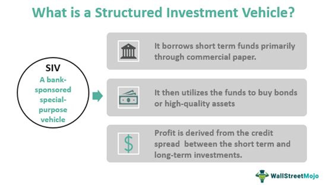

Understanding the diverse world of investment vehicles and financial instruments is crucial for both novice and seasoned investors. Investment vehicles refer to any product used by investors to gain positive returns and manage risks. These products range from traditional options like stocks and bonds, which have been the cornerstones of investment portfolios, to more innovative opportunities such as algorithmic trading, which leverages technological advancements to optimize trading decisions. In today's rapidly evolving financial landscape, a comprehensive understanding of these investment vehicles is paramount for constructing a robust and diversified investment strategy.

Stocks represent ownership in a company and allow investors to partake in its growth and success. Bonds, on the other hand, are debt securities that provide predictable income through interest payments and offer a relatively lower-risk option compared to equities. Both stocks and bonds form the foundation of many investment portfolios due to their established track records and essential roles in wealth accumulation and risk management.



In contrast, algorithmic trading harnesses the power of algorithms to execute trades at high speeds and with precision, reducing human error and emotional bias. This method can be particularly advantageous for managing large asset volumes and navigating volatile markets. By understanding how these traditional and modern investment vehicles function, investors can better align their portfolios with personal financial goals, risk tolerance, and market conditions.

This article explores various types of investment vehicles and highlights how they can be effectively combined to achieve a well-rounded, diversified investment strategy. Through this exploration, investors can make informed decisions to optimize their wealth-building and risk management efforts.

## Table of Contents

## What Are Investment Vehicles?

Investment vehicles are crucial tools that facilitate the growth of wealth by allowing individuals or entities to engage in the financial markets. These instruments provide a structured way to allocate capital with the goal of achieving specific financial objectives. Investment vehicles can be broadly categorized by their level of risk, which varies significantly depending on the nature and purpose of the instrument.

Low-risk investment vehicles typically include certificates of deposit (CDs), government bonds, and money market funds. These vehicles are characterized by their conservative nature and generally provide steady, albeit lower, returns. For instance, a certificate of deposit is a savings account with a fixed [interest rate](/wiki/interest-rate-trading-strategies) and maturity date, representing a low-risk, guaranteed return on investment.

Conversely, high-risk investment vehicles such as stocks, futures, and options offer the potential for higher returns, albeit with increased [volatility](/wiki/volatility-trading-strategies) and risk of loss. Stocks involve purchasing equity in a company, granting the investor potential dividends and capital appreciation. Futures and options, on the other hand, are derivatives that allow investors to speculate on the price movements of underlying assets, providing opportunities for significant gains but also posing substantial risks due to market unpredictability.

The optimal choice for an investment vehicle depends on several key factors: risk tolerance, investment goals, and market understanding. Risk tolerance is the investor's ability to withstand financial loss. Investors with a higher risk tolerance might gravitate towards equities or derivatives, while those with a lower tolerance might prefer bonds or CDs.

Investment goals further dictate the choice of vehicle. For example, an investor focused on long-term capital growth might prioritize stocks or real estate, whereas someone seeking short-term income might choose dividend-paying stocks or interest-bearing instruments like bonds.

Lastly, market understanding encompasses knowledge of financial markets' dynamics and potential fluctuations. A well-informed investor can navigate complex products like options and futures more effectively, exploiting market opportunities to achieve their financial objectives.

Overall, investment vehicles are diverse and multifaceted, requiring investors to carefully assess their financial circumstances and market insights to make informed investment decisions.

## Types of Investment Vehicles

Investment vehicles represent various instruments through which individuals and entities invest to diversify their portfolios, grow wealth, and manage risk. These vehicles are generally categorized into four major groups: ownership investments, lending investments, cash equivalents, and pooled investment vehicles. Each category has unique characteristics and serves specific strategic objectives in portfolio management.

**Ownership Investments**

Ownership investments involve purchasing assets with the expectation of generating income or profit from their value appreciation. The most common forms of ownership investments are stocks, real estate, and mutual funds:

- **Stocks**: Stocks represent shares in the ownership of a company. When investors buy stocks, they acquire a stake in the company and may receive dividends, which are portions of the company’s earnings distributed to shareholders. Additionally, they may benefit from the appreciation of stock prices.

- **Real Estate**: Investing in real estate allows investors to earn income through rent generated by leasing properties or capital gains through the appreciation of property values over time. Real estate investment can be direct, by owning property, or indirect through Real Estate Investment Trusts (REITs).

- **Mutual Funds**: Mutual funds pool money from multiple investors to buy a diversified portfolio of stocks, bonds, or other securities. Investors own shares of the mutual fund, which in turn owns an interest in the underlying securities.

**Lending Investments**

Lending investments involve providing capital to an entity, such as a corporation or government, with the expectation of receiving interest payments. The principal is typically repaid upon maturity. Key lending investments include:

- **Bonds**: Bonds are debt securities where the investor lends money to governments or corporations in exchange for periodic interest payments and the return of principal upon maturity.

- **Certificates of Deposit (CDs)**: CDs are time deposits offered by banks with a fixed interest rate and maturity date. Investors agree to leave a specified amount of money in the bank for a set term and receive interest in return.

**Cash Equivalents**

Cash equivalents are short-term, highly liquid investments with minimal risk. These instruments are nearly as liquid as cash and valued for the ease and speed with which they can be converted to cash. Examples include:

- **Money Market Accounts**: These accounts invest in short-term, high-quality investments issued by government and corporate entities. They pay interest and provide excellent liquidity.

- **Treasury Bills (T-bills)**: T-bills are short-term government securities with maturities ranging from a few days to a year. They are sold at a discount from the face value, and the difference between the purchase price and the face value represents the investor’s return.

**Pooled Investment Vehicles**

Pooled investment vehicles gather capital from multiple investors to invest in a broader and potentially more diversified range of investments, offering benefits such as professional management and economies of scale. Prominent examples include:

- **Mutual Funds**: As mentioned earlier, mutual funds pool resources from many investors to manage a diversified portfolio of securities.

- **Pension Funds**: Pension funds collect and invest funds from workers’ and employers’ contributions to provide retirement income to the employees after retirement.

Each of these categories offers different advantages and levels of risk, and investors often use a combination of these vehicles to achieve a balanced and diversified portfolio tailored to their investment goals and risk tolerances.

## Algorithmic Trading: A Modern Investment Method

Algorithmic trading is a sophisticated approach to executing trades that utilizes computer algorithms, which can analyze vast amounts of market data and make trading decisions in fractions of a second. By leveraging pre-programmed instructions, [algorithmic trading](/wiki/algorithmic-trading) systems aim to identify the most opportune moments for executing trades, thereby enhancing efficiency and minimizing human error.

One of the primary advantages of algorithmic trading is its ability to capitalize on market fluctuations. Algorithms can detect and respond to market signals more quickly than human traders, which is particularly beneficial in volatile markets where rapid decision-making is imperative. By systematically analyzing variables such as price, timing, and [volume](/wiki/volume-trading-strategy), these algorithms enable traders to execute complex strategies consistently and accurately.

Algorithmic trading is especially advantageous in managing large volumes of assets. The high-frequency trading ([HFT](/wiki/high-frequency-trading-strategies)) variant of algorithmic trading exemplifies how institutions can handle substantial transaction volumes. HFT firms utilize sophisticated technology and data-driven insights to conduct a large number of trades at exceedingly fast speeds, which can lead to significant profit opportunities from small price discrepancies. 

Moreover, the rapid execution of trades facilitated by algorithmic systems reduces latency and ensures that trading strategies are implemented instantly, ensuring that traders can adhere to their strategy without costly delays. For instance, trading algorithms can be programmed to trigger buy or sell orders when certain technical indicators are met, such as moving averages or [momentum](/wiki/momentum) signals, thus automating the implementation of tactical trading plans.

To harness the full potential of algorithmic trading, a deep understanding of market data and trends is essential. This requires expertise in data analysis, statistical modeling, and programming skills to develop and refine trading algorithms. Python, a widely used programming language in the financial industry, offers numerous libraries such as NumPy and pandas that can be utilized to create, test, and execute algorithmic trading models. For instance, [backtesting](/wiki/backtesting) a trading strategy in Python might involve simulating the strategy over historical data to assess its potential performance using a backtest loop like:

```python
import numpy as np
import pandas as pd

# Assume 'data' is a pandas DataFrame with historical price data
def run_backtest(data, strategy):
    cash = 100000  # starting cash
    positions = 0
    for date, price in data['Close'].items():
        signal = strategy(price)
        if signal == 'buy' and cash > price:
            positions += 1
            cash -= price
        elif signal == 'sell' and positions > 0:
            positions -= 1
            cash += price
    return cash + positions * data['Close'].iloc[-1]
```

In this code, a hypothetical `strategy` function evaluates whether to buy or sell based on provided price data. The loop simulates trading decisions over the dataset, ultimately returning the resulting cash balance.

In conclusion, algorithmic trading offers significant benefits by improving the precision and speed of trade executions, especially in high-volume and high-frequency trading environments. However, it demands detailed market knowledge and a solid foundation in data analytics and software development to optimize trading strategies effectively.

## Choosing the Right Investment Vehicle

Selecting the appropriate investment vehicle requires a careful evaluation of several key factors: financial goals, risk tolerance, and market knowledge. Financial goals may vary significantly from individual to individual, encompassing long-term objectives such as retirement savings, short-term goals like purchasing a home, or even mid-term targets like funding education. Clearly defined goals provide a roadmap for choosing investments that align with an individual's timeline and capital needs.

Risk tolerance is another critical consideration. It is influenced by factors such as age, income stability, and personal comfort with market volatility. Younger investors may afford a higher risk tolerance due to a longer time horizon, which allows for recovery from market downturns. In contrast, older individuals might prioritize capital preservation and opt for more conservative investment options. Conducting a risk assessment can help determine the appropriate mix of investment vehicles to meet individual appetite for risk.

Market knowledge significantly impacts investment choices. An understanding of market dynamics, economic indicators, and financial instruments empowers investors to make informed decisions. For those unfamiliar with these complexities, financial advisors offer valuable guidance. They can tailor investment strategies to align with personal financial circumstances and objectives, leveraging their expertise to navigate market conditions and optimize portfolio performance.

Diversification plays a pivotal role in managing investment risk. By spreading investments across different asset classes—such as stocks, bonds, real estate, and cash equivalents—investors can mitigate risks associated with market fluctuations. A diversified portfolio reduces the exposure to any single investment, potentially leading to more stable and higher long-term returns. Diversification can be achieved through various strategies, including investing in mutual funds or exchange-traded funds (ETFs), which offer broad market exposure and reduce individual stock risk.

Consulting a financial advisor can be particularly advantageous. Advisors can assess personal financial situations comprehensively, considering factors such as income, expenses, and future financial needs. They help create a diversified investment plan that balances risk and return, aligned with individual preferences and goals. Moreover, advisors can offer ongoing advice, adjusting the strategy as required, for example, in response to changes in economic conditions, legislative reforms, or life events.

In conclusion, selecting the right investment vehicle is a nuanced decision-making process that involves assessing financial goals, understanding risk tolerance, and possessing market knowledge. Diversification, facilitated by professional advisory services, enhances the potential for higher returns while minimizing risks, ensuring that individuals are well-positioned to meet their long-term financial objectives.

## Conclusion

The landscape of investment vehicles offers a myriad of possibilities for those looking to grow their wealth while managing risk effectively. Investors today have access to a range of financial instruments, each with unique risk-reward profiles and characteristics. By staying informed about these diverse investment opportunities, including the innovations in algorithmic trading, investors can better navigate the financial markets and make informed choices that align with their goals.

Algorithmic trading, for instance, has revolutionized the manner in which trades are executed, providing opportunities to capitalize on market fluctuations with minimal human intervention. This method not only increases efficiency but also mitigates the risk of human error, thereby appealing to investors with substantial asset volumes and high-frequency trading needs.

To make well-informed investment decisions, understanding the characteristics and risks associated with each type of vehicle is crucial. Ownership investments, lending options, cash equivalents, and pooled investment vehicles each offer distinct advantages and drawbacks. For instance, while stocks may offer high returns, they come with considerable volatility, contrasting with the relative stability and lower returns of bonds and certificates of deposit.

Diversification remains a key strategy for mitigating risk. By combining different types of investments, investors can achieve a more stable portfolio, balancing potential high returns with safer, more predictable assets. This approach requires a comprehensive understanding of how various financial instruments interact and respond to market conditions.

In conclusion, achieving financial goals necessitates a strategic approach to selecting investment vehicles. Consulting with financial advisors can help tailor a portfolio that suits individual risk tolerance and financial objectives. Moreover, continuous learning and staying updated about market trends and emerging investment technologies, such as algorithmic trading, are paramount for long-term success in the dynamic world of investing.

## References & Further Reading

[1]: ["Advances in Financial Machine Learning"](https://www.amazon.com/Advances-Financial-Machine-Learning-Marcos/dp/1119482089) by Marcos Lopez de Prado

[2]: ["Evidence-Based Technical Analysis: Applying the Scientific Method and Statistical Inference to Trading Signals"](https://www.amazon.com/Evidence-Based-Technical-Analysis-Scientific-Statistical/dp/0470008741) by David Aronson

[3]: ["Machine Learning for Algorithmic Trading"](https://github.com/stefan-jansen/machine-learning-for-trading) by Stefan Jansen

[4]: ["Quantitative Trading: How to Build Your Own Algorithmic Trading Business"](https://www.amazon.com/Quantitative-Trading-Build-Algorithmic-Business/dp/1119800064) by Ernest P. Chan

[5]: Bergstra, J., Bardenet, R., Bengio, Y., & Kégl, B. (2011). ["Algorithms for Hyper-Parameter Optimization."](https://dl.acm.org/doi/10.5555/2986459.2986743) Advances in Neural Information Processing Systems 24.