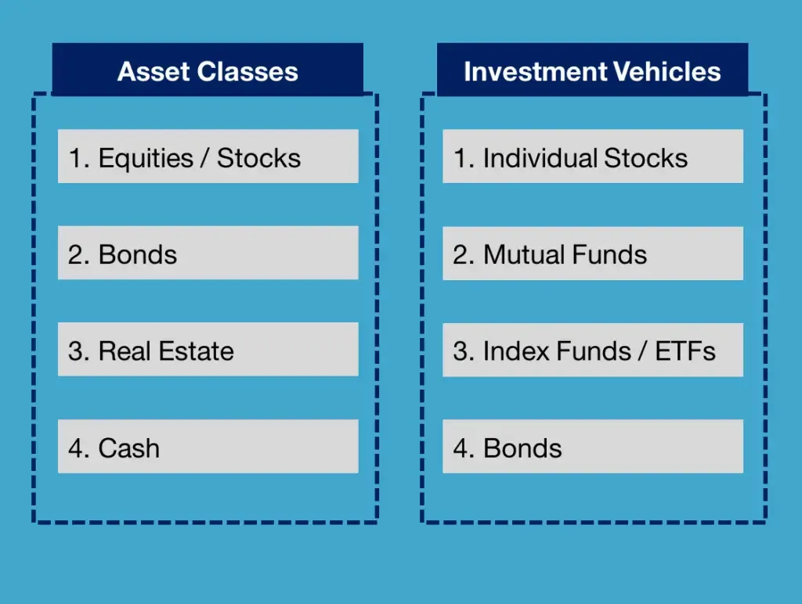

## Table of Contents

## What is an investment vehicle?

An investment vehicle is a way to invest your money. It's like a tool that helps you put your money into different things that might grow over time. There are many types of investment vehicles, like stocks, bonds, mutual funds, and real estate. Each one has its own way of working and its own level of risk and reward.

Choosing the right investment vehicle depends on what you want to achieve and how much risk you are willing to take. For example, if you want to save for retirement, you might choose a 401(k) or an IRA. If you want to grow your money faster, you might invest in stocks, but remember that stocks can go up and down a lot. It's important to understand each investment vehicle so you can pick the one that fits your goals and comfort with risk.

## What are the most common types of investment vehicles for beginners?

For beginners, some of the most common types of investment vehicles are savings accounts, mutual funds, and exchange-traded funds (ETFs). A savings account is a safe place to keep your money and earn a little interest. It's good for beginners because it's easy to understand and there's no risk of losing your money. Mutual funds and ETFs are also popular because they let you invest in a lot of different things at once, like stocks and bonds. This can help spread out the risk, which is good if you're new to investing.

Another common investment vehicle for beginners is a retirement account, like a 401(k) or an IRA. These accounts are set up to help you save for the future. A 401(k) is often offered by your employer, and they might even add some money to your account. An IRA is something you can set up on your own. Both types of accounts have special tax benefits, which means you might pay less in taxes. They're a good choice for beginners because they're designed to help you save over a long time, and they're pretty easy to manage.

## How do stocks differ from bonds as investment vehicles?

Stocks and bonds are two different kinds of investment vehicles that work in different ways. When you buy a stock, you're buying a small piece of a company. If the company does well, the value of your stock might go up, and you could make money. But if the company doesn't do well, the value of your stock could go down, and you could lose money. Stocks can be risky, but they also have the potential to grow a lot over time.

Bonds, on the other hand, are like loans that you give to a company or the government. When you buy a bond, the borrower promises to pay you back the money you lent them, plus a little extra called interest. Bonds are usually safer than stocks because you're more likely to get your money back. But they usually don't grow as much as stocks over time. So, stocks might be better if you want to grow your money a lot, but bonds are better if you want to keep your money safe and get a steady return.

## What are mutual funds and how do they work?

A mutual fund is a way for a lot of people to pool their money together to invest in a bunch of different things, like stocks, bonds, or other investments. When you buy into a mutual fund, you're buying a small piece of the whole fund. The people who run the mutual fund, called fund managers, decide what to invest in. They try to pick investments that will grow over time and make money for everyone who has put money into the fund.

Mutual funds are popular because they let you spread your money across many different investments, which can help lower the risk. Instead of putting all your money into one stock or bond, you're investing in a whole bunch of them. This is called diversification. It's like not putting all your eggs in one basket. Mutual funds can be a good choice for beginners because they're managed by professionals, and you don't have to pick the investments yourself.

## Can you explain what an ETF is and its benefits?

An [ETF](/wiki/etf-trading-strategies), or Exchange-Traded Fund, is a lot like a mutual fund. It's a way for a bunch of people to pool their money and invest in many different things at once, like stocks, bonds, or other investments. The big difference is that ETFs are traded on stock exchanges, just like individual stocks. This means you can buy and sell them throughout the day at the current market price, while mutual funds are usually bought or sold at the end of the trading day.

One of the main benefits of ETFs is that they offer diversification, which means you're spreading your money across many different investments. This can help lower the risk because if one investment doesn't do well, the others might make up for it. Another benefit is that ETFs often have lower fees than mutual funds. This is because they're usually passively managed, which means they follow a specific index, like the S&P 500, instead of having a team of people [picking](/wiki/asset-class-picking) the investments. Lower fees can mean more money in your pocket over time.

## What role do real estate investments play in a diversified portfolio?

Real estate investments can be a good addition to a diversified portfolio because they offer something different from stocks and bonds. When you invest in real estate, you're putting your money into physical property, like houses or buildings. This can help spread out your risk because real estate often doesn't move in the same way as the stock market. If the stock market goes down, your real estate might still be doing well, which can help balance out your losses.

Another benefit of real estate is that it can provide a steady income if you rent out the property. This can be a good way to earn money regularly, which is different from the ups and downs of stock prices. Plus, over time, real estate can go up in value, which means you could make a profit if you decide to sell it later. Adding real estate to your portfolio can help you have a mix of investments that work together to grow your money and protect it from big losses.

## How do hedge funds operate and who should invest in them?

Hedge funds are a type of investment vehicle that pools money from a lot of investors to make different kinds of investments. They're usually managed by professional investors who use special strategies to try to make money, no matter if the market is going up or down. These strategies can be risky and complicated, like betting on stocks going down or using borrowed money to invest more. Because of this, hedge funds are often seen as high-risk, high-reward investments.

Hedge funds are not for everyone. They're usually meant for people who have a lot of money to invest and who can handle the risk of losing some of it. In many places, you need to be an "accredited investor" to put money into a [hedge fund](/wiki/hedge-fund-trading-strategies), which means you have to meet certain income or wealth requirements. This is because hedge funds are less regulated than other investments, so they're not as safe. If you're thinking about investing in a hedge fund, it's important to understand the risks and make sure it fits with your overall investment plan.

## What are the risks and rewards associated with investing in commodities?

Investing in commodities means putting your money into things like gold, oil, or wheat. These are physical goods that people use every day. The big reward of investing in commodities is that they can go up in value a lot if there's not enough of them around. For example, if there's a shortage of oil, the price might go up, and you could make a lot of money. Commodities can also help protect your money from inflation, which is when the cost of things goes up over time. If you have some of your money in commodities, it might keep up with or even beat inflation.

But there are also big risks with commodities. Their prices can go up and down a lot because they depend on things like the weather, politics, and how much people want them. If there's too much of a commodity, the price can drop, and you could lose money. Also, commodities don't give you any income like stocks or bonds might. You're just hoping the price will go up. So, while commodities can be a good way to diversify your investments, they're also risky and not right for everyone.

## How can one use options and futures as investment vehicles?

Options and futures are special kinds of investments that let you bet on what will happen to the price of something in the future. An option gives you the right, but not the obligation, to buy or sell something at a certain price before a certain time. For example, if you think the price of a stock will go up, you can buy an option to buy that stock at today's price. If the stock goes up, you can make money by buying it at the lower price and then selling it at the higher price. But if the stock doesn't go up, you only lose the money you paid for the option. Futures are a bit different. They're agreements to buy or sell something at a set price on a specific date in the future. If you think the price of oil will go up, you can buy a futures contract to buy oil at today's price. If the price goes up, you make money when you buy the oil at the lower price and sell it at the higher price. But if the price goes down, you have to buy the oil at the higher price and might lose money.

Using options and futures can be risky because they're complicated and the prices can change a lot. They're not usually good for beginners because you need to understand a lot about how they work and what can go wrong. But if you know what you're doing, options and futures can be a way to make money or protect other investments. For example, if you own a stock and you're worried the price might go down, you can buy an option to sell the stock at today's price. This can help you limit your losses if the stock does go down. But remember, options and futures can also make you lose a lot of money if things don't go the way you expect. So, it's important to learn a lot about them and maybe talk to a financial advisor before you start using them.

## What are private equity and venture capital, and how do they differ?

Private equity and venture capital are both ways of investing money in companies, but they work a bit differently. Private equity is when investors put money into a company that's not publicly traded on the stock market. Usually, these are bigger companies that need money to grow or to fix some problems. The investors might buy the whole company or just a big part of it. They often try to make the company better and then sell it for a profit later. Private equity can be risky because the company might not do well, but it can also make a lot of money if things go right.

Venture capital is a type of private equity, but it focuses on new, small companies that are just starting out. These companies often have big ideas but need money to make them happen. Venture capitalists give them money in exchange for a piece of the company. They hope that the company will grow a lot and become very valuable. Venture capital is really risky because a lot of new companies fail, but if one of them becomes a big success, the investors can make a lot of money. So, while both private equity and venture capital are about investing in companies, private equity is more about established companies, and venture capital is more about new, risky startups.

## How do tax implications vary across different investment vehicles?

Different investment vehicles have different tax rules, which can affect how much money you keep after taxes. When you invest in stocks, you might have to pay capital gains tax if you sell them for a profit. If you hold the stocks for more than a year, you usually pay a lower tax rate than if you sell them in less than a year. Bonds can also have tax implications. If you earn interest from bonds, you have to pay income tax on that interest every year. But some bonds, like municipal bonds, might be tax-free at the federal level, which can be a big advantage.

Mutual funds and ETFs can be a bit more complicated because they hold a lot of different investments. When you sell shares of a mutual fund or ETF, you might have to pay capital gains tax, just like with stocks. But mutual funds can also give you dividends, which are taxed as income. Sometimes, mutual funds have to sell investments inside the fund, and if they make a profit, they pass that on to you as a capital gain, even if you didn't sell your shares. ETFs are usually more tax-efficient because they don't have to sell investments as often, which means fewer capital gains for you to pay taxes on.

Retirement accounts like 401(k)s and IRAs have special tax benefits. With a traditional 401(k) or IRA, you can put money in before you pay taxes on it, which means you might pay less in taxes now. But you'll have to pay taxes when you take the money out later. With a Roth 401(k) or Roth IRA, you put in money that you've already paid taxes on, but you don't have to pay taxes when you take the money out in retirement. Real estate investments can also have different tax rules. You might be able to deduct things like mortgage interest and property taxes, and if you sell a property for a profit, you might have to pay capital gains tax. But there are ways to delay paying that tax, like using a 1031 exchange to swap one property for another.

## What advanced strategies can experts use to optimize returns from various investment vehicles?

Experts can use a few smart tricks to make more money from their investments. One trick is called asset allocation, which means spreading your money across different types of investments, like stocks, bonds, and real estate. By doing this, experts can lower their risk because if one type of investment goes down, the others might go up and balance it out. Another trick is called rebalancing, which means checking your investments every now and then and making sure they're still in the right mix. If one type of investment has grown a lot, you might sell some of it and buy more of the others to keep things balanced. This can help you buy low and sell high, which is a good way to make more money.

Another advanced strategy is called tax-loss harvesting. This means selling investments that have lost value to get a tax break. You can use these losses to lower the taxes you pay on your gains from other investments. It's like using one part of your portfolio to help another part. Experts also use something called dollar-cost averaging, which means putting money into investments little by little over time instead of all at once. This can help lower the risk because you're buying at different prices, and it can help you avoid putting all your money in when prices are high. By using these strategies, experts can make their investments work harder and keep more of their money after taxes.

## References & Further Reading

[1]: ["Advances in Financial Machine Learning"](https://www.amazon.com/Advances-Financial-Machine-Learning-Marcos/dp/1119482089) by Marcos Lopez de Prado

[2]: ["Evidence-Based Technical Analysis: Applying the Scientific Method and Statistical Inference to Trading Signals"](https://www.amazon.com/Evidence-Based-Technical-Analysis-Scientific-Statistical/dp/0470008741) by David Aronson

[3]: ["Machine Learning for Algorithmic Trading"](https://github.com/stefan-jansen/machine-learning-for-trading) by Stefan Jansen

[4]: ["Quantitative Trading: How to Build Your Own Algorithmic Trading Business"](https://www.amazon.com/Quantitative-Trading-Build-Algorithmic-Business/dp/1119800064) by Ernest P. Chan

[5]: Bergstra, J., Bardenet, R., Bengio, Y., & Kégl, B. (2011). ["Algorithms for Hyper-Parameter Optimization."](https://dl.acm.org/doi/10.5555/2986459.2986743) Advances in Neural Information Processing Systems 24.