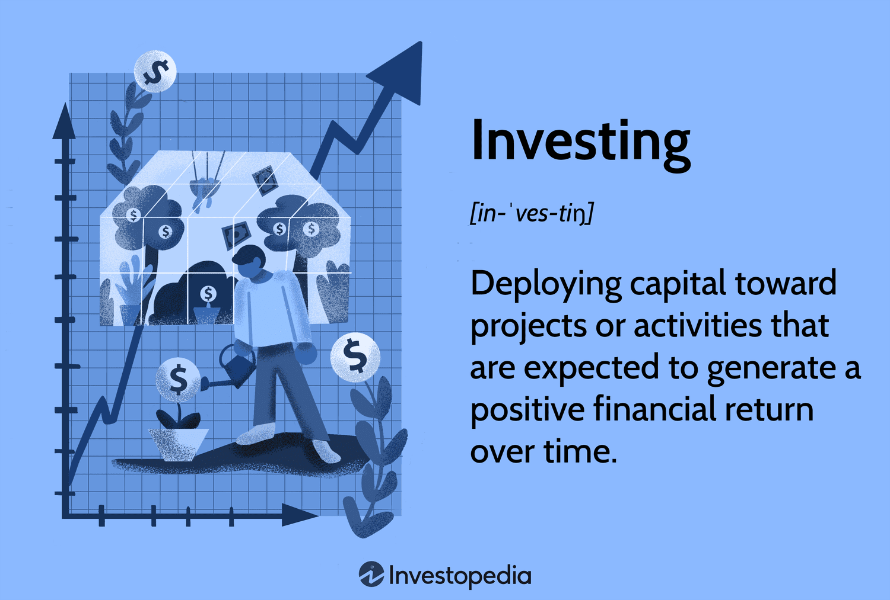

In the rapidly evolving world of finance, three interconnected domains play a pivotal role: investment view, investment finance, and algorithmic (algo) trading. Each element forms a crucial part of modern financial strategies, offering tools and perspectives to enhance investment outcomes. Understanding these domains and their interplay is vital for investors aiming for success.

An investment view is essentially how an investor perceives the market, encompassing macroeconomic variables, market trends, and individual risk profiles. It guides decision-making and strategic choices in aligning investments with personal or institutional goals. A clear investment view balances risk and reward, ensuring that investment choices align with financial objectives.



Investment finance serves as the foundation for creating and managing portfolios that embody these views. It involves the application of financial tools and techniques to analyze and select investment opportunities. This can involve various financial instruments like stocks, bonds, ETFs, and derivatives. Fundamental analysis plays a central role, allowing investors to understand the intrinsic value of assets and make informed decisions.

Algorithmic trading is transforming financial markets by automating the execution of trades through advanced algorithms, improving speed and accuracy. This technology eliminates emotional biases and enhances market efficiency. Different algorithmic trading strategies are employed to capitalize on market movements, including trend-following, arbitrage, and high-frequency trading.

The goal of this article is to explore how these concepts intertwine and provide insights on navigating them for optimal financial outcomes. Understanding the mechanics of algo trading and integrating them with strategic investment views can give investors a competitive edge. This article aims to serve as a comprehensive guide for those looking to leverage these advanced financial strategies.

Readers will gain a deeper understanding of the financial landscape, learning how technology and strategic viewpoints can influence investment success. By understanding these interconnected domains, investors are better equipped to refine their strategies, enhance performance, and achieve financial growth and stability.

## Table of Contents

## Understanding Investment Views

An investment view is an investor's perception of the market, which informs their decision-making process. This perception is influenced by several factors, including macroeconomic variables, market trends, and an individual's risk profile. Macroeconomic variables such as interest rates, inflation rates, and GDP growth offer critical insights into the broader economic environment that can affect asset valuations. For example, an increase in interest rates typically leads to a higher cost of borrowing, which can suppress economic growth and affect the performance of interest-sensitive stocks and bonds.

Market trends, encompassing patterns like market cycles and sector swings, also significantly impact investment views. Historical data and technical analysis often help investors identify these patterns, providing a foundation for predicting future market behavior. For instance, a bull market may encourage aggressive investing in [growth stocks](/wiki/growth-stocks), whereas a bear market could prompt a shift toward defensive sectors such as utilities or consumer staples.

Another essential [factor](/wiki/factor-investing) is the investor's risk profile, which determines their tolerance for potential losses versus expected returns. Risk profiles are often categorized into conservative, moderate, or aggressive, influencing the selection of assets and the structuring of portfolios.

To formulate investment views, investors need to consider these external market conditions alongside their personal or institutional resources and objectives. For instance, an individual investor with a long-term horizon and moderate risk appetite might favor a diversified portfolio with a mix of equities and bonds. In contrast, a [hedge fund](/wiki/hedge-fund-trading-strategies) might employ leverage and complex derivatives to exploit short-term market inefficiencies.

Maintaining a clear investment view is crucial for guiding investment choices and achieving financial goals. It requires balancing risk and reward by aligning investment decisions with the overall financial objectives. A clear investment view helps investors to stay focused during market [volatility](/wiki/volatility-trading-strategies), reducing emotional decision-making that could lead to suboptimal outcomes.

For example, if an investor's view suggests that technology stocks will outperform, they might increase their exposure to this sector. However, balancing this view with risk management strategies—such as setting stop-loss orders or diversifying across different geographic regions—ensures that potential downturns do not jeopardize their financial stability.

In summary, a well-structured investment view integrates an understanding of macroeconomic factors, market trends, and individual risk profiles. By doing so, investors can navigate the financial landscape effectively, making informed decisions that align with their long-term financial objectives.

## The Role of Investment Finance

Investment finance serves as the foundation for constructing and managing portfolios that align with an investor's views and objectives. This involves the judicious selection and analysis of investment opportunities through various financial tools and techniques. Key financial instruments such as stocks, bonds, ETFs, and derivatives play a crucial role in formulating an effective investment strategy.

**Financial Instruments**

1. **Stocks** represent ownership in a company and entitle the shareholder to a portion of the profits. They are a primary component of many investment portfolios due to their potential for significant capital appreciation over the long term. Investors typically evaluate stocks based on metrics like price-to-earnings (P/E) ratios, dividend yield, and earnings growth.

2. **Bonds** are debt instruments that entities issue to raise capital. They provide periodic interest payments to investors and return the principal at maturity. Bonds are generally considered less risky compared to stocks and are favored by investors seeking a steady income stream. The yield to maturity (YTM) is a common measure used to assess a bond's potential return.

3. **Exchange-Traded Funds (ETFs)** offer a diversified portfolio of assets, similar to mutual funds, but trade like individual stocks on exchanges. They provide exposure to a wide range of asset classes, sectors, and regions, allowing investors to diversify their portfolios efficiently. ETFs are often selected based on factors such as expense ratios, liquidity, and tracking error.

4. **Derivatives**, including options and futures, are financial contracts whose value is derived from underlying assets. They are used for hedging risks or speculating on price movements. For example, options can provide leverage, allowing investors to participate in market movements with a smaller initial investment.

**Fundamental Analysis**

Fundamental analysis is integral to investment finance, providing a systematic approach to assessing the intrinsic value of assets. This involves analyzing a company's financial statements, such as the income statement, balance sheet, and cash flow statement, to evaluate its financial health and potential for growth.

Key elements of [fundamental analysis](/wiki/fundamental-analysis) include:

- **Earnings Analysis**: Assessing a company's profitability through metrics like earnings per share (EPS) and net income growth.

- **Valuation Metrics**: Calculating ratios like P/E, price-to-book (P/B), and return on equity (ROE) to determine if an asset is undervalued or overvalued.

- **Industry and Economic Context**: Understanding the broader economic environment and industry trends to predict how they may impact a company's performance.

Fundamental analysis provides a comprehensive view of an asset's value, guiding investors in making informed decisions that align with their investment goals. As investment finance continues to evolve, integrating traditional analysis methods with technology-driven insights remains crucial for optimizing investment outcomes.

## Algorithmic Trading: Revolutionizing Financial Markets

Algorithmic trading, commonly referred to as algo trading, is the use of computer algorithms to automate trading decisions and transactions in financial markets. These algorithms leverage data-driven models and mathematical formulae to execute trades at speeds and frequencies that surpass human capability. By minimizing manual intervention, algo trading enhances the speed and accuracy of financial transactions, providing traders and investors with several strategic advantages.

**Mechanics of Algo Trading**

At its core, algo trading involves designing algorithms that can analyze market data, identify trading opportunities, and execute orders based on predefined criteria. The process begins with the acquisition of market data from various sources such as stock exchanges, financial news, and economic indicators. The algorithm then processes this data to detect patterns or trends that can be exploited for trading. Once the algorithm identifies a favorable condition, it executes orders through an electronic trading platform without human input.

The speed at which these trades occur is crucial, as the competitive nature of financial markets requires capturing opportunities in fractions of a second. Algo trading systems can operate across various asset classes, including stocks, bonds, commodities, and foreign exchange, thereby offering traders access to a broad spectrum of markets.

**Advantages of Algorithmic Trading**

One significant advantage of algo trading is the elimination of emotional bias, which can often impair decision-making in manual trading. Algorithms follow consistent, rule-based strategies, ensuring that trades are executed based on logical conditions rather than emotional reactions to market events. This logical approach improves the efficiency of market operations, as it reduces the likelihood of errors stemming from impulsive human behavior.

Furthermore, [algorithmic trading](/wiki/algorithmic-trading) enhances market [liquidity](/wiki/liquidity-risk-premium) and narrows bid-ask spreads, contributing to increased market efficiency. As algorithms execute trades swiftly and precisely, they contribute to a more fluid exchange environment, facilitating smoother price discovery.

**Types of Algorithmic Trading Strategies**

Several types of algorithmic trading strategies are instrumental in capitalizing on market movements:

1. **Trend-Following Strategies**: These strategies identify and exploit trends in market prices. Algorithms analyze historical price data to predict future movements, applying methods like moving averages and momentum indicators to spot trends.

2. **Arbitrage Strategies**: Arbitrage involves taking advantage of price differentials in different markets or instruments. For instance, an arbitrage algorithm might identify situations where a stock is priced differently on two exchanges and execute simultaneous buy and sell orders to profit from the disparity.

3. **High-Frequency Trading (HFT)**: HFT strategies focus on extremely short-term trades, often holding positions for mere seconds or less. They capitalize on minor price discrepancies and require advanced technology to execute a high volume of trades rapidly. HFT requires sophisticated infrastructure capable of processing vast amounts of data in real-time, making it a domain dominated by financial institutions with substantial technological resources.

Algorithmic trading represents a paradigm shift in financial markets by combining technological advancement with strategic trading methodologies. By using consistent, data-driven approaches, it offers substantial benefits in terms of speed, precision, and market efficiency, providing a robust framework for achieving trading success.

## Integrating Investment Views with Algorithmic Trading

Integrating investment views with algorithmic trading strategies necessitates a sophisticated interplay between strategic insight and technological precision. The goal is to utilize algorithms to systematically execute trading strategies that are aligned with an investor's overarching market outlook. This approach not only enhances decision-making processes but also streamlines the execution to capitalize on market efficiencies.

The first step in this integration involves developing a clear and detailed investment view. This view acts as a blueprint for decision-making, taking into account macroeconomic indicators, market trends, and individual risk appetites. Investment views are characterized by their strategic outlook on future market movements and potential opportunities. For instance, an investor anticipating a rise in technology stocks might focus on setting up algorithmic strategies that prioritize these assets.

Once an investment view is established, the challenge lies in translating this viewpoint into algorithmic parameters. This requires an understanding of both the market environment and the technical capabilities of the algorithms being deployed. Algorithms can be designed to emulate a variety of investment strategies, from trend-following and [momentum](/wiki/momentum) trading to more complex approaches like [market making](/wiki/market-making) and statistical [arbitrage](/wiki/arbitrage). Each strategy demands a unique set of coding instructions and [backtesting](/wiki/backtesting) to ensure that it aligns with the investor’s expectations.

A core component in algorithmic adaptability is the feedback loop mechanism, which allows for continuous recalibration of strategies as new data becomes available. This process involves computational models capable of learning from realtime inputs and refining outcomes by minimizing errors and maximizing returns. Mathematically, this can be expressed using optimization techniques such as gradient descent, which iteratively adjusts algorithm parameters to find the best configuration for trade execution.

Moreover, the algorithms’ ability to process large volumes of data swiftly enables them to identify trading signals and execute trades faster than humanly possible. This speed offers significant advantages in terms of seizing transient profitability windows, reducing the impact of market volatility, and mitigating the risks of emotional biases that often skew human judgment.

For example, a simple Python framework for algorithmic trading might involve using libraries such as pandas for data handling, NumPy for numerical computations, and libraries like TA-Lib for technical analysis:

```python
import pandas as pd
import numpy as np
import talib

# Load historical price data
data = pd.read_csv('stock_data.csv')

# Calculate moving averages
short_window = 40
long_window = 100

signals = pd.DataFrame(index=data.index)
signals['signal'] = 0.0

signals['short_mavg'] = data['Close'].rolling(window=short_window, min_periods=1, center=False).mean()
signals['long_mavg'] = data['Close'].rolling(window=long_window, min_periods=1, center=False).mean()

# Generate trading signals: Buy when short MA crosses above long MA
signals['signal'][short_window:] = np.where(signals['short_mavg'][short_window:] > signals['long_mavg'][short_window:], 1.0, 0.0)

# Calculate positions
signals['positions'] = signals['signal'].diff()
```

In conclusion, the integration of investment views with algorithmic trading offers investors a dual advantage: the strategic foresight of a well-defined market perspective and the execution acumen of automated systems. By harnessing these synergies, investors not only enhance their capability to respond effectively to market dynamics but also optimize their operational efficiencies, thus driving superior investment outcomes.

## Challenges and Considerations

Algorithmic trading has revolutionized the financial markets by enabling rapid and precise execution of trades. Despite its undeniable benefits, it also poses significant challenges that require careful consideration and management. One of the primary technical challenges is the risk of system failures. These failures can stem from hardware malfunctions, software bugs, or network outages, potentially leading to substantial financial losses. Ensuring robust, redundant systems and implementing comprehensive testing protocols are essential to mitigate these risks.

Another concern is the market impact of algorithmic trading. High-frequency trades, a common component of algorithmic strategies, can exacerbate market volatility and lead to phenomena such as 'flash crashes.' A notable example occurred in May 2010, when the Dow Jones Industrial Average plunged nearly 1,000 points within minutes before recovering. To minimize such impacts, traders must carefully design algorithms to adjust dynamically to market liquidity conditions, ensuring that trade sizes and frequencies do not unduly influence market stability.

The rapid pace of algo trading demands high-speed infrastructure. Ensuring that trading systems are co-located with exchanges and operating on the fastest available hardware is crucial. These setups allow for orders to be executed at minimal latency, essential for maintaining a competitive edge. However, the cost and complexity of maintaining such infrastructure can be prohibitive, particularly for smaller market participants.

Overfitting is a critical issue in designing trading algorithms. An algorithm overfit to historical data may perform exceedingly well in simulations but fail in real market conditions. This occurs because the algorithm becomes tailored to past noise rather than the underlying market dynamics. Continuous monitoring, backtesting with diverse datasets, and regular algorithmic updates are necessary to mitigate the risks of overfitting, ensuring that algorithms remain adaptable to evolving market conditions.

To manage the risks associated with algorithmic trading, certain best practices should be observed. These include implementing rigorous risk management frameworks that encompass pre-trade risk assessments and stop-loss mechanisms. Regular audits and stress tests of the algorithms help to uncover potential weaknesses and ensure resilience. Additionally, fostering a culture of ethical trading behavior and compliance with regulatory standards is integral to sustainable and responsible algorithmic trading.

Integrating new technologies responsibly into algorithmic trading systems is also a significant consideration. As [artificial intelligence](/wiki/ai-artificial-intelligence) and [machine learning](/wiki/machine-learning) algorithms become more prevalent, traders must ensure these systems are transparent and their decision-making processes are interpretable. This transparency is vital not only for compliance with regulatory obligations but also for maintaining investor trust and ensuring effective risk management. 

In conclusion, while algorithmic trading offers substantial opportunities for enhancing market efficiency and executing investment strategies, it is not without its challenges. Addressing these issues requires a combination of technical astuteness, strategic planning, and adherence to ethical standards.

## Conclusion

Investment views, investment finance, and algorithmic trading together constitute a formidable trio that significantly influences the contemporary investment landscape. Understanding and effectively leveraging these domains can considerably augment the quality of investment decision-making. Each component, from developing a coherent investment perspective to accurately implementing trading strategies through automation, contributes to the overall dynamism and depth available to investors today.

Investors are encouraged to stay updated with ongoing technological advancements and market developments. This continual learning is crucial, as the financial ecosystem is inherently dynamic. Technological progress frequently introduces new tools and methodologies which necessitate adaptation and recalibration of existing strategies. By embedding a culture of adaptive learning and innovation, investors can refine their techniques, enhancing both resilience and profitability.

Furthermore, merging strategic insights with technological capabilities holds considerable promise for achieving financial growth and stability. The synthesis of human ingenuity in strategy formation with the precision and speed of algorithmic execution allows for a more nuanced and effective approach to market operations. Investors who adeptly integrate these facets are often better positioned to not only meet their financial goals but also navigate the complexities and volatilities of global markets with greater assurance.

Ultimately, the symbiotic relationship between strategic insight and technological prowess allows for a more robust, efficient, and insightful approach to investing, offering significant potential for those who harness these elements adeptly.

## References & Further Reading

[1]: Chan, E. (2008). ["Quantitative Trading: How to Build Your Own Algorithmic Trading Business"](https://github.com/ftvision/quant_trading_echan_book). John Wiley & Sons.

[2]: Lopez de Prado, M. (2018). ["Advances in Financial Machine Learning"](https://www.amazon.com/Advances-Financial-Machine-Learning-Marcos/dp/1119482089). John Wiley & Sons.

[3]: Aronson, D. R. (2006). ["Evidence-Based Technical Analysis: Applying the Scientific Method and Statistical Inference to Trading Signals"](https://www.amazon.com/Evidence-Based-Technical-Analysis-Scientific-Statistical/dp/0470008741). John Wiley & Sons.

[4]: Jansen, S. (2020). ["Machine Learning for Algorithmic Trading"](https://github.com/stefan-jansen/machine-learning-for-trading). Packt Publishing.

[5]: Bergstra, J., Bardenet, R., Bengio, Y., & Kégl, B. (2011). ["Algorithms for Hyper-Parameter Optimization."](https://dl.acm.org/doi/10.5555/2986459.2986743) Advances in Neural Information Processing Systems 24.