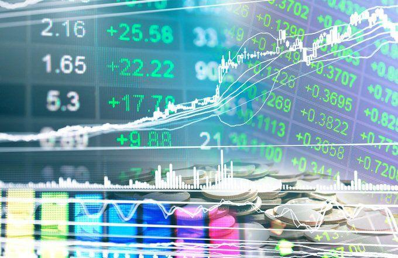

Investment returns play a pivotal role in financial decision-making, serving as the primary measure of an investment's profitability and risk. They influence decisions ranging from individual portfolio constructions to large-scale institutional allocations. By evaluating historical investment returns, investors gain insights into the performance patterns of various assets, which aids in forecasting future opportunities and risks.

Algorithmic trading, which utilizes computer programs to execute trading strategies at high speeds and frequencies, has seen massive growth in modern investing. Its appeal lies in the precision and efficiency with which algorithms can analyze large datasets and exploit market inefficiencies. This evolution in trading methodology represents a shift from manual decision-making based on analyst insights and sentiment to a more data-driven, systematic approach.



The purpose of this article is to explore the relationship between historical investment returns and the impact of algorithmic trading on financial performance. By understanding the historical returns, investors can better anticipate future trends, allowing them to make informed decisions. It is vital to recognize how past data from different asset classes, including stocks, bonds, commodities, and real estate, serves as a touchstone for predicting the future trajectory of these investments.

This article sets the stage for a comprehensive examination of these different asset classes and trading methodologies. By analyzing historical returns and comparing manual trading with algorithmic approaches, we aim to provide a holistic perspective on modern investing. The ensuing sections will delve into the mechanics of algorithmic trading, assess its impact on the financial markets, and explore how its rise reshapes the investment landscape, ultimately equipping investors to harness the power of both historical insights and cutting-edge technology.

## Table of Contents

## Understanding Historical Investment Returns

Historical investment returns refer to the past performance of asset classes over specific periods, reflecting the profits or losses an investor might have experienced. These returns are crucial for financial decision-making, serving as a benchmark for evaluating potential future investments and understanding market behavior.

### Importance of Historical Data

Historical data is invaluable as it helps investors forecast potential outcomes by identifying patterns, trends, and cyclical behaviors in financial markets. By examining past performance, investors can estimate expected future returns and evaluate the risk associated with different investments. For example, historical data can provide insights into the probability of future returns meeting or exceeding desired benchmarks, thus guiding strategic asset allocation decisions.

### Asset Classes

#### Stocks

Stocks represent ownership in a company and offer the potential for high returns. Historical stock market data suggests a long-term upward trend, although this asset class can be volatile in the short term. For example, the S&P 500 Index has historically provided an average annual return of about 7-10% after inflation.

#### Bonds

Bonds are fixed-income securities that tend to be less volatile than stocks. Historical returns on bonds are typically lower compared to stocks but offer more stability, making them an attractive option for risk-averse investors. For instance, over the last century, U.S. government bonds have averaged around 5% annual returns.

#### Commodities

Commodities, including raw materials like gold, oil, and agricultural products, can exhibit significant price fluctuations. The historical performance of commodities is often tied to supply and demand dynamics, geopolitical events, and changes in global economic conditions. Gold, traditionally seen as a hedge against inflation, has shown long-term appreciation of around 1-2% per year in real terms.

#### Real Estate

Real estate investment can provide both income through rent and capital appreciation. Historically, real estate has been a stable investment with returns averaging 3-4% annually after inflation, although location and economic conditions can significantly influence returns.

### Case Studies of Investments

Historically, the U.S. stock market crash of 1929 and the ensuing Great Depression serve as examples of low-performing investment periods, with extensive losses across many asset classes. Contrastingly, the bull market of the 1980s and 1990s saw significant stock appreciation, highlighted by the technological boom in the late 1990s.

### Economic Cycles

Economic cycles, characterized by phases of expansion and recession, significantly impact investment returns. During expansion phases, asset prices typically rise as economic activity increases, leading to higher investment returns. Conversely, during recessions, reduced economic activity often results in asset price declines and lower returns. Understanding these cycles can help investors time their investments to maximize returns and minimize risk exposure.

In summary, historical investment returns provide key insights into the performance of various asset classes, helping guide future investment decisions by highlighting potential risks and rewards associated with different economic scenarios.

## The Rise of Algorithmic Trading

Algorithmic trading refers to the use of computer algorithms to automate the process of buying and selling financial instruments. These algorithms are designed to execute trades at high speed and [volume](/wiki/volume-trading-strategy), based on pre-defined criteria such as timing, price, or quantity. The core principle of [algorithmic trading](/wiki/algorithmic-trading) is the systematic, rules-based execution of trades, reducing the need for human intervention and therefore diminishing the impact of human emotions on trading decisions.

Historically, algorithmic trading has its roots in the quantitative strategies employed by financial institutions since the 1970s, when Andrew Lo and others began to apply computer models to trading. Over the following decades, technological advancements have transformed these early quantitative methods into sophisticated algorithms. The initial goals were straightforward: automate repetitive tasks and reduce execution costs. Today, algorithms incorporate advanced [machine learning](/wiki/machine-learning) techniques, enabling more complex and adaptive strategies.

One of the primary advantages of algorithmic trading is speed. Algorithms can analyze vast datasets and execute orders in fractions of a second, capitalizing on fleeting opportunities in the market. This rapid execution ensures that trades are completed at the best possible prices, minimizing market impact. Another advantage is accuracy, as algorithms adhere strictly to their programmed rules, reducing errors associated with manual trading. Furthermore, algorithms allow for greater volume trading without the need for proportional increases in manpower, enhancing operational efficiency.

The role of big data and machine learning has become increasingly significant in algorithmic trading. Big data enables algorithms to process and interpret large volumes of market and non-market (e.g., social media, news) data. Machine learning models can identify patterns and predict market movements, improving the adaptiveness and performance of trading strategies. This synergy between big data and algorithmic trading provides a competitive edge by uncovering insights that were previously inaccessible through traditional analysis techniques.

However, algorithmic trading also presents several challenges, particularly in volatile markets. The 2010 Flash Crash illustrates the potential for rapid and severe market disruptions caused by algorithmic trading. During such events, algorithms can exacerbate [volatility](/wiki/volatility-trading-strategies) by amplifying rapid price movements. Moreover, they may struggle to adapt to extreme market conditions as models and parameters that work well in stable markets might become ineffective. Algorithms are as good as the data and assumptions upon which they are built, leading to potential model risks and overfitting. This susceptibility to unexpected market behavior requires robust risk management and continuous strategy refinement.

In conclusion, algorithmic trading has revolutionized the landscape of financial markets, providing numerous advantages over traditional trading methods. However, its complexity and susceptibility to market volatility necessitate comprehensive understanding and cautious implementation. To harness the full potential of algorithmic trading, continuous adaptation and improvement of these systems are essential in navigating an ever-evolving financial environment.

## Comparative Analysis: Manual vs. Algorithmic Trading

Manual trading and algorithmic trading represent two fundamentally different approaches to the financial markets, each with its own strengths and limitations. Understanding the distinctions and the relative performance of these methods provides valuable insights for investors.

Manual trading involves human decision-making, relying heavily on an individual's expertise, intuition, and experience. In contrast, algorithmic trading uses computer programs to execute trades based on pre-determined criteria. The automation allows for rapid processing of complex data, which can lead to more efficient trading strategies.

### Performance Metrics

**1. Sharpe Ratio:**
The Sharpe ratio is a measure of risk-adjusted return. It is calculated as:

$$
Sharpe\:Ratio = \frac{{R_p - R_f}}{{\sigma_p}}
$$

Where $R_p$ is the portfolio return, $R_f$ is the risk-free rate, and $\sigma_p$ is the standard deviation of the portfolio return. Algorithmic trading strategies often exhibit higher Sharpe ratios due to precise calculations and reduced emotional interference, leading to a more favorable risk-adjusted performance.

**2. Compound Annual Growth Rate (CAGR):**
CAGR measures the mean annual growth rate of an investment over a specified time period longer than one year. It provides a smoothed annual rate that indicates performance without volatility affecting the average:

$$
CAGR = \left( \frac{{V_f}}{{V_i}} \right)^{\frac{1}{t}} - 1
$$

Where $V_f$ is the final value, $V_i$ is the initial value, and $t$ is the time in years. Algo trading can optimize CAGR by dynamically adjusting strategies in response to real-time data.

**3. Drawdown:**
Drawdown assesses the extent of a portfolio's peak-to-trough decline during a specific period before a new peak is achieved. Algorithmic systems can be programmed to limit drawdowns by employing stop-loss mechanisms and diversification strategies.

### Case Studies: Key Successes and Failures

Algorithmic trading gained recognition with notable successes such as Renaissance Technologies' Medallion Fund, which took advantage of small market inefficiencies with high-frequency strategies, achieving remarkable returns. Conversely, failures like Knight Capital's 2012 trading glitch highlight potential risks, where flawed algorithms can cause substantial losses within minutes.

Manual trading has its triumphs, famously exemplified by Warren Buffett’s long-term value investing strategy. Yet, it is prone to human error and psychological biases, leading to cases like the collapse of Barings Bank after a rogue trader incurred hefty losses.

### Human Emotions vs. Automated Decision-Making

Human traders often grapple with emotional biases such as fear, greed, and overconfidence, which can adversely affect decision-making. Algorithmic trading eliminates emotional interference, consistently executing trades based on logical criteria. This objectivity reduces impulsive decisions and promotes disciplined trading.

### Minimizing Trading Biases

Algorithms can systematically minimize biases by [backtesting](/wiki/backtesting) strategies against historical data, optimizing for maximum efficiency. They evaluate market conditions unemotionally, using massive datasets to identify patterns untapped by human traders. 

Through automation, algorithms enforce risk management techniques such as setting stop-loss orders and rebalancing portfolios, compared to manual trading where biases can impact risk perception and action. This focus on statistical precision and discipline is crucial in volatile markets, where swift, unbiased responses can safeguard against significant losses.

In conclusion, the comparative analysis of manual versus algorithmic trading underscores the evolution of financial strategies, emphasizing the blend of technology and data to optimize market engagement effectively.

## Impact of Algorithmic Trading on Financial Markets

Algorithmic trading has significantly impacted financial markets, profoundly influencing market [liquidity](/wiki/liquidity-risk-premium) and volatility. By leveraging complex algorithms, these systems can execute trades at speeds and frequencies that far surpass human capabilities, thereby enhancing liquidity. The increased market activity reduces bid-ask spreads and leads to tighter pricing, benefiting investors with more efficient trade executions. However, this high-speed, automated trading also contributes to increased market volatility, particularly during periods of market stress when algorithms may simultaneously react to the same signals.

Algorithmic trading enhances market efficiency by continually arbitraging price discrepancies in real-time, suggesting that markets can quickly reflect all available information in asset prices. Algorithms such as statistical [arbitrage](/wiki/arbitrage) exploit small spreads between correlated securities to maintain efficient pricing across different markets. Researchers have found quantitative evidence supporting the efficiency enhancement provided by algorithmic trading, as measured by reduced mispricings in normally inefficient markets.

Despite the advantages of algorithmic trading, its rapid growth presents significant regulatory challenges and necessitates oversight. Regulations like MiFID II in Europe and the SEC’s Circuit Breakers in the U.S aim to mitigate systemic risks by implementing preventive measures such as trading halts during extreme volatility. Oversight is critical to ensure that these automated systems do not disrupt market stability through excessive risk-taking or manipulation.

The inherent risk in algorithmic trading is the potential for flash crashes, sudden market nosedives caused by large, automated sell orders. The infamous 2010 "Flash Crash" underscored the vulnerabilities associated with algorithmic trading. Algorithms can malfunction or enter feedback loops that cascade across markets, causing unanticipated anomalies. Developing fail-safes within algorithms and imposing stringent risk management protocols help manage such risks.

Future trends in algorithmic trading involve integrating advanced technologies including machine learning, [artificial intelligence](/wiki/ai-artificial-intelligence), and quantum computing. These developments will facilitate more sophisticated decision-making processes and predictive analytics, fostering an evolving trading landscape. While these technologies promise increased efficiency and insights, they also raise ethical considerations and the need for robust governance frameworks.

In conclusion, the impact of algorithmic trading on financial markets is multifaceted, enhancing liquidity and efficiency while also contributing to complexity and risk. Continued innovation in algorithmic strategies must be matched with rigorous regulatory oversight and ethical consideration to ensure sustainable and equitable market functioning.

## Evaluating Algorithmic Trading Performance

Evaluating algorithmic trading performance requires a comprehensive approach utilizing key metrics and tools to ensure the effectiveness and robustness of trading strategies. The critical metrics in this evaluation include the Sharpe ratio, Compound Annual Growth Rate (CAGR), maximum drawdown, and various risk-adjusted returns. These metrics provide insights into the profitability, risk, and overall efficiency of trading algorithms.

**Backtesting and Forward Testing**

Backtesting involves testing a trading strategy on historical data to assess how it would have performed. It is essential for understanding a strategy's past efficacy and identifying potential weaknesses. A well-conducted backtest requires high-quality historical data and realistic simulation of trading conditions, including transaction costs and slippage. Forward testing, on the other hand, involves applying the strategy in a paper-trading or a live environment but with real-time data to observe its performance in current market conditions. This step helps validate the robustness of an algorithm beyond historical performance.

```python
# Python example for backtesting
import pandas as pd
import numpy as np

# Sample historical price data for a simple moving average crossover
data = pd.read_csv('historical_price_data.csv')
data['SMA_20'] = data['Close'].rolling(window=20).mean()
data['SMA_50'] = data['Close'].rolling(window=50).mean()

# Generating signals
data['Signal'] = 0
data.loc[data['SMA_20'] > data['SMA_50'], 'Signal'] = 1
data.loc[data['SMA_20'] < data['SMA_50'], 'Signal'] = -1

# Calculating returns
data['Returns'] = data['Close'].pct_change()
data['Strategy_Returns'] = data['Returns'] * data['Signal'].shift(1)

# Performance evaluation
annual_return = np.prod(1 + data['Strategy_Returns'])**(252/len(data)) - 1
print(f'Annualized Return: {annual_return:.2%}')
```

**Risk Management and Position Sizing**

Effective risk management is crucial in algorithmic trading, focusing on minimizing potential losses and maximizing returns through strategic position sizing. Position sizing determines how much capital is allocated to a given trade or asset, helping manage exposure and ensure that no single trade can significantly impact the overall portfolio. Techniques like the Kelly Criterion or volatility-based sizing can be applied to optimize trade sizes based on expected returns and volatility.

**Understanding Drawdowns and Risk-Adjusted Returns**

Drawdowns, the peak-to-trough decline in portfolio value, are critical in evaluating the risk associated with trading strategies. Maximum drawdown provides a measure of the worst loss experienced during a given period and is essential for assessing the potential risk. Risk-adjusted returns, such as the Sharpe ratio, help investors understand the return of an investment compared to its risk, facilitating informed decisions between competing strategies.

$$
\text{Sharpe Ratio} = \frac{R_p - R_f}{\sigma_p}
$$

where $R_p$ is the portfolio return, $R_f$ is the risk-free rate, and $\sigma_p$ is the portfolio standard deviation.

**Case Examples of Successful Algo Trading Strategies**

Successful algorithmic trading strategies often integrate diverse indicators and adaptive mechanisms. For example, Renaissance Technologies' Medallion Fund employs complex mathematical models, incorporating non-linear and non-Gaussian models with machine learning enhancements. Another successful strategy is high-frequency trading ([HFT](/wiki/high-frequency-trading-strategies)), which leverages speed and small price discrepancies to execute numerous trades rapidly, profiting from minuscule market movements while maintaining low risk exposure.

In summary, the evaluation of algorithmic trading performance hinges on the precise measurement and management of numerous factors, including thorough testing phases, disciplined risk management, and the judicious use of performance metrics. These elements collectively contribute to the development and refinement of robust trading strategies capable of achieving sustainable financial success.

## Conclusion

Algorithmic trading has significantly reshaped the investment landscape by automating decision-making processes and enabling efficient execution of trades. Historical investment returns, a cornerstone for forecasting future opportunities, are being increasingly analyzed through the lens of advanced algorithms. A deep understanding of past market performance allows investors to develop data-driven strategies, potentially optimizing returns and minimizing risks. 

Algorithmic trading has transformed investment activities by reducing the impact of human emotions, improving accuracy, and allowing for the rapid processing of vast amounts of financial data. By leveraging machine learning and big data, algorithmic strategies have enhanced predictive capabilities, fostering more informed investment decisions. These technologies continue to evolve, influencing market dynamics and elevating the importance of technology in managing financial portfolios.

The ongoing advancements in algorithmic trading promise to refine strategy development and execution further. Innovations in artificial intelligence and data analytics are expected to bring about new methodologies for interpreting market patterns and adjusting to changing conditions. Such progress holds the potential to enhance market liquidity and efficiency while presenting new challenges, including regulatory concerns and the risk of flash crashes.

Investors are encouraged to integrate both historical data and modern technological solutions to make more informed and strategic investment choices. By understanding past performance and employing contemporary algorithmic tools, investors can better navigate unpredictable market environments. Remaining informed and adaptable is crucial as financial markets continue to evolve at a rapid pace. It is a call to action for investors to cultivate a balanced approach, combining the wisdom gleaned from historical insights with the pioneering capabilities of modern technology.

## References & Further Reading

[1]: Bergstra, J., Bardenet, R., Bengio, Y., & Kégl, B. (2011). ["Algorithms for Hyper-Parameter Optimization."](https://papers.nips.cc/paper/4443-algorithms-for-hyper-parameter-optimization) Advances in Neural Information Processing Systems 24.

[2]: ["Advances in Financial Machine Learning"](https://www.amazon.com/Advances-Financial-Machine-Learning-Marcos/dp/1119482089) by Marcos Lopez de Prado

[3]: ["Evidence-Based Technical Analysis: Applying the Scientific Method and Statistical Inference to Trading Signals"](https://www.amazon.com/Evidence-Based-Technical-Analysis-Scientific-Statistical/dp/0470008741) by David Aronson

[4]: ["Machine Learning for Algorithmic Trading"](https://github.com/stefan-jansen/machine-learning-for-trading) by Stefan Jansen

[5]: ["Quantitative Trading: How to Build Your Own Algorithmic Trading Business"](https://books.google.com/books/about/Quantitative_Trading.html?id=j70yEAAAQBAJ) by Ernest P. Chan