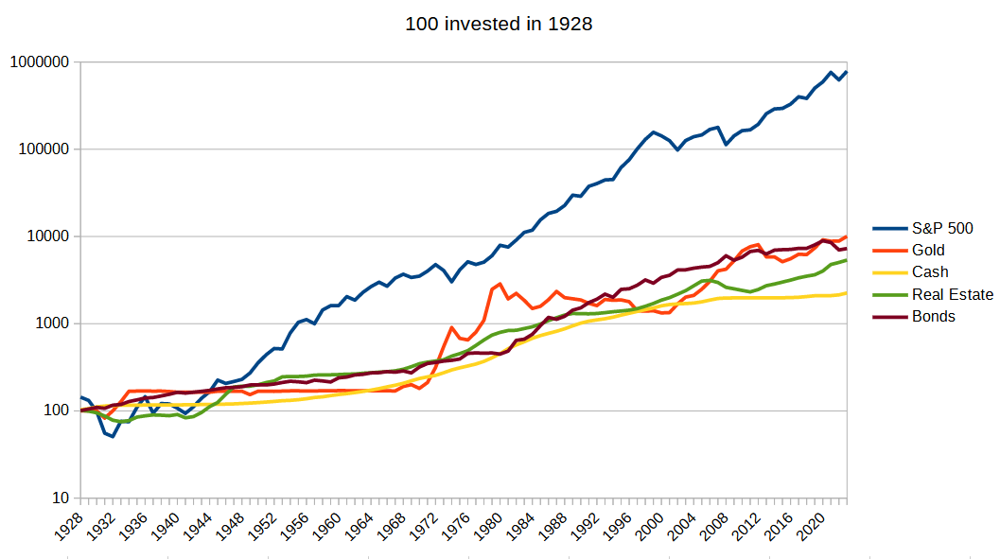

## Table of Contents

## What are investments and why should someone consider them?

Investments are ways to use your money to try to make more money over time. When you invest, you put your money into things like stocks, bonds, or real estate, hoping that they will grow in value or give you regular payments. It's like planting a seed and waiting for it to grow into a tree that gives you fruit. But, just like with plants, there's no guarantee that your investment will grow. Sometimes, you might lose some or all of your money.

People should consider investments because they can help your money grow faster than if you just kept it in a savings account. Over many years, investments can help you reach big goals, like buying a house, paying for your kids' education, or having enough money to live comfortably when you retire. While there are risks, spreading your money across different types of investments can help reduce those risks. By starting to invest early and being patient, you give your money the best chance to grow and help you achieve your financial dreams.

## What are the different types of investments available to beginners?

For beginners, there are several types of investments that are easy to understand and get started with. One common type is stocks, which are pieces of ownership in a company. When you buy a stock, you're hoping the company does well and the value of the stock goes up. Another type is bonds, which are like loans you give to a company or government. They pay you back with interest over time, and they're usually safer than stocks but don't grow as fast. Mutual funds and exchange-traded funds (ETFs) are also good for beginners because they let you invest in a bunch of stocks or bonds at once, which can make your investment less risky.

Another simple investment for beginners is a savings account or a certificate of deposit (CD) at a bank. These are very safe because they're insured by the government, but they usually don't grow your money as much as stocks or bonds. Real estate can also be an investment if you buy a house or property to rent out or sell later for a profit. It's a bit more complicated and requires more money to start, but it can be a good way to build wealth over time. Each type of investment has its own level of risk and potential reward, so it's important to learn about them and think about what fits best with your goals and how much risk you're comfortable taking.

## How do historical returns influence investment decisions?

Historical returns show us how much money an investment made in the past. They can help us guess how well an investment might do in the future. For example, if stocks usually go up by about 10% each year, you might expect them to do something similar in the future. But, it's important to remember that past results don't promise the same thing will happen again. Things can change a lot, like the economy or what people want to buy, so what worked before might not work next time.

Because of this, people use historical returns as just one part of their decision. They also look at other things, like how risky the investment is and what's happening in the world right now. If an investment has been very steady and made good money over many years, someone might feel more comfortable putting their money into it. But if the world is changing a lot or there are big risks, they might decide to be more careful or choose a different investment. So, historical returns help guide decisions, but they're not the only thing that matters.

## Which investment options have historically shown the highest returns over the last decade?

Over the last decade, stocks have generally shown the highest returns compared to other common investments. For example, the S&P 500, which is a big group of stocks from the biggest companies in the U.S., has had an average yearly return of around 10-12%. This means if you put $100 into the S&P 500 ten years ago, it could be worth about $250 to $300 now. Stocks can be risky because their value can go up and down a lot, but over long periods, they have often given the best returns.

Another investment that has done well over the last decade is technology stocks. Companies like Apple, Amazon, and Google have seen their stock prices grow a lot because more people are using technology every day. These stocks have had even higher returns than the overall market, sometimes growing by 20% or more each year. But they can be even riskier because if people stop wanting their products or services, the stock price can drop fast.

Real estate has also been a good investment over the last decade in many places. Property values have gone up, and renting out homes or buildings can give you regular income. But real estate needs more money to start and can be harder to sell quickly if you need your money back. Overall, while stocks, especially in technology, have shown the highest returns, it's important to think about how much risk you're okay with and how long you can leave your money invested.

## What are the risks associated with investments that have high historical returns?

Investments that have high historical returns, like stocks, especially in technology, come with big risks. One main risk is that their value can go up and down a lot. This means you might lose money if you need to sell your investment when its value is low. For example, if you bought a stock that went up a lot over the last few years, it could suddenly drop if people stop liking the company or if something bad happens in the world that affects the stock market.

Another risk is that past success doesn't mean the same thing will happen in the future. Just because a stock or a type of investment did well before doesn't guarantee it will keep doing well. Things like changes in the economy, new laws, or new competitors can make a big difference. If you put all your money into one investment that used to do well but then doesn't anymore, you could lose a lot.

It's also important to think about how long you can leave your money invested. High-return investments often need time to grow. If you might need your money back soon, these investments can be risky because you might have to sell them at a bad time. Spreading your money across different types of investments can help lower these risks, but it's still important to understand that high returns come with high risks.

## How does the time horizon affect the choice of investments with high historical returns?

The time horizon, or how long you plan to keep your money invested, is really important when choosing investments with high historical returns. If you have a long time horizon, like 10 years or more, you might be okay with the ups and downs of stocks or technology investments. These can be risky and go up and down a lot, but over many years, they often give the best returns. So, if you can leave your money in for a long time, these high-return investments could help your money grow a lot.

But if your time horizon is short, like just a few years, high-return investments can be too risky. You might need your money back before the investment has a chance to grow, and if the value goes down, you could lose money. In this case, you might want to choose safer investments, even if they don't grow as fast. It's all about matching your investment choices with how long you can wait for your money to grow.

## Can you explain the concept of risk-adjusted returns in the context of high-return investments?

Risk-adjusted returns help you understand how much return you're getting for the risk you're taking with an investment. It's like looking at how much reward you get compared to how bumpy the ride might be. For high-return investments like stocks, especially in technology, the returns can be big, but so can the risks. The value of these investments can go up and down a lot, so you might lose money if you need to sell at a bad time. Risk-adjusted returns let you see if the high returns are worth the high risk.

One way to measure risk-adjusted returns is by using something called the Sharpe Ratio. This ratio compares the return of an investment to how much it moves up and down. A higher Sharpe Ratio means you're getting more return for the risk you're taking, which is good. For example, if two investments both give you a 10% return, but one moves up and down a lot more than the other, the one with less movement would have a better Sharpe Ratio. This helps you decide if the high returns of an investment are worth the risk, especially when you're thinking about high-return investments like stocks.

## What role does diversification play when investing in assets with high historical returns?

Diversification means spreading your money across different types of investments. It's like not putting all your eggs in one basket. When you invest in assets with high historical returns, like stocks or technology companies, they can be risky because their value can go up and down a lot. By diversifying, you can lower that risk. If one investment goes down, others might go up or stay the same, so your overall money doesn't drop as much.

Even with high-return investments, diversification helps because it balances out the ups and downs. For example, if you only invest in tech stocks and something bad happens in the tech world, you could lose a lot of money. But if you also have some money in other kinds of stocks, bonds, or even real estate, those might not be affected as much. This way, you can still aim for high returns but with less chance of losing everything if one type of investment does badly.

## How have different economic cycles impacted the performance of investments with high historical returns?

Different economic cycles can really change how well investments with high historical returns do. When the economy is growing and people are buying a lot, investments like stocks, especially in technology, can do really well. Companies make more money, and their stock prices go up. But when the economy slows down or goes into a recession, these same investments can lose value fast. People might stop buying as much, and companies might not make as much money, so their stock prices can drop a lot. This means that high-return investments can be very up and down, depending on what's happening in the economy.

It's also important to think about what's happening in the world when looking at economic cycles. For example, if there's a big event like a global health crisis or a war, it can shake up the economy a lot. These events can make high-return investments even riskier because their value can change a lot in a short time. But over many years, these investments can still grow a lot, even with the ups and downs. So, understanding economic cycles can help you decide when to buy or sell these investments, and how much risk you're okay with taking.

## What advanced strategies can be used to optimize returns from investments with high historical returns?

One advanced strategy to optimize returns from investments with high historical returns is called dollar-cost averaging. This means you put a little bit of money into your investment regularly, like every month, instead of all at once. This can help you buy more when prices are low and less when prices are high, which can make your overall cost lower and your returns better over time. It also helps you not worry so much about when to buy, because you're spreading out your investment.

Another strategy is rebalancing your portfolio. This means you check your investments every so often and make sure they're still spread out the way you want. If one investment has grown a lot and is now a bigger part of your money than you planned, you might sell some of it and buy more of something else. This keeps your risk level where you want it and can help you buy low and sell high, which can make your returns better.

A third strategy is using stop-loss orders. This is a way to tell your broker to sell an investment if it drops to a certain price. It can help you limit how much money you lose if an investment goes down a lot. But it's important to use stop-loss orders carefully because if the price drops a little and then goes back up, you might miss out on the gain. These strategies can help you get the most out of high-return investments, but they also need you to keep an eye on your investments and be ready to make changes.

## How do global market trends affect investments with the highest historical returns?

Global market trends can really change how well investments with high historical returns do. When the world economy is doing well, and people are buying a lot, investments like stocks, especially in technology, can go up a lot. Companies make more money, and their stock prices go up too. But if something big happens, like a global health crisis or a war, it can shake up the world economy. This can make high-return investments lose value fast because people might stop buying as much, and companies might not make as much money. So, what's happening around the world can make these investments go up and down a lot.

It's also important to think about how different countries' economies are doing. If one country is doing really well, its companies might do better, and their stocks could go up. But if another country is having a hard time, its companies might struggle, and their stocks could go down. Because high-return investments often come from big companies that do business all over the world, what happens in one place can affect them a lot. So, keeping an eye on global market trends can help you understand why your investments are doing what they're doing and help you make better choices about when to buy or sell.

## What are some case studies of investments that have consistently delivered high returns over long periods?

One good example of an investment that has given high returns over a long time is the S&P 500. The S&P 500 is a big group of stocks from the biggest companies in the U.S. If you look back over the last 50 years, the S&P 500 has usually gone up by about 10% each year. This means if you put $100 into the S&P 500 50 years ago, it could be worth around $1,173 today, not counting any money you take out along the way. Even though it goes up and down a lot, over many years, it has been a good way to grow your money.

Another example is investing in companies like Apple or Amazon. These tech companies have grown a lot over the last 20 years. If you bought Apple stock 20 years ago, your money could have grown by more than 100 times. That means $100 could be worth over $10,000 today. Amazon has done something similar, with its stock growing by about 50 times over the same period. But these investments can be very risky because their value can go up and down a lot. Still, they show how [picking](/wiki/asset-class-picking) the right company and holding onto it for a long time can really pay off.

## What are the differences between Manual and Algorithmic Trading according to a comparative analysis?

Manual trading and [algorithmic trading](/wiki/algorithmic-trading) represent two fundamentally different approaches to the financial markets, each with its own strengths and limitations. Understanding the distinctions and the relative performance of these methods provides valuable insights for investors.

Manual trading involves human decision-making, relying heavily on an individual's expertise, intuition, and experience. In contrast, algorithmic trading uses computer programs to execute trades based on pre-determined criteria. The automation allows for rapid processing of complex data, which can lead to more efficient trading strategies.

### Performance Metrics

**1. Sharpe Ratio:**
The Sharpe ratio is a measure of risk-adjusted return. It is calculated as:

$$
Sharpe\:Ratio = \frac{{R_p - R_f}}{{\sigma_p}}
$$

Where $R_p$ is the portfolio return, $R_f$ is the risk-free rate, and $\sigma_p$ is the standard deviation of the portfolio return. Algorithmic trading strategies often exhibit higher Sharpe ratios due to precise calculations and reduced emotional interference, leading to a more favorable risk-adjusted performance.

**2. Compound Annual Growth Rate (CAGR):**
CAGR measures the mean annual growth rate of an investment over a specified time period longer than one year. It provides a smoothed annual rate that indicates performance without [volatility](/wiki/volatility-trading-strategies) affecting the average:

$$
CAGR = \left( \frac{{V_f}}{{V_i}} \right)^{\frac{1}{t}} - 1
$$

Where $V_f$ is the final value, $V_i$ is the initial value, and $t$ is the time in years. Algo trading can optimize CAGR by dynamically adjusting strategies in response to real-time data.

**3. Drawdown:**
Drawdown assesses the extent of a portfolio's peak-to-trough decline during a specific period before a new peak is achieved. Algorithmic systems can be programmed to limit drawdowns by employing stop-loss mechanisms and diversification strategies.

### Case Studies: Key Successes and Failures

Algorithmic trading gained recognition with notable successes such as Renaissance Technologies' Medallion Fund, which took advantage of small market inefficiencies with high-frequency strategies, achieving remarkable returns. Conversely, failures like Knight Capital's 2012 trading glitch highlight potential risks, where flawed algorithms can cause substantial losses within minutes.

Manual trading has its triumphs, famously exemplified by Warren Buffett’s long-term value investing strategy. Yet, it is prone to human error and psychological biases, leading to cases like the collapse of Barings Bank after a rogue trader incurred hefty losses.

### Human Emotions vs. Automated Decision-Making

Human traders often grapple with emotional biases such as fear, greed, and overconfidence, which can adversely affect decision-making. Algorithmic trading eliminates emotional interference, consistently executing trades based on logical criteria. This objectivity reduces impulsive decisions and promotes disciplined trading.

### Minimizing Trading Biases

Algorithms can systematically minimize biases by [backtesting](/wiki/backtesting) strategies against historical data, optimizing for maximum efficiency. They evaluate market conditions unemotionally, using massive datasets to identify patterns untapped by human traders. 

Through automation, algorithms enforce risk management techniques such as setting stop-loss orders and rebalancing portfolios, compared to manual trading where biases can impact risk perception and action. This focus on statistical precision and discipline is crucial in volatile markets, where swift, unbiased responses can safeguard against significant losses.

In conclusion, the comparative analysis of manual versus algorithmic trading underscores the evolution of financial strategies, emphasizing the blend of technology and data to optimize market engagement effectively.

## How can we evaluate algorithmic trading performance?

Evaluating algorithmic trading performance requires a comprehensive approach utilizing key metrics and tools to ensure the effectiveness and robustness of trading strategies. The critical metrics in this evaluation include the Sharpe ratio, Compound Annual Growth Rate (CAGR), maximum drawdown, and various risk-adjusted returns. These metrics provide insights into the profitability, risk, and overall efficiency of trading algorithms.

**Backtesting and Forward Testing**

Backtesting involves testing a trading strategy on historical data to assess how it would have performed. It is essential for understanding a strategy's past efficacy and identifying potential weaknesses. A well-conducted backtest requires high-quality historical data and realistic simulation of trading conditions, including transaction costs and slippage. Forward testing, on the other hand, involves applying the strategy in a paper-trading or a live environment but with real-time data to observe its performance in current market conditions. This step helps validate the robustness of an algorithm beyond historical performance.

```python
# Python example for backtesting
import pandas as pd
import numpy as np

# Sample historical price data for a simple moving average crossover
data = pd.read_csv('historical_price_data.csv')
data['SMA_20'] = data['Close'].rolling(window=20).mean()
data['SMA_50'] = data['Close'].rolling(window=50).mean()

# Generating signals
data['Signal'] = 0
data.loc[data['SMA_20'] > data['SMA_50'], 'Signal'] = 1
data.loc[data['SMA_20'] < data['SMA_50'], 'Signal'] = -1

# Calculating returns
data['Returns'] = data['Close'].pct_change()
data['Strategy_Returns'] = data['Returns'] * data['Signal'].shift(1)

# Performance evaluation
annual_return = np.prod(1 + data['Strategy_Returns'])**(252/len(data)) - 1
print(f'Annualized Return: {annual_return:.2%}')
```

**Risk Management and Position Sizing**

Effective risk management is crucial in algorithmic trading, focusing on minimizing potential losses and maximizing returns through strategic position sizing. Position sizing determines how much capital is allocated to a given trade or asset, helping manage exposure and ensure that no single trade can significantly impact the overall portfolio. Techniques like the Kelly Criterion or volatility-based sizing can be applied to optimize trade sizes based on expected returns and volatility.

**Understanding Drawdowns and Risk-Adjusted Returns**

Drawdowns, the peak-to-trough decline in portfolio value, are critical in evaluating the risk associated with trading strategies. Maximum drawdown provides a measure of the worst loss experienced during a given period and is essential for assessing the potential risk. Risk-adjusted returns, such as the Sharpe ratio, help investors understand the return of an investment compared to its risk, facilitating informed decisions between competing strategies.

$$
\text{Sharpe Ratio} = \frac{R_p - R_f}{\sigma_p}
$$

where $R_p$ is the portfolio return, $R_f$ is the risk-free rate, and $\sigma_p$ is the portfolio standard deviation.

**Case Examples of Successful Algo Trading Strategies**

Successful algorithmic trading strategies often integrate diverse indicators and adaptive mechanisms. For example, Renaissance Technologies' Medallion Fund employs complex mathematical models, incorporating non-linear and non-Gaussian models with [machine learning](/wiki/machine-learning) enhancements. Another successful strategy is high-frequency trading ([HFT](/wiki/high-frequency-trading-strategies)), which leverages speed and small price discrepancies to execute numerous trades rapidly, profiting from minuscule market movements while maintaining low risk exposure.

In summary, the evaluation of algorithmic trading performance hinges on the precise measurement and management of numerous factors, including thorough testing phases, disciplined risk management, and the judicious use of performance metrics. These elements collectively contribute to the development and refinement of robust trading strategies capable of achieving sustainable financial success.

## References & Further Reading

[1]: Bergstra, J., Bardenet, R., Bengio, Y., & Kégl, B. (2011). ["Algorithms for Hyper-Parameter Optimization."](https://papers.nips.cc/paper/4443-algorithms-for-hyper-parameter-optimization) Advances in Neural Information Processing Systems 24.

[2]: ["Advances in Financial Machine Learning"](https://www.amazon.com/Advances-Financial-Machine-Learning-Marcos/dp/1119482089) by Marcos Lopez de Prado

[3]: ["Evidence-Based Technical Analysis: Applying the Scientific Method and Statistical Inference to Trading Signals"](https://www.amazon.com/Evidence-Based-Technical-Analysis-Scientific-Statistical/dp/0470008741) by David Aronson

[4]: ["Machine Learning for Algorithmic Trading"](https://github.com/stefan-jansen/machine-learning-for-trading) by Stefan Jansen

[5]: ["Quantitative Trading: How to Build Your Own Algorithmic Trading Business"](https://books.google.com/books/about/Quantitative_Trading.html?id=j70yEAAAQBAJ) by Ernest P. Chan