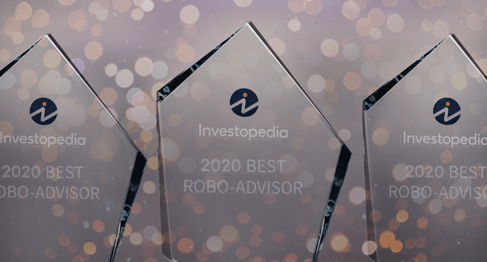

The landscape of investment is constantly evolving with technological advancements. One of the most significant developments in recent years has been the rise of robo-advisors. These digital platforms have transformed the way individuals engage with financial markets by offering automated, algorithm-driven financial planning services at a low cost. Robo-advisors provide personalized investment advice with minimal human intervention, making them an attractive option for both novice and experienced investors.

Investopedia, known for its extensive financial education resources, plays a crucial role in recognizing the top performers within this burgeoning field through its annual Best Robo-Advisors Awards. The recognition aims to identify and honor those platforms that excel in providing innovative and efficient services to their users.

This article examines the Investopedia Robo-Advisors 2020 Awards, focusing on the winners who have made significant contributions to algorithmic trading. These platforms have been recognized for their ability to adapt and innovate, especially during challenging times, offering stability and guidance through advanced technological solutions. The awards highlight the diverse capabilities of robo-advisors, ensuring individuals and investors have access to some of the best options available for optimizing their investment strategies.

## Table of Contents

## Overview of Robo-Advisors

Robo-advisors are a modern solution to the complexities of investment management, leveraging technology to offer automated, algorithm-driven financial services. These digital platforms require minimal human intervention, allowing investors to obtain personalized financial advice without the traditional costs associated with human advisors. The primary function of robo-advisors is to simplify the investment process by using algorithms to recommend and manage a diversified portfolio that aligns with an individual’s financial goals and risk tolerance.

The popularity of robo-advisors can be attributed to several key factors. First, their accessibility allows investors from various backgrounds and financial statuses to participate in the markets. Many robo-advisors have low minimum investment requirements, making it feasible for more individuals to engage in investment activities. Second, the cost-effectiveness of these platforms is a significant draw; fees are generally lower than those charged by traditional financial advisors due to the automated nature of the service. As a result, robo-advisors provide an economical option for achieving financial growth and security.

Another important advantage of robo-advisors is their ability to deliver customized investment advice. By gathering data on an investor's financial situation, risk tolerance, and investment goals, these platforms use sophisticated algorithms to create tailored portfolio recommendations. This personalization ensures that the investment strategy is aligned with the unique needs and preferences of the investor, thereby optimizing their potential for success.

In 2020, the global COVID-19 pandemic led to increased market [volatility](/wiki/volatility-trading-strategies) and economic uncertainty. During this period, many investors turned to robo-advisors for stability and guidance. As individuals sought safe investment solutions to navigate unpredictable markets, robo-advisors experienced a surge in use. Their ability to provide clear, data-driven insights and continuously adapt to market changes made them particularly appealing in such a tumultuous financial environment.

Overall, robo-advisors represent a significant shift in the landscape of investment management. Through innovative use of technology, these platforms offer efficient, affordable, and personalized financial advice, making them an increasingly popular choice for investors seeking to optimize their portfolios in a digital age.

## Investopedia Robo-Advisors 2020 Awards

Investopedia conducted a comprehensive evaluation of more than 20 robo-advisor platforms to determine the best performers in various categories for their 2020 Robo-Advisors Awards. This evaluation process relied on a detailed analysis of 51 parameters, aimed at rigorously assessing the capabilities and features of each platform. The parameters measured aspects such as user experience, cost-effectiveness, financial tools provided, and customer support, among others.

The 2020 awards recognized platforms that provided innovative solutions tailored to the evolving needs of investors, especially during an economically challenging year marked by global uncertainties. The pandemic-induced market volatility and economic fluctuations highlighted the need for automated investment solutions that could offer stability and personalized guidance.

The evaluation process led to several key award categories that encapsulated the unique strengths of different robo-advisors. These categories included "Best Overall," which assessed the comprehensiveness and balance of all service offerings. The "Best for Beginners" category prioritized user interface simplicity and educational resources, ensuring ease of access for novice investors. The "Best for Low Costs" category focused on platforms that offered minimal fees for portfolio management and trades, thus maximizing investor returns.

These categories reflect Investopedia's commitment to highlighting the diverse strengths of robo-advisors, providing investors with valuable insights into choosing platforms that best meet their financial goals and preferences.

## Top Award Winners

Wealthfront was distinguished with the Best Overall award in the Investopedia Robo-Advisors 2020 Awards, largely due to its holistic approach to financial management. The platform is equipped with a suite of features that cater to various aspects of an investor's journey, including goal setting, comprehensive financial planning, banking solutions, and investment management. Wealthfront's innovative software enables users to set and track financial goals through effective planning techniques, integrating diverse banking functions like cash accounts and lending options. These features contribute to its robust portfolio management capabilities, allowing users to maintain a well-diversified and balanced investment strategy tailored to their financial objectives.

Betterment, recognized as the Best for Beginners, provides an approachable and user-friendly platform that excels in demystifying the investing process for novice investors. The platform is acclaimed for its intuitive design and ease of use, which makes it accessible to those new to investing. Betterment distinguishes itself through an extensive range of educational resources that empower users with knowledge about investment fundamentals and personal finance. The inclusion of features such as automated rebalancing, tax-efficient investment strategies, and personalized financial advice further enhance its appeal to beginner investors looking to establish a solid foundation.

M1 Finance earned the title of Best for Low Costs by offering a fee-free structure for both portfolio management and trading. Unlike many of its competitors, M1 Finance does not charge management or trading fees, making it an attractive option for cost-conscious investors. The platform's unique approach allows users to create custom investment portfolios, termed "pies," supporting fractional share investing and enabling a high degree of customization. M1 Finance stands out for its cost efficiency, providing investors the freedom to invest without the burden of fees commonly associated with financial advisory services.

## Special Categories and Their Winners

Interactive Advisors was distinguished as the Best for Sustainable Investing in the Investopedia Robo-Advisors 2020 Awards, highlighting the growing significance of Environmental, Social, and Governance ([ESG](/wiki/esg-investing)) strategies in investment portfolios. This accolade acknowledges Interactive Advisors' commitment to incorporating ESG factors into its [algorithmic trading](/wiki/algorithmic-trading) models, thus enabling investors to align their financial objectives with social and environmental values. By prioritizing responsible investing, Interactive Advisors effectively addresses the increasing demand for ethical investment options.

Personal Capital earned the title of Best for Portfolio Management, thanks to its sophisticated technological infrastructure that encompasses risk and tax management. This recognition underscores Personal Capital's ability to offer a comprehensive suite of financial tools that facilitate personalized portfolio optimization. The platform utilizes advanced analytics and proprietary algorithms to assess risk exposure and implement tax-efficient strategies, thereby enhancing overall portfolio performance. Users benefit from detailed insights into their investment allocations and are provided with actionable recommendations to improve their asset management approach.

E*TRADE Core Portfolios was awarded Best for Mobile Experience, reflecting the platform's strength in delivering a seamless user interface and mobile functionality. This award emphasizes the importance of accessibility and convenience in digital investment platforms. E*TRADE's mobile application is designed to support on-the-go investors, offering intuitive navigation and real-time account tracking. The platform provides key functionalities such as automatic rebalancing and cash management tools, all accessible through a highly-rated mobile interface, thus enabling users to manage their investments with ease and flexibility. 

These special category awards in the 2020 Investopedia Robo-Advisors Awards highlight platforms that have excelled in niche areas crucial to modern investing, catering to the evolving needs and preferences of investors.

## Conclusion

The Investopedia 2020 Robo-Advisors Awards underscored the significant role of automated investing solutions during a period of severe market volatility. The financial turbulence of 2020, driven by the global pandemic, prompted investors to seek platforms that could provide stability and cost-efficiency. Robo-advisors stood out as a viable option, offering algorithm-driven financial planning and management services with minimal human intervention.

For investors, these awards serve as a critical resource when navigating the diverse landscape of robo-advisory services. By recognizing platforms excelling in various categories, Investopedia has made it easier for individuals to find services that align with their unique financial goals, whether they prioritize low costs, beginner-friendly interfaces, or sustainable investment strategies.

The growing popularity and sophistication of robo-advisors mean that investors now have an array of choices that were not available even a few years ago. Platforms like Wealthfront, Betterment, and M1 Finance have paved the way for more tailored, user-centric investment experiences. The criterion of cost-effectiveness has become a cornerstone of robo-advisor success, providing users with transparent and affordable options in managing their portfolios.

In conclusion, the Investopedia 2020 Robo-Advisors Awards have illuminated the pathways to successful investing in turbulent times, offering clarity and direction for those seeking efficient and adaptive approaches to managing their investments. These awards not only celebrate the technological advancements in the industry but also empower investors to make informed decisions in selecting the right robo-advisor to enhance their financial strategies.

## References & Further Reading

[1]: ["Best Robo-Advisors"](https://www.forbes.com/advisor/investing/best-robo-advisors/) - Investopedia, 2020 Awards page

[2]: ["Robo-Advisors: A Portfolio Management Perspective"](https://economics.yale.edu/sites/default/files/2023-01/Jonathan_Lam_Senior%20Essay%20Revised.pdf) by Thomas Philippon - Swiss Journal of Economics and Statistics, 2018

[3]: ["The Future of Investment Management"](https://rpc.cfainstitute.org/sites/default/files/-/media/documents/book/rf-publication/2018/future-of-investment-management-kahn.pdf) by Larry Siegel - CFA Institute 

[4]: ["The Rise of Robo-Advice: Changing the Concept of Wealth Management"](https://www.researchgate.net/publication/375867066_The_Rise_of_Robo-Advisory_in_Investment_Management_An_Individual_Investors'_Perspective) by Anurag Maheshwari - Journal of Financial Service Professionals

[5]: ["Advances in Financial Machine Learning"](https://www.amazon.com/Advances-Financial-Machine-Learning-Marcos/dp/1119482089) by Marcos Lopez de Prado