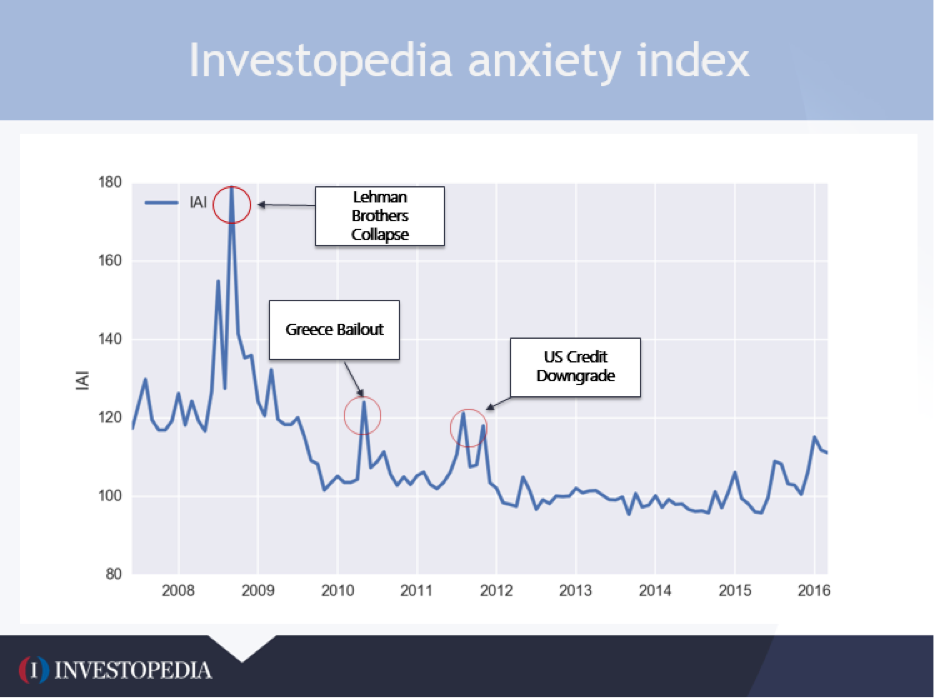

In today's digital economy, investor sentiment has emerged as a powerful force influencing financial markets. With the rise of internet-driven platforms, understanding how investors feel about market conditions is paramount for both individual and institutional investors. The Investopedia Anxiety Index (IAI) provides valuable insights into this sentiment, acting as a barometer of investor anxiety. By analyzing user behavior on Investopedia, the IAI captures real-time changes in investor mood by gauging interest and concerns about macroeconomic topics, market volatility, and credit issues.

Given the rapid evolution of financial markets, algorithmic trading strategies are increasingly leveraging sentiment indices like the IAI to enhance decision-making processes. These advanced algorithms use predefined criteria to execute trades, incorporating sentiment data to predict market movements more accurately. The integration of the IAI into these trading strategies reflects a shift towards sentiment-driven analytics, enabling traders to adapt to market fluctuations with greater precision.



This article provides an overview of the Investopedia Anxiety Index, exploring its significance for sentiment-driven algorithmic trading. By understanding the intricacies of the IAI, traders and investors can better anticipate market dynamics, develop more robust trading strategies, and potentially gain a competitive edge in the financial landscape.

## Table of Contents

## Understanding the Investopedia Anxiety Index

The Investopedia Anxiety Index (IAI) is a quantitative measure designed to capture market sentiment by analyzing reader behavior on Investopedia's platform. As users engage with content related to various economic and financial topics, the frequency and intensity of their interest in specific topics are tracked and measured. This behavioral data is then aggregated to form the IAI, which serves as a proxy for investor anxiety.

The index particularly focuses on key areas of concern for investors: macroeconomic factors, market volatility, and debt/credit issues. These components are critical as they often precede significant market movements. For instance, heightened interest in articles about economic downturns or stock market crashes may indicate increased investor apprehension about macroeconomic stability. Similarly, spikes in searches related to debt or credit could suggest growing worries over financial sustainability or creditworthiness at a corporate or national level.

The IAI's values are designed to reflect the degree of anxiety within the investor community. A high index value points to a period of elevated anxiety; this might be indicative of potential market instability or a response to adverse economic news. Conversely, a lower index value suggests a period of relative calm and confidence among investors.

One of the strengths of the IAI lies in its ability to provide insights into how global events influence investor psychology and behavior. For example, geopolitical tensions, significant policy shifts, or unexpected economic data releases can trigger changes in reader engagement patterns, which in turn are captured by the index. This makes the IAI a valuable tool for understanding the psychological climate of the market, offering a complementary perspective to traditional market indices that focus solely on numerical and financial data. By highlighting the connection between global events and investor sentiment, the IAI can help inform investment strategies and risk assessments.

## Algorithmic Trading and Sentiment Analysis

Algorithmic trading leverages computer programs to execute trades based on predefined criteria, such as price, timing, and [volume](/wiki/volume-trading-strategy). These systems can process large volumes of data with high speed and precision, far exceeding human capabilities. One of its most intriguing aspects is its capacity to incorporate sentiment analysis, which is increasingly recognized for its potential to forecast market movements.

Sentiment analysis in the context of financial markets involves the evaluation of human sentiment from various sources to understand market perceptions and trends. This process typically involves natural language processing (NLP) techniques to analyze text data, ranging from news articles to social media posts. As financial markets are significantly influenced by investor sentiment, algorithms that effectively incorporate this data can potentially anticipate market trends and fluctuations.

By integrating sentiment data from indices such as the Investopedia Anxiety Index (IAI), traders and analysts aim to exploit these insights for strategic advantage. The IAI itself offers a real-time reflection of investor concern related to macroeconomic conditions, market [volatility](/wiki/volatility-trading-strategies), and credit issues, based on user behavior on the Investopedia platform. By monitoring shifts in the IAI, traders can gain early warnings about market apprehension or optimism, allowing them to make more informed trading decisions.

These algorithmic systems assess patterns in sentiment that might not be immediately apparent to human analysts. For example, an algorithm could detect a sustained rise in anxiety levels from the IAI, prompting traders to adopt more conservative strategies or adjust portfolio allocations to mitigate potential losses. Conversely, a decline in anxiety could signal a more favorable market environment, encouraging algorithms to increase exposure to higher-risk assets.

To operationalize sentiment analysis, algorithms might employ the following Python-based example illustrating a simple sentiment scoring mechanism using text data sources:

```python
from textblob import TextBlob
import pandas as pd

# Sample data
data = pd.DataFrame({
    'text': [
        "The market is poised for growth.",
        "Investor worries increase as market volatility rises.",
        "Positive sentiment prevails despite geopolitical tensions."
    ]
})

# Sentiment scoring function
def calculate_sentiment(text):
    blob = TextBlob(text)
    return blob.sentiment.polarity

# Apply sentiment analysis
data['sentiment_score'] = data['text'].apply(calculate_sentiment)

print(data)
```

This example uses TextBlob, a simple text processing library, to compute sentiment polarity scores, where a positive score indicates a generally positive sentiment, and a negative score reflects negativity. The sentiment scores can then be used as input parameters for trading algorithms.

Overall, sentiment analysis enhances [algorithmic trading](/wiki/algorithmic-trading) by offering quantitative insights into collective market perceptions, thus optimizing trading strategies. As market sentiment continues to be an influential [factor](/wiki/factor-investing) in asset price movements, the integration of indices like the IAI into these systems will likely become increasingly prevalent, providing traders a nuanced understanding of market dynamics.

## IAI vs. Traditional Market Indicators

Traditional market indicators have long been the cornerstone of investment strategies. Tools such as the Volatility Index (VIX), which measures market expectations of near-term volatility conveyed by S&P 500 stock index option prices, and other fundamental indicators like earnings reports, GDP growth rates, and interest rates, provide crucial insights into market dynamics. These indicators assist investors in making decisions by offering a quantitative approach to assessing market stability and potential future movements.

The Investopedia Anxiety Index (IAI) offers a distinctive perspective by concentrating on digital user behavior and sentiment rather than relying solely on market data. It captures how investors perceive market conditions based on their engagement with financial information online. This makes the IAI an innovative tool for gauging investor sentiment by reflecting the concerns and anxiety levels present in the market.

While traditional indicators analyze statistical and economic factors, the IAI measures sentiment derived from user behavior on financial platforms. This unique approach enables the IAI to capture shifts in market sentiment that may not be immediately apparent in traditional data. For instance, an uptick in searches related to economic uncertainty or financial crisis might suggest growing investor anxiety, potentially signaling market volatility.

By comparing the IAI with conventional market indices, traders and investors can achieve a more comprehensive market outlook. The juxtaposition of sentiment-driven data with traditional economic indicators can reveal underlying market conditions and emerging trends. In effect, the IAI may act as a leading indicator, identifying market shifts before they are reflected in conventional measures.

Historical analyses have demonstrated instances where the IAI has anticipated market developments ahead of traditional indicators. For example, periods of heightened anxiety detected by the IAI have occasionally preceded significant market corrections, offering an early warning for potential downturns. This predictive capability is particularly valuable in the current digital economy, where investor sentiment can rapidly influence market dynamics.

This comparison highlights the potential benefits of incorporating both sentiment measures and traditional indicators in financial analysis. The complementariness of these tools allows for a nuanced view of market conditions, providing a broader framework for forecasting and decision-making processes. Balancing the insights gained from traditional market data with those obtained from indices like the IAI may significantly enhance the precision and reliability of investment strategies.

## Implications for Traders and Investors

Understanding the Investopedia Anxiety Index (IAI) offers significant benefits for traders and investors seeking to anticipate and react to market fluctuations driven by economic and geopolitical events. The IAI's emphasis on investor sentiment, derived from the behavior of Investopedia users, provides a unique perspective that can enhance traditional trading strategies.

Incorporating sentiment indicators like the IAI into algorithmic trading systems can improve the precision of these systems. By analyzing behavioral data, algorithms can be programmed to recognize shifts in investor anxiety, allowing for preemptive trading decisions. This can lead to the identification of potential market inflections before they are apparent through conventional metrics. For instance, by tracking the IAI alongside other market signals such as moving averages or trend lines, traders may develop more responsive and adaptive models.

For investors, insights drawn from the IAI can be pivotal in making portfolio adjustments in anticipation of market changes. When investor anxiety is high, as indicated by a rising IAI, investors might opt to reduce exposure to volatile assets or seek out safe-haven investments. Conversely, a low IAI might encourage a more aggressive risk posture, taking advantage of perceived stability to capitalize on potential gains.

Sentiment-driven strategies, supported by indices such as the IAI, offer potential advantages in risk management and investment diversification. By factoring in sentiment analysis, investors can enhance their understanding of underlying market risks, leading to more informed decisions regarding asset allocation and portfolio management. This approach can contribute to a more robust risk-adjusted return, helping to mitigate the impact of unforeseen market events.

In summary, the application of the IAI in trading and investment decisions provides a valuable layer of insight. It empowers market participants to better navigate economic and geopolitical uncertainties, ultimately supporting a more agile and informed market engagement strategy.

## Challenges and Limitations

The Investopedia Anxiety Index (IAI), while a valuable tool for gauging investor sentiment, faces several challenges and limitations associated with its reliance on reader behavior. One significant limitation is that the IAI does not capture the entire market sentiment spectrum. Since the index is derived from user interactions on Investopedia, it might reflect the sentiment of a specific subset of market participants—those who are actively seeking information on the platform. This could lead to a skewed representation, particularly in cases where significant portions of investors are not using Investopedia as a primary information source.

Additionally, noise in the data, such as fluctuations in site traffic, can complicate the analysis of the IAI. For instance, an increase in site visits may not necessarily correspond to heightened anxiety but might be driven by other external factors like publicity events or unrelated viral content. This noise can obscure true sentiment signals and create false positives or negatives in the anxiety levels being reported. As a result, the IAI's efficacy in predicting market trends may be compromised if these fluctuations are not appropriately accounted for.

For traders, solely relying on the IAI for decision-making may not be sufficient. Instead, it is crucial to combine IAI data with other market insights to derive a more holistic view of market sentiment. This multi-faceted approach leverages the strengths of different data sources, such as economic indicators, earnings reports, or social media sentiment, to form a comprehensive analysis. Traders may consider using weighted averages or ensemble models to incorporate multiple indicators, ensuring that a single data source's limitations don't drastically affect the overall sentiment analysis.

Algorithmic trading strategies, when based exclusively on sentiment indices like the IAI, may require rigorous fine-tuning and validation to ensure accuracy and reliability. This necessity springs from the inherent volatility and often transitory nature of sentiment data. Algorithm developers should perform [backtesting](/wiki/backtesting) to assess how effectively the algorithm responds to sentiment shifts historically. Furthermore, implementing [machine learning](/wiki/machine-learning) techniques could dynamically adjust the algorithm based on real-time performance metrics and sentiment shifts. Here's a simple Python snippet illustrating how an algorithm could incorporate both sentiment data and traditional indicators:

```python
import numpy as np

def sentiment_trading_strategy(sentiment_data, market_data):
    # Assuming sentiment_data and market_data are numpy arrays
    # sentiment_score and market_index are hypothetical thresholds
    sentiment_score = np.mean(sentiment_data)
    market_index = np.mean(market_data)

    if sentiment_score > 0.7 and market_index > 1000:
        return "Buy"
    elif sentiment_score < 0.3 and market_index < 800:
        return "Sell"
    else:
        return "Hold"

# Example dataset
sentiment_data = np.array([0.6, 0.8, 0.7])
market_data = np.array([1020, 995, 1005])

decision = sentiment_trading_strategy(sentiment_data, market_data)
print(decision)  # Output could be "Buy", "Sell", or "Hold" based on the data
```

In conclusion, while the IAI provides meaningful insights into investor sentiment, its challenges necessitate careful consideration. Traders must use the index as part of a broader analytical framework to mitigate the limitations inherent in sentiment analysis.

## Conclusion

The Investopedia Anxiety Index (IAI) represents a novel approach to capturing and understanding market sentiment by analyzing reader behavior on Investopedia's platform. This unique metric provides insights into investor anxiety levels, which can be instrumental for traders and investors aiming to anticipate market movements and inform their decision-making processes. 

Integrating the IAI into algorithmic trading strategies offers traders the potential to gain a competitive edge by leveraging sentiment data. Algorithms can analyze the patterns revealed by the IAI to predict potential market shifts before they fully manifest. In doing so, traders can position themselves advantageously, optimizing their entries and exits in the financial markets.

However, a successful trading strategy requires more than mere reliance on sentiment indicators. A balanced approach that also considers traditional market indicators—such as the Volatility Index (VIX) and economic fundamentals—tends to provide the most reliable results. The integration of both sentiment-driven data like the IAI and established market metrics enables a comprehensive view, enhancing the trader's ability to manage risks effectively and capitalize on opportunities.

As technology advances, sentiment analysis is becoming increasingly prominent in the development of trading algorithms. The growing availability of data and innovative analytics capabilities will likely boost the role of sentiment metrics in future trading practices, underscoring the importance of understanding and leveraging tools like the Investopedia Anxiety Index in modern financial markets.

## References & Further Reading

[1]: Lopez de Prado, M. (2018). ["Advances in Financial Machine Learning"](https://www.amazon.com/Advances-Financial-Machine-Learning-Marcos/dp/1119482089). Wiley.

[2]: Aronson, D. R. (2006). ["Evidence-Based Technical Analysis: Applying the Scientific Method and Statistical Inference to Trading Signals"](https://www.amazon.com/Evidence-Based-Technical-Analysis-Scientific-Statistical/dp/0470008741). Wiley.

[3]: Jansen, S. (2020). ["Machine Learning for Algorithmic Trading: Predictive models to extract signals from market and alternative data for systematic trading strategies with Python"](https://www.amazon.com/Machine-Learning-Algorithmic-Trading-alternative/dp/1839217715). Packt Publishing.

[4]: Chan, E. (2008). ["Quantitative Trading: How to Build Your Own Algorithmic Trading Business"](https://github.com/ftvision/quant_trading_echan_book). Wiley.

[5]: Tetlock, P. C. (2007). ["Giving Content to Investor Sentiment: The Role of Media in the Stock Market,"](https://onlinelibrary.wiley.com/doi/abs/10.1111/j.1540-6261.2007.01232.x) The Quarterly Journal of Economics, 122(3), 1139-1168.

[6]: Shleifer, A., & Summers, L. H. (1990). ["The Noise Trader Approach to Finance,"](https://www.jstor.org/stable/1942888) Journal of Economic Perspectives, 4(2), 19-33.