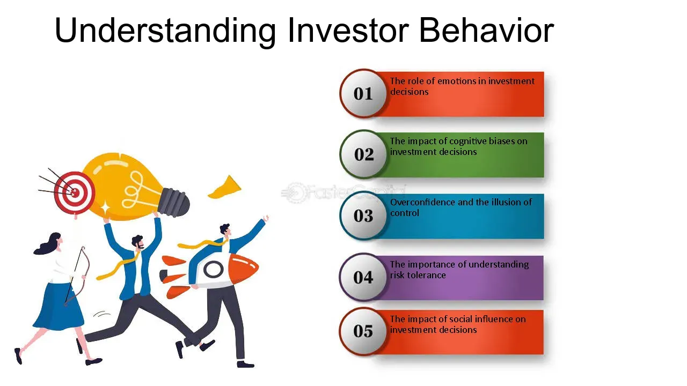

## Table of Contents

## What is investor behavior analysis?

Investor behavior analysis is the study of how people make decisions about their investments. It looks at why people choose certain investments, how they react to changes in the market, and what influences their decisions. This field combines psychology and finance to understand the often irrational ways people handle their money.

Understanding investor behavior is important because it can help financial advisors and investors make better decisions. For example, if people tend to panic and sell their investments when the market goes down, advisors can help them stay calm and stick to their long-term plans. By knowing common behaviors, investors can avoid making mistakes that could hurt their financial goals.

Overall, investor behavior analysis helps explain why markets can be unpredictable and why people sometimes make choices that don't seem to make sense financially. It shows that emotions and biases play a big role in investment decisions, and recognizing these factors can lead to more successful investing.

## Why is understanding investor behavior important?

Understanding investor behavior is important because it helps people make better choices with their money. When we know why people do certain things with their investments, we can avoid common mistakes. For example, many people get scared and sell their investments when the market goes down. If they understand this behavior, they might not panic and could keep their investments, which could be better for them in the long run.

Also, knowing about investor behavior can help financial advisors give better advice. Advisors can see when their clients are making decisions based on fear or excitement instead of facts. By understanding these behaviors, advisors can help their clients stick to a good plan and not make quick choices that might hurt their savings. This can lead to more successful investing and help people reach their financial goals.

## What are the common psychological biases affecting investor decisions?

One common psychological bias is overconfidence. This happens when investors think they know more than they really do. They might believe they can predict the market or pick winning stocks better than others. This can lead them to take big risks or trade too much, which can hurt their investments. Another bias is loss aversion, where people feel the pain of losing money much more than the joy of gaining it. Because of this, they might sell their investments too soon when the market goes down, even if holding on might be better in the long run.

Another bias is herd mentality, where people follow what others are doing without thinking for themselves. If everyone is buying a certain stock, they might buy it too, even if it's not a good choice. This can create bubbles in the market. Confirmation bias is also common, where investors look for information that supports what they already believe and ignore information that doesn't. This can keep them from seeing the full picture and making good decisions. Understanding these biases can help investors make smarter choices and avoid common pitfalls.

## How do emotions influence investment choices?

Emotions play a big role in how people make investment choices. When people feel happy or excited, they might take more risks with their money. They might buy stocks that seem popular or invest in something new without thinking it through. On the other hand, when people feel scared or worried, they might sell their investments quickly, even if it's not the best time. This is because fear can make people want to protect their money, even if holding on might be better in the long run.

Understanding how emotions affect investment choices can help people make better decisions. If someone knows they tend to get excited and take risks when they're happy, they can try to calm down and think more carefully. If they know they get scared and want to sell when the market goes down, they can remind themselves to stick to their plan. By being aware of their emotions, investors can avoid making choices based on feelings instead of facts, which can lead to more successful investing.

## What are the different types of investor behavior models?

There are several types of investor behavior models that help explain how people make choices with their money. One model is the rational choice model, which says that people make decisions based on facts and logic. They look at all the information and choose what seems best for them. Another model is the behavioral finance model, which says that people often make choices based on emotions and biases, not just facts. This model looks at how feelings like fear and excitement can affect what people do with their money.

Another type of model is the prospect theory model, which focuses on how people feel about gains and losses. It says that people feel the pain of losing money much more than the joy of gaining it, so they might make choices to avoid losses, even if it's not the best decision. The mental accounting model is also important. It says that people treat money differently depending on where it comes from or what they plan to use it for. For example, they might be more willing to take risks with money they see as "extra" compared to money they see as their main savings.

These models help us understand why people do what they do with their investments. By knowing about these different ways of thinking, investors and financial advisors can make better plans and avoid common mistakes. It's important to remember that people are not always perfectly logical when it comes to money, and emotions and biases play a big role in their choices.

## How can historical data be used to predict investor behavior?

Historical data can help us guess how investors might act in the future by looking at what they did in the past. For example, if we see that people often sell their investments when the market goes down a lot, we can predict they might do the same thing next time the market drops. By studying past patterns, we can see common behaviors like panic selling or jumping on popular trends. This helps us understand what might happen when similar situations come up again.

Using historical data also lets us see how different events affect investor choices. For instance, if a big economic event like a recession happened before and people reacted in a certain way, we can use that information to predict how they might react to a similar event in the future. By looking at these patterns, financial advisors and investors can prepare better and make smarter decisions. It's like learning from history to not repeat the same mistakes.

## What role does market sentiment play in investor behavior?

Market sentiment is how people feel about the market at a certain time. It can be positive, when people think the market will do well, or negative, when they think it will do badly. This feeling can really affect what investors do. If everyone feels good about the market, more people might buy stocks, thinking they will go up. But if everyone feels bad, people might sell their stocks quickly, worried that prices will fall.

Understanding market sentiment helps investors make better choices. If they know that everyone is feeling too excited or too scared, they can think more carefully about their own decisions. For example, if the market sentiment is very positive and everyone is buying, an investor might decide to wait and see if the excitement cools down before buying. On the other hand, if the sentiment is very negative and everyone is selling, an investor might see it as a chance to buy good stocks at lower prices. By paying attention to how others feel, investors can avoid following the crowd and make choices that fit their own goals.

## How do socio-economic factors impact investor behavior?

Socio-economic factors, like how much money people have or what's happening in the economy, can really change how they invest. When the economy is doing well and people feel secure about their jobs and money, they might be more willing to take risks with their investments. They might buy more stocks or try new things, hoping to make more money. But if the economy is struggling, people might feel worried about their future. They could choose safer investments, like saving accounts or bonds, to protect their money instead of trying to grow it.

These factors also affect how much money people have to invest in the first place. If someone has a good job and is [earning](/wiki/earning-announcement) a lot, they might have extra money to put into the stock market or other investments. But if someone is struggling to pay their bills, they might not have any money left over to invest. Plus, things like education and where someone lives can influence their choices. People with more education might know more about different investments and feel more comfortable trying them. And if someone lives in a place where the economy is growing, they might feel more hopeful about their investments doing well.

## What are the latest tools and technologies used in analyzing investor behavior?

The latest tools and technologies for analyzing investor behavior include big data analytics and [machine learning](/wiki/machine-learning). Big data analytics helps by looking at huge amounts of information from different places, like social media, news, and trading data. This helps experts see patterns in how people invest and what might affect their choices. Machine learning, a type of [artificial intelligence](/wiki/ai-artificial-intelligence), can learn from this data and make predictions about what investors might do next. It can find small details that people might miss and use them to guess future behavior.

Another important tool is sentiment analysis, which looks at what people are saying online to figure out how they feel about the market. By using special software, experts can see if people are feeling positive or negative about their investments. This can help predict if people will buy or sell based on their feelings. Also, behavioral analytics tools track how investors act over time, like how often they trade or what types of investments they choose. These tools help create a full picture of investor behavior, making it easier to understand and predict what they might do in the future.

## How can investor behavior analysis improve portfolio management?

Investor behavior analysis can help make portfolio management better by understanding why people do what they do with their money. When we know that investors often feel scared and sell their investments when the market goes down, we can help them not to panic. Instead, we can encourage them to stick to their long-term plans. This can stop them from making quick choices that might hurt their savings. By knowing about common behaviors, we can create investment plans that fit how people actually act, not just how they should act.

Using tools like big data and machine learning, we can look at a lot of information to see patterns in how people invest. This helps us predict what investors might do next and make better choices for their portfolios. For example, if we see that people are feeling very excited about the market, we might suggest they be careful and not buy too much at once. By understanding investor behavior, we can manage portfolios in a way that helps people reach their financial goals without getting too influenced by their emotions or what everyone else is doing.

## What are the ethical considerations in studying and influencing investor behavior?

When studying and trying to influence how investors behave, it's important to think about what's right and wrong. One big thing to consider is privacy. When we look at data to understand how people invest, we need to make sure we're not using their personal information in a way that could hurt them. It's also important to be honest and clear about what we're doing. If we're using what we learn to help people make better choices, we should tell them that and not try to trick them into doing something they might not want to do.

Another thing to think about is fairness. When we use what we know about investor behavior to help some people, we need to make sure we're not leaving others out. It's not right to use this information to make money for just a few people while others don't get the same help. We should try to use what we learn to help everyone make better choices with their money, not just a small group. By keeping these ethical ideas in mind, we can study and influence investor behavior in a way that's good for everyone.

## How can advanced data analytics and machine learning enhance investor behavior analysis?

Advanced data analytics and machine learning can really help us understand how investors behave. These tools can look at huge amounts of information from places like social media, news, and trading records. By doing this, they can find patterns that might be hard for people to see. For example, they can tell if people are feeling happy or worried about the market by looking at what they say online. This helps us predict what investors might do next, like if they will buy or sell their investments.

Machine learning is also great because it can learn from the data it sees. Over time, it gets better at guessing what investors will do. This means we can make better plans for people's investments. If the machine learning tool sees that people often sell their stocks when the market goes down, it can help us tell investors to stay calm and stick to their plans. By using these smart tools, we can help people make better choices with their money and reach their financial goals.

## References & Further Reading

[1]: Kahneman, D., & Tversky, A. (1979). ["Prospect Theory: An Analysis of Decision under Risk."](http://web.mit.edu/curhan/www/docs/Articles/15341_Readings/Behavioral_Decision_Theory/Kahneman_Tversky_1979_Prospect_theory.pdf) Econometrica, 47(2), 263-291.

[2]: Barber, B. M., & Odean, T. (2000). ["Trading is Hazardous to Your Wealth: The Common Stock Investment Performance of Individual Investors."](https://faculty.haas.berkeley.edu/odean/Papers%20current%20versions/Individual_Investor_Performance_Final.pdf) The Journal of Finance, 55(2), 773-806.

[3]: Thaler, R. H. (1999). ["Mental Accounting Matters."](https://onlinelibrary.wiley.com/doi/abs/10.1002/%28SICI%291099-0771%28199909%2912%3A3%3C183%3A%3AAID-BDM318%3E3.0.CO%3B2-F) Journal of Behavioral Decision Making, 12(3), 183-206.

[4]: Shleifer, A. (2000). ["Inefficient Markets: An Introduction to Behavioral Finance."](https://academic.oup.com/book/27761) Oxford University Press.

[5]: Malkiel, B. G. (2003). ["The Efficient Market Hypothesis and Its Critics."](https://www.princeton.edu/~ceps/workingpapers/91malkiel.pdf) Journal of Economic Perspectives, 17(1), 59-82.

[6]: Lo, A. W. (2005). ["Reconciling Efficient Markets with Behavioral Finance: The Adaptive Markets Hypothesis."](http://www.empirical.net/wp-content/uploads/2014/12/Andrew-Lo-Reconciling-Efficient-Markets-with-Behavioral-Finance.pdf) Journal of Investment Consulting, 7(2), 21-44.