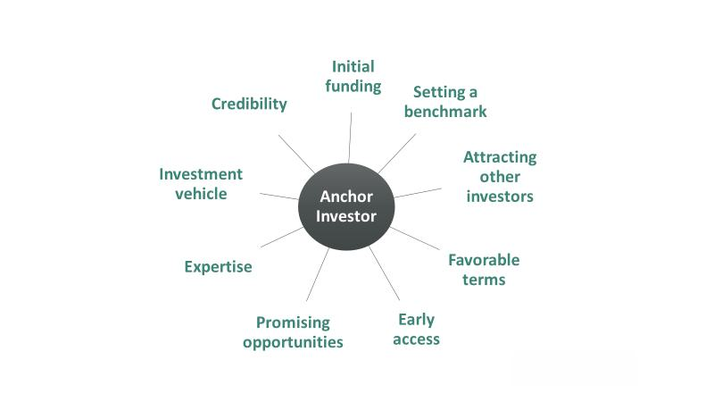

Understanding investment language is critical for effective investor communication. Grasping the terminology and concepts used in the financial markets allows individuals to engage more productively with financial professionals and better comprehend investment strategies and opportunities. By learning to speak like an investor, one can enhance their ability to make sound investment decisions, ultimately contributing to more successful financial outcomes.

Central to this is the need to familiarize oneself with the myriad of terms and practices that pervade the world of investing. This includes not only understanding basic concepts like equities and bonds but also more complex tools like derivatives and futures. These concepts form the foundation of investment dialogue, influencing how investors approach both opportunities and risks in the market.



Moreover, the advent of complex investment strategies such as algorithmic trading signifies a shift in how trades are executed and decisions are made. Gaining insights into algo trading enables investors to harness technology-driven tools that offer speed and precision, thereby increasing the potential to optimize returns. This article aims to equip readers with not only a robust understanding of key investment terms but also valuable insights into the intricacies of algorithmic trading, thereby fostering a more confident approach to navigating the financial markets.

In summary, mastering the language and intricacies of investment is essential for making informed decisions and effectively communicating with other market participants. This forms a crucial part of one's journey toward building robust financial acumen and achieving investment success.

## Table of Contents

## Mastering Investment Lingo

Investment lingo is often perceived as a complex language by novice investors. Possessing a grasp of this terminology is crucial for navigating financial markets and making informed decisions. At the core of investment lexicon are terms like equities, derivatives, futures, commodities, and forex.

**Equities** refer to shares of ownership in a company, represented by stocks. When an investor holds equities, they possess a claim on a portion of a company’s assets and earnings. Understanding equities is fundamental, as they are key components of most investment portfolios.

**Derivatives** are financial contracts whose value is derived from an underlying asset, index, or rate. Common types of derivatives include options, futures, and swaps, which are used for hedging risks or speculating on the future price movements of assets.

**Futures** are standardized contracts obligating the buyer to purchase, or the seller to sell, an asset at a predetermined future date and price. They are used extensively in commodities markets for hedging against price fluctuations.

The term **commodities** describes raw materials or primary agricultural products that can be bought and sold, such as gold, oil, or grains. Commodities trading allows investors to diversify their portfolios by investing in physical goods.

**Forex**, or foreign exchange, involves trading currencies from different countries. It is the largest and most liquid market in the world. Forex trading is pivotal for international trade and investment, influencing global economic stability.

Investors must also comprehend market sentiments indicated by terms such as 'bullish' and 'bearish'. A **bullish** sentiment implies an expectation that asset prices will rise, whereas a **bearish** sentiment suggests anticipation of falling prices. These terms facilitate the interpretation of market trends and decision-making.

Mastering these key investment terms enables investors to engage effectively with financial markets, paving the way for informed investment strategies and decision-making.

## Long and Short Positions

A long position involves purchasing an asset with the anticipation that its value will appreciate over time. This strategy is foundational for investors who believe in the sustained growth prospects of a particular stock, bond, or commodity. When an investor holds a long position, they essentially own the asset and benefit from any price increase, potentially yielding profits if the asset is sold at a higher price than the purchase price.

Conversely, short selling or "shorting" is a technique used to profit from the decline in an asset's price. In this strategy, an investor borrows shares of a stock or another asset they do not currently own, sells them at the current market price, and aims to repurchase them later at a lower price. The difference between the selling price and the repurchase price represents the potential profit. Shorting requires an initial margin deposit and is often leveraged, meaning that it can amplify both potential gains and losses. 

Understanding long and short positions is crucial for active participation in equity and derivative markets. These positions are not just tactics for individual stocks but are also applicable in the context of derivatives, such as options and futures. In derivatives markets, a long position signifies holding a contract agreeing to buy an asset at a future date, while a short position indicates an obligation to sell.

The strategic use of long and short positions allows investors to hedge against market [volatility](/wiki/volatility-trading-strategies) and capitalize on both upward and downward trends. Mastery of these concepts enables better navigation through complex market conditions and can form the basis for more advanced trading strategies, such as pairs trading or [arbitrage](/wiki/arbitrage).

## The Nuances of Algorithmic Trading

Algorithmic trading, often referred to as algo trading, involves the use of sophisticated computer algorithms to execute trades in financial markets. These algorithms are programmed to make decisions concerning orders such as timing, price, and quantity, based on predefined criteria. The primary objective of algo trading is to enhance efficiency, reduce the impact of human emotions, and manage large volumes of data and trades with precision.

One of the core advantages of [algorithmic trading](/wiki/algorithmic-trading) is its ability to process vast amounts of market data at unparalleled speed. Traditional trading methods may struggle to analyze and react to data in real-time due to human limitations, but algos can swiftly parse through numerous data points across various markets. As a result, they can capitalize on market inefficiencies and exploit short-lived trading opportunities that are not easily identifiable through manual methods.

To effectively participate in algorithmic trading, investors must gain a deep understanding of market indicators and data analysis techniques. Market indicators like moving averages, relative strength index (RSI), and Bollinger Bands are frequently incorporated into trading algorithms to generate buy or sell signals. These indicators help algos identify trends, reversals, and potential market movements.

Moreover, a strong comprehension of data analysis techniques is instrumental for successful algo trading. Techniques such as time-series analysis, [machine learning](/wiki/machine-learning), and [statistical arbitrage](/wiki/statistical-arbitrage) can be integrated into algorithms to refine trading strategies and improve prediction accuracy. Python, with its powerful libraries like pandas, NumPy, and scikit-learn, is a popular programming language for developing and back-testing algorithmic trading strategies. An example of a simple moving average crossover strategy in Python might look like this:

```python
import pandas as pd

# Assuming 'data' is a DataFrame containing the historical prices with a 'Close' column
data['SMA_50'] = data['Close'].rolling(window=50).mean()
data['SMA_200'] = data['Close'].rolling(window=200).mean()

# Generating buy/sell signals
data['Signal'] = 0
data['Signal'][data['SMA_50'] > data['SMA_200']] = 1
data['Signal'][data['SMA_50'] < data['SMA_200']] = -1
data['Position'] = data['Signal'].diff()

# Printing the head of the data with signals
print(data.head())
```

In this example, a buy signal is generated when the 50-day simple moving average (SMA) crosses above the 200-day SMA, and a sell signal is generated when it crosses below. This exemplifies how computational trading strategies are framed through quantitative criteria.

Overall, algorithmic trading demands a strong grasp of both quantitative finance and programming, making it accessible to those who are well-versed in both domains. As markets continue to evolve, the reliance on algorithmic strategies is likely to grow, underscoring the importance of mastering these nuances for modern investors.

## Communicating Effectively with Investors

Effective communication with investors is a critical skill for entrepreneurs, business leaders, and fund managers aiming to foster positive investor relations and secure funding. Central to this communication process is the ability to convey clarity and articulate the value proposition of a business or investment opportunity.

### Clarity and Articulation of Value

Clarity in communication ensures that the investor comprehends the core message without ambiguity. This involves simplifying complex ideas and using clear, concise language. Investors, often time-constrained, appreciate communication that gets to the point and highlights critical financial metrics and strategic objectives.

Articulating value requires a precise explanation of how your offering meets market needs. This involves painting a picture of the problem at hand, explaining the market demand, and positioning your product or service as a solution. Providing data and research-backed evidence reinforces the credibility of your claims. For example, statistical analyses, market reports, and customer case studies can demonstrate the efficacy and potential market penetration of your product.

### Market Needs and Competitive Advantage

Understanding market needs is vital in demonstrating the relevance of your offering. Comprehensive market research helps identify target customer segments, pain points, and emerging trends. By synthesizing this information, you can effectively demonstrate how your product or service aligns with these needs, potentially leading to sustainable competitive advantages.

Furthermore, a well-articulated understanding of competitors is crucial. This involves analyzing competitors’ strengths and weaknesses and your strategic positioning. A clear differentiation demonstrates to investors why your offering stands out. This includes aspects such as unique technological innovations, proprietary processes, or advanced intellectual property that competitors cannot easily replicate.

### Supporting Research and Evidence

To substantiate claims, support your investment proposition with quantitative and qualitative evidence. Detailed financial models, projected revenue streams, and growth trajectories help in building trust. Use graphs and charts to depict trends and financial forecasts clearly. For instance, a graph showing projected market growth alongside anticipated company growth can illustrate opportunities for market share capture.

Data analytics tools can enhance your presentation. For example, employing Python to analyze market trends or customer data can provide insights that are visualized through libraries such as Matplotlib or Seaborn:

```python
import matplotlib.pyplot as plt
import seaborn as sns
import pandas as pd

# Sample data
data = {'Year': [2021, 2022, 2023, 2024],
        'MarketGrowth': [5, 7, 10, 12],
        'CompanyGrowth': [6, 8, 12, 15]}

df = pd.DataFrame(data)

# Plotting the data
plt.figure(figsize=(10, 6))
sns.lineplot(x='Year', y='MarketGrowth', data=df, marker='o', label='Market Growth')
sns.lineplot(x='Year', y='CompanyGrowth', data=df, marker='o', label='Company Growth')
plt.title('Projected Market vs Company Growth')
plt.xlabel('Year')
plt.ylabel('Growth (%)')
plt.legend()
plt.show()
```

This code snippet can generate a clear, compelling visualization of growth metrics, aiding in a more convincing presentation to investors.

In summary, establishing effective communication with investors blends clarity with an in-depth articulation of value, supported by data and research. By highlighting market needs, understanding competitors, and leveraging quantitative evidence, you can differentiate your proposition and build confidence in potential investors.

## Key Financial Metrics in Investor Discussions

Understanding financial metrics like Customer Acquisition Cost (CAC) and Customer Lifetime Value (CLV) is vital for engaging in meaningful discussions with investors. These metrics are critical in evaluating a business's scalability and potential profitability, thus influencing investment decisions.

Customer Acquisition Cost is calculated by dividing the total costs associated with acquiring new customers by the number of customers acquired during a specific period. It provides insight into the efficiency of marketing and sales efforts. The formula for CAC is:

$$

CAC = \frac{\text{Total Cost of Sales and Marketing}}{\text{Number of New Customers Acquired}}
$$

A lower CAC indicates more efficient use of resources in acquiring customers, which can lead to higher profitability.

Customer Lifetime Value represents the projected revenue a business can earn from a customer throughout their relationship. CLV helps in assessing the long-term value a customer brings, providing a perspective on how much can be justifiably spent on customer acquisition. The formula for CLV is:

$$

CLV = \frac{\text{Average Purchase Value} \times \text{Average Purchase Frequency}}{\text{Churn Rate}}
$$

Understanding CLV allows companies to strategize on customer retention and optimize their marketing budgets to enhance profitability. 

When pitching to investors, clear communication of these financial metrics not only demonstrates a grasp of the business's financial dynamics but also aids in projecting future growth and sustainability. Investors gain confidence from metrics that illustrate a healthy balance between customer acquisition costs and the lifetime value. This balance is indicative of a scalable and potentially lucrative business model. Presenting these metrics effectively can substantiate financial health and align expectations with investors' profit objectives.

In conclusion, mastering these financial metrics allows businesses to communicate their value proposition compellingly, aiding in securing investor support by emphasizing robust financial management and strategic foresight.

## Practical Tips for Pitching to Investors

Preparing a compelling pitch for investors requires strategic alignment with their priorities, whether those priorities focus on growth potential, innovative solutions, or other factors. Understanding what investors value ensures that your presentation resonates with them, and this involves several key practices.

Firstly, it is crucial to craft a narrative that aligns with investor interests. A pitch should highlight the unique aspects of your business, such as how it stands to capture market share or disrupt an industry with a novel approach. Clearly articulating your company's value proposition can differentiate your offering in a crowded field. Understanding the investor's background and focus can guide this narrative, allowing you to tailor your message to their specific investment theses.

Practicing your pitch is equally important. This means not only refining the delivery but also anticipating and preparing for potential questions and objections from investors. Common queries might focus on market size, competitive advantage, revenue models, or risk mitigation strategies. Being ready with well-researched answers demonstrates preparedness and builds credibility. For instance, if asked about market expansion risks, having data-driven responses can reassure investors of your strategic foresight.

Leveraging case studies and market examples can significantly enhance your pitch. These real-world examples provide concrete evidence of how your business model can succeed in practice. For instance, presenting a case study of a similar company that achieved substantial growth using strategies similar to yours can illustrate your potential trajectory. Market examples highlight trends and opportunities you plan to exploit, reinforcing the viability of your business plan.

Incorporating data and forecasts is another essential element. Investors appreciate a quantitative approach in assessing potential investments. Demonstrating a detailed financial plan with clear projections, supported by historical data and realistic assumptions, can establish your credibility. Using formulas or models to showcase scalability and potential ROI (Return on Investment) further enhances this. For example, the inclusion of a formula for calculating projected revenue growth based on market penetration rates could look like:

$$
\text{Projected Revenue} = \text{Current Market Size} \times \text{Market Penetration Rate} \times \text{Average Revenue Per User (ARPU)}
$$

Finally, using visual aids such as graphs, charts, and slides can help illustrate complex ideas succinctly and memorably. These tools focus attention and simplify the communication of quantitative data, making your pitch more engaging.

In conclusion, the combination of understanding investor priorities, honing your delivery, backing assertions with data and examples, and utilizing visual aids can create a compelling pitch that stands out to investors. Such an approach not only enhances your ability to secure investment but also builds a foundation for long-term investor relations.

## Conclusion

Mastering investment language and effective communication are indispensable for thriving in financial markets. The ability to articulate financial concepts clearly and persuasively enables investors to make well-informed decisions, enhancing their interactions and relationships with peers and stakeholders. Recognizing and using key terms like equities, derivatives, and market sentiment indicators such as “bullish” and “bearish” allows investors to communicate their intentions and strategies more effectively.

With the rapid advancements in technology and market dynamics, continual learning is essential. Algorithmic trading, for example, requires a robust understanding of complex concepts like market indicators and data analytics. As the financial environment evolves, staying updated on the latest trends, technologies, and investment strategies is crucial. This adaptability not only aids in navigating the market efficiently but also in identifying new opportunities for growth and innovation.

In summary, developing proficiency in investment language and honing communication skills serve as foundational elements for investment success. They equip investors to engage confidently with the market, thus fostering stronger investor relations. Remaining open to learning and adapting to change is vital, ensuring resilience and competitiveness in an ever-changing financial landscape.

## References & Further Reading

[1]: Bergstra, J., Bardenet, R., Bengio, Y., & Kégl, B. (2011). ["Algorithms for Hyper-Parameter Optimization."](https://dl.acm.org/doi/10.5555/2986459.2986743) Advances in Neural Information Processing Systems 24.

[2]: ["Advances in Financial Machine Learning"](https://www.amazon.com/Advances-Financial-Machine-Learning-Marcos/dp/1119482089) by Marcos Lopez de Prado

[3]: ["Evidence-Based Technical Analysis: Applying the Scientific Method and Statistical Inference to Trading Signals"](https://www.amazon.com/Evidence-Based-Technical-Analysis-Scientific-Statistical/dp/0470008741) by David Aronson

[4]: ["Machine Learning for Algorithmic Trading"](https://github.com/stefan-jansen/machine-learning-for-trading) by Stefan Jansen

[5]: ["Quantitative Trading: How to Build Your Own Algorithmic Trading Business"](https://github.com/LucindaYa/quant-resources/blob/master/Quantitative%20Trading%20How%20to%20Build%20Your%20Own%20Algorithmic%20Trading%20Business.pdf) by Ernest P. Chan