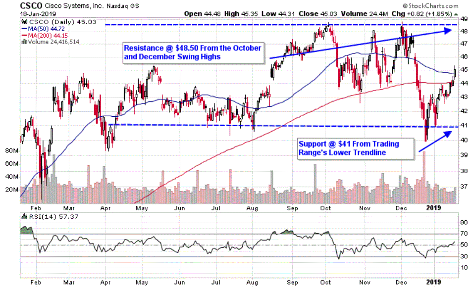

The global transformation towards 5G technology is undeniably underway. Marked by significant enhancements in connectivity speeds, reduced latency, and increased capacity compared to its predecessor, 4G, 5G technology is poised to significantly alter both our daily routines and the broader economic landscape. The shift to 5G is not merely an enhancement of mobile communication systems but a fundamental change that supports a massive number of devices and promises ultra-reliable, low-latency connectivity, which is crucial for a variety of applications.

This development presents a multitude of investment opportunities as industries adapt to leverage 5G capabilities. The advance in technology brings about potential benefits for stakeholders, providing new avenues for growth while also introducing some inherent risks. The ability to understand these potential benefits and risks can significantly impact investment decisions.

Emerging technologies such as algorithmic trading are particularly influenced by 5G, as the technology enhances data transmission speeds and processing abilities. This allows for almost instantaneous execution of trades, giving a competitive edge in sectors where speed matters. Algorithmic trading, bolstered by 5G, can utilize real-time data with greater efficiency, thereby enabling more sophisticated market strategies.

A comprehensive understanding of 5G dynamics, particularly its integration with artificial intelligence (AI) and algorithmic trading platforms, is essential for investors aiming to gain a competitive advantage in the financial markets. This deep understanding aids in devising strategies that are responsive to the rapid technological changes brought on by 5G progression.

In this article, we explore the complex interplay between 5G technology and investment strategies, providing insights into how this next-generation technology is reshaping the future of trading. With a focus on capturing the potential of this technological revolution, investors can prepare to navigate and capitalize on the myriad opportunities that 5G brings to the financial sphere.

## Table of Contents

## Investment Opportunities in the 5G Market

5G technology offers a myriad of investment opportunities, mainly focusing on stocks of companies involved in infrastructure development, device manufacturing, and provision of 5G services. As 5G networks continue to expand on a global scale, they present significant potential gains for both telecommunication giants and technology firms. Companies such as Verizon Communications Inc., AT&T Inc., and T-Mobile US Inc. are at the forefront of 5G network rollouts, positioning themselves as prominent players in the market. These firms are investing heavily in the necessary infrastructure and technologies to enhance network capabilities, enabling faster speeds and lower latency.

For investors seeking diversification, intermediate options such as Exchange-Traded Funds (ETFs) offer a practical solution. ETFs focused on the 5G sector allow individuals to invest in a broad array of companies benefiting from this technological evolution without concentrating their portfolio on single stocks. These funds typically include leading firms in telecommunications and related sectors, thereby mitigating risk and offering exposure to a comprehensive investment basket.

Market trends illustrate that the demand for 5G-compatible devices and infrastructure is on the rise, further augmenting investment opportunities. Companies involved in the production of semiconductor chips, network towers, and related technologies are likely to see increased demand as the technology is adopted more widely. Firms such as Qualcomm Incorporated and Nokia Corporation are key participants in this market, contributing to the landscape with their specialized products and services.

A thorough understanding of these market trends is essential for effectively navigating the 5G investment environment. Investors must stay informed about technological advancements, regulatory changes, and potential market disruptors to harness the full potential of their investments. By keeping abreast of these factors, investors can strategically position themselves to capitalize on the growth and transformative effects of 5G technology in the global economy.

## The Influence of 5G Technology on Algorithmic Trading

5G technology holds transformative potential for algorithmic trading, largely due to its capability to enhance data speed and processing capabilities. With the ultra-low latency and real-time data exchange enabled by 5G, trades can be executed almost instantaneously, providing a significant competitive edge in rapidly changing market environments. This superior speed is crucial in volatile markets, where market conditions can shift in fractions of a second, requiring equally swift reaction times to maximize profit and minimize loss.

Additionally, the integration of AI algorithms with 5G networks allows for faster and more comprehensive analysis of market trends. This integration facilitates the development of smarter trading strategies capable of adapting quickly to market dynamics. AI systems, enhanced by the rapid data transmission of 5G, can scan vast market data, identify patterns, and predict future market movements much faster than with previous network technologies. This capability permits the implementation of complex algorithmic strategies that can respond in real-time to market fluctuations.

Moreover, 5G technology significantly boosts the ability of trading systems to collect and analyze massive data sets from various sources. The increased capacity for data handling means traders can utilize a broader scope of information, from market indices to social media sentiment analyses, which enriches the decision-making process. The ability to process diverse data sources rapidly enables traders to refine their strategies continually, improving the accuracy and profitability of trades.

Despite these advancements, it is critical to address the security challenges associated with the integration of 5G in trading ecosystems. The increased connectivity and expanded data flow in trading systems heightens the risk of cybersecurity threats. As a network becomes more complex, potential vulnerabilities also increase. Therefore, rigorous security measures must be implemented to protect sensitive data and maintain the integrity of transactions. Ensuring that systems are resilient against potential cyber threats is essential for the safe and effective utilization of 5G technologies in [algorithmic trading](/wiki/algorithmic-trading) environments.

## Risks and Challenges of Investing in 5G

Investing in 5G technology is accompanied by a variety of risks and challenges that must be carefully navigated by investors. As with any major technological advancement, the development and deployment of 5G require substantial initial investments, which can lead to financial [volatility](/wiki/volatility-trading-strategies). High costs associated with infrastructure development, such as setting up new base stations and upgrading existing network hardware, pose significant financial burdens. These initial expenditures can affect cash flows and delay expected returns, especially in the early stages of 5G rollout.

One of the critical concerns surrounding 5G technology is cybersecurity and privacy. As 5G networks begin to support an extensive range of applications, including vital services such as power grids and other sensitive infrastructures, the risk of cyber-attacks increases. These networks are more susceptible due to their vast connectivity and open interfaces, which can be exploited by malicious actors. Ensuring robust security measures is essential to protect data integrity and privacy, which could otherwise result in severe financial and reputational consequences.

Regulatory changes and potential interference issues are another area of concern for 5G investors. The aviation sector, for example, has raised concerns about 5G frequencies potentially interfering with aircraft systems. Such risks necessitate ongoing adjustments to regulatory frameworks, which can introduce unpredictability into the market. Investors must stay informed about these changes to assess how regulatory measures might impact their investments and operational landscapes.

Furthermore, the roadmap for 5G deployment is intricate and capital-intensive, often involving staggered rollout plans. This complexity can create disparities in network coverage and service availability, influencing consumer adoption rates and delaying the anticipated financial benefits. Investors may face short to mid-term uncertainties in achieving profitable returns due to these operational hurdles.

To mitigate these risks, investors must conduct thorough due diligence and continuously monitor market dynamics, technological advancements, and regulatory shifts. By adopting diversified investment strategies and engaging with companies that prioritize security and adhere to evolving regulations, investors can position themselves to better navigate the uncertainties linked with 5G investments. Recognizing and planning for these challenges is key to securing potential long-term benefits in the burgeoning 5G landscape.

## The Future: From 5G to 5G Advanced and Beyond

While 5G represents the apex of current wireless technology, the progression toward '5G Advanced' and eventually 6G is already underway. As the landscape evolves, 5G Advanced is predicted to introduce substantial improvements, notably in terms of data speeds and energy efficiency. This makes it a compelling focal point for investment over the next decade. Such enhancements are crucial as networks aim to support an ever-increasing number of connected devices while reducing energy consumption—a significant concern given the global push toward more sustainable practices.

The transition from 5G to 5G Advanced is expected to drive notable shifts across both consumer markets and industrial applications. In consumer markets, users can anticipate more seamless experiences with augmented reality (AR), virtual reality (VR), and other bandwidth-intensive applications. In the industrial sector, including areas such as algorithmic trading, the quicker data transmission and processing capabilities will facilitate more efficient and intelligent operations. For example, in algorithmic trading, even marginal reductions in latency can translate into significant competitive advantages, allowing quicker response to market changes and more efficient execution of trades.

For investors, staying informed about these technological advancements is paramount. The pace at which wireless technology evolves implies that strategic investment planning must incorporate future trends alongside current market conditions. Understanding the trajectory from 5G to its advanced iterations can help investors identify which sectors and companies are likely to benefit the most.

The continual innovations in wireless technologies promise growth opportunities and transformative changes across various sectors, from telecommunications to healthcare, transportation, and finance. Embracing this evolution not only ensures relevance in a rapidly changing market but also positions investors to capitalize on potential breakthroughs that redefine industry standards. By acknowledging the potential of 5G Advanced and beyond, stakeholders can craft strategies that are both forward-thinking and resilient, maximizing their opportunities in an ever-evolving technological landscape.

## Conclusion

5G technology represents a transformative advancement, offering substantial improvements over the capabilities of 4G. Its implementation is expected to create numerous investment opportunities across multiple sectors, albeit not without associated risks. In telecommunications, finance, healthcare, and beyond, 5G enhances efficiency and innovation, making it a fertile ground for strategic investments.

The interplay between 5G and algorithmic trading exemplifies the technology’s potential to revolutionize industries. By augmenting data transmission speeds and processing capabilities, 5G enables prompt, data-driven decisions that can lead to significant financial gains. Investors with a keen understanding of these dynamics can position themselves advantageously, potentially capitalizing on the technology's ability to reshape market practices.

As we approach the era of 5G Advanced, the possibilities for technological growth and sectoral transformation broaden further. This impending evolution in wireless technology necessitates vigilance and adaptability among investors and businesses alike, ensuring they remain competitive in a swiftly evolving digital ecosystem.

To fully leverage the benefits of 5G, entities must actively engage with ongoing technological advancements and anticipate future trends. This proactive approach to the forthcoming changes in wireless technology will offer strategic advantages, empowering stakeholders to maintain relevance and capitalize on the opportunities presented by the rapid shifts in technology and market demands.

## References & Further Reading

[1]: Qualcomm Technologies, Inc. (2019). ["The 5G Economy: How 5G technology will contribute to the global economy."](https://www.qualcomm.com/content/dam/qcomm-martech/dm-assets/documents/the_ihs_5g_economy_-_2019.pdf)

[2]: Gandhi, D., & Suri, S. (2020). ["5G and its Impact on Financial Markets."](https://academic.oup.com/rfs/article/34/11/5135/6337991) arXiv preprint arXiv:2009.04503.

[3]: Hong, C. R., & Patrick, K. A. (2020). ["Algorithmic Trading Strategies."](https://www.semanticscholar.org/paper/Algorithmic-Trading%3A-Winning-Strategies-and-Their-Chan/8220c62caf83863b7f5fb279366d545e720ee062) SSRN Electronic Journal.

[4]: Stewart, J. (2021). ["The Impact of 5G on Algorithmic Trading: Speed, Efficiency, and Security."](https://www.forbes.com/councils/forbestechcouncil/2021/07/08/13-big-impacts-5g-has-already-had-on-business-and-consumer-life/)

[5]: Freedman, E. (2020). ["How 5G Connectivity Will Transform Financial Services and Trading."](https://www.weforum.org/stories/2020/01/5g-is-about-to-change-the-world-in-ways-we-cant-even-imagine-yet/) Business Insider.