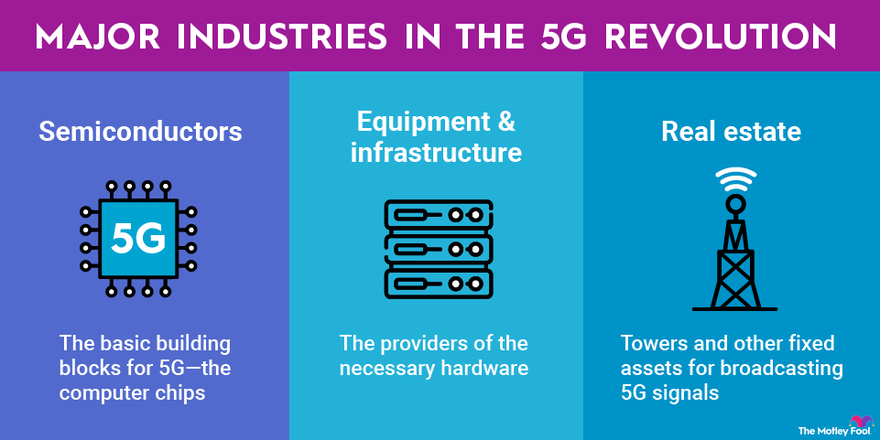

## Table of Contents

## What is 5G technology and how does it differ from previous generations?

5G technology is the fifth generation of mobile networks, designed to provide faster internet speeds, lower latency, and the ability to connect more devices at once compared to previous generations. It's like upgrading from a small road to a big highway for data. With 5G, you can download movies in seconds, play online games without lag, and even control robots or self-driving cars from far away.

The main differences between 5G and earlier generations like 4G, 3G, and 2G are speed and capacity. 5G can be up to 100 times faster than 4G, which means you can do more things online at the same time without slowing down. Also, 5G can handle many more devices connected to the internet at once, which is important as more and more things like home appliances, cars, and even street lights start using the internet. This makes 5G a big step forward in how we use technology in our daily lives.

## What are the potential benefits of 5G for investors?

5G technology can be a big opportunity for investors because it can help many different industries grow. Companies that make 5G equipment, like phones and network parts, could see their business grow a lot as more people and businesses start using 5G. Also, companies that use 5G to make their products or services better, like self-driving car companies or smart home tech companies, could become more valuable. This means investors who put money into these kinds of companies early might see big returns as 5G becomes more common.

Another way investors can benefit from 5G is by investing in the companies that build the infrastructure for 5G, like telecom companies. These companies need to spend a lot of money to set up 5G networks, and as they do this, their value can go up. Plus, as more people use 5G, these companies can make more money from their services. So, investors who believe in the future of 5G might want to look at these companies as a way to grow their money over time.

## What industries are expected to be most impacted by the rollout of 5G?

The telecom industry will be one of the most impacted by 5G. This is because telecom companies need to build the new 5G networks. They will spend a lot of money on new equipment and technology to make this happen. As more people start using 5G, these companies can offer faster and better services, which could help them make more money and grow their business.

Another industry that will see big changes is the technology sector. Companies that make smartphones, tablets, and other devices will need to update their products to work with 5G. This can lead to more sales and new types of devices. Also, tech companies that make things like smart home devices, drones, and virtual reality gear can use 5G to make their products work better and do more things, which could make them more popular and valuable.

The healthcare industry could also be transformed by 5G. With faster internet and better connections, doctors can use technology to help patients from far away. For example, they could do surgeries using robots controlled over the internet or use virtual reality to train doctors. This could make healthcare better and reach more people, which is good for healthcare companies and the people they help.

## How can investors identify companies that are likely to benefit from 5G?

Investors can identify companies that will benefit from 5G by looking at businesses in the telecom industry. These are the companies that build and maintain the 5G networks. They will need to buy a lot of new equipment and technology to set up 5G, which can help them grow. As more people start using 5G, these companies can make more money from their services. So, keeping an eye on telecom companies that are actively working on 5G projects can be a good way to find potential investments.

Another way to find companies that will benefit from 5G is to look at the technology sector. Companies that make smartphones, tablets, and other devices will need to update their products to work with 5G. This can lead to more sales and new types of devices. Also, tech companies that make things like smart home devices, drones, and virtual reality gear can use 5G to make their products work better and do more things. Investors should look for tech companies that are investing in 5G technology and developing new products that take advantage of 5G's capabilities.

Lastly, the healthcare industry is another area where investors can find companies that will benefit from 5G. With faster internet and better connections, healthcare companies can use technology to help patients from far away. For example, they could do surgeries using robots controlled over the internet or use virtual reality to train doctors. This could make healthcare better and reach more people. Investors should look for healthcare companies that are developing new ways to use 5G to improve their services and reach more patients.

## What are the risks associated with investing in 5G technology?

Investing in 5G technology can be risky because it's new and expensive. Companies need to spend a lot of money to build 5G networks and make new devices that work with 5G. If people don't start using 5G as quickly as expected, these companies might not make back the money they spent. This could make their stock prices go down, which would be bad for investors.

Another risk is that technology changes fast. A new, better technology could come along and make 5G less important. If that happens, companies that invested a lot in 5G might lose money. Also, there are rules and laws about 5G that can change. If new laws make it harder for companies to use 5G, it could hurt their business and affect their stock prices. So, investors need to think about these risks before putting money into 5G companies.

## What is the current state of 5G deployment globally?

5G is being rolled out all over the world, but it's happening at different speeds in different places. In some countries like South Korea, the United States, and China, 5G networks are already up and running in many cities. These countries started early and have been working hard to build out their 5G networks. People in these places can already use 5G on their phones and other devices, enjoying faster internet and new services.

In other parts of the world, 5G is still in the early stages. Many countries in Europe, Asia, and other regions are still building their 5G networks. It takes time and a lot of money to set up all the equipment needed for 5G. Some places are waiting to see how 5G works in other countries before they spend a lot of money on it. So, while 5G is spreading, it's not available everywhere yet, and it will take more time for it to reach every corner of the globe.

## How does government regulation affect the development and deployment of 5G?

Government rules can really change how fast and how well 5G gets built and used. Some countries have rules that make it easy for companies to set up 5G networks. They might give special licenses or money to help companies build the networks faster. But in other places, the rules can make it hard. There might be a lot of paperwork or strict rules about where 5G towers can go. This can slow down the whole process and make it more expensive for companies to bring 5G to people.

Also, governments worry about safety and security with 5G. They might make rules to check that 5G is safe for people and doesn't get used by bad guys to spy or cause problems. These rules can help keep people safe, but they can also slow down 5G projects. So, the way governments make and use rules can really shape how 5G grows in different places around the world.

## What are the technical challenges that could impact the success of 5G?

One big challenge for 5G is making sure it works well in different places. 5G needs a lot of small towers close together to give people fast internet. But putting up all these towers can be hard, especially in cities where there's not a lot of space. Also, things like buildings and trees can block the 5G signals, which can make the internet slower or not work at all in some spots. So, companies have to figure out the best places to put the towers and how to make the signals strong enough to reach everyone.

Another challenge is keeping 5G safe and secure. Because 5G can connect so many devices at once, it's a big target for hackers who might want to steal information or cause problems. Companies need to build strong security into 5G networks to stop these attacks. But making everything safe can be tricky and might slow down how fast 5G gets built. So, finding the right balance between speed and security is a big challenge for 5G.

## How can investors evaluate the financial health and growth potential of 5G-related companies?

Investors can evaluate the financial health of 5G-related companies by looking at their financial statements. They should check the company's income statement to see if it's making more money over time. The balance sheet can show if the company has enough money to pay its bills and invest in new projects. Also, the cash flow statement can tell investors if the company is bringing in enough cash to keep growing. If a company's profits are going up and it has a strong balance sheet, it might be a good investment.

To understand the growth potential of 5G-related companies, investors should look at the company's plans for the future. They should see if the company is investing in new 5G technology and if it's working on new products or services that use 5G. It's also important to check if the company is getting more customers and if it's expanding into new markets. If a company has a clear plan to grow with 5G and is making progress, it could be a good choice for investors looking for growth.

## What are the long-term investment strategies for capitalizing on 5G technology?

One long-term investment strategy for capitalizing on 5G technology is to invest in companies that are building the 5G networks. These companies, like telecom giants, will need to spend a lot of money to set up 5G, but as more people start using it, they can make more money from their services. Investors should look for telecom companies that are actively working on 5G projects and have a strong financial position. This way, they can benefit from the growth of 5G as it becomes more common and widespread.

Another strategy is to invest in companies that make devices and technology that use 5G. This includes companies that make smartphones, tablets, and other gadgets that need to be updated to work with 5G. Also, tech companies that make smart home devices, drones, and virtual reality gear can use 5G to make their products better and more useful. Investors should look for tech companies that are investing in 5G and developing new products that take advantage of its capabilities. By doing this, they can grow their money as these companies expand and sell more products.

## How does 5G integrate with other emerging technologies like IoT and AI?

5G works really well with the Internet of Things (IoT). IoT is all about connecting everyday things like fridges, cars, and even street lights to the internet. With 5G, these things can talk to each other much faster and more reliably. This means smart homes can work better, and cities can use IoT to make traffic flow smoother or save energy. 5G helps IoT by giving it the fast internet it needs to do all these cool things.

5G also helps artificial intelligence (AI) do more. AI is when computers learn and make decisions on their own. With 5G, AI can get information and send commands much faster. This is important for things like self-driving cars, where every second counts. 5G can also help AI systems in factories to work better and make things faster. So, 5G makes AI more powerful and useful in our daily lives.

## What are the future trends and predictions for 5G technology and its investment landscape?

In the future, 5G is expected to become even more important and widespread. More and more people will use 5G as it becomes available in more places around the world. This means companies that build 5G networks and make 5G devices will keep growing. Also, new technologies that use 5G, like smart cities and self-driving cars, will become more common. This could create new opportunities for investors who put their money into these areas early.

The investment landscape for 5G will likely see a lot of changes too. As 5G becomes more popular, companies that are doing well with it will see their stock prices go up. But investors need to be careful because new technologies can come along and change things quickly. Also, governments might make new rules that affect how 5G grows. So, investors should keep an eye on these trends and be ready to adjust their plans. By staying informed and [picking](/wiki/asset-class-picking) the right companies, investors can make good money from the growth of 5G.

## References & Further Reading

[1]: Qualcomm Technologies, Inc. (2019). ["The 5G Economy: How 5G technology will contribute to the global economy."](https://www.qualcomm.com/content/dam/qcomm-martech/dm-assets/documents/the_ihs_5g_economy_-_2019.pdf)

[2]: Gandhi, D., & Suri, S. (2020). ["5G and its Impact on Financial Markets."](https://academic.oup.com/rfs/article/34/11/5135/6337991) arXiv preprint arXiv:2009.04503.

[3]: Hong, C. R., & Patrick, K. A. (2020). ["Algorithmic Trading Strategies."](https://www.semanticscholar.org/paper/Algorithmic-Trading%3A-Winning-Strategies-and-Their-Chan/8220c62caf83863b7f5fb279366d545e720ee062) SSRN Electronic Journal.

[4]: Stewart, J. (2021). ["The Impact of 5G on Algorithmic Trading: Speed, Efficiency, and Security."](https://www.forbes.com/councils/forbestechcouncil/2021/07/08/13-big-impacts-5g-has-already-had-on-business-and-consumer-life/)

[5]: Freedman, E. (2020). ["How 5G Connectivity Will Transform Financial Services and Trading."](https://www.weforum.org/stories/2020/01/5g-is-about-to-change-the-world-in-ways-we-cant-even-imagine-yet/) Business Insider.