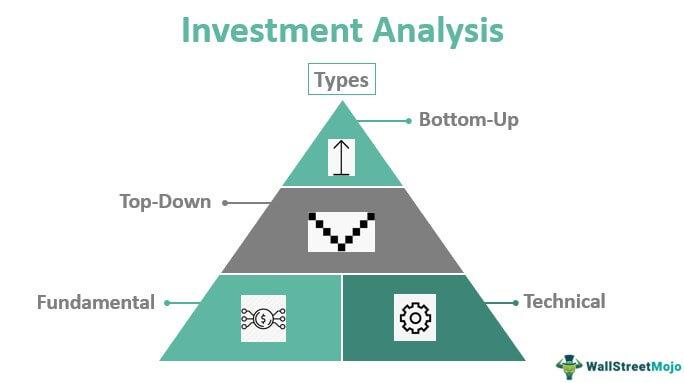

Understanding the dynamics of financial markets is crucial for anyone looking to invest or trade. Financial markets offer a vast array of investment opportunities, ranging from traditional stocks and bonds to more sophisticated instruments like derivatives. These markets serve as platforms where buyers and sellers can exchange assets, providing liquidity and enabling the effective allocation of resources across the economy.

Navigating the complexities of these markets requires investors to be well-informed and strategic. They must have a comprehensive understanding of the various asset classes, market structures, and the regulatory environments that govern these platforms. Investors also need to develop a keen sense of timing and judgment to capitalize on market movements and mitigate potential risks.



Technology has prominently transformed the landscape of financial markets, particularly through algorithmic trading. Algorithmic trading utilizes computer algorithms to execute trades automatically based on predefined criteria, significantly enhancing the speed and precision of trades. This technological advancement has revolutionized the way trades are executed, allowing large volumes of transactions to be carried out in milliseconds and offering a competitive edge to those who can leverage these tools effectively.

This article explores the intersection of financial markets, investment strategies, and algorithmic trading, providing insights into how technology is reshaping the investment landscape. By understanding these components, investors can better position themselves to seize opportunities and navigate the complexities of modern financial markets successfully.

## Table of Contents

## Understanding Financial Markets

Financial markets are essential platforms that facilitate the exchange of various assets between buyers and sellers. These markets can be broadly categorized into several segments: stocks, bonds, commodities, and derivatives, each with unique characteristics and regulatory frameworks.

Stocks, or equities, represent ownership interests in corporations. Investors purchase stocks to gain dividends and take advantage of potential capital appreciation. The stock market is influenced by factors such as company performance, investor sentiment, and macroeconomic conditions. Regulatory bodies, like the U.S. Securities and Exchange Commission (SEC), oversee these markets to ensure transparency and fairness.

Bonds are debt securities that entities issue to finance operations or projects. They pay periodic interest and return the principal at maturity. Bond markets are critical for both issuers needing capital and investors seeking stable income. Interest rates, credit ratings, and economic indicators significantly influence bond prices and yields.

Commodities markets facilitate the trading of physical goods like gold, oil, and agricultural products. These markets can be divided into spot and futures markets, where the former involves immediate delivery, and the latter involves agreements to trade at a future date. Commodity prices fluctuate based on supply-demand dynamics, geopolitical factors, and environmental changes.

Derivatives derive their value from underlying assets like stocks, bonds, or commodities. They include options, futures, and swaps, allowing investors to hedge risk or speculate on price movements. Given their complexity, derivatives markets are heavily regulated to mitigate risks associated with leverage and speculation.

The role of financial markets is pivotal in the global economy. They provide [liquidity](/wiki/liquidity-risk-premium), enabling investors to buy and sell assets smoothly. This liquidity fosters confidence, attracts investment, and drives economic growth. Financial markets also inform resource allocation by reflecting asset prices based on current and expected future conditions, guiding businesses and policymakers in decision-making.

Investment strategies are significantly impacted by the structure and behavior of financial markets. Investors must understand market dynamics, use diversification to manage risk, and tailor strategies to specific market segments. For instance, those focused on long-term growth might gravitate towards equities, while risk-averse investors may prefer the stability of bonds.

Overall, financial markets are central to economic functioning, influencing monetary policy, capital formation, and wealth distribution. Their efficient operation is crucial for economic stability and development, requiring continuous oversight and adaptation to changing global landscapes.

## Types of Investors in Financial Markets

Investors in financial markets can be distinguished based on their investment strategy, style, and time horizon. Understanding the different types of investors is crucial for grasping market dynamics and predicting market movements.

Long-term investors adopt strategies focused on identifying value and growth potential over several years. These investors are characterized by their patience and often employ [fundamental analysis](/wiki/fundamental-analysis) to identify undervalued assets with growth potential. They invest in stocks, bonds, or real estate, with the intention of holding these assets for extended periods, thereby benefiting from compound growth. The famous buy-and-hold strategy is a typical example employed by this group, exemplified by Warren Buffett's investment approach.

On the other hand, traders aim to capitalize on short-term price fluctuations. These individuals or firms engage in frequent buying and selling, often within the same trading day ([day trading](/wiki/day-trading-spy)) or over a period of days to weeks (swing trading). Traders rely heavily on technical analysis, which involves evaluating historical data and price charts to make predictions. This approach can involve more risk due to the focus on short-term market movements but offers the potential for significant profits in a shorter timeframe.

Institutional investors and retail investors represent two broad categories based on the size and scope of their activities. Institutional investors, such as pension funds, mutual funds, and insurance companies, manage large pools of capital. They often have more significant influences on the market due to their substantial investment volumes and sophisticated strategies. Institutional investors may leverage advanced tools, resources, and research to optimize their portfolios and mitigate risks.

Retail investors, in contrast, are individual investors who buy and sell securities for their personal accounts. Although the transaction volumes for retail investors are typically smaller, their collective influence can be substantial, especially in certain markets or market conditions. Retail investors have increasingly gained access to advanced trading tools and market data due to technological advancements, enabling them to participate more actively in the market.

Understanding investor risk tolerance is pivotal in defining investment choices. Risk tolerance is the degree of variability in investment returns that an investor is willing to withstand. It is influenced by factors such as financial goals, investment time horizon, and individual comfort with market swings. For instance, a young investor with a long-term horizon might have a higher risk tolerance, allowing for more exposure to volatile stocks. Conversely, someone nearing retirement might prioritize capital preservation and thus prefer lower-risk investments like bonds or dividend-paying stocks.

By comprehending these distinctions, one can better understand the diverse behaviors and motivations driving financial markets, allowing for informed and strategic investment decisions.

 to Algorithmic Trading

Algorithmic trading employs advanced computer algorithms to automate trading activities, executing orders at speeds and efficiencies unattainable by human traders alone. By utilizing predefined criteria, these algorithms evaluate numerous market conditions, such as price fluctuations, [volume](/wiki/volume-trading-strategy), and timing, to make informed trading decisions. This automated approach minimizes human intervention, thereby reducing emotional biases in trading.

The implementation of [algorithmic trading](/wiki/algorithmic-trading) enables rapid execution of complex trading strategies. Computers are capable of processing vast amounts of data within milliseconds, allowing traders to capitalize on marginal price variations and [arbitrage](/wiki/arbitrage) opportunities. For example, high-frequency trading ([HFT](/wiki/high-frequency-trading-strategies)), a subset of algorithmic trading, involves executing thousands of orders in fractions of a second to exploit minute price differentials.

Algorithmic trading is widely favored among institutional investors, hedge funds, and even individual traders due to its numerous advantages. For institutional investors and hedge funds, it provides scalability and the capacity to manage large portfolios with greater precision and efficiency. Individual traders benefit from the accessibility of sophisticated trading platforms that offer automated trading functionalities, democratizing the ability to use advanced trading strategies typically reserved for professional traders.

To implement algorithmic trading strategies, traders often rely on mathematical models and statistical methods. These models integrate various quantitative analysts' insights to optimize trading decisions. In Python, popular libraries such as NumPy and pandas can be utilized to develop and test trading algorithms. For instance, a simple moving average crossover strategy can be implemented using pandas to identify buy and sell signals:

```python
import pandas as pd

# Load market data
data = pd.read_csv('market_data.csv')

# Calculate moving averages
data['SMA_50'] = data['Close'].rolling(window=50).mean()
data['SMA_200'] = data['Close'].rolling(window=200).mean()

# Generate signals
data['Signal'] = 0
data.loc[data['SMA_50'] > data['SMA_200'], 'Signal'] = 1
data.loc[data['SMA_50'] < data['SMA_200'], 'Signal'] = -1

# Display signals
print(data[['Date', 'Close', 'SMA_50', 'SMA_200', 'Signal']])
```

This code calculates the 50-day and 200-day simple moving averages for a given stock's closing prices and generates buy/sell signals based on their crossover. This is a basic example of how algorithmic trading can be structured, and more sophisticated strategies can incorporate additional data and [machine learning](/wiki/machine-learning) techniques.

In conclusion, algorithmic trading represents a paradigm shift in trading methodologies, enabling participants to enhance performance by leveraging computational power and quantitative analysis. Its popularity continues to grow as technology advances and market participants seek to optimize their trading operations.

## Advantages of Algorithmic Trading

Algorithmic trading offers several notable advantages that have transformed the landscape of financial markets. 

One of the most prominent benefits is speed. Algorithms can process vast amounts of data and execute trades much faster than a human trader could. This ability enables traders to capitalize on even minor fluctuations in the market that occur within milliseconds. As financial markets continue to evolve, the swift execution of trades remains a competitive edge.

Precision is another key advantage of algorithmic trading. Human errors and emotional biases, which can significantly affect decision-making, are eliminated when trades are executed by algorithms. This results in more consistent and reliable trading outcomes. By following predefined criteria, algorithms ensure that trading decisions are based on logic and statistical analysis rather than psychological factors.

Efficiency is enhanced through the use of algorithms, as they can manage multiple trades across various markets and financial instruments simultaneously. This capability allows traders to diversify their strategies and positions without the risk of manual oversight errors. For example, an algorithm could be designed to buy certain stocks when specific market conditions are met while simultaneously selling other assets in a different market where different conditions apply.

Cost reduction plays a crucial role in the appeal of algorithmic trading. By optimizing the execution pathways and minimizing market impact costs, algorithms help reduce transaction fees. Lower costs can be achieved through strategies like slicing large orders into smaller pieces to avoid significant market impact, a method known as "order splitting". Furthermore, algorithms can be programmed to seek out and execute trades at the best available prices, thus adding an additional layer of cost efficiency.

These advantages underscore the transformative impact that algorithmic trading has had on modern financial markets. As technology continues to advance, the benefits of algorithmic trading are likely to become even more pronounced, making it an indispensable tool for investors and traders aiming to navigate the complexities of financial markets efficiently.

## Challenges and Risks of Algorithmic Trading

Algorithmic trading, while providing numerous advantages, is not devoid of challenges and risks. One significant risk is the potential for technical failures. These failures can result in substantial financial losses, underscoring the necessity for robust and reliable systems. A technical glitch in an algorithm can lead to incorrect trades being executed, resulting in unintended market positions that may cause severe losses.

Another notable challenge is the market impact of algorithmic trading, particularly in the form of flash crashes. These are sudden and severe market price declines, capable of causing turmoil in the financial markets. Algorithmic trades can exacerbate these events due to the sheer volume and speed of transactions executed by algorithms, sometimes reacting to errant data or extreme market swings. One infamous example is the May 6, 2010, Flash Crash, where major U.S. stock indices, futures, and options markets dropped and recovered rapidly within minutes[1]. The event was partly attributed to high-frequency algorithmic trading strategies that amplified the market's downward [momentum](/wiki/momentum).

Establishing an algorithmic trading strategy demands substantial initial investments in technology and skill development. Sophisticated hardware, such as low-latency trading servers, and high-speed internet connections are crucial for executing trades efficiently. Additionally, knowledge in computer programming and statistical analysis is essential to develop and maintain effective algorithms, often necessitating a team of skilled professionals.

Finally, algorithmic traders must navigate evolving regulatory landscapes. Financial regulations are continuously transforming to address new market realities and mitigate risks associated with algorithmic trading. Traders must stay informed about these changes and ensure their trading practices comply with current regulations to avoid legal repercussions. Regulatory bodies like the U.S. Securities and Exchange Commission (SEC) and the European Securities and Markets Authority (ESMA) have laid down regulations specifically targeting algorithmic trading practices, emphasizing the importance of risk management and transparency[2].

In conclusion, while algorithmic trading offers significant benefits in terms of speed, precision, and cost-effectiveness, it presents notable challenges and risks related to system reliability, market stability, substantial investment needs, and compliance with regulations. Traders must carefully consider these factors to mitigate potential downsides and ensure effective trading operations.

References:
[1] "U.S. Securities and Exchange Commission, Find out more about our regulatory actions within the SEC Docket No. 146-52 (Release No. 34- 63095; File No. SR-2010-099) from October 1, 2010."

[2] "European Securities and Markets Authority, Guidelines on Systems and Controls in an Automated Trading Environment for Trading Platforms, Investment Firms, and Competent Authorities, 5 (ESMA 2012)."

## How to Get Started in Algorithmic Trading

To embark on algorithmic trading, a fundamental understanding of both programming and statistical analysis is essential. Programming skills, particularly in languages such as Python, enable traders to automate trading strategies by writing scripts to execute trades based on specific criteria. Python is widely preferred for its extensive libraries and ease of use in handling financial data.

Statistical analysis forms the backbone of developing and validating trading strategies. Traders employ statistical methods to identify patterns and relationships within market data, which can be translated into algorithmic rules. Techniques such as regression analysis, time-series forecasting, and probability distributions are routinely used to derive insights from financial datasets.

Selecting the right trading platform is crucial for implementing algorithmic trading. It is important to choose a platform that offers robust Application Programming Interfaces (APIs). APIs facilitate seamless interaction between the trader's algorithms and the market, allowing for real-time execution and management of trades. Popular trading platforms that provide such capabilities include MetaTrader, [Interactive Brokers](/wiki/interactive-brokers-api), and QuantConnect.

Backtesting is a vital step that entails testing your algorithmic strategies using historical market data. This process helps ascertain the viability and effectiveness of strategies before deploying them in live markets. In Python, libraries like Backtrader or PyAlgoTrade allow traders to simulate trading strategies over historical data, providing insights into potential performance and risk metrics.

The equations used in [backtesting](/wiki/backtesting) often revolve around calculating returns, risk-adjusted performance measures, and transaction costs. For instance, the Sharpe Ratio is commonly calculated as:

$$
\text{Sharpe Ratio} = \frac{E[R_p - R_f]}{\sigma_p}
$$

Here, $E[R_p - R_f]$ represents the expected excess return of the portfolio over the risk-free rate, and $\sigma_p$ is the standard deviation of the portfolio's excess return.

Finally, continuous monitoring and adjustment of algorithms are imperative to align with changing market conditions and regulations. Market dynamics can shift rapidly, making it necessary for traders to adapt their algorithms to maintain performance. This process often involves updating data inputs, refining models, and re-testing strategies to ensure they remain robust and effective.

By following these foundational steps, aspiring algorithmic traders can establish a solid groundwork for developing and executing trading strategies that leverage the potential of automated decision-making in financial markets.

## Conclusion

Algorithmic trading represents a significant evolution in the execution of trades across financial markets, fundamentally altering not only the speed but also the strategic approach investors can take. By leveraging computer algorithms, market participants can execute trades with remarkable speed and precision, reducing emotional bias and human error. This technological advancement offers substantial benefits, including reduced transaction costs and the capability to handle complex strategies across diverse markets.

However, despite its advantages, algorithmic trading is not without challenges and risks. Technical failures, for instance, pose a considerable risk, with the potential to lead to substantial financial losses in a very short time frame. Furthermore, the market behavior itself can be affected by automated trading systems, contributing to phenomena such as flash crashes—extreme, rapid fluctuations in asset prices. As a result, maintaining robust, fail-safe systems becomes a necessity, along with a keen awareness of evolving regulatory landscapes to ensure compliance.

Success in the field of algorithmic trading lies in the seamless integration of technology with astute investment strategies. Investors and traders who thrive are those able to blend technological tools with their strategic insight, constantly updating their algorithms in response to shifting market dynamics and regulations. Continuous learning and adaptation are critical, as the financial environment is characterized by rapid technological advancements and ever-changing market conditions.

Ultimately, staying informed and adaptable is crucial in the fast-paced, continuously evolving financial markets. The capability to effectively harness algorithmic systems will likely define the future success of investors, making the synergy between human insight and technological prowess a cornerstone of modern trading strategies.

## References & Further Reading

[1]: ["Quantitative Trading: How to Build Your Own Algorithmic Trading Business"](https://books.google.com/books/about/Quantitative_Trading.html?id=j70yEAAAQBAJ) by Ernest P. Chan

[2]: ["Advances in Financial Machine Learning"](https://books.google.com/books/about/Advances_in_Financial_Machine_Learning.html?id=oU9KDwAAQBAJ) by Marcos Lopez de Prado

[3]: Bergstra, J., Bardenet, R., Bengio, Y., & Kégl, B. (2011). ["Algorithms for Hyper-Parameter Optimization."](https://dl.acm.org/doi/10.5555/2986459.2986743) Advances in Neural Information Processing Systems 24.

[4]: ["Evidence-Based Technical Analysis: Applying the Scientific Method and Statistical Inference to Trading Signals"](https://www.amazon.com/Evidence-Based-Technical-Analysis-Scientific-Statistical/dp/0470008741) by David Aronson

[5]: ["Machine Learning for Algorithmic Trading"](https://github.com/PacktPublishing/Machine-Learning-for-Algorithmic-Trading-Second-Edition) by Stefan Jansen