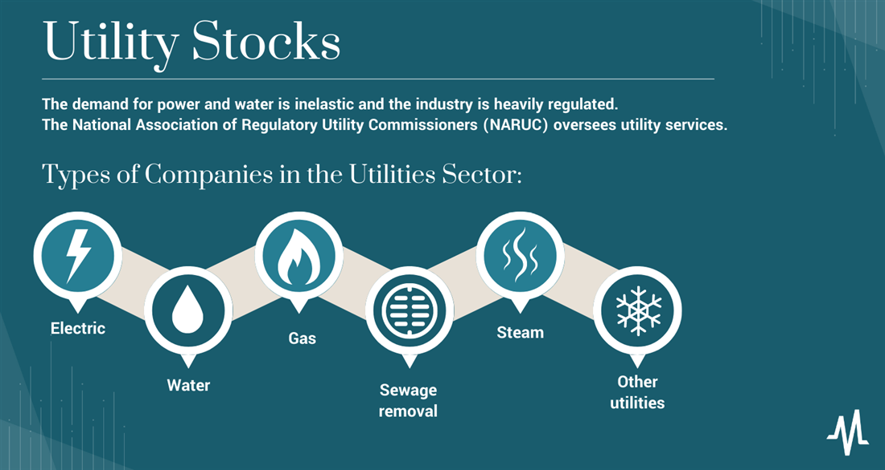

## Table of Contents

## What are utility stocks and why are they considered a safe investment?

Utility stocks are shares in companies that provide essential services like electricity, gas, water, and sometimes even internet and phone services. These companies are often seen as stable because people need their services no matter what's happening in the economy. For example, even during tough times, people still need to heat their homes and have lights.

These stocks are considered safe investments because they usually have steady and predictable earnings. Since people always need utilities, these companies can plan their income well and often pay regular dividends to their shareholders. This makes them attractive to investors who want a reliable source of income and less risk compared to other types of stocks.

## How do utility stocks differ from other types of stocks?

Utility stocks are different from other stocks because they come from companies that provide essential services like electricity, water, and gas. These services are always needed, so the companies that provide them usually have steady income and can predict their earnings well. This is different from other types of stocks, like technology or retail stocks, where earnings can go up and down a lot depending on what's happening in the market or the economy.

Another way utility stocks differ is that they often pay regular dividends. This means they give money back to their shareholders on a regular basis, which can be every three months or so. This is attractive to people who want a steady income from their investments. Other types of stocks, especially in newer or more volatile industries, might not pay dividends at all or might pay them less regularly.

In general, utility stocks are seen as safer and less risky than many other stocks. This is because the demand for utilities doesn't change much, even during tough economic times. On the other hand, stocks in other sectors can be more exciting and potentially offer higher returns, but they also come with more risk because their performance can be more unpredictable.

## What are the main factors that influence the performance of utility stocks?

The performance of utility stocks is mainly influenced by a few key factors. One big factor is interest rates. When interest rates go up, it can make borrowing money more expensive for utility companies. These companies often need to borrow money to build or upgrade their infrastructure, like power plants or water treatment facilities. Higher interest rates can mean higher costs for them, which can affect their profits and, in turn, their stock prices.

Another important factor is regulation. Utility companies are usually heavily regulated by government agencies. These regulations can control how much the companies can charge for their services. If regulators allow higher prices, the companies can make more money, which is good for their stocks. But if regulators keep prices low, it can be harder for the companies to make a profit, which can hurt their stock performance.

Lastly, the overall economy plays a role too. Even though utility stocks are seen as safe, they can still be affected by economic downturns. During tough times, people might try to save money by using less electricity or water. Also, if the economy is doing well, more people might move into an area, increasing the demand for utilities and helping the companies' profits. So, while utility stocks are more stable than many others, they are not completely immune to economic changes.

## Who are the typical investors in utility stocks and what are their investment goals?

Typical investors in utility stocks are often people who want a safe and steady investment. They might be retirees or people close to retirement who need a regular income from their investments. These investors like utility stocks because they usually pay regular dividends. This means they get money back from the company every few months, which can help them pay their bills or enjoy their retirement.

Another group of investors in utility stocks are those who want to balance out riskier parts of their investment portfolio. They might have some money in stocks that can go up and down a lot, like tech stocks. By also investing in utility stocks, they can make their overall investments more stable. These investors are looking to protect their money and keep it growing slowly but surely, without too much risk.

## How does the regulatory environment affect investment in utility stocks?

The regulatory environment has a big impact on investing in utility stocks. Governments keep a close eye on utility companies because they provide essential services like electricity and water. These companies can't just charge whatever they want for their services. Instead, regulators decide how much they can charge. If the regulators allow higher prices, the companies can make more money, which is good for their stocks. But if regulators keep prices low, it can be harder for the companies to make a profit, which might make their stock prices go down.

Investors need to pay attention to what regulators are doing because it can affect how much money they can make from their investments. For example, if a new regulation comes out that makes it easier for utility companies to raise prices, that could be good news for investors. On the other hand, if a new rule makes it harder for the companies to make money, it could be bad news. So, understanding the regulatory environment is important for anyone thinking about investing in utility stocks.

## What are the key financial metrics to look at when evaluating utility stocks?

When you want to check how good a utility stock is, you should look at some important numbers. One of these is the dividend yield, which tells you how much money the company pays back to its shareholders every year compared to the stock's price. A high dividend yield can be good because it means you get more money back from your investment. Another important number is the payout ratio, which shows how much of the company's earnings are paid out as dividends. If this ratio is too high, it might mean the company is paying out more than it can afford, which could be risky.

You should also look at the company's earnings growth. This tells you if the company is making more money over time. Steady earnings growth is a good sign that the company is doing well. Another thing to check is the debt-to-equity ratio. This number shows how much the company is borrowing compared to what it owns. Utility companies often have a lot of debt because they need to build big things like power plants, but too much debt can be risky. So, it's good to see a balance here. By looking at these numbers, you can get a better idea of whether a utility stock is a good investment for you.

## How do interest rates impact the attractiveness of utility stocks?

Interest rates can make a big difference in how good utility stocks look to investors. When interest rates go up, it becomes more expensive for utility companies to borrow money. They often need loans to build or fix things like power plants or water systems. If borrowing costs more, it can cut into their profits. This might make their stocks less attractive because investors might worry the companies won't make as much money.

On the flip side, when interest rates are low, borrowing is cheaper for utility companies. This can help them keep their costs down and their profits up, which is good for their stock prices. Also, when interest rates are low, other investments like bonds might not pay as much. So, investors might find the steady dividends from utility stocks more appealing because they can get a better return compared to other low-risk options.

## What role do dividends play in the investment strategy of utility stock investors?

Dividends are a big part of why people invest in utility stocks. Utility companies usually pay out regular dividends, which means they give money to their shareholders every few months. This is really important for investors who want a steady income from their investments. For example, retirees often like utility stocks because the dividends can help them pay their bills or enjoy their retirement without having to sell their stocks.

Dividends also make utility stocks more attractive when compared to other investments. If interest rates are low, the dividends from utility stocks might be higher than what you could get from safer investments like bonds. This makes utility stocks a good choice for people who want a bit more return on their money but still want to keep their investment safe. So, the promise of regular dividends is a key reason why many people choose to invest in utility stocks.

## How can an investor diversify their portfolio using utility stocks?

An investor can use utility stocks to make their portfolio more diverse and safer. Utility stocks are known for being steady and paying regular dividends. If an investor already has a lot of money in stocks that can go up and down a lot, like tech or retail stocks, adding utility stocks can help balance things out. This way, if the risky stocks don't do well, the utility stocks can help keep the overall value of the portfolio more stable.

For example, if someone has a lot of money in stocks that might grow a lot but are also risky, they can put some of their money into utility stocks. These stocks might not grow as fast, but they are less likely to lose a lot of value quickly. By mixing utility stocks with other types of stocks, an investor can have a mix of growth and safety. This can help them feel more secure about their investments and still have a chance to make money.

## What are the advanced strategies for investing in utility stocks, such as options and hedging?

Advanced strategies for investing in utility stocks include using options and hedging. Options are contracts that give you the right to buy or sell a stock at a certain price before a certain date. You can use options to make money if you think the price of a utility stock will go up or down. For example, if you think the price will go up, you can buy a call option. If you're right, you can make money by buying the stock at a lower price than it's worth on the market. If you think the price will go down, you can buy a put option, which lets you sell the stock at a higher price than it's worth on the market.

Hedging is another strategy that can help protect your investment in utility stocks. It's like buying insurance for your stocks. One way to hedge is by using options. For example, if you own a utility stock and you're worried the price might go down, you can buy a put option. This gives you the right to sell your stock at a set price, even if the market price drops lower. This can help limit your losses. Another way to hedge is by investing in other types of stocks or assets that move in the opposite direction of utility stocks. This way, if your utility stocks lose value, the other investments might gain value and help balance things out.

These strategies can be useful, but they're also more complicated and can be riskier than just buying and holding utility stocks. It's important to understand how options and hedging work before you use them. They can help you make more money or protect your investments, but they can also lead to bigger losses if you're not careful. So, it's a good idea to learn as much as you can and maybe talk to a financial advisor before trying these advanced strategies.

## How do global economic conditions influence the investment decisions in utility stocks?

Global economic conditions can have a big impact on whether people choose to invest in utility stocks. When the world economy is doing well, people and businesses might use more electricity, water, and gas. This can be good for utility companies because they can make more money. But if the global economy is struggling, people might try to save money by using less of these services. This can hurt utility companies' profits and make their stocks less attractive to investors. Also, if there's a lot of uncertainty around the world, like during a financial crisis, people might look for safe places to put their money. Utility stocks can seem like a good choice because they are usually steady and pay regular dividends.

Interest rates around the world can also affect how people feel about investing in utility stocks. If interest rates are low in many countries, it can be cheaper for utility companies to borrow money to build or fix things like power plants. This can help them keep their costs down and their profits up, which is good for their stock prices. But if interest rates go up, borrowing becomes more expensive, and this can cut into the companies' profits. This might make their stocks less appealing because investors might worry the companies won't make as much money. So, when deciding whether to invest in utility stocks, it's important to think about what's happening in the global economy and with interest rates.

## What are the emerging trends and future outlook for utility stocks in the context of renewable energy and sustainability?

The future of utility stocks is closely tied to the growing trend of renewable energy and sustainability. More and more, people and governments want to use clean energy like wind, solar, and hydro power instead of fossil fuels. This means utility companies are investing a lot in renewable energy projects. They are building wind farms, solar panels, and other green energy sources. This shift can be good for utility stocks because it shows the companies are thinking about the future and trying to meet the demand for clean energy. Investors who care about the environment might find these stocks more attractive because they are part of the solution to climate change.

However, there are also challenges for utility companies as they move to renewable energy. Building new green energy projects can be expensive, and it takes time for them to start making money. Also, the rules about how much companies can charge for their services can change, especially when it comes to renewable energy. Governments might want to keep prices low to encourage more people to use green energy. This can affect how much profit the companies make and, in turn, their stock prices. Still, many investors believe that the long-term future of utility stocks looks bright because the world needs more clean energy, and utility companies are key players in making that happen.

## What are the investment strategies for utility stocks?

Utility stocks are a critical component of many investment portfolios due to their defensive nature and consistent dividend payouts. Investors often adopt distinct strategies to maximize returns from utility stocks, catering to varied investment goals and market scenarios.

Income investors prioritize utility stocks for their ability to generate steady income. These stocks are known for their reliable dividend payouts, which provide a consistent income stream. This income-oriented approach is particularly appealing in low-interest-rate environments, where traditional fixed-income investments may offer lower returns. The dividend yield, a key metric for income investors, is calculated as follows:

$$
\text{Dividend Yield} = \frac{\text{Annual Dividends per Share}}{\text{Price per Share}} \times 100\%
$$

By focusing on stocks with higher dividend yields, income investors can enhance their portfolio’s cash flow.

Value investors, on the other hand, seek utility stocks that are undervalued by the market. They analyze financial statements and use valuation metrics such as the price-to-earnings ratio (P/E) and price-to-book ratio (P/B) to identify stocks trading below their intrinsic value. This strategy offers the potential for capital appreciation when the market eventually recognizes the stock's true value. Python code for calculating these ratios is as follows:

```python
def calculate_pe_ratio(price_per_share, earnings_per_share):
    return price_per_share / earnings_per_share

def calculate_pb_ratio(price_per_share, book_value_per_share):
    return price_per_share / book_value_per_share
```

Growth investors may focus on utility stocks during recessionary periods. Historically, utilities are less sensitive to economic cycles, as demand for essential services like electricity and water remains relatively constant, even during economic downturns. Furthermore, growth investors may find opportunities in emerging markets, where utility infrastructure development is ongoing, driving revenue growth for these companies. By investing in utilities within these markets, growth investors can benefit from the long-term expansion potential.

In summary, investment strategies for utility stocks can vary significantly based on the investor's objectives. Whether seeking steady income, capital appreciation from undervalued stocks, or growth in expanding markets, investors can tailor their approach to align with their financial goals while managing overall portfolio risk.

## References & Further Reading

[1]: Bergstra, J., Bardenet, R., Bengio, Y., & Kégl, B. (2011). ["Algorithms for Hyper-Parameter Optimization."](https://dl.acm.org/doi/10.5555/2986459.2986743) Advances in Neural Information Processing Systems 24.

[2]: ["Advances in Financial Machine Learning"](https://www.amazon.com/Advances-Financial-Machine-Learning-Marcos/dp/1119482089) by Marcos Lopez de Prado

[3]: ["Evidence-Based Technical Analysis: Applying the Scientific Method and Statistical Inference to Trading Signals"](https://www.amazon.com/Evidence-Based-Technical-Analysis-Scientific-Statistical/dp/0470008741) by David Aronson

[4]: ["Machine Learning for Algorithmic Trading"](https://github.com/stefan-jansen/machine-learning-for-trading) by Stefan Jansen

[5]: ["Quantitative Trading: How to Build Your Own Algorithmic Trading Business"](https://www.amazon.com/Quantitative-Trading-Build-Algorithmic-Business/dp/1119800064) by Ernest P. Chan