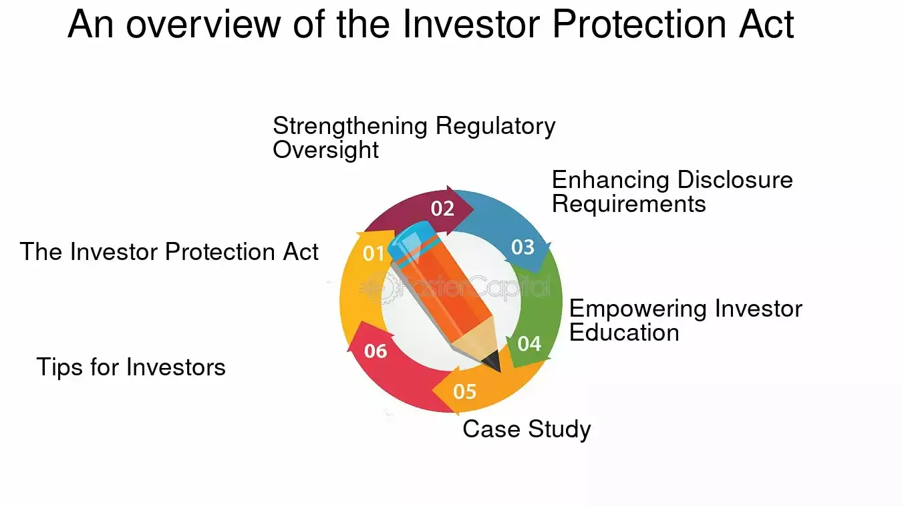

## Table of Contents

## What is the Investor Protection Act?

The Investor Protection Act is a law that helps keep people safe when they invest their money. It makes sure that companies and people who help others invest follow certain rules. This law helps stop fraud and makes sure that investors get all the important information they need before they decide to invest their money.

The act was created because sometimes people lost their money because they were not told the truth about their investments. By having this law, it helps make investing fairer and more trustworthy. It also sets up groups like the Securities and Exchange Commission (SEC) to watch over the investment world and make sure everyone follows the rules.

## Why was the Investor Protection Act created?

The Investor Protection Act was created to help people feel safer when they invest their money. Before this law, some people lost their money because they were tricked or not told the truth about their investments. The act makes sure that companies and people who help others invest have to follow certain rules. This helps stop fraud and makes sure that everyone gets all the important information they need before they decide to invest.

The act was needed because without it, investing could be very risky and unfair. It helps make the world of investing more trustworthy. The law also set up groups like the Securities and Exchange Commission (SEC) to watch over everything and make sure the rules are followed. This way, people can invest their money with more confidence, knowing that there are protections in place to help keep their investments safe.

## Who does the Investor Protection Act protect?

The Investor Protection Act protects people who invest their money. It helps keep their money safe by making sure that the companies and people they invest with follow certain rules. This means that investors are less likely to lose their money because of fraud or being tricked.

The act also makes sure that investors get all the important information they need before they decide to invest. This helps them make better choices about where to put their money. By having this protection, people can feel more confident when they invest, knowing that there are rules in place to help keep their investments safe.

## What are the key provisions of the Investor Protection Act?

The Investor Protection Act has several important rules to help keep people's money safe when they invest. One key rule is that companies and people who help others invest must tell the truth about the investments. They have to give all the important information to investors so they can make good choices. This helps stop fraud and makes sure investors know what they are getting into before they put their money in.

Another important part of the act is that it set up groups like the Securities and Exchange Commission (SEC) to watch over the investment world. These groups make sure that everyone follows the rules and they can punish those who break them. This helps keep the investing world fair and trustworthy. By having these rules and groups in place, the Investor Protection Act helps people feel more confident when they invest their money.

## How does the Investor Protection Act affect individual investors?

The Investor Protection Act helps individual investors by making sure they get all the important information they need before they invest their money. This means that companies and people who help others invest have to tell the truth about the investments. This helps stop fraud and makes sure investors know what they are getting into. When investors have all the facts, they can make better choices about where to put their money.

The act also makes the world of investing safer and more trustworthy for individual investors. It set up groups like the Securities and Exchange Commission (SEC) to watch over everything and make sure the rules are followed. If someone breaks the rules, these groups can punish them. This helps keep the investing world fair. By having these protections in place, individual investors can feel more confident when they invest their money, knowing that there are rules to help keep their investments safe.

## What enforcement mechanisms are in place under the Investor Protection Act?

The Investor Protection Act has strong ways to make sure people follow the rules. It set up the Securities and Exchange Commission (SEC), which is a group that watches over the investment world. The SEC checks to make sure that companies and people who help others invest are telling the truth and following the law. If they find someone breaking the rules, the SEC can take action against them.

If someone breaks the rules, they can face big punishments. The SEC can fine them, which means they have to pay money as a penalty. They can also stop people from working in the investment world if they break the rules. Sometimes, if the breaking of rules is very bad, the SEC can even send the case to the police, and the person could go to jail. These strong punishments help make sure that everyone follows the rules and keeps the investing world safe and fair for everyone.

## How has the Investor Protection Act evolved since its inception?

Since it was first made, the Investor Protection Act has changed a lot to keep up with new ways of investing and new problems that come up. At first, it was all about making sure people got the right information and stopping big frauds. But as time went on, the law got updated to deal with new things like the internet and new kinds of investments. These changes help make sure the law still works well to protect people's money.

One big change was making the rules stricter after big financial problems happened. For example, after the 2008 financial crisis, the law was updated to have even stronger rules to stop the kind of risky behavior that caused the crisis. The Securities and Exchange Commission (SEC) also got more power to watch over things and make sure the rules were followed. All these changes help keep the investing world safe and fair for everyone, even as things keep changing.

## What are the criticisms of the Investor Protection Act?

Some people say that the Investor Protection Act makes things too hard for companies. They think the rules are too strict and it takes too much time and money to follow them. This can make it harder for small companies to grow because they have to spend a lot of time and money just to meet all the rules. Some also say that the act might stop new ideas because companies are afraid to try new things if they have to follow so many rules.

Others think that even with the Investor Protection Act, there are still big problems in the investing world. They say that some people find ways to cheat the system and the rules don't stop all fraud. They want the act to be even stronger to make sure everyone is safe. But making the rules too strict might make it harder for good companies to do business, so it's a tricky balance to get right.

## How does the Investor Protection Act interact with other financial regulations?

The Investor Protection Act works together with other financial rules to keep the investing world safe and fair. It is like a big team effort where different laws help each other out. For example, the Investor Protection Act makes sure that companies tell the truth about investments, while other laws like the Dodd-Frank Act focus on stopping big financial risks. Together, these laws make a strong net to catch problems and protect people's money.

Sometimes, the rules from the Investor Protection Act and other financial laws can overlap. This means that companies have to follow many rules at the same time, which can be hard for them. But this also means that there are many layers of protection for investors. The Securities and Exchange Commission (SEC) and other groups watch over all these rules to make sure everyone is playing fair. By working together, these laws help make the world of investing safer and more trustworthy for everyone.

## What are the international implications of the Investor Protection Act?

The Investor Protection Act is a U.S. law, but it can affect people and companies all over the world. When American companies do business in other countries, they still have to follow the rules of the Investor Protection Act. This means that investors from other countries who put their money into these companies are also protected by the law. It helps make sure that everyone is playing fair, no matter where they are from.

Other countries might look at the Investor Protection Act and decide to make their own similar laws. This can help make the whole world of investing safer and more trustworthy. But sometimes, different countries have different rules, which can make things confusing for companies that work in many places. Still, the act helps set a good example for how to protect investors everywhere.

## How can investors ensure they are fully protected under the Investor Protection Act?

To make sure they are fully protected under the Investor Protection Act, investors should always do their homework before putting their money into anything. This means reading all the information that companies give out about their investments. If something seems too good to be true, it probably is. Investors should also check if the people or companies they are investing with are registered with the Securities and Exchange Commission (SEC). This helps make sure they are dealing with someone who follows the rules.

Another important thing investors can do is to keep an eye on their investments. If they see something strange or if they think someone might be breaking the rules, they should report it to the SEC. The SEC can then check it out and take action if needed. By staying informed and being careful, investors can use the protections of the Investor Protection Act to help keep their money safe.

## What future changes might be expected in the Investor Protection Act?

In the future, the Investor Protection Act might change to keep up with new ways of investing and new problems that come up. As more people use the internet to invest, the law might need to be updated to make sure it still works well. This could mean adding new rules to stop online fraud or to make sure companies are honest about their investments on the internet. The law might also get stricter if there are big financial problems, like what happened in 2008, to stop risky behavior that can hurt investors.

Another thing that could happen is that the law might be changed to make it easier for small companies to follow the rules. Right now, some people say the rules are too hard for small businesses. So, future changes might try to balance protecting investors with helping small companies grow. The Securities and Exchange Commission (SEC) will keep watching over everything and might suggest new rules to make sure the act stays strong and fair for everyone.

## References & Further Reading

[1]: ["The Dodd-Frank Wall Street Reform and Consumer Protection Act."](https://en.wikipedia.org/wiki/Dodd%E2%80%93Frank_Wall_Street_Reform_and_Consumer_Protection_Act) U.S. Congress

[2]: Lipton, A., & Rennie, M. (2013). ["Algorithmic Trading and Machine Learning"](https://www.researchgate.net/publication/378287610_Machine_learning_in_financial_markets_A_critical_review_of_algorithmic_trading_and_risk_management). The European Physical Journal Plus, 128(11).

[3]: Cartea, Á., Jaimungal, S., & Penalva, J. (2015). ["Algorithmic and High-Frequency Trading."](https://assets.cambridge.org/97811070/91146/frontmatter/9781107091146_frontmatter.pdf) Cambridge University Press.

[4]: Aldridge, I. (2013). ["High-Frequency Trading: A Practical Guide to Algorithmic Strategies and Trading Systems."](https://www.amazon.com/High-Frequency-Trading-Practical-Algorithmic-Strategies/dp/1118343506) Wiley.

[5]: Hasbrouck, J., & Saar, G. (2013). ["Low-latency trading"](https://www.sciencedirect.com/science/article/abs/pii/S1386418113000165). Journal of Financial Markets, 16(4), 646-679. 

[6]: Easley, D., López de Prado, M. M., & O’Hara, M. (2011). ["The Microstructure of the ‘Flash Crash’: Flow Toxicity, Liquidity Crashes, and the Probability of Informed Trading"](https://www.semanticscholar.org/paper/Flow-Toxicity-and-Liquidity-in-a-High-Frequency-Easley-Prado/9369430bd005d194f9332ae7cbd5a57ace5e9ab3). The Journal of Finance, 66(5), 2057-2163.

[7]: International Organization of Securities Commissions (IOSCO). ["Objectives and Principles of Securities Regulation."](https://www.iosco.org/library/pubdocs/pdf/IOSCOPD561.pdf)