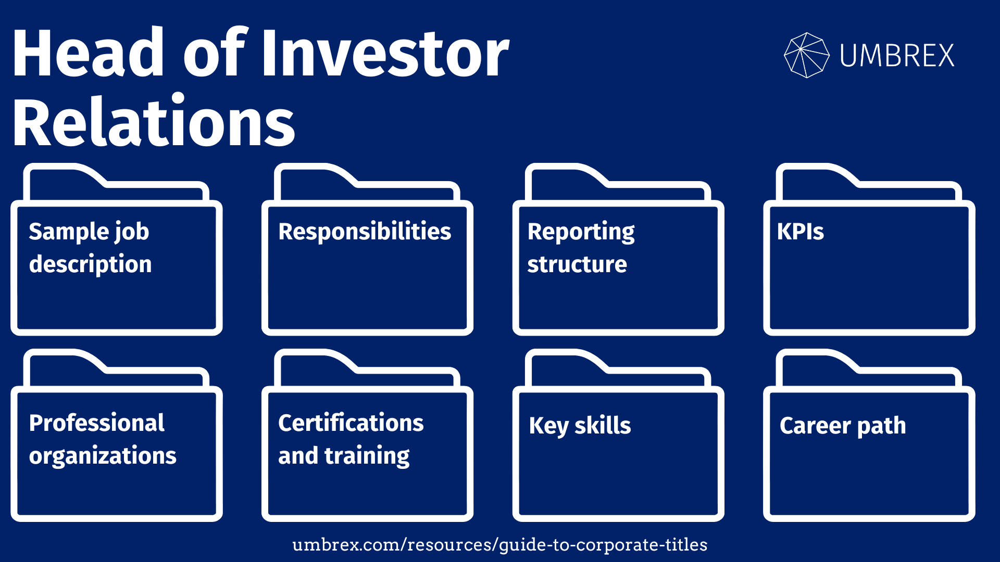

## Table of Contents

## What is investor relations?

Investor relations is about how a company talks to the people who invest in it. It's like a bridge between the company and its shareholders. The main job is to share important information about the company's money, plans, and news. This helps investors make smart choices about buying or selling the company's stocks.

The team in charge of investor relations does things like writing reports, holding meetings, and answering questions from investors. They make sure that all the information they share is clear and honest. This way, investors can trust the company and feel good about their investments. Good investor relations can also make the company look better to new investors.

## Why is investor relations important for a company?

Investor relations is important for a company because it helps keep the people who own parts of the company, called shareholders, happy and informed. When shareholders know what's going on with the company, they can make better choices about whether to keep their money in the company or take it out. This communication also builds trust. If shareholders trust the company, they are more likely to stick around and maybe even tell others to invest too.

Another reason investor relations is key is that it can make the company look good to new investors. When a company shares clear and honest information, it shows that it is open and responsible. This can attract more people to invest in the company, which can bring in more money. More money can help the company grow and do new things. So, good investor relations can really help a company succeed in the long run.

## What are the primary responsibilities of an investor relations professional?

An investor relations professional's main job is to talk to the people who own parts of the company, called shareholders, and to people who might want to invest. They do this by sharing information about how the company is doing financially, what its plans are, and any big news. They write reports, hold meetings, and answer questions to make sure everyone knows what's going on. This helps investors make smart choices about buying or selling the company's stocks.

Another big part of their job is to make sure all the information they share is clear and honest. They have to follow rules about what they can say and when they can say it. This builds trust with investors, which is really important. If investors trust the company, they are more likely to keep their money in it and maybe even tell others to invest too. So, an investor relations professional plays a key role in keeping the company's reputation strong and attracting new money to help the company grow.

## What skills are necessary to succeed in investor relations?

To succeed in investor relations, you need good communication skills. You have to talk to investors in a clear and honest way. Writing reports and answering questions are big parts of the job. You also need to be good at explaining things so everyone can understand, even if they don't know much about business.

Another important skill is understanding numbers and financial stuff. You need to know how to read and explain the company's financial reports. Being good at math helps you make sense of the company's money situation and share that with investors. Also, you need to be good at building relationships. Trusting investors are happy investors, so being friendly and reliable is key.

Lastly, you should be organized and good at planning. You need to know when to share information and follow rules about what you can say. Keeping everything on track helps keep the company's reputation strong. Being able to work well with other teams in the company, like the finance and legal teams, is also important for success in investor relations.

## How does investor relations interact with other departments within a company?

Investor relations works closely with other departments to make sure they have all the right information to share with investors. They talk a lot with the finance team because they need to know about the company's money situation. The finance team gives them numbers and reports that investor relations uses to tell investors how the company is doing. They also work with the legal team to make sure they are following all the rules about what they can say and when they can say it. This helps them avoid any trouble and keep everything honest.

Besides finance and legal, investor relations also works with the marketing and communications teams. These teams help make sure the information is easy to understand and looks good when it goes out to investors. Sometimes, investor relations needs help from the top bosses, like the CEO or CFO, to share big news or explain important plans. Working together with all these departments helps investor relations do their job well and keep investors happy and informed.

## What are the typical career pathways into investor relations?

People often get into investor relations through different paths. One common way is starting in finance or accounting. They might work as a financial analyst or accountant first. This gives them a good understanding of numbers and how a company's money works. After gaining experience, they can move into investor relations roles where they use this knowledge to talk to investors about the company's financial health.

Another path is through communications or public relations. Someone might start by working in marketing or corporate communications. They learn how to talk to people and share information clearly. This experience is useful in investor relations because they need to explain the company's plans and news to investors in a way that's easy to understand. With time, they can move into investor relations and use their communication skills to build trust with shareholders.

Some people also get into investor relations through business development or strategy roles. They might work on planning the company's future and understanding its goals. This experience helps them see the big picture, which is important when talking to investors about where the company is headed. No matter the starting point, a mix of financial knowledge, communication skills, and understanding the company's overall strategy can lead to a successful career in investor relations.

## What are the key differences between investor relations in public versus private companies?

Investor relations in public companies is different from private companies because public companies have to follow strict rules about sharing information. They have to tell everyone about their money situation and big news through official reports and meetings. This is because their stocks are traded on the stock market, and lots of people can buy and sell them. So, investor relations in public companies spend a lot of time making sure they follow these rules and keep all shareholders informed.

In private companies, investor relations is usually less formal. Private companies don't have to share as much information with the public because their stocks are not traded on the stock market. They might only have a few big investors, like private equity firms or family members. So, investor relations in private companies focus more on building strong relationships with these key investors and keeping them happy. They might not need to write as many reports or hold big meetings, but they still need to communicate clearly and honestly.

## How do investor relations professionals manage crises and negative publicity?

When a company faces a crisis or negative publicity, investor relations professionals step in to manage how the news is shared with investors. They make sure to tell the truth and share all the important facts quickly. This helps stop rumors and keeps investors from worrying too much. They might hold special meetings or send out reports to explain what's happening and what the company is doing to fix the problem. Keeping investors in the loop like this can help the company keep their trust, even during tough times.

It's also important for investor relations to work closely with other teams in the company, like the legal and communications teams, during a crisis. The legal team can help make sure they follow all the rules about what they can say. The communications team can help make the messages clear and easy to understand. Together, they can create a plan to handle the crisis and keep the company's reputation strong. By being open and honest, investor relations can help the company get through the crisis and keep investors on their side.

## What role does investor relations play in mergers and acquisitions?

When a company is thinking about merging with another company or buying one, investor relations has a big job. They need to talk to the investors about what's happening. They explain why the merger or acquisition is a good idea and how it will help the company grow. They share all the important details so investors can understand and feel good about the plan. This helps keep investors happy and on board with the big change.

During the merger or acquisition, investor relations also works with other teams in the company. They talk to the legal team to make sure they follow all the rules about sharing information. They work with the finance team to get the numbers right and explain them to investors. And they team up with the communications team to make sure the messages are clear and easy to understand. By working together, they can help the company go through the merger or acquisition smoothly and keep the trust of the investors.

## How do investor relations teams utilize technology and data analytics?

Investor relations teams use technology and data analytics to make their jobs easier and better. They use special computer programs to keep track of who their investors are and how they feel about the company. These programs help them send out reports and news quickly to a lot of people at once. They also use websites and social media to talk to investors and share information in real time. This makes it easier for investors to find out what's going on with the company without having to wait for meetings or reports.

Data analytics is another big help for investor relations. They use it to look at numbers and see patterns in how investors act. For example, they can see if investors are buying or selling more of the company's stocks and why. This helps them understand what investors like or don't like about the company. By using this information, investor relations can make better plans to keep investors happy and attract new ones. It's like having a smart tool that helps them make the best decisions for the company and its investors.

## What are the advanced strategies for engaging with institutional investors?

To engage with institutional investors, investor relations teams often use advanced strategies that go beyond just sharing reports and holding meetings. One key strategy is to create personalized communication plans. This means understanding what each big investor cares about and tailoring the information to match their interests. For example, if an investor is focused on sustainability, the team might highlight the company's green initiatives and how they contribute to long-term value. By showing that the company understands and addresses the specific concerns of these investors, trust and engagement can be strengthened.

Another strategy is to use data analytics to predict and respond to investor behavior. By analyzing past interactions and market trends, investor relations can anticipate what institutional investors might do next. This helps them prepare better and be proactive in their communications. For instance, if data shows that certain investors are likely to sell their shares due to market conditions, the team can reach out with reassuring information or updates on the company's strategy to keep them invested. Using technology and data in this way helps build a more dynamic and responsive relationship with institutional investors, which is crucial for maintaining their support and investment.

## How can one progress to senior roles within investor relations?

To move up to senior roles in investor relations, you need to start by doing a great job in your current position. Show that you can talk to investors well and understand the company's money situation. It's important to build good relationships with investors and other teams in the company. As you work, try to learn more about the business and how it works. Take on bigger projects and show that you can lead them. This could mean helping with big news or working on plans for the future. The more you show you can handle, the more likely you are to get noticed for a senior role.

Once you have experience and a good track record, you can aim for senior positions like Investor Relations Director or Vice President. To get there, keep learning and maybe even get more education or certifications. It's also good to network with other people in the industry. Go to meetings and events where you can meet others in investor relations. Show that you can think about the big picture and help the company grow. Senior roles need people who can make big decisions and lead the team. By showing you can do these things, you'll be on your way to a senior role in investor relations.

## References & Further Reading

[1]: Bergstra, J., Bardenet, R., Bengio, Y., & Kégl, B. (2011). ["Algorithms for Hyper-Parameter Optimization."](https://papers.nips.cc/paper/4443-algorithms-for-hyper-parameter-optimization) Advances in Neural Information Processing Systems 24.

[2]: ["Advances in Financial Machine Learning"](https://www.amazon.com/Advances-Financial-Machine-Learning-Marcos/dp/1119482089) by Marcos Lopez de Prado

[3]: ["Evidence-Based Technical Analysis: Applying the Scientific Method and Statistical Inference to Trading Signals"](https://www.amazon.com/Evidence-Based-Technical-Analysis-Scientific-Statistical/dp/0470008741) by David Aronson

[4]: ["Machine Learning for Algorithmic Trading"](https://github.com/stefan-jansen/machine-learning-for-trading) by Stefan Jansen

[5]: ["Quantitative Trading: How to Build Your Own Algorithmic Trading Business"](https://www.amazon.com/Quantitative-Trading-Build-Algorithmic-Business/dp/1119800064) by Ernest P. Chan