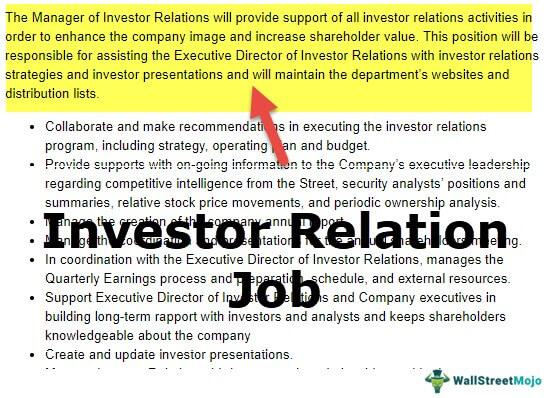

Investment communication is a significant facet of the financial landscape, encompassing critical areas like investor relations and algorithmic trading. These specialized fields play essential roles in the way financial markets operate and how companies interact with their stakeholders.

Investor relations (IR) focuses on managing communication and relationships between a company and its investors. It requires a strategic approach that combines finance, communication, marketing, and regulatory compliance, aiming to ensure that a company's securities are fairly valued and traded. IR professionals coordinate crucial activities such as shareholder meetings, financial disclosures, and press conferences, all while ensuring adherence to financial regulations. Their work enhances corporate transparency and builds investor confidence, thus improving a company's reputation in the financial community.



On the other hand, algorithmic trading, often referred to as "algo trading," leverages computer algorithms to execute trading strategies automatically and efficiently. This method relies heavily on quantitative analysis, mathematical models, and cutting-edge technologies like machine learning and artificial intelligence. Algorithmic trading has revolutionized financial markets by enabling high-frequency trading and enhancing market liquidity. It demands strong skills in mathematics, programming, and financial analysis, making it a lucrative field for skilled professionals.

The intersection of these two fields forms a unique career path within investment communication. Professionals operating within this intersection must adeptly balance financial analytics with clear, effective communication. They are responsible for interpreting complex data and communicating insights in a manner that influences investor behavior and aligns with market expectations. As the financial sector continues to evolve with advancements in technology and shifts in market dynamics, the demand for such multi-skilled professionals is only expected to grow.

This article seeks to explore these facets of investment communication, offering insights into the respective career paths, the skills necessary for success, and future trends shaping the industry. An understanding of the dynamic between effective communication and robust financial analysis is crucial for anyone aspiring to thrive in this field. The sections that follow will provide a clearer definition of these domains and their distinctive roles within the broader investment world.

## Table of Contents

## Understanding Investor Relations

Investor Relations (IR) is a critical strategic management function that involves harmonizing finance, communication, marketing, and compliance with securities law. Its primary objective is to facilitate the fair trading of a company's publicly traded stock through the effective dissemination of vital information. This responsibility involves creating a transparent communication channel between the company and its shareholders, potential investors, and the financial community at large.

The core responsibilities of IR encompass a range of activities aimed at maintaining and enhancing corporate transparency and investor perception. These responsibilities include organizing shareholder meetings, which serve as essential platforms for direct communication between the company's management and its investors. During these meetings, key financial performance indicators, strategic initiatives, and future outlooks are typically discussed.

IR activities also involve managing press conferences and releases to communicate important information about the company, such as quarterly earnings reports, mergers and acquisitions, and other significant corporate developments. By providing timely and accurate information, IR helps maintain investor confidence and supports stock valuation stability.

Ensuring compliance with financial regulations is another crucial aspect of investor relations. Compliance involves adhering to various securities laws and regulations that govern financial reporting and disclosure, such as the Sarbanes-Oxley Act in the United States. This legislation, among others, has heightened the emphasis on transparency and accountability in financial reporting, thereby increasing the importance of effective IR practices.

By facilitating clear and consistent communication, effective investor relations can significantly enhance a company's reputation among investors. It builds trust and credibility, which are essential for maintaining and attracting investment. As a result, companies with strong IR practices are often perceived as more reliable and stable, which can lead to a favorable impact on their stock prices.

In summary, investor relations serve as a bridge between a company and its stakeholders, ensuring that there is a clear understanding of the company's value and strategic direction. This role has become increasingly important due to recent legislative changes necessitating greater transparency in financial reporting, underscoring the need for proficient IR management in today's financial landscape.

## The Rise of Algorithmic Trading

Algorithmic trading, commonly referred to as 'algo trading', is the process of utilizing computer algorithms to execute trading strategies automatically. This approach is revolutionizing financial markets by enabling trades to occur at speeds and frequencies far beyond human capabilities. At its core, [algorithmic trading](/wiki/algorithmic-trading) is dependent on quantitative modeling and data analysis. Traders develop complex mathematical models that analyze market data and execute trades based on predefined criteria, ensuring that trading decisions are free from human biases and emotions.

A critical aspect of algorithmic trading is the incorporation of [machine learning](/wiki/machine-learning) and [artificial intelligence](/wiki/ai-artificial-intelligence) (AI) technologies. These advanced technologies allow algorithms to learn from historical data, adapt to changing market conditions, and optimize trading strategies over time. For instance, machine learning algorithms can identify patterns in vast datasets that are not apparent through traditional analysis. This capability results in more informed and potentially profitable trading decisions.

One of the key advantages of algorithmic trading is its facilitation of high-frequency trading ([HFT](/wiki/high-frequency-trading-strategies)). High-frequency trading involves executing a large number of orders at extremely fast speeds, often within fractions of a second. HFT strategies typically exploit very small price discrepancies across different markets or securities, making them highly dependent on ultra-low latency data feeds and execution systems.

To pursue a career in algorithmic trading, a strong foundation in mathematics, programming, and financial analysis is essential. Proficiency in programming languages like Python is particularly valuable, as it is widely used for developing trading algorithms and analyzing market data. The skills required for this field often extend beyond basic programming to include knowledge of statistical analysis, probability theory, and machine learning.

The global algorithmic trading market has experienced considerable growth in recent years, driven by technological advancements and increased interest from institutional and retail traders alike. According to market research, the algorithmic trading market is anticipated to continue expanding, offering lucrative job opportunities for skilled professionals. The demand for expertise in this area is fueled by the benefits that algorithmic trading provides, including improved efficiency, reduced transaction costs, and enhanced capability to manage complex investment portfolios.

In summary, the rise of algorithmic trading represents a significant shift in the financial industry, offering both challenges and opportunities. As the field continues to evolve, professionals equipped with the requisite technical and analytical skills will be integral to harnessing the full potential of algorithmic trading strategies.

## Intersecting Career Paths

Roles within Investor Relations (IR) and algorithmic trading frequently intersect, particularly in the domains of data analysis and strategic communication. This intersection allows for a more comprehensive understanding of financial markets and enhances the efficacy with which information is relayed to stakeholders.

Professionals involved in these areas are expected to be proficient at interpreting complex financial data and conveying those insights effectively to decision-makers. The ability to translate analytical findings into actionable recommendations is crucial. This is especially pertinent in today's data-driven environment, where vast amounts of data are processed to inform trading strategies and investor communications.

IR specialists, by understanding algorithmic trading strategies, can more effectively communicate with stakeholders who are increasingly interested in the technical aspects of trading operations. For instance, an IR professional who comprehends how algorithms make buy or sell decisions based on specific market signals can more effectively address investor inquiries about market strategy and performance.

On the other hand, algo traders who are knowledgeable about the principles of investor relations can ensure their strategies align with broader market expectations and investor sentiment. By appreciating the importance of communication and transparency, algo traders can tailor their strategies to incorporate these elements, improving investor confidence and market reception.

The synergy of skills drawn from both IR and algorithmic trading is increasingly sought after in the financial industry. Companies value professionals who can bridge the gap between data-driven trading strategies and effective communication. This demand underscores the importance of developing a dual skill set that encompasses both technical expertise in quantitative analysis and strong communication capabilities.

In summary, intersecting career paths in IR and algorithmic trading highlight the need for professionals who are adept at both number crunching and eloquent communication. Embracing this duality can lead to enhanced career prospects and a significant contribution to an organization's success in the financial markets.

## Essential Skills and Education

For a career in investment communication, having a solid educational foundation in finance, economics, or business is highly beneficial. These fields provide essential knowledge and understanding of financial markets, economic principles, and business operations, which are crucial for effective communication and decision-making in the investment industry.

Pursuing advanced degrees in quantitative finance, data science, or related disciplines can further enhance one's career prospects. These programs often delve into complex mathematical models, statistical analysis, and computational techniques that are vital in today's data-driven financial environment. For instance, a Master’s degree in quantitative finance might cover topics such as risk management, numerical methods, and derivatives pricing, which are instrumental in algorithmic trading and financial analysis.

Key skills for professionals in investment communication include strong analytical thinking and data manipulation capabilities. Analytical thinking is essential for interpreting vast amounts of financial data and deriving meaningful insights. Data manipulation skills are critical for handling and analyzing large datasets, a common requirement in both investor relations and algorithmic trading. Proficiency in programming languages such as Python or R is crucial for implementing algorithms, performing quantitative analysis, and automating repetitive tasks. Below is an example of how Python can be used for basic data analysis:

```python
import pandas as pd

# Load financial data into a DataFrame
data = pd.read_csv('financial_data.csv')

# Calculate the moving average of a stock's closing price
data['Moving Average'] = data['Close'].rolling(window=20).mean()

# Display the first few rows
print(data.head())
```

Alongside technical skills, communication skills are paramount. Professionals must convey complex financial information clearly and concisely to stakeholders, including investors, corporate executives, and regulatory bodies. This requires the ability to translate technical data and analyses into comprehensive reports, presentations, and strategic recommendations.

Continuous learning and adaptation to technological advancements are crucial for long-term success in investment communication. The financial industry is constantly evolving with new technologies, such as artificial intelligence and machine learning, reshaping how data is analyzed and decisions are made. Professionals should be proactive in updating their skills and knowledge, leveraging online courses, workshops, and professional certifications to stay updated with the latest industry trends and tools.

In summary, a career in investment communication demands a blend of strong educational credentials, technical prowess, and effective communication skills. By continuously enhancing these attributes, professionals can thrive in the dynamic financial landscape.

## Future Trends in Investment Communication

The increasing role of artificial intelligence (AI) and machine learning in investment communication is profoundly transforming how financial entities interact with the market. These technologies enable enhanced data processing and predictive analytics, allowing for more informed decision-making. AI-driven tools can analyze vast amounts of data in real-time, offering insights that were previously unattainable. Machine learning models can predict market trends by identifying patterns and correlations, enhancing the strategic approach to both investor relations (IR) and algorithmic trading.

Sustainability, along with Environmental, Social, and Governance ([ESG](/wiki/esg-investing)) factors, is becoming crucial in shaping investor relations strategies. Stakeholders now demand transparency and accountability concerning a company's social and environmental impact. Incorporating ESG considerations can enhance a company's reputation and appeal, aligning financial performance with societal values. This trend underscores the necessity for companies to integrate sustainable practices and communicate these effectively to investors.

Data-driven decision-making is reshaping approaches to IR and algorithmic trading. The ability to harness big data allows investment professionals to extract actionable insights, tailor communication strategies, and refine trading algorithms for better market performance. By leveraging data analytics, companies can personalize investor communications and optimize trading strategies, improving return on investment and stakeholder engagement.

The demand for professionals who can bridge the gap between technical expertise and strategic communication is on the rise. Successful investment communication now requires a multidimensional skill set encompassing data analysis, AI proficiency, and communication. These professionals can effectively translate complex technological insights into coherent communication strategies that meet investor expectations and regulatory requirements.

To remain competitive, staying abreast of the latest industry developments is essential. Continuous learning and adaptation to technological advancements are key to career advancement in investment communication. Professionals must engage with emerging trends and tools, ensuring their strategies are current and effective in a rapidly changing financial landscape.

## Conclusion

A career in investment communication, where investor relations intersect with algorithmic trading, offers both rigorous challenges and rewarding outcomes. Professionals equipped with a comprehensive mix of skills can significantly contribute to their organizations. A strong foundation in analytics, programming, and strategic communication is essential to navigate and succeed in this field. As the financial industry continues to evolve, driven by technological advancements and increasing complexity, opportunities in this dynamic area continue to expand. 

For aspiring professionals, focusing on acquiring and honing both technical skills, such as proficiency in programming languages and data analysis, and communication skills is crucial. This combination not only enables professionals to interpret complex financial data but also allows them to articulate insights clearly and effectively to stakeholders. Continuous learning is pivotal, as staying updated on the latest industry developments and technological innovations can enhance career prospects and strengthen one’s impact within an organization.

Ultimately, with dedication, adaptability, and a commitment to ongoing education, professionals can achieve a fulfilling career in investment communication. The ability to bridge technical expertise with strategic communication skills will be particularly valuable in shaping the future of this evolving field.

## References & Further Reading

[1]: Bergstra, J., Bardenet, R., Bengio, Y., & Kégl, B. (2011). ["Algorithms for Hyper-Parameter Optimization."](https://papers.nips.cc/paper/4443-algorithms-for-hyper-parameter-optimization) Advances in Neural Information Processing Systems 24.

[2]: ["Advances in Financial Machine Learning"](https://www.amazon.com/Advances-Financial-Machine-Learning-Marcos/dp/1119482089) by Marcos Lopez de Prado

[3]: ["Evidence-Based Technical Analysis: Applying the Scientific Method and Statistical Inference to Trading Signals"](https://www.amazon.com/Evidence-Based-Technical-Analysis-Scientific-Statistical/dp/0470008741) by David Aronson

[4]: ["Machine Learning for Algorithmic Trading"](https://github.com/stefan-jansen/machine-learning-for-trading) by Stefan Jansen

[5]: ["Quantitative Trading: How to Build Your Own Algorithmic Trading Business"](https://www.amazon.com/Quantitative-Trading-Build-Algorithmic-Business/dp/1119800064) by Ernest P. Chan