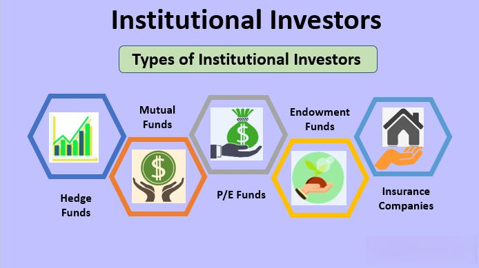

Understanding the dynamics of investing is crucial for anyone looking to maximize returns and secure financial independence. Investors today face a complex landscape shaped by evolving financial markets, technological advancements, and diverse investment opportunities. Identifying and leveraging the right investment strategies is paramount to achieving financial goals.

This article examines the various types of investors and the roles they play, while highlighting the role of algorithmic trading in modern financial markets. By recognizing how different investment types fulfill distinct investor roles, one can appreciate the nuances of market participation. Algorithmic trading, a growing trend, is fundamentally changing how trades are executed, offering efficiencies and opportunities previously unattainable.

Understanding these key elements is essential for anyone seeking to navigate today's financial markets successfully. As the investment world continues to evolve, staying informed and adaptable will empower investors to thrive in ever-changing conditions. Join us in exploring the factors that are driving financial markets today, shaping the future of investing.

## Table of Contents

## Types of Investors and Their Roles

Investors are pivotal players in the financial markets and can be classified into several types based on their financial objectives and risk tolerance levels. The primary categories include individual investors, institutional investors, angel investors, and venture capitalists. Each of these investor types plays a specific role in the economic ecosystem, providing liquidity, fostering innovation, and driving economic growth.

Individual investors are those who use their personal funds to invest in various financial instruments such as stocks, bonds, or real estate. Their primary aim is often long-term wealth accumulation, which is generally achieved through a combination of capital gains and income generation. These investors vary widely in their risk tolerance and investment strategies, from conservative approaches focusing on low-risk bonds and dividend-paying stocks to more aggressive strategies involving [growth stocks](/wiki/growth-stocks) and real estate ventures. 

Institutional investors include entities such as mutual funds, pension funds, insurance companies, and endowments. These entities wield significant influence in the financial markets due to the substantial volumes of assets they manage. For instance, pension funds often invest in a mix of equities and fixed-income securities to match their long-term liabilities, whereas mutual funds offer investors exposure to diversified portfolios, allowing for broader market participation. Institutional investors contribute to market stability and liquidity and are critical to efforts in financial market regulation and governance.

Angel investors and venture capitalists are crucial in financing start-ups and high-risk ventures. Angel investors, typically affluent individuals, provide capital to early-stage start-ups, usually in exchange for convertible debt or ownership equity. Their involvement often goes beyond financial support, offering strategic advice and mentorship to fledgling companies. Venture capitalists, on the other hand, usually involve more structured investment firms that invest in start-ups with the potential for high returns. These investors play a fundamental role in fostering innovation by supporting businesses with novel ideas that may otherwise struggle to secure traditional funding sources.

Each investor type plays a distinct role in the economy. Individual and institutional investors contribute significantly to market [liquidity](/wiki/liquidity-risk-premium) and stability, while angel investors and venture capitalists drive financial innovation by funding new ventures. Collectively, these investor types bolster economic growth by channeling funds into productive investments, supporting entrepreneurial activities, and participating in corporate governance to ensure efficient market operations.

## Investment Types

Investors have numerous investment vehicles available, each catering to different financial goals and risk appetites. The two most traditional and foundational types of investments are stocks and bonds. Stocks represent equity ownership in a company, providing investors with the potential for capital gains and, at times, dividend income. Bonds, on the other hand, offer a fixed income return, as they are essentially loans made by the investor to a borrower, typically a corporate or governmental entity. The borrower agrees to pay back the principal amount on a specified date, along with periodic interest payments.

Real estate is another strong investment avenue, offering potential benefits from both capital appreciation and rental income. Investors can acquire physical properties or engage in real estate investments through Real Estate Investment Trusts (REITs), which provide the advantage of investing in real estate without the direct management hassles.

Mutual funds and Exchange-Traded Funds (ETFs) are popular choices for those seeking diversification. These funds pool money from multiple investors to purchase a diversified portfolio of securities. Mutual funds typically offer active management, attempting to outperform market indices, while ETFs tend to be passively managed, tracking an index and trading like stocks on exchanges.

For those interested in hedging risks or engaging in speculative trading, options, derivatives, and commodities present viable strategies. Options provide the right, but not the obligation, to buy or sell an asset at a predetermined price within a specified timeframe. Derivatives, which derive their value from underlying assets, can be used for hedging or speculative purposes, as they allow investors to take positions on asset price movements without needing to hold the actual asset. Commodities involve investing in physical goods such as gold, oil, or agricultural products, offering diversification from stock and bond markets.

Cryptocurrencies have emerged as a new asset class in recent years, characterized by their digital nature and the use of blockchain technology. These alternative investments have garnered attention for their potential high returns, although they come with significant [volatility](/wiki/volatility-trading-strategies) and regulatory uncertainty. Investors in this space should be prepared for substantial price swings and conduct thorough due diligence.

This wide array of investment options enables investors to tailor their portfolios according to personal financial objectives, risk tolerance, and market conditions. Diversifying among different investment types is often recommended to minimize risk and optimize returns over time.

## The Rise of Algorithmic Trading

Algorithmic trading, also known as algo-trading, represents a transformative approach within the financial markets, leveraging complex computational algorithms to execute trades at speeds and efficiencies unattainable by human traders. By utilizing advanced algorithms, traders can minimize emotional biases, optimize execution, and take advantage of fleeting market conditions that are unmanageable for humans.

The core advantage of [algorithmic trading](/wiki/algorithmic-trading) lies in its ability to analyze large datasets rapidly and execute trades based on predefined criteria and conditions. Algorithms can process numerous market variables, such as price, [volume](/wiki/volume-trading-strategy), and timing, simultaneously, ensuring that trades are executed under optimal conditions and strategies are adhered to accurately.

Numerous strategies underpin algorithmic trading, each offering distinct potentials. Trend-following strategies, for instance, aim at capturing gains through analyzing an asset's [momentum](/wiki/momentum) in one direction. These strategies often employ moving averages and other statistical indicators to predict future price movements. Arbitrage, another strategy, exploits price discrepancies between different markets or instruments to generate profits. This strategy requires high-frequency trading capabilities to capitalize on minute price differences before they dissipate. Index rebalancing is a further strategy, where algorithms adjust portfolios to maintain a specific composition, ensuring that market indices are tracked closely.

Despite its advantages, algorithmic trading requires substantial technological investments. High-performance computing systems, low-latency connectivity, and sophisticated software platforms are essential for effective implementation. Additionally, algorithmic trading is not without its challenges. There are concerns about market manipulation, where algorithms could potentially disrupt market stability intentionally or unintentionally. Flash crashes, sudden market drops triggered by automated trading algorithms, further illustrate the potential risks associated with algo-trading.

To navigate today's fast-paced financial environments successfully, understanding algorithmic trading is essential for both seasoned investors and newcomers. Mastering these strategies and recognizing the inherent challenges can significantly bolster an investor's toolkit, offering a competitive edge in an increasingly algorithm-driven market landscape.

## Comparing Traditional and Algorithmic Trading

Traditional trading and algorithmic trading represent two distinct methodologies in the financial markets, each with unique characteristics and advantages. Traditional trading relies heavily on human analysis and execution. Traders interpret market data, news, and economic indicators to make decisions, often influenced by their intuition and experience. While this approach allows traders to react to unexpected market developments with flexibility, it is also susceptible to emotional biases such as fear and greed. These emotions can lead to inconsistent decision-making and, in some cases, suboptimal outcomes.

In contrast, algorithmic trading executes trades based on pre-defined quantitative strategies. Algorithms use mathematical models to analyze market conditions and execute orders with speed and precision that humans cannot match. This approach eliminates emotional biases and leverages computational power to process vast amounts of data efficiently. Common strategies employed in algorithmic trading include trend-following, which identifies and follows market momentum, and [arbitrage](/wiki/arbitrage), which capitalizes on price differentials between related securities.

The decision to use traditional or algorithmic trading ultimately depends on factors such as risk tolerance, trading goals, and resource availability. Investors with a deep understanding of market dynamics and the ability to interpret qualitative data may prefer traditional trading. They can exploit their market insights and personal judgment to make decisions swiftly in volatile environments. Conversely, those with access to sophisticated technology infrastructure and a preference for systematic, data-driven approaches may lean towards algorithmic trading.

It is crucial for investors to recognize the complementary nature of these trading methods. A well-rounded investment strategy can incorporate both approaches, leveraging the strengths of each. Traditional trading can be beneficial for interpreting macroeconomic trends and unforeseen events, while algorithmic trading can optimize execution efficiency and mitigate the impact of emotional biases.

In conclusion, understanding the differences and potential synergies between traditional and algorithmic trading enables investors to tailor their strategies effectively. By aligning their approaches with personal objectives and resources, investors can enhance their overall investment performance and adaptability in an ever-evolving financial landscape.

## Conclusion

Navigating through the diverse spectrum of investors and investment strategies is crucial in today's financial markets. Different investor types and strategies provide unique benefits and cater to varying needs, reflecting the multifaceted nature of capital markets. As technological advancements permeate the financial sector, algorithmic trading has emerged as a significant force, introducing both opportunities and uncertainties.

Algorithmic trading leverages complex algorithms to optimize trading efficiency and execution, enabling investors to tackle market dynamics with speed and precision. Despite its advantages, it introduces challenges such as the potential for market manipulation and the occurrence of flash crashes, necessitating robust risk management measures. Investors who successfully integrate both traditional strategies, which rely on human intuition and analysis, and algorithmic approaches, can create more resilient and adaptive portfolios.

The continuously evolving financial landscape demands that investors remain flexible, learning to leverage both conventional methodologies and advanced technological tools. A commitment to ongoing education and staying abreast of emerging market trends and technological innovations is essential for thriving in this dynamic environment. By remaining informed and adaptable, investors can harness the full potential of both traditional and algorithmic trading methods, achieving greater financial success.

## FAQs

### What are the main differences between active and passive investing?

Active investing involves a hands-on approach where investors, or fund managers, engage in continuous buying and selling of assets to outperform broader market indices. This strategy relies on analysis, skill, and judgment to make investment decisions and often incurs higher fees due to frequent trading and management efforts. Passive investing, on the other hand, involves minimal trading and seeks to replicate the performance of specific indices, such as the S&P 500. It typically results in lower transaction costs and management fees, catering to long-term investors who prefer stable growth with less interaction.

### How does an individual begin investing with algorithmic trading?

To start investing with algorithmic trading, an individual should first acquire a solid understanding of trading fundamentals and programming skills, typically Python. They should familiarize themselves with financial markets and investment strategies. The next step is to select or develop a trading platform, such as MetaTrader or platforms that use Python, like QuantConnect. Individuals can start with simple strategies, such as moving averages, and use historical data to backtest and refine these strategies. Risk management techniques should also be incorporated to mitigate financial losses.

### What are the potential risks involved with algorithmic trading?

Algorithmic trading, although offering enhanced execution speed and reduced human error, presents several risks. One major risk is the potential for technical failures, such as software bugs or hardware malfunctions, which can lead to substantial financial losses. Market risks, including liquidity issues, can also affect algorithmic trades during volatile market conditions. Additionally, algorithmic trading can contribute to market disruptions like flash crashes, where rapid automated trades create severe price swings. Unintended strategies stemming from poorly coded algorithms pose another risk, often resulting in unexpected financial outcomes.

### Can traditional investors benefit from understanding algorithmic trading strategies?

Traditional investors can indeed benefit from understanding algorithmic trading strategies as it provides insights into market behavior and trading patterns that may influence their investments. Knowledge of algorithmic strategies can help traditional investors anticipate market movements driven by automated trades. Moreover, it allows them to integrate quantitative analysis into their decision-making processes, potentially enhancing their ability to optimize portfolio performance and manage risks effectively.

### What resources are available for learning more about investment types and strategies?

Numerous resources are available for individuals interested in learning about investment types and strategies. Online platforms such as Coursera, edX, and Khan Academy offer courses in finance and investment. Websites like Investopedia provide comprehensive articles and tutorials on diverse investment topics. Books like "The Intelligent Investor" by Benjamin Graham and "A Random Walk Down Wall Street" by Burton Malkiel offer foundational investment knowledge. For algorithmic trading specifically, resources like "Algorithmic Trading" by Ernie Chan and platforms like QuantInsti provide detailed insights and practical guidance. Additionally, financial news outlets like Bloomberg and The Wall Street Journal offer up-to-date information on market trends and developments.

## References & Further Reading

[1]: Bergstra, J., Bardenet, R., Bengio, Y., & Kégl, B. (2011). ["Algorithms for Hyper-Parameter Optimization."](https://papers.nips.cc/paper/4443-algorithms-for-hyper-parameter-optimization) Advances in Neural Information Processing Systems 24.

[2]: ["Advances in Financial Machine Learning"](https://www.amazon.com/Advances-Financial-Machine-Learning-Marcos/dp/1119482089) by Marcos Lopez de Prado

[3]: ["Evidence-Based Technical Analysis: Applying the Scientific Method and Statistical Inference to Trading Signals"](https://www.semanticscholar.org/paper/Evidence-Based-Technical-Analysis%3A-Applying-the-and-Aronson/3b33df8737f1772e9e14d66a08c9696f140a2ee1) by David Aronson

[4]: ["Machine Learning for Algorithmic Trading"](https://github.com/stefan-jansen/machine-learning-for-trading) by Stefan Jansen

[5]: ["Quantitative Trading: How to Build Your Own Algorithmic Trading Business"](https://www.amazon.com/Quantitative-Trading-Build-Algorithmic-Business/dp/1119800064) by Ernest P. Chan