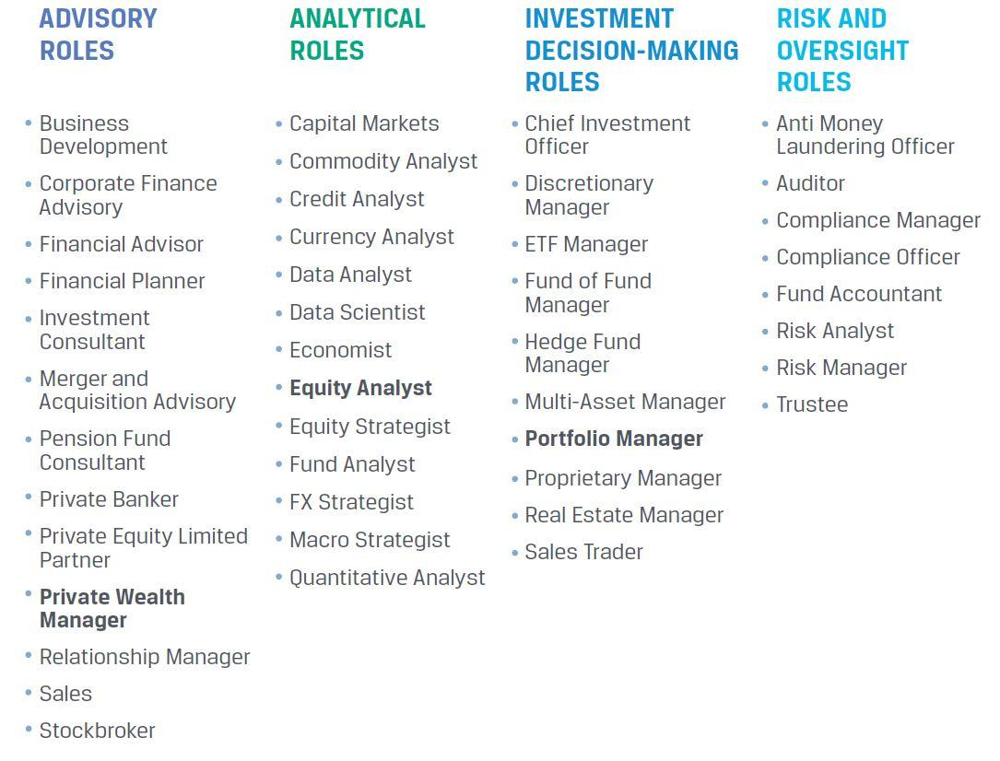

## Table of Contents

## What is an investor?

An investor is someone who puts money into different things to make more money over time. These things can be businesses, real estate, or financial products like stocks and bonds. Investors hope that the value of what they invest in will grow, so they can sell it later for a higher price or get regular payments like dividends.

There are different types of investors. Some people invest for a short time, trying to make quick profits. Others invest for the long term, planning to see their money grow slowly over many years. No matter the approach, all investors take on some risk, because there's no guarantee that their investments will increase in value. But if they choose wisely, they can earn more money than they started with.

## What are the basic types of investors?

There are a few basic types of investors. One type is the individual investor. These are regular people who use their own money to buy things like stocks, bonds, or real estate. They might do this to save for retirement, to buy a house, or just to grow their money over time. Individual investors usually don't have a lot of money to invest at once, but they can still build up a good amount over the years.

Another type is the institutional investor. These are big organizations like banks, insurance companies, and pension funds. They have a lot more money to invest than individual investors. Because they handle so much money, they can affect the prices of stocks and other investments. Institutional investors often have teams of experts to help them decide where to put their money.

The last type is the professional investor. These are people who invest money for a living. They might work for a [hedge fund](/wiki/hedge-fund-trading-strategies), a mutual fund, or as private wealth managers. Professional investors often use complex strategies to try to make the best returns for their clients. They might take bigger risks than individual investors, hoping to earn bigger rewards.

## How do individual investors differ from institutional investors?

Individual investors and institutional investors differ mainly in the amount of money they invest and their level of expertise. Individual investors are everyday people who use their own money to buy things like stocks, bonds, or real estate. They usually don't have a lot of money to invest at once, but they can still build up a good amount over time. Individual investors often rely on their own research or simple advice from financial advisors to make investment decisions.

On the other hand, institutional investors are big organizations like banks, insurance companies, and pension funds. They handle a lot more money than individual investors. Because they manage such large sums, they can influence the prices of stocks and other investments. Institutional investors usually have teams of experts who help them decide where to put their money. These experts use detailed research and sophisticated strategies to try to get the best returns.

In summary, the key differences are the scale of investment and the resources available. Individual investors operate on a smaller scale with limited resources, while institutional investors have much more money and expert support to guide their investment choices.

## What roles do investors play in a company?

Investors play important roles in a company. They provide the money that companies need to start up, grow, and keep running. When a company needs money, it can sell shares to investors. These investors then own a part of the company. They hope that the company will do well and their shares will become more valuable over time. Investors also give money to companies through loans or bonds. This helps the company pay for new projects or expand its business.

Investors also have a say in how the company is run. If they own enough shares, they can vote on important decisions at shareholder meetings. They can vote on things like who should be on the company's board of directors or whether the company should merge with another business. This gives investors some control over the company's future. By watching the company closely, investors can also give advice and feedback to help the company make better decisions.

## What is the difference between active and passive investing?

Active investing is when investors try to beat the market by [picking](/wiki/asset-class-picking) specific stocks or timing their buys and sells. They spend a lot of time researching and making decisions about which investments to buy and when to sell them. Active investors believe that by being smart and working hard, they can do better than if they just followed the market. This approach can lead to higher returns, but it also involves more risk and more work.

Passive investing is different because it aims to match the market's performance rather than beat it. Instead of picking individual stocks, passive investors usually buy index funds or ETFs that track a whole market, like the S&P 500. They hold onto these investments for a long time without making many changes. Passive investing is easier and often cheaper because it doesn't require as much research or trading. While it might not lead to big wins, it's usually less risky and can still provide good, steady growth over time.

## How do angel investors and venture capitalists differ?

Angel investors are usually rich people who give money to start-up companies. They often help out early on, when the company is just an idea or has just started. Angel investors use their own money, and they might also give advice or use their connections to help the business grow. They usually take a bigger risk because the company might not make money for a long time, but they hope to make a lot of money if the company does well.

Venture capitalists are different because they are part of bigger companies that invest in start-ups. They use money from other investors, like pension funds or rich people, to put into new businesses. Venture capitalists often invest after the company has been going for a bit and needs more money to grow. They might give more money than angel investors, but they also want a bigger say in how the company is run. They aim to make big profits too, but they spread their money across many start-ups to lower their risk.

## What are the responsibilities of a lead investor in a syndicate?

A lead investor in a syndicate is like the captain of a team. They are the ones who find a good investment opportunity and then bring other investors together to put money into it. The lead investor does a lot of the research and makes sure everyone knows about the investment. They also talk to the company the syndicate is investing in, making deals and setting terms. Because they lead the group, they usually put in more money than others and might get a bigger share of the profits if things go well.

Besides finding and managing the investment, the lead investor also keeps an eye on how the company is doing after the investment is made. They check in with the company, give advice, and help solve problems if they come up. If the company needs more money later, the lead investor might organize another round of funding. They act as a link between the company and the other investors, making sure everyone stays informed and happy with how things are going.

## How does an investor's risk tolerance affect their investment strategy?

An investor's risk tolerance is how much they can handle their money going up and down. If someone has a high risk tolerance, they are okay with their investments maybe losing value in the short term, because they think they can make more money in the long run. These investors might put their money into things like stocks of new companies or other risky investments. They hope to get big rewards but know there's a chance they could lose money too.

On the other hand, if someone has a low risk tolerance, they want their money to be safe and not change much in value. These investors will choose safer options, like bonds or savings accounts. They might not make as much money, but they feel more secure because their investments are less likely to lose value. So, an investor's risk tolerance really shapes what they choose to invest in and how they plan to grow their money over time.

## What are the tax implications for different types of investors?

Different types of investors can face different tax situations. For individual investors, the money they make from their investments, like selling stocks for a profit or getting dividends, can be taxed. In many places, if an individual holds onto a stock for a long time before selling it, they might pay less tax on the profit than if they sold it quickly. Also, some investments like certain bonds might not be taxed as much, which can be good for people who want to keep more of their money.

Institutional investors, like big companies or pension funds, often have different tax rules. They might not pay as much tax on their investment earnings because they are investing for a lot of people or for future retirement benefits. But they still need to report their earnings and pay taxes on them according to the laws of their country. Understanding these rules can help them plan their investments better and keep more money for their clients.

Professional investors, who manage money for others, have to deal with taxes too. The way they are taxed can depend on the type of fund they manage. For example, hedge funds and mutual funds have different tax treatments. Professional investors need to know these rules well so they can help their clients pay as little tax as possible while still making good investment choices.

## How do investors use financial instruments like options and futures?

Investors use options and futures to manage risk and try to make money. Options give investors the right, but not the obligation, to buy or sell an asset at a set price before a certain date. For example, if an investor thinks a stock will go up, they can buy a call option to buy the stock at today's price later on. If the stock does go up, they can buy it at the lower price and sell it at the higher market price, making a profit. If the stock goes down, they can just let the option expire and only lose the money they paid for the option. This way, options can help investors bet on price movements without having to buy the whole stock.

Futures are agreements to buy or sell an asset at a set price on a future date. They are often used by investors who want to protect themselves from price changes. For example, a farmer might use futures to lock in a price for their crops before they harvest them. If the price of crops goes down, the farmer still gets the higher price they agreed on in the future contract. Investors can also use futures to guess on price movements. If they think the price of oil will go up, they can buy a future contract to buy oil at today's price later. If they're right, they can sell the oil at the higher market price and make a profit. Both options and futures can be risky, but they give investors more ways to make money and manage their risks.

## What advanced strategies do hedge fund managers employ?

Hedge fund managers use many smart strategies to try to make more money for their investors. One common strategy is called "long/short equity." This means they buy stocks they think will go up in value (that's the "long" part) and at the same time, they sell stocks they think will go down in value (that's the "short" part). By doing both, they hope to make money no matter what the market does. Another strategy is "[global macro](/wiki/global-macro-strategy)," where they look at big things happening around the world, like changes in interest rates or political events, and use that information to bet on things like currencies or commodities.

Another advanced strategy is "[arbitrage](/wiki/arbitrage)." This is when hedge fund managers try to make money from small price differences between similar things. For example, they might buy a stock on one market where it's cheaper and sell it on another market where it's more expensive. They can also use "event-driven" strategies, where they invest based on things like company mergers or other big events that might change a company's value. These strategies can be risky, but hedge fund managers use them to try to beat the market and make big profits for their investors.

## How do global economic trends influence investor behavior and strategy?

Global economic trends can really change how investors act and what they decide to do with their money. When the world economy is doing well, investors might feel more confident and willing to take risks. They might put their money into stocks or start-ups, hoping to make big profits as the economy grows. But if there are signs that the economy might slow down or face problems, like high inflation or rising interest rates, investors might get worried. They might move their money into safer investments, like bonds or cash, to protect what they have and avoid losing money if the market goes down.

These trends also make investors think about where to invest their money around the world. If one country's economy is growing faster than others, investors might want to put more money there to take advantage of the growth. For example, if a country is doing well because of new technology or good government policies, investors might buy stocks or real estate there. On the other hand, if a country is struggling with debt or political problems, investors might pull their money out to avoid the risk. By watching these global trends, investors can adjust their strategies to try to make the best returns while managing their risks.

## References & Further Reading

[1]: Bergstra, J., Bardenet, R., Bengio, Y., & Kégl, B. (2011). ["Algorithms for Hyper-Parameter Optimization."](https://papers.nips.cc/paper/4443-algorithms-for-hyper-parameter-optimization) Advances in Neural Information Processing Systems 24.

[2]: ["Advances in Financial Machine Learning"](https://www.amazon.com/Advances-Financial-Machine-Learning-Marcos/dp/1119482089) by Marcos Lopez de Prado

[3]: ["Evidence-Based Technical Analysis: Applying the Scientific Method and Statistical Inference to Trading Signals"](https://www.semanticscholar.org/paper/Evidence-Based-Technical-Analysis%3A-Applying-the-and-Aronson/3b33df8737f1772e9e14d66a08c9696f140a2ee1) by David Aronson

[4]: ["Machine Learning for Algorithmic Trading"](https://github.com/stefan-jansen/machine-learning-for-trading) by Stefan Jansen

[5]: ["Quantitative Trading: How to Build Your Own Algorithmic Trading Business"](https://www.amazon.com/Quantitative-Trading-Build-Algorithmic-Business/dp/1119800064) by Ernest P. Chan