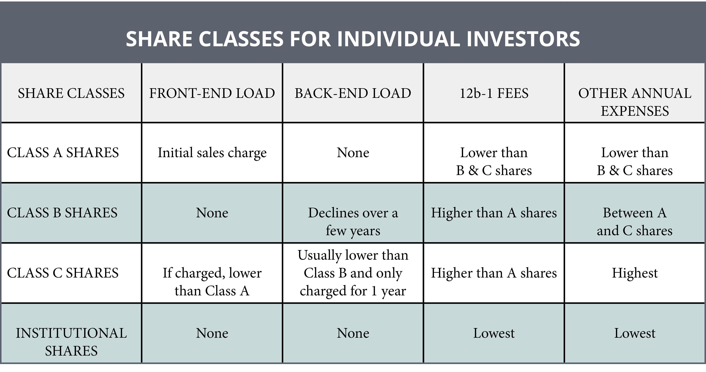

In the evolving world of investing, understanding the intricate details of fees and commissions is crucial. Investors face various charges that differ based on the class of shares they invest in and the trading strategies they employ. These costs can significantly impact investment returns, making it essential to grasp how they are calculated and applied.

This article provides a comprehensive overview of the different investment classes, with a focus on investor shares, fees, and commissions. It also examines the benefits and drawbacks of algorithmic trading, a technology-driven approach that has reshaped modern investing. Algorithmic trading can enhance trade efficiency and potentially reduce costs, yet it also carries certain risks and complexities.



By exploring these topics, our aim is to equip you with the knowledge necessary to optimize your investments and increase your overall profitability. Understanding the components that contribute to the cost of investing will empower you to make informed decisions, tailor your investment strategies to minimize unnecessary expenses, and ultimately, enhance your financial returns.

## Table of Contents

## Understanding Investor Shares

Investor shares are tailored for individual investors as opposed to institutional investors, who typically deal with larger volumes of transactions and capital. The distinguishing characteristic of investor shares is their accessibility; they are designed to cater to retail investors with lower investment minimums, making them an appealing option for individuals seeking portfolio diversification without the substantial capital requirements often associated with institutional investments.

### Fee Structure of Investor Shares

Investor shares usually have higher fees compared to institutional shares. This is primarily due to the economies of scale enjoyed by institutional investors, which often translate into lower per-unit costs. The fees associated with investor shares can include:

1. **Sales Loads**: These are transaction-based fees that are charged either at the time of purchase (front-end load) or at the time of sale (back-end load). For example, a 5% front-end load on a $1,000 investment would mean $50 is deducted as a fee, leaving $950 actually invested.

2. **12b-1 Fees**: These are annual marketing or distribution fees, usually ranging from 0.25% to 1% of the fund's net assets. They are taken out of the fund's assets, thus reducing the total returns for investors.

3. **Management Fees**: These cover the costs associated with managing the investment fund and are typically charged as a percentage of the assets under management (AUM).

4. **Redemption Fees**: Charged when investors sell their shares within a certain period, typically to discourage short-term trading.

### Appeal to Retail Investors

Despite the higher fee structure, investor shares hold significant appeal for retail investors. The primary attraction is the lower investment minimums. This feature democratizes access to a variety of investment options, allowing retail investors to build diversified portfolios that were once the exclusive domain of institutional investors.

Moreover, investor shares often come with additional services such as customer support and financial advisory, which can be valuable to retail investors who may not have the expertise or time to manage their investments actively. The higher fees, therefore, can be viewed as a trade-off for these added conveniences and the lower entry barrier.

In summary, investor shares provide a feasible entry point for individual investors into the investment market. While the higher fees compared to institutional shares may reduce returns, the benefits of accessibility, flexibility, and support make them a compelling choice for many retail investors. Understanding the specific fee structures associated with these shares is crucial for optimizing investment strategies and ensuring cost-effective portfolio management.

## Fees and Commissions Explained

In the landscape of investor shares, understanding the associated fees is pivotal to maximizing returns. Sales loads and 12b-1 fees are two primary types of charges that retail investors often encounter.

Sales loads are commissions paid to brokers who sell mutual funds, typically expressed as a percentage of the purchase price. These fees can be classified into front-end loads, payable at the time of purchase, and back-end loads, payable at the time of selling shares. Front-end loads reduce the initial amount invested. For instance, a $10,000 investment in a fund with a 5% front-end load translates to an actual investment of $9,500.

Alternatively, 12b-1 fees are annual marketing or distribution fees found in mutual funds and can account for up to 1% of a fund's net assets. They are included in a fund's expense ratio and are meant to cover marketing and distribution costs. While these fees do not require upfront or [exit](/wiki/exit-strategy) payments, they can erode returns over time as they are continually deducted.

Fees impact investment returns by reducing the overall capital employed in generating returns. The relationship between fees and investment growth can be expressed using the formula:

$$
\text{Net Return} = \left( 1 + \text{Gross Return} \right)^{n} \times \left( 1 - \text{Total Expense Ratio} \right)^{n} - 1
$$

Where:
- Gross Return is the total return before fees.
- Total Expense Ratio includes all annual fees (management fees, 12b-1 fees, etc.).
- $n$ denotes the number of years.

Effective financial planning requires understanding the distinction between flat fees and percentage-based fees. Flat fees are fixed charges regardless of the transaction size, whereas percentage-based fees are proportional to the value of the transaction.

Investors can adopt strategies to minimize fees by selecting funds with lower expense ratios or choosing fee structures that align with their investment horizon. Transparent analysis of these fee structures enables more informed investment decisions, ultimately affecting the long-term performance of an investment portfolio.

## Investment Classes: A Comparative Analysis

Investment classes constitute the various categories of assets that investors can choose to structure their portfolios. Understanding these classes, which include stocks, bonds, ETFs (Exchange Traded Funds), and derivatives, is essential for creating a balanced investment strategy that accounts for risk and fee management. 

### Stocks
Stocks represent ownership in a corporation and entitle the shareholder to a portion of the company’s profits, often received as dividends. Fees associated with stocks typically include brokerage fees, which can vary depending on whether the purchase is executed through a traditional brokerage or an online platform. Some platforms charge flat fees per trade, while others might levy a percentage of the transaction value.

### Bonds
Bonds are essentially loans made by the investor to a borrower, typically corporate or governmental. They generate interest income, usually on a fixed schedule. Fees for bonds are often lower than those for stocks but can include transaction fees and potential custodian fees. The interest rates, duration, and credit risk significantly impact an investor’s return, making proper selection vital to optimizing fees and mitigating risks.

### ETFs
ETFs are investment funds traded on stock exchanges, much like stocks. They hold assets such as stocks, commodities, or bonds and generally have lower expense ratios than mutual funds. Management fees and brokerage commissions are common costs associated with ETFs. Given their diversity and low fees, ETFs offer an efficient way to access multiple markets and asset classes with reduced individual transaction costs.

### Derivatives
Derivatives derive their value from an underlying asset, which could be a stock, bond, commodity, currency, [interest rate](/wiki/interest-rate-trading-strategies), or market index. Common types of derivatives include options and futures. They often involve complex fee structures that can include commissions, margin costs, and options premiums. While derivatives can be used for hedging risk, their complexity and potential for substantial losses make fee optimization and risk management crucial.

### Comparative Analysis of Fees and Risks
Fees and risks vary significantly across investment classes. For instance, while stocks and ETFs may incur regular brokerage fees, bonds might involve fewer transaction costs but present interest rate risk. Derivatives, on the other hand, involve higher complexity and potential margin costs but offer sophisticated mechanisms for hedging and speculation.

A diverse mix of investment classes can manage risks effectively and optimize fees. By allocating assets across different classes, investors can spread risk—reducing the impact of poor performance in any single investment type. This diversification can also help in optimizing fee expenses as different asset classes are subject to different fee structures.

Investors should carefully assess their investment goals, risk tolerance, and the fee structures of various asset classes. This assessment can guide them in selecting an appropriate mix that minimizes costs and maximizes potential returns. Leveraging tools such as robo-advisors can also help in automatically reallocating assets to maintain a balanced portfolio, thereby optimizing risk and fee management in line with market changes.

## The Role of Brokers and Algo Trading in Fee Structures

Brokers are central to the formation of fee structures for investor shares, guiding investors through complex financial landscapes while ensuring access to various investment opportunities. Broker fees can significantly impact investment profitability, as they often include commissions, management fees, and other transactional costs. As intermediaries between investors and stock exchanges, brokers provide the resources and execution platforms necessary for investment activity.

The advent of [algorithmic trading](/wiki/algorithmic-trading) has introduced a new dimension to fee structures by potentially lowering the costs associated with trade execution. Algorithmic trading employs sophisticated mathematical models and high-speed data analysis to execute trading orders with minimal human intervention. This automation reduces the cost per trade by streamlining processes and improving the speed of executions, which is particularly beneficial in highly volatile markets. By automatically adjusting to market conditions, algorithmic trading can achieve better price execution by minimizing slippage—the difference between the expected price of a trade and the actual price.

However, choosing the right broker and trading platform requires careful consideration, especially with regard to the support for algorithmic trading. Not all brokers offer the same level of services or the same fee structures, making it essential for investors to comprehensively assess their options. Key considerations when evaluating brokers include the following:

1. **Trading Fees and Commissions**: Different brokers have varied fee structures, ranging from flat fees to percentage-based commissions. It is crucial to compare these costs to understand their impact on your net returns.

2. **Trading Platforms and Technology**: The level of sophistication and user-friendliness of a trading platform can influence your trading efficiency. Platforms offering advanced algorithmic trading tools, such as backtesting capabilities and real-time data feeds, can enhance trade execution quality.

3. **Market Access and Order Types**: Ensure the broker provides access to the markets and asset classes you wish to trade and supports various order types that align with your trading strategy.

4. **Security and Regulation**: Verify the broker's regulatory status and consider the security measures they employ to protect your investments and personal data.

The integration of algorithmic trading in fee structures not only offers cost reductions but also requires the strategic selection of brokers to leverage cutting-edge technologies effectively. Balancing the benefits of reduced costs with considerations for service quality, platform features, and regulatory compliance can optimize investment outcomes. In summary, the role of brokers and algorithmic trading in fee structures is a blend of strategic decision-making and leveraging technological advances to maximize returns while minimizing costs.

## Case Studies: Fee Impact on Different Investment Strategies

Examining the impact of fees on different investment strategies reveals crucial insights that can significantly influence investor outcomes. Various strategies are affected by how fees are structured and managed, ultimately impacting both short-term performance and long-term profitability. By exploring real-world examples, we can better understand how different types of investors navigate fee structures to maximize their returns.

### Leveraging Share Classes to Minimize Fees

Investors often leverage different share classes to minimize fees and enhance returns. For example, Class A shares generally come with a front-end sales load, which is a one-time fee paid when shares are purchased. These shares might also have lower annual 12b-1 fees, making them suitable for investors with a long-term horizon who wish to minimize their ongoing expenses.

Conversely, Class C shares typically have no upfront sales load but may charge higher annual fees. These are more attractive to investors who plan to hold their investments for a shorter period, as the absence of an initial sales load allows for more flexibility. By strategically selecting appropriate share classes, investors can align their financial goals with the fee structures that best suit their expected investment duration.

### Case Studies on Successful Fee Management

**Case Study 1: Long-term Growth through Class A Shares**

Consider an investor named Maria, who plans to invest $50,000 in a mutual fund for 15 years. Maria chooses Class A shares with a 5% front-end load and an annual 12b-1 fee of 0.25%. The upfront cost is $2,500 (5% of $50,000), leaving $47,500 to invest. The lower ongoing fee allows more of Maria's funds to compound over time, resulting in substantial long-term growth. This strategy benefits her more had she opted for a share class with lower initial costs but higher annual fees.

**Python Calculation:**

```python
initial_investment = 50000
front_end_load = 0.05
net_investment = initial_investment * (1 - front_end_load)

annual_return_rate = 0.07
annual_12b1_fee = 0.0025
years = 15

for year in range(years):
    net_investment *= (1 + annual_return_rate) * (1 - annual_12b1_fee)

final_amount = net_investment
final_amount
```

This code calculates Maria's portfolio growth taking into account the initial front-end load and annual fees over 15 years at a 7% average annual return rate.

**Case Study 2: Flexibility with Class C Shares**

John is an investor with a short-term perspective, intending to invest $20,000 in a mutual fund for 3 years. He selects Class C shares, which do not [carry](/wiki/carry-trading) a front-end load but include a 1% annual fee. This choice enables John to keep more of his capital working immediately, which is advantageous for short-term growth objectives. The higher annual fee is a trade-off for the flexibility to liquidate without incurring additional charges, maximizing his potential to respond to market shifts.

These case studies underscore the importance of aligning investment horizons with fee structures to optimize returns. Successful fee management requires a detailed understanding of the intricate balance between initial costs and ongoing expenses. By considering both short-term needs and long-term objectives, investors can make informed decisions that enhance profitability while effectively managing associated costs.

## Conclusion

In the ever-evolving landscape of investing, understanding the nuances of investor shares, fees, and the role of brokers is crucial for optimizing investment strategies and enhancing profitability. Investor shares, tailored for individual retail investors, often come with higher fees than their institutional counterparts but offer the advantage of lower minimum investment thresholds. This makes them accessible to a wider range of investors, thereby democratizing participation in financial markets.

Fees, including sales loads and 12b-1 fees, directly impact investment returns and necessitate strategic planning to minimize their effects. A comprehensive grasp of the fee structures, whether flat rate or percentage-based, is essential for maximizing returns. Investors should prioritize fee optimization within their strategies to enhance overall profitability.

Brokers play a pivotal role in the cost dynamics of investment transactions. They determine the fee structures associated with investor shares, and choosing the right broker can lead to significant savings. The rise of algorithmic trading offers opportunities to lower trade execution costs. However, it requires investors to be discerning when selecting brokers and platforms, ensuring they align with their investment strategies and optimize for both cost and performance.

The importance of making well-informed investment decisions cannot be overstated. Continuous education on financial products, fees, and market trends empowers investors to adapt to changes and capitalize on opportunities. As technologies and markets evolve, staying informed ensures that investment strategies remain relevant and effective in an increasingly complex financial landscape.

Encouraging ongoing education and adaptation ensures that investors can navigate the challenges of modern investing with confidence. Embracing innovation and maintaining an awareness of market developments will support informed decision-making and consistent fee optimization. By doing so, investors can enhance their financial acumen and better position themselves for sustained success.

## FAQ

**FAQ**

**1. What are investor shares, and how do they differ from institutional shares?**

Investor shares are tailored for individual investors rather than large-scale institutional investors. They generally have higher fees compared to institutional shares but feature lower investment minimums, making them more accessible for retail investors. The trade-off typically involves paying higher fees for entry-level investment opportunities.

**2. What types of broker fees should I be aware of?**

Broker fees can include a variety of charges such as trading commissions, account maintenance fees, and service fees. Understanding these fee structures is key to managing costs effectively. Trading commissions can be fixed per trade or vary as a percentage of the trade value, while some brokers also charge for additional services like research and advisory.

**3. What are algorithmic trading and its advantages regarding fees?**

Algorithmic trading involves using automated systems to execute trades based on predefined criteria. This approach can lower trading costs through more efficient trade executions and potentially reduce human error. However, it requires a sophisticated understanding of both market dynamics and algorithmic strategies.

**4. How can I minimize investment costs and maximize returns?**

To reduce investment costs and enhance returns, consider the following strategies:
- Opt for no-load mutual funds or ETFs with low expense ratios.
- Use a discount brokerage that offers lower trading commissions or zero-commission trades.
- Implement a long-term investment strategy to minimize frequent trading costs.
- Leverage tax-efficient investments and accounts to reduce tax liabilities on returns.

**5. Can you clarify some common terms related to investment fees?**

Here are some crucial terms to understand:

- **Sales Load**: A fee charged when purchasing or selling mutual fund shares. It can be front-end (paid when buying) or back-end (paid when selling).

- **12b-1 Fee**: An annual marketing or distribution fee on a mutual fund. It's included in the fund's expense ratio.

- **Expense Ratio**: The annual fee expressed as a percentage of your investment, covering management and administrative costs within the fund.

- **Bid-Ask Spread**: The difference between the price buyers are willing to pay (bid) and the price sellers want to receive (ask), affecting the cost of executing trades.

**6. Are there any tools or algorithms I can use to evaluate fee impact?**

Yes, several tools can help analyze the fee impact on investments:

- **Fee Calculators**: Many financial websites offer calculators that allow you to input your portfolio details and project the long-term impact of fees.

- **Spreadsheet Analysis**: Use spreadsheets to model fees using formulas. For example, leveraging Python pandas or Excel can help simulate different fee structures and their impact over time. Here's a simple example in Python:

  ```python
  import pandas as pd

  # Define the initial investment and fees
  initial_investment = 10000
  annual_return_rate = 0.06
  annual_fee_percentage = 0.01

  # Projection over 10 years
  years = 10
  data = []

  for year in range(1, years + 1):
      investment_value = initial_investment * ((1 + annual_return_rate) ** year)
      fees = investment_value * annual_fee_percentage
      investment_value -= fees
      data.append({'Year': year, 'Value': investment_value, 'Fees': fees})

  df = pd.DataFrame(data)
  print(df)
  ```

Understanding these aspects helps make informed decisions, aligning your investment strategy with your financial goals while ensuring cost efficiency.

## References & Further Reading

[1]: ["A Random Walk Down Wall Street: The Time-Tested Strategy for Successful Investing"](https://www.amazon.com/Random-Walk-Down-Wall-Street/dp/0393358380) by Burton G. Malkiel

[2]: Piziak, R., & Kraemer, P. L. (2014). ["Algorithmic Trading: A Case Study."](https://books.google.com/books/about/Matrix_Theory.html?id=0kct1p3UdCQC) IEEE International Conference on Computational Intelligence and Computing Research.

[3]: French, K. R. (2008). ["Presidential Address: The Cost of Active Investing."](http://qed.econ.queensu.ca/faculty/milne/322/ECON322(2008)%20Kenneth%20R%20French.pdf) The Review of Financial Studies, Volume 22, Issue 10.

[4]: ["Investment Analysis and Portfolio Management"](https://faculty.cengage.com/works/9780357988176) by Frank K. Reilly and Keith C. Brown

[5]: ["Asset Pricing and Portfolio Choice Theory"](https://www.amazon.com/Portfolio-Financial-Management-Association-Synthesis/dp/0190241144) by Kerry Back