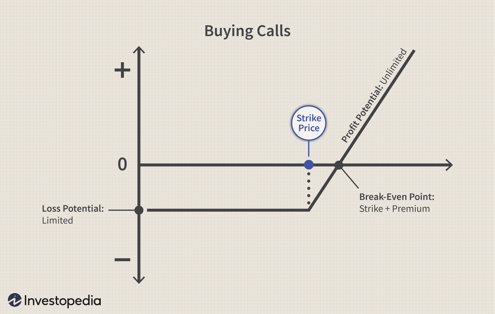

In today’s volatile financial markets, managing risk while optimizing returns has become a critical goal for investors. One widely adopted method to achieve this balance is through the use of options, particularly puts and calls. Options offer a strategic approach to hedging, providing a safety net against potential downturns in the market. These financial instruments allow investors to either purchase (calls) or sell (puts) an asset at a pre-set price before a specific expiration date. This capability to lock in prices can significantly limit potential losses, making options essential tools for financial risk management.

Complementing these traditional strategies, algorithmic trading introduces a layer of automation and precision, transforming the execution of financial strategies. Algorithmic trading, often referred to as algo trading, employs computer algorithms to execute trades based on predefined parameters. This innovation enhances the speed and efficiency of deploying options strategies, ensuring rapid response to market fluctuations. By continuously monitoring market conditions, algorithms can adjust options positions dynamically, aligning them with the investor’s risk tolerance and market outlook.



The synergy between hedging with options and algorithmic trading constructs a sophisticated framework for investors seeking to optimize their financial strategies. This article aims to examine the dynamic interplay between these components, offering insights into how they can be effectively leveraged to achieve desired financial outcomes. Investors looking to navigate today's complex financial landscape can benefit from understanding and implementing these advanced tools tailored to market dynamics.

## Table of Contents

## The Fundamentals of Options: Puts and Calls

Options are financial derivatives, a type of contract whose value is derived from the performance of an underlying asset, which could include stocks, bonds, indices, commodities, or currencies. Essentially, an option provides its holder with the right, but not the obligation, to buy or sell the underlying asset at a predetermined price, known as the strike price, on or before a specified expiration date. This flexibility makes options an attractive tool for various investment strategies, particularly for hedging purposes.

Call options and put options are the two fundamental types of options. A call option gives the holder the right to purchase the underlying asset at the strike price within the option's active period. Investors typically buy call options when they anticipate an increase in the asset's price, aiming to benefit from upward price movements without having to invest the full amount required to purchase the asset outright.

Conversely, a put option provides the holder with the right to sell the underlying asset at the strike price before the expiration date. This type of option is advantageous when the investor expects the asset's price to decline. By holding put options, investors can benefit from falling prices or protect their investments against potential losses.

A critical aspect of options is their role in hedging financial risks. Hedging involves taking a position in one market to offset exposure to price fluctuations in another, providing a safety net against undesired price movements. Options serve this purpose by allowing investors to lock in purchase or sale prices, effectively capping potential losses while maintaining the possibility of gains. For instance, an investor owning a stock might purchase a put option to safeguard against significant drops in the stock's price, ensuring they have the option to sell at a predefined price even if the market value falls drastically.

The utility of options as hedging instruments lies in their ability to limit risk while preserving the upside potential. This characteristic is particularly important in volatile markets, where sudden and adverse price swings can quickly erode investment gains. By incorporating options into their strategies, investors can achieve a more balanced risk-reward profile, enabling them to navigate complex and unpredictable financial landscapes more effectively.

## Hedging Strategies with Puts and Calls

Hedging in financial markets aims to mitigate the risk of adverse price movements that could negatively impact an investment portfolio. Among the most prevalent strategies for achieving this are protective puts and covered calls. These methods provide a layer of security in unpredictable markets, allowing investors to shield their assets while potentially enhancing returns.

Protective puts involve purchasing put options to safeguard against potential declines in the value of an asset. A put option grants the holder the right, but not the obligation, to sell a particular asset at a predetermined price, known as the strike price, before the option's expiration date. By holding a put option, an investor can effectively set a floor on their potential losses. For example, if the market price falls below the strike price, the investor can exercise the put option to sell the asset at the strike price, thereby limiting the loss.

Covered calls, on the other hand, are utilized to generate additional income on assets that an investor already owns. This strategy involves selling call options against these holdings. A call option provides the buyer the right, but not the obligation, to purchase an asset at a specified strike price before the option's expiration. By selling a call option, the investor receives a premium from the buyer, which acts as an additional income stream. If the asset’s market price rises above the strike price, the investor might be obligated to sell the asset at the strike price, potentially capping the gains.

The choice between these two strategies requires careful consideration of the investor's risk tolerance and market outlook. Protective puts are often favored in bearish or uncertain markets where the primary concern is preserving capital, whereas covered calls could be more suitable in neutral to bullish markets where the investor wishes to capitalize on stable or moderately rising prices while [earning](/wiki/earning-announcement) premiums.

For investors looking to implement these strategies, it’s crucial to perform a thorough analysis of the current market conditions and their portfolio’s specific needs. Understanding the intricacies of option pricing, such as the role of [volatility](/wiki/volatility-trading-strategies) and time decay, can help in selecting the appropriate strike prices and expiration dates to maximize the effectiveness of these hedging strategies.

## Algorithmic Trading in Options Markets

Algorithmic trading, commonly referred to as algo trading, employs computer algorithms to automate the execution of trades based on predefined parameters. This approach enhances the precision and speed of implementing options strategies, crucial in the fast-paced environment of financial markets.

The automation aspect of [algorithmic trading](/wiki/algorithmic-trading) allows for swift adjustments to shifting market conditions, reducing human error and emotional responses that can affect decision-making. Algorithmic systems can process vast amounts of data and execute trades at a speed unattainable by human traders. This capability is particularly advantageous in options markets, where time-sensitive opportunities can significantly impact profitability.

Algorithms can efficiently manage complex options strategies by continuously scanning for favorable market conditions and realigning positions accordingly. For example, an algorithm may be programmed to purchase call options when a particular stock price trends up or to sell put options when anticipating market stability.

A foundational aspect of algorithmic trading is the use of quantitative methods to determine trading signals. These methods might include statistical models, [machine learning](/wiki/machine-learning) algorithms, or a combination. Consider the Black-Scholes model, a mathematical model frequently used to price options. In Python, utilizing libraries such as NumPy and SciPy, traders can implement the Black-Scholes formula to derive theoretical prices for options:

```python
from scipy.stats import norm
import numpy as np

def black_scholes(S, K, T, r, sigma, option_type="call"):
    # Parameters: S = stock price, K = strike price, T = time to maturity,
    # r = risk-free rate, sigma = volatility, option_type = "call" or "put"

    d1 = (np.log(S / K) + (r + 0.5 * sigma ** 2) * T) / (sigma * np.sqrt(T))
    d2 = d1 - sigma * np.sqrt(T)

    if option_type == "call":
        return S * norm.cdf(d1) - K * np.exp(-r * T) * norm.cdf(d2)
    elif option_type == "put":
        return K * np.exp(-r * T) * norm.cdf(-d2) - S * norm.cdf(-d1)
    else:
        raise ValueError("Invalid option type. Use 'call' or 'put'.")

# Example usage:
S = 100  # Current stock price
K = 100  # Strike price
T = 1    # Time to maturity in years
r = 0.05 # Risk-free interest rate
sigma = 0.2  # Volatility

call_price = black_scholes(S, K, T, r, sigma, option_type="call")
put_price = black_scholes(S, K, T, r, sigma, option_type="put")
```

This example showcases the flexibility of algorithms in dynamically evaluating and executing options trades based on real-time data and mathematical models. Such capabilities make algorithmic trading an indispensable tool for modern investors aiming to optimize their hedging strategies while minimizing risk and maximizing returns in volatile markets.

## Combining Hedging Strategies with Algo Trading

Combining options strategies with algorithmic trading creates a sophisticated framework that enhances risk management and boosts potential returns for investors. This integration leverages the strengths of both methodologies to create a dynamic approach to hedging that adjusts in real-time to market fluctuations.

Automated systems play a crucial role in this synergy by implementing dynamic hedging. The primary objective of dynamic hedging is to maintain a specific risk exposure despite the constant changes in market conditions. For instance, if an investor holds a portfolio of stocks and fears a market downturn, a dynamic hedging strategy might involve continuously recalibrating the number of put options needed to offset the potential losses. These adjustments can be executed rapidly and with precision using algorithms that monitor the portfolio's exposure to various risk factors.

A core advantage of integrating algorithmic trading with hedging strategies is the ability to conduct real-time monitoring and execution of trades. In financial markets characterized by high volatility and rapid price movements, the capacity to act swiftly is crucial. Algorithms can be programmed to respond instantly to predefined market signals, ensuring that the hedging strategy remains aligned with the investor's risk management objectives.

The implementation of these strategies often involves the use of programming languages such as Python, which provide powerful libraries for quantitative analysis and trading. For example, the `pandas` library can be used to handle time-series data efficiently, while the `NumPy` library facilitates complex mathematical computations. Here's a simple Python snippet illustrating how an options pricing model, such as the Black-Scholes model, can be used in conjunction with algorithmic trading:

```python
import numpy as np
from scipy.stats import norm

def black_scholes_call(S, K, T, r, sigma):
    d1 = (np.log(S / K) + (r + 0.5 * sigma**2) * T) / (sigma * np.sqrt(T))
    d2 = d1 - sigma * np.sqrt(T)
    call_price = S * norm.cdf(d1) - K * np.exp(-r * T) * norm.cdf(d2)
    return call_price

# Example execution
S = 100  # Current stock price
K = 105  # Strike price
T = 1    # Time to expiration (1 year)
r = 0.05 # Risk-free interest rate
sigma = 0.2 # Volatility

call_option_price = black_scholes_call(S, K, T, r, sigma)
print("Call Option Price: ", call_option_price)
```

The code above calculates the price of a call option using the Black-Scholes formula, illustrating how quantitative metrics can support bid decisions in algorithmic trading.

The integration of hedging strategies with algorithmic trading not only enhances the precision of executing trades but also allows for the optimization of trading strategies that can adapt to shifts in market conditions. This combination is increasingly vital in today's fast-paced markets, where the ability to manage risk effectively translates directly to optimizing returns.

## Case Studies and Practical Applications

Algorithmic trading has notably revolutionized the implementation of hedging strategies with options, enhancing execution speed and precision. In practice, algorithmic trading involves the use of sophisticated models and computer programs to automate the trading process. Several real-world examples illustrate its efficacy and provide insights into the potential advantages and challenges associated with this approach.

One prominent example of successful algorithmic trading in the options market is the use of delta hedging strategies. Delta hedging aims to reduce or eliminate the directional risk associated with option portfolios by ensuring that the portfolio's overall delta is neutral. Algorithmic systems can continuously calculate the delta of the portfolio and execute trades to maintain this neutrality, thereby minimizing the risk of large losses due to adverse market movements. 

Additionally, high-frequency trading ([HFT](/wiki/high-frequency-trading-strategies)) firms have effectively applied algorithmic trading strategies to exploit market inefficiencies and volatility. These firms use algorithms to monitor options markets continuously and execute trades in milliseconds, capturing price discrepancies before they disappear. For example, if an HFT algorithm detects an [arbitrage](/wiki/arbitrage) opportunity between the option's implied volatility and the underlying asset's market price, it can execute simultaneous buy and sell orders to lock in profits with minimal risk exposure.

An instructive case study involves a large asset management firm that successfully utilized algorithmic trading to implement a protective put strategy for its equity portfolio. By employing algorithms, the firm could continuously monitor the portfolio's beta and adjust the put options' strike prices dynamically. This approach allowed the firm to maintain an optimal hedge ratio, safeguarding the portfolio against potential downturns while still participating in market upswings.

Despite these successes, it is crucial to recognize potential pitfalls. Algorithmic trading systems are highly dependent on the quality and robustness of the underlying algorithms. Faulty algorithms can lead to significant losses, as evidenced by the infamous flash crash of 2010, where automated systems exacerbated market volatility. Moreover, algorithmic trading requires substantial technological infrastructure and expertise, which can be a barrier for smaller investors.

In conclusion, real-world applications of algorithmic trading in hedging strategies offer compelling evidence of its potential to enhance risk management and optimize returns. However, it also highlights the need for substantial technological investments and a thorough understanding of the underlying strategies to mitigate the associated risks.

## Conclusion

Hedging with options, such as puts and calls, combined with the precision and speed of algorithmic trading offers a robust framework for managing investment risk. These strategies provide investors the ability to offset potential losses during market downturns by locking in prices and systematically executing trades. However, the effective use of these instruments demands a thorough understanding and careful implementation. The complex nature of options and algorithmic trading calls for investors to be well-informed about the mechanics and implications of their strategies.

Investors should thoroughly consider their financial goals, risk tolerance, and market outlook before deploying these strategies. The tailored implementation of hedging through the use of options requires one to anticipate market movements accurately and respond swiftly to changing conditions. This is where algorithmic trading shines, allowing for real-time adjustments and maintaining the desired risk profile. Advanced algorithms execute trades with precision, adhering to predefined criteria that account for volatility, [liquidity](/wiki/liquidity-risk-premium), and market conditions.

Moreover, consulting with financial professionals is essential in navigating the intricacies of these strategies. Professionals bring expertise and insights that can aid in crafting strategies that align with an investor's objectives while mitigating risks. The meticulous design and execution of such strategies can unlock their full potential, optimizing returns while maintaining risk within acceptable bounds.

In conclusion, while hedging with options and utilizing algorithmic trading can be powerful tools in an investor's arsenal, they should not be undertaken lightly. A comprehensive understanding, strategic planning, and professional guidance are critical to harnessing the benefits while minimizing potential pitfalls.

## References & Further Reading

[1]: Hull, J. C. (2017). ["Options, Futures, and Other Derivatives"](https://www.semanticscholar.org/paper/Options%2C-Futures%2C-and-Other-Derivatives-Hull/89bdee500c8623864fc9eb7a471546aa713acc44) (9th Edition). Pearson.

[2]: Black, F., & Scholes, M. (1973). ["The Pricing of Options and Corporate Liabilities."](https://www.cs.princeton.edu/courses/archive/fall09/cos323/papers/black_scholes73.pdf) The Journal of Political Economy, 81(3), 637-654.

[3]: Chan, E. (2009). ["Quantitative Trading: How to Build Your Own Algorithmic Trading Business"](https://github.com/ftvision/quant_trading_echan_book). Wiley.

[4]: Narang, R. K. (2013). ["Inside the Black Box: The Simple Truth About Quantitative Trading"](https://www.amazon.com/Inside-Black-Box-Quantitative-Trading/dp/0470432063). Wiley.

[5]: Lopez de Prado, M. (2018). ["Advances in Financial Machine Learning"](https://www.amazon.com/Advances-Financial-Machine-Learning-Marcos/dp/1119482089). Wiley.

[6]: Jansen, S. (2020). ["Machine Learning for Algorithmic Trading: Second Edition"](https://www.amazon.com/Machine-Learning-Algorithmic-Trading-alternative/dp/1839217715). Packt Publishing.

[7]: Glasserman, P. (2004). ["Monte Carlo Methods in Financial Engineering"](https://link.springer.com/book/10.1007/978-0-387-21617-1). Springer.