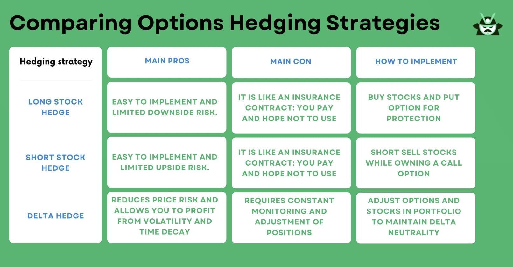

## Table of Contents

## What are puts and calls in options trading?

In options trading, a put is a contract that gives the buyer the right, but not the obligation, to sell a specific amount of an underlying asset at a set price within a certain time. Think of it like an insurance policy for your stocks. If you own a stock and you're worried its price might drop, you can buy a put option to sell it at a higher price than the market might fall to. If the stock price does drop, you can use the put option to sell at the higher price, limiting your losses.

A call, on the other hand, is a contract that gives the buyer the right, but not the obligation, to buy a specific amount of an underlying asset at a set price within a certain time. It's like reserving the right to buy something at today's price, hoping that the price will go up in the future. If you think a stock's price will rise, you can buy a call option to purchase it at a lower price than what it might be in the future. If the stock price does go up, you can buy it at the lower price and then sell it at the higher market price, making a profit.

## How do puts and calls work as hedging instruments?

Puts and calls can be used as hedging instruments to protect against potential losses in your investments. Imagine you own a stock and you're worried its price might go down. You can buy a put option, which gives you the right to sell your stock at a certain price, even if the market price drops below that. This way, if the stock price does fall, you can still sell it at the higher price you set with the put option, limiting your loss. It's like having insurance for your stock.

On the other hand, if you're worried about missing out on potential gains because you're holding cash instead of stocks, you can use a call option. A call option gives you the right to buy a stock at a set price, even if the market price goes up. If you think a stock's price will rise, you can buy a call option now and later buy the stock at the lower price you set, even if the market price is higher. This way, you can still benefit from the stock's price increase without having to buy the stock right away. It's like reserving the right to buy at today's price, hoping for a better price tomorrow.

## What are the basic strategies for using puts to hedge a stock portfolio?

Using puts to hedge a stock portfolio is like buying insurance for your stocks. If you own stocks and you're worried their prices might go down, you can buy put options. A put option gives you the right to sell your stocks at a certain price, even if the market price drops below that. So, if the stock price does fall, you can use the put option to sell at the higher price you set, which helps limit your losses. It's a way to protect your portfolio from big drops in the stock market.

One simple strategy is to buy put options for the same number of shares you own in a stock. For example, if you own 100 shares of a company, you can buy one put option contract (which usually covers 100 shares) with a strike price that you think is a good safety net. If the stock price stays the same or goes up, you only lose the cost of the put option, which is like the premium you pay for insurance. But if the stock price drops below the strike price, you can use the put option to sell your shares at the higher strike price, reducing your losses.

Another strategy is to use put options to hedge a whole portfolio, not just one stock. You can buy put options on a stock index, like the S&P 500, if your portfolio is diversified across many stocks. This way, if the overall market goes down, the value of your put options will go up, helping to offset the losses in your portfolio. It's like having a safety net for your entire investment, not just individual stocks.

## What are the basic strategies for using calls to hedge a stock portfolio?

Using calls to hedge a stock portfolio is a bit different from using puts. If you have a lot of cash and you're worried about missing out on potential gains because you're not invested in stocks, you can buy call options. A call option gives you the right to buy a stock at a set price, even if the market price goes up. So, if you think a stock's price will rise, you can buy a call option now and later buy the stock at the lower price you set, even if the market price is higher. This way, you can still benefit from the stock's price increase without having to buy the stock right away.

One basic strategy is to buy call options on stocks you're interested in but not ready to invest in fully. For example, if you think a company's stock will go up but you don't want to buy the stock yet, you can buy a call option with a strike price that you think is a good deal. If the stock price stays the same or goes down, you only lose the cost of the call option, which is like the price you pay for the opportunity. But if the stock price goes up above the strike price, you can use the call option to buy the stock at the lower strike price and then sell it at the higher market price, making a profit.

Another strategy is to use call options to hedge against the risk of holding cash. If you're holding a lot of cash and you're worried about inflation or missing out on market gains, you can buy call options on a stock index, like the S&P 500. This way, if the overall market goes up, the value of your call options will go up too, helping you benefit from the market's rise without having to invest all your cash in stocks right away. It's like having a way to participate in the market's growth while still keeping your cash safe.

## How can an investor use a protective put strategy?

A protective put strategy is like buying insurance for your stocks. If you own a stock and you're worried its price might go down, you can buy a put option. A put option gives you the right to sell your stock at a certain price, even if the market price drops below that. So, if the stock price does fall, you can use the put option to sell at the higher price you set, which helps limit your losses. It's a way to protect your investment from big drops in the stock market.

For example, let's say you own 100 shares of a company, and you're worried the stock price might drop. You can buy one put option contract (which usually covers 100 shares) with a strike price that you think is a good safety net. If the stock price stays the same or goes up, you only lose the cost of the put option, which is like the premium you pay for insurance. But if the stock price drops below the strike price, you can use the put option to sell your shares at the higher strike price, reducing your losses. This strategy can help you sleep better at night knowing your investment is protected.

## What is a covered call strategy and how does it help in hedging?

A covered call strategy is when you own a stock and then sell a call option on that stock. It's like renting out your stock to someone else for a little while. When you sell a call option, you get paid a fee, called a premium, right away. The person who buys the call option gets the right to buy your stock at a set price, called the strike price, before the option expires. If the stock price stays below the strike price, the option will expire worthless, and you keep the premium as extra income. But if the stock price goes above the strike price, the buyer can use the call option to buy your stock at the lower price, and you have to sell it to them.

This strategy can help you in two ways. First, it can give you extra income from the premium you get when you sell the call option. This can be helpful if you think the stock price won't go up much or will stay the same. Second, it can help limit your losses if the stock price drops. The premium you receive can help offset some of the loss in the stock's value. But remember, if the stock price goes up a lot, you might miss out on some of the gains because you have to sell your stock at the lower strike price if the buyer decides to use the call option. So, it's a trade-off between getting extra income and possibly missing out on big gains.

## How do collar strategies combine puts and calls for risk management?

A collar strategy is like putting a safety belt around your stock investment. You own a stock, and to protect it, you buy a put option. The put option gives you the right to sell your stock at a certain price, even if the market price drops. This helps limit your losses if the stock price goes down. At the same time, you sell a call option on the same stock. The call option gives someone else the right to buy your stock at a set price. You get paid for selling the call option, which can help cover the cost of the put option. If the stock price goes up a lot, you might have to sell your stock at the lower price set by the call option, but you still get to keep the money from selling the call option.

This strategy is a way to manage risk without spending a lot of money. By buying a put option, you're protecting your stock from big drops in price. By selling a call option, you're getting some extra money that can help pay for the put option. It's like having a safety net below and a cap above your stock price. The downside is that if the stock price goes up a lot, you might miss out on some of the gains because you have to sell at the lower price set by the call option. But if you're okay with that trade-off, a collar strategy can help you sleep better at night knowing your investment is more secure.

## What are the tax implications of using puts and calls for hedging?

When you use puts and calls for hedging, you need to think about taxes. If you buy a put option to protect your stock and you use it to sell your stock at a higher price than the market, you might have to pay capital gains tax on the profit you make from selling the stock. The tax rate depends on how long you held the stock. If you held it for more than a year, it's a long-term capital gain, which usually has a lower tax rate. If you held it for less than a year, it's a short-term capital gain, which is taxed at your regular income tax rate. Also, if you let the put option expire without using it, the money you spent on the put option is a loss, and you can use that loss to reduce your taxes.

Selling a call option as part of a covered call strategy also has tax implications. The money you get from selling the call option is usually considered ordinary income and is taxed at your regular income tax rate. If the call option is exercised and you have to sell your stock, you'll also have to pay capital gains tax on any profit from selling the stock. Like with the put option, the tax rate depends on how long you held the stock. If the call option expires without being used, you keep the money you got from selling it, and that's taxed as ordinary income. It's a good idea to talk to a tax professional to understand all the tax rules and how they apply to your specific situation.

## How can advanced investors use put-call parity for hedging?

Put-call parity is a fancy way of saying that the price of a call option and a put option, when combined with the stock, should balance out. Advanced investors can use this idea to make sure their hedging strategies are working right. For example, if you own a stock and you buy a put option to protect it, you can also sell a call option on the same stock. If everything is set up correctly according to put-call parity, the money you spend on the put option should be about the same as the money you get from selling the call option. This helps you hedge without spending a lot of extra money.

If the prices don't match up like they should, you might find a chance to make a profit. Let's say the call option is too expensive compared to the put option and the stock. You could buy the put option, buy the stock, and sell the call option. If everything goes according to put-call parity, you should make a little bit of money from the difference in prices. But remember, this is tricky stuff, and you need to be careful. It's a good idea to talk to someone who knows a lot about options trading before you try something like this.

## What are the risks associated with using puts and calls for hedging?

Using puts and calls for hedging can help protect your investments, but it also comes with risks. One big risk is that you might lose the money you spent on the options. If you buy a put option to protect your stock and the stock price stays the same or goes up, the put option will expire worthless, and you'll lose the money you paid for it. The same thing can happen if you buy a call option and the stock price doesn't go up enough. You have to be okay with losing the money you spend on the options if things don't go the way you expect.

Another risk is that using options can limit your potential gains. If you sell a call option as part of a covered call strategy, you might have to sell your stock at a lower price than the market if the stock price goes up a lot. This means you could miss out on some of the profit you could have made if you had just held onto the stock. Also, options can be complicated, and if you don't understand them well, you might make mistakes that cost you money. It's important to learn as much as you can about options and maybe talk to a financial advisor before you start using them to hedge your investments.

## How can an investor adjust their hedging strategy using puts and calls in response to market volatility?

When the stock market gets bumpy, investors can use puts and calls to adjust their hedging strategy. If the market is going up and down a lot, you might want to buy more put options to protect your stocks. A put option gives you the right to sell your stock at a certain price, even if the market price drops. So, if you think the market might go down a lot, buying more put options can help you limit your losses. You can choose put options with different expiration dates and strike prices to match how much you think the market might drop.

On the other hand, if you think the market might go up a lot, you could sell more call options. Selling a call option means you get paid a fee right away, but you might have to sell your stock at a set price if it goes up. This can help you make some extra money while the market is volatile. But remember, if the market goes up a lot, you might miss out on some of the gains because you have to sell at the lower price you set with the call option. It's all about finding the right balance between protecting your investments and taking advantage of market opportunities.

## What are some advanced techniques for optimizing a hedging strategy with puts and calls?

One advanced technique for optimizing a hedging strategy with puts and calls is called delta hedging. Delta is a number that tells you how much the price of an option will change when the price of the stock changes. If you own a stock and you buy a put option to protect it, you can use delta to figure out how many put options you need to buy to balance out the risk. If the delta of the put option is 0.5, it means the option's price will move half as much as the stock's price. So, you might need to buy two put options for every 100 shares of stock to fully hedge your position. This way, you can adjust your hedging strategy as the stock price moves, making sure you're always protected.

Another technique is to use a dynamic hedging strategy. This means you keep changing your hedging plan as the market changes. If the market starts to go down, you might buy more put options to protect your stocks. If the market goes up, you might sell some of your put options or even sell call options to make some extra money. This way, you can take advantage of market movements and keep your investments safe at the same time. It's like always having the right amount of insurance, no matter what the market does. But remember, this can be tricky and takes a lot of watching and adjusting, so it's not for everyone.

## References & Further Reading

[1]: Hull, J. C. (2017). ["Options, Futures, and Other Derivatives"](https://www.semanticscholar.org/paper/Options%2C-Futures%2C-and-Other-Derivatives-Hull/89bdee500c8623864fc9eb7a471546aa713acc44) (9th Edition). Pearson.

[2]: Black, F., & Scholes, M. (1973). ["The Pricing of Options and Corporate Liabilities."](https://www.cs.princeton.edu/courses/archive/fall09/cos323/papers/black_scholes73.pdf) The Journal of Political Economy, 81(3), 637-654.

[3]: Chan, E. (2009). ["Quantitative Trading: How to Build Your Own Algorithmic Trading Business"](https://github.com/ftvision/quant_trading_echan_book). Wiley.

[4]: Narang, R. K. (2013). ["Inside the Black Box: The Simple Truth About Quantitative Trading"](https://www.amazon.com/Inside-Black-Box-Quantitative-Trading/dp/0470432063). Wiley.

[5]: Lopez de Prado, M. (2018). ["Advances in Financial Machine Learning"](https://www.amazon.com/Advances-Financial-Machine-Learning-Marcos/dp/1119482089). Wiley.

[6]: Jansen, S. (2020). ["Machine Learning for Algorithmic Trading: Second Edition"](https://www.amazon.com/Machine-Learning-Algorithmic-Trading-alternative/dp/1839217715). Packt Publishing.

[7]: Glasserman, P. (2004). ["Monte Carlo Methods in Financial Engineering"](https://link.springer.com/book/10.1007/978-0-387-21617-1). Springer.