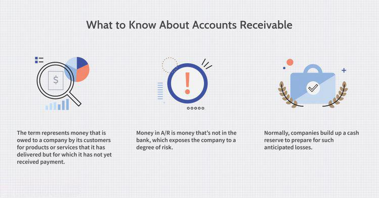

## Table of Contents

## What are accounts receivable and why are they important on a balance sheet?

Accounts receivable are amounts of money that customers owe a company for goods or services they have received but not yet paid for. Imagine you run a small store and you sell products to people on credit. Those amounts that people promise to pay you later are your accounts receivable. They are listed as an asset on the balance sheet because they represent money that the company expects to receive in the future.

Accounts receivable are important on a balance sheet because they show how much money the company is expecting to collect. This helps people understand the financial health of the company. If a company has a lot of accounts receivable, it might mean they are doing well and selling a lot of products. However, if those amounts are not collected quickly, it could also mean the company might have trouble getting the money it is owed, which could be a problem. So, accounts receivable give important information about both the company's sales and its ability to manage credit and collect payments.

## How do investors identify accounts receivable on a company's balance sheet?

Investors can find accounts receivable on a company's balance sheet by looking at the section labeled "Current Assets." The balance sheet lists all the things a company owns and owes, and it's divided into sections. Accounts receivable will be listed under current assets because it's money the company expects to receive within a year.

Once investors spot the current assets section, they should look for the line item specifically labeled "Accounts Receivable" or sometimes just "Receivables." This line will show the total amount of money that customers owe the company at that moment. By checking this number, investors can get a sense of how much money the company is expecting to collect soon, which helps them understand the company's financial situation better.

## What is the difference between accounts receivable and other current assets?

Accounts receivable are amounts of money that customers owe a company for goods or services they've bought but haven't paid for yet. They are listed under current assets on a balance sheet because the company expects to get this money within a year. Think of it like a store selling items on credit; the money people promise to pay later is the store's accounts receivable.

Other current assets include different types of short-term assets that a company owns, which it expects to turn into cash or use up within a year. These can be things like prepaid expenses, where a company pays for something in advance, like insurance, or short-term investments, like stocks or bonds that can be sold quickly. Unlike accounts receivable, these other current assets don't come from selling goods or services on credit, but they still help the company in the short term.

So, while accounts receivable focus on money owed by customers, other current assets cover a broader range of short-term financial resources that help the company operate smoothly. Both are important for understanding a company's short-term financial health, but they represent different kinds of assets.

## How can investors assess the quality of accounts receivable?

Investors can assess the quality of accounts receivable by looking at something called the accounts receivable turnover ratio. This ratio shows how quickly a company collects the money that customers owe them. To find this ratio, you divide the total sales by the average accounts receivable. A high turnover ratio means the company is good at collecting money quickly, which is a good sign. A low turnover ratio might mean the company is having trouble getting paid, which could be a problem.

Another way to check the quality of accounts receivable is by looking at the aging schedule. This schedule shows how long the money has been owed to the company. If most of the money is owed for a short time, that's good because it means the company should get paid soon. But if a lot of money has been owed for a long time, it might mean customers are having trouble paying, which is not good. By looking at these two things, investors can get a better idea of whether the company's accounts receivable are strong or if there might be issues with collecting the money they are owed.

## What are common metrics used to analyze accounts receivable, such as days sales outstanding (DSO)?

One common metric to analyze accounts receivable is the Days Sales Outstanding (DSO). DSO tells you how many days, on average, it takes for a company to get paid after a sale. You can find the DSO by taking the accounts receivable and dividing it by the total sales, then multiplying by the number of days in the period you're looking at, usually a year or a quarter. A lower DSO is better because it means the company is collecting money from customers quickly. A high DSO might mean the company is having trouble getting paid, which could be a problem.

Another useful metric is the Accounts Receivable Turnover Ratio. This ratio shows how many times a company collects its average accounts receivable during a period, like a year. You calculate it by dividing the total sales by the average accounts receivable. A higher turnover ratio is good because it means the company is efficient at collecting money. If the ratio is low, it might mean the company is not good at getting paid on time, which could be a sign of financial trouble.

Both DSO and the Accounts Receivable Turnover Ratio help investors understand how well a company manages its credit and collects payments. By looking at these metrics, investors can see if the company's accounts receivable are of good quality or if there might be issues with customers paying on time.

## How does the allowance for doubtful accounts affect the analysis of accounts receivable?

The allowance for doubtful accounts is money a company sets aside because it thinks some customers might not pay what they owe. This allowance is important because it shows a more realistic picture of how much money the company will actually get from its accounts receivable. When you look at the balance sheet, you'll see the total accounts receivable, but then you subtract the allowance for doubtful accounts to find out the net realizable value. This net amount is what the company really expects to collect.

Using the allowance for doubtful accounts affects how investors analyze accounts receivable because it gives a clearer idea of the company's financial health. If the allowance is large, it might mean the company is worried about a lot of customers not paying. This could make the accounts receivable seem less valuable. By looking at the allowance, investors can better judge if the company is being realistic about what it will collect and if there are any risks with the money customers owe.

## What impact do changes in accounts receivable have on a company's cash flow?

Changes in accounts receivable can have a big impact on a company's cash flow. If accounts receivable go up, it means more customers are buying things on credit and not paying right away. This can make the company's cash flow go down because the money is not coming in as fast as it could be. The company has to wait to get paid, so it might not have enough cash to pay its own bills or invest in new things.

On the other hand, if accounts receivable go down, it means the company is collecting money from customers more quickly. This can help the company's cash flow because more money is coming in. When the company gets paid faster, it has more cash on hand to use for things like paying employees, buying supplies, or growing the business. So, managing accounts receivable well is really important for keeping good cash flow.

## How can investors use accounts receivable turnover to evaluate a company's efficiency?

Investors can use the accounts receivable turnover ratio to see how well a company is at collecting money from customers. This ratio is found by dividing the total sales by the average accounts receivable. If the ratio is high, it means the company is good at getting paid quickly, which is a sign that the company is efficient. A high turnover shows that the company does not have a lot of money tied up in accounts receivable, which is good for the company's cash flow and overall financial health.

If the accounts receivable turnover ratio is low, it might mean the company is not so good at collecting money on time. This can be a problem because it means the company's cash is stuck with customers who haven't paid yet. A low ratio could signal that the company needs to work on its credit policies or collection processes to improve its cash flow. By looking at this ratio, investors can get a sense of how efficiently the company manages its money and whether it might face cash flow issues in the future.

## What are the potential risks associated with high levels of accounts receivable?

High levels of accounts receivable can be risky for a company. When a lot of money is owed by customers, it means the company might not have enough cash on hand to pay its own bills or invest in new projects. If customers take a long time to pay, or if they don't pay at all, the company's cash flow can suffer. This can make it hard for the company to keep running smoothly and could even lead to financial trouble if the situation doesn't improve.

Another risk is that high accounts receivable might mean the company is too lenient with its credit policies. If the company lets too many customers buy things on credit without checking if they can pay, it might end up with a lot of money that it can't collect. This can hurt the company's financial health and make it look less attractive to investors. So, while having some accounts receivable is normal, having too much can be a sign of bigger problems that need to be fixed.

## How do industry standards and benchmarks influence the analysis of accounts receivable?

Industry standards and benchmarks help investors understand how well a company is doing with its accounts receivable compared to others in the same field. For example, if a company's accounts receivable turnover ratio is lower than the industry average, it might mean the company is not as good at collecting money from customers as its competitors. This can be a warning sign that the company needs to improve its credit and collection policies. By looking at these benchmarks, investors can see if a company is doing better or worse than expected, which helps them make smarter decisions about whether to invest.

On the other hand, if a company's accounts receivable performance is better than the industry standard, it can be a good sign. It might mean the company has strong credit policies and is good at getting paid on time, which is great for its cash flow and overall financial health. Investors use these industry standards as a guide to see if a company's accounts receivable are managed well or if there might be problems that need to be fixed. This comparison helps investors get a clearer picture of the company's performance and potential risks.

## What advanced techniques can investors use to forecast future accounts receivable trends?

Investors can use something called regression analysis to predict future trends in accounts receivable. This technique looks at past data, like sales and how quickly money was collected before, to make guesses about what might happen next. By studying patterns in this data, investors can figure out if accounts receivable might go up or down in the future. This helps them understand if the company will have more or less money coming in, which is important for deciding if the company is a good investment.

Another useful method is to look at seasonal trends. Some businesses have times of the year when they sell more and get paid more, like during holidays. By looking at these patterns, investors can predict how accounts receivable might change throughout the year. This helps them see if the company might have cash flow problems during slow times or if it will have plenty of money coming in during busy seasons. Using these advanced techniques, investors can make better guesses about the future and make smarter investment choices.

## How do different accounting policies and practices affect the comparability of accounts receivable across companies?

Different accounting policies and practices can make it hard to compare accounts receivable across companies. For example, one company might use a very strict method to decide how much money it thinks customers won't pay, called the allowance for doubtful accounts. Another company might use a more relaxed method. This means the numbers they report for accounts receivable can look very different, even if they're in the same business. Investors need to know about these differences to understand what the numbers really mean.

Another way accounting policies can affect comparability is how companies recognize revenue. Some companies might count a sale as soon as they send out a product, while others might wait until they get paid. This can change how much money shows up in accounts receivable. If one company reports higher accounts receivable because it counts sales earlier, it might seem like it's doing better than a company that waits to count sales until it gets paid. By understanding these differences, investors can make fairer comparisons between companies and get a clearer picture of their financial health.

## What is the importance of accounts receivable in balance sheets?

Accounts receivable (AR) are a critical component of balance sheets, offering insights into a company's future cash inflows and financial practices. They illustrate the amount of money owed to a company by its customers for goods or services delivered on credit. High levels of accounts receivable on a balance sheet often signal potential future cash inflows, as these receivables are expected to be converted into cash once collected. However, excessive AR must be consistently monitored to ensure they do not indicate potential [liquidity](/wiki/liquidity-risk-premium) issues due to delayed payments or poor credit management.

Investors should pay particular attention to the levels of AR relative to cash. A high AR with low cash reserves may suggest that a company is overly reliant on credit sales and may face cash flow problems if collection periods extend. By analyzing this ratio, potential and existing investors can discern a company's financial health and operational efficiency.

The receivables turnover ratio is a crucial metric used to measure how efficiently a company manages its credit sales. It is calculated as follows:

$$
\text{Receivables Turnover Ratio} = \frac{\text{Net Credit Sales}}{\text{Average Accounts Receivable}}
$$

A high turnover ratio typically indicates a company is effective in collecting its receivables and thus managing its credit efficiently. Conversely, a low ratio may suggest issues in credit policies or collection processes. This ratio can be an essential indicator for assessing the operational efficiency of a company, as it sheds light on how quickly a company can convert its receivables into cash, thereby directly influencing its liquidity and overall financial stability.

Understanding the importance of accounts receivable on a balance sheet enables investors and analysts to make more informed assessments of a company's short-term financial health and its ability to manage cash flows effectively. This understanding is vital for evaluating both potential risks and opportunities in investment contexts.

## How do algorithmic trading and balance sheets relate to each other?

Algorithmic trading utilizes sophisticated computer algorithms to execute trades at a speed and frequency beyond the capability of human traders. These algorithms rely heavily on data-driven strategies, where a balance sheet serves as a crucial resource. The balance sheet provides comprehensive raw data, which is essential for [backtesting](/wiki/backtesting) various trading strategies and ensuring their efficacy before deployment in live markets.

One of the vital components of this data is accounts receivable (AR), a significant indicator of a company's expected cash flow. When designing trading algorithms, AR figures are analyzed to evaluate a company's credit policies and its efficiency in collecting debts. High levels of accounts receivable could suggest a potential for future cash inflows, while also indicating risks associated with delayed payments.

In developing trading models, financial ratios derived from balance sheet data, such as the current ratio, offer insights into a company’s liquidity. These ratios measure a company's ability to cover its short-term obligations with its short-term assets, providing essential data for algorithmic strategies. Other crucial ratios include the receivables turnover ratio, which measures how effectively a company collects its receivables. This ratio can be expressed as:

$$
\text{Receivables Turnover Ratio} = \frac{\text{Net Credit Sales}}{\text{Average Accounts Receivable}}
$$

This formula helps identify how often a company converts its receivables into cash during a period. A high turnover ratio can be interpreted as an efficient collection process, offering a more stable financial footing and potentially enhancing the accuracy of [algorithmic trading](/wiki/algorithmic-trading) models. 

Python can be used to implement these analyses effectively. For example, a snippet to calculate the receivables turnover ratio might look like this:

```python
def calculate_receivables_turnover(net_credit_sales, average_accounts_receivable):
    return net_credit_sales / average_accounts_receivable

net_credit_sales = 500000  # Example value
average_accounts_receivable = 100000  # Example value

turnover_ratio = calculate_receivables_turnover(net_credit_sales, average_accounts_receivable)
print(f"Receivables Turnover Ratio: {turnover_ratio:.2f}")
```

By incorporating these data points into algorithmic models, traders can more accurately predict market trends and adjust strategies in real time. This integration of financial data with technology provides a nuanced approach to trading, potentially yielding superior investment outcomes.

## How can accounts receivable data be incorporated into trading algorithms?

Traders leverage accounts receivable (AR) data to gain insights into a company's liquidity and overall financial health. This data serves as a pivotal component in developing trading algorithms that are both sophisticated and predictive. By examining AR, traders can assess how efficiently a company is converting credit sales into cash, which directly impacts liquidity measures.

One crucial metric derived from balance sheet data is the current ratio, calculated as:

$$
\text{Current Ratio} = \frac{\text{Current Assets}}{\text{Current Liabilities}}
$$

Accounts receivable forms a significant portion of current assets. A high current ratio, driven by substantial accounts receivable, may indicate better liquidity but necessitates further analysis to ensure these assets are not at risk of becoming uncollectible.

Trading algorithms integrate AR data to adapt to observed trends over time, thereby refining their predictive capabilities. Such algorithms can process vast datasets, predicting future financial scenarios by evaluating AR collection patterns, historical growth, and seasonality. For instance, a Python-based algorithm might continually update predictions as new AR figures become available:

```python
import pandas as pd
from sklearn.linear_model import LinearRegression

# Pseudo code for updating AR trends
ar_data = pd.read_csv('ar_data.csv')
x = ar_data[['time']].values
y = ar_data['accounts_receivable'].values

model = LinearRegression()
model.fit(x, y)

# Predict future AR values
future_times = [[t] for t in range(len(x), len(x)+12)]
future_ar_predictions = model.predict(future_times)
```

Incorporating AR data allows algorithms to reconceptualize market risk profiles based on the liquidity evidenced through accounts receivable. This dynamic application enhances trading strategies by aligning them with an evolving financial landscape, providing traders with a competitive edge in swiftly adapting to market changes. Such integration offers a nuanced vista into not just the financial health of a company, but also the broader financial trends impacting trading decisions.

## How can analyzing balance sheets inform investment strategies?

Conducting a comprehensive analysis of balance sheet items, particularly accounts receivable (AR) and related financial metrics, is integral to developing sound investment strategies. Accounts receivable is a pivotal component of the balance sheet and significantly impacts a company's financial health and future cash flows, making it a crucial element for investors to evaluate.

### Accounts Receivable's Impact on Cash Flow, Liquidity, and Credit Terms

1. **Cash Flow**: Accounts receivable directly influence a company's cash flow. When a company sells goods or services on credit, it records the transaction as an accounts receivable entry, awaiting cash inflow. Timely collection of AR ensures steady cash inflow, crucial for meeting ongoing operational expenses and investments. Delays in AR collection can strain liquidity, causing cash flow issues.

2. **Liquidity**: The efficiency of AR management affects a company’s liquidity, which is the firm's ability to cover short-term obligations. The current ratio and quick ratio are important liquidity metrics derived from balance sheet data:
$$
   \text{Current Ratio} = \frac{\text{Current Assets}}{\text{Current Liabilities}}

$$
$$
   \text{Quick Ratio} = \frac{\text{Cash + Marketable Securities + Accounts Receivable}}{\text{Current Liabilities}}

$$
   High accounts receivable figures might initially suggest potential future cash inflows. However, if these debts remain uncollected for extended periods, the company’s liquidity could be compromised, indicating poor credit management.

3. **Credit Terms**: Evaluating AR in the context of credit terms offered by the company provides insight into its credit policy and customer relations. An overly lenient credit policy may inflate AR but could also expose the company to a higher risk of bad debts. Investors should analyze the receivables turnover ratio, which measures how effectively a company converts its accounts receivables into cash:
$$
   \text{Receivables Turnover Ratio} = \frac{\text{Net Credit Sales}}{\text{Average Accounts Receivable}}

$$
   A higher ratio indicates efficient credit management and faster collections.

### Predicting Market Trends and Making Informed Investments

Balance sheet analysis, focusing on AR and related metrics, supports the prediction of market trends and enables prudent investment decisions. By examining trends in AR along with financial ratios, investors can infer the economic health of a company and its potential for future growth.

1. **Historical Data Analysis**: Analyzing historical AR data provides trends about a company's sales pattern and credit policy effectiveness. Consistent year-on-year growth in AR, coupled with strong receivables turnover, might suggest increasing market demand and efficient credit operations.

2. **Economic Indicators**: AR levels can signal wider economic conditions. Rising AR may imply that customers are extending payment durations due to financial constraints, potentially warning of economic slowdown. Conversely, decreasing AR might indicate improving customer liquidity and economic conditions.

3. **Investment Decision Framework**: The synthesis of AR data with other balance sheet components guides informed investment decisions. Investors should combine AR analysis with broader financial metrics—such as debt to equity ratio, return on equity, and profit margins—to assess the overall financial health and strategic positioning of a company.

Investors employing systematic balance sheet analysis, particularly focusing on accounts receivable and their interaction with cash flow and liquidity, can make data-driven decisions, enhancing the potential for investment success.

## References & Further Reading

[1]: ["Financial Statement Analysis and Security Valuation"](https://www.amazon.com/Financial-Statement-Analysis-Security-Valuation/dp/0073379662) by Stephen Penman

[2]: ["Financial Accounting: Understanding and Analysis"](https://openstax.org/books/principles-financial-accounting/pages/a-financial-statement-analysis) by Stephen Cooney

[3]: ["Algorithmic Trading: Winning Strategies and Their Rationale"](https://books.google.com/books/about/Algorithmic_Trading.html?id=WAlFDwAAQBAJ) by Ernest P. Chan

[4]: ["Intermediate Accounting"](https://www.amazon.com/Intermediate-Accounting-Donald-Kieso/dp/1118147294) by Donald E. Kieso, Jerry J. Weygandt, and Terry D. Warfield

[5]: ["Algorithmic and High-Frequency Trading"](https://www.amazon.com/Algorithmic-High-Frequency-Trading-Mathematics-Finance/dp/1107091144) by Álvaro Cartea, Sebastian Jaimungal, and José Penalva