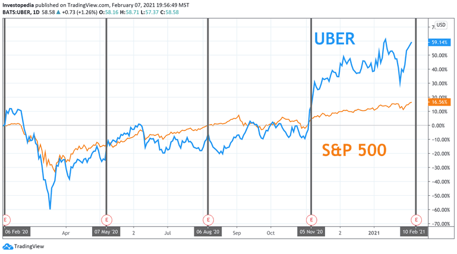

The ride-sharing industry has experienced remarkable growth in recent years, with companies like Uber and Lyft at the forefront of this transformation. The rise of these platforms has revolutionized urban mobility, offering convenient and efficient transportation solutions to millions around the globe. Central to their success is the substantial funding both companies have obtained from eminent investors, which has been instrumental in driving their expansion and technological progress.

Uber and Lyft have benefited from the financial backing of high-profile investors, enabling them to penetrate new markets, enhance their technological infrastructure, and continuously innovate their service offerings. This has given them a competitive edge in an increasingly crowded marketplace, helping to solidify their positions as leaders in the ride-sharing arena.

This article will focus on the dynamics of Uber and Lyft's funding strategies and the participation of their investors. A key area of interest is the role of algorithmic trading in these financial interactions, as this modern technique allows investors to analyze vast amounts of market data and make rapid investment decisions. These elements together shape the financial maneuvers of both companies.

To comprehend how Uber and Lyft aim to maintain and extend their market dominance, it is essential to explore their trajectory from past to present, and what the future holds. This analysis will consider the current competitive landscape, the impact of technological advancements, and the implications of evolving market conditions. Through this exploration, we aim to provide insights into the ongoing efforts of these ride-sharing giants as they navigate the challenges and opportunities inherent in the rapidly changing transportation industry.

## Table of Contents

## The Role of Investors in Lyft and Uber's Growth

Venture capitalists and other prominent investors have been instrumental in shaping the growth trajectories of Uber and Lyft. These companies have attracted substantial investments from high-profile figures and firms, reflecting the ride-sharing sector's importance in the tech industry.

Carl Icahn, a renowned activist investor, made a significant investment in Lyft, contributing $100 million as part of a $150 million funding round in 2015. Icahn's investment was primarily motivated by the potential for high returns in the burgeoning ride-sharing market, which was beginning to disrupt traditional transportation models. His involvement was seen as a strategic move to capitalize on Lyft's growth potential and to gain influence in a competitive market landscape.

Marc Andreessen, through the venture capital firm Andreessen Horowitz, has also been a crucial investor in Uber. Andreessen Horowitz's early investment in Uber was part of a broader strategy to support transformative technology companies that have the potential to redefine industries. By backing Uber, Andreessen aimed to leverage Uber's innovative business model and expansive growth strategy, anticipating substantial returns as the company expanded globally.

Google Ventures, now known as GV, invested in Uber at a critical stage of its expansion. The $258 million investment in 2013 was one of the largest in GV's history and underscored Google's belief in Uber's ability to lead the burgeoning ride-sharing market. This investment also aligned with Google's broader strategy to integrate its technologies with emerging transportation services.

The involvement of major Silicon Valley venture capital firms has highlighted the strategic significance of the ride-sharing market. These firms, with their substantial financial resources and expertise, aim to identify and support companies that can disrupt existing markets and create new ones. Their investments in Uber and Lyft are not just financial commitments but strategic efforts to dominate a rapidly evolving industry.

Understanding the motivations behind these investments provides insights into the potential return on investment that these backers foresee. For investors like Icahn, Andreessen, and GV, the expectation is that their financial involvement will lead to significant gains as Uber and Lyft continue to innovate and expand their services. These investors are betting on the ride-sharing companies' abilities to maintain and grow their market share in an increasingly competitive and dynamic environment.

## Algorithmic Trading and its Impact

Algorithmic trading has become a significant force in shaping investment strategies, particularly within tech-driven sectors like ride-sharing. This method leverages complex algorithms to process vast amounts of financial data rapidly, enabling investors to make real-time decisions regarding stock acquisitions and sales. This capability is particularly relevant to companies like Uber and Lyft, which operate in a dynamic and fast-paced market environment.

The incorporation of [algorithmic trading](/wiki/algorithmic-trading) in investment strategies allows for precise market analysis, reducing human error and emotional biases that can impact trading decisions. Algorithms can sift through historical data, identify patterns, and predict future market trends with remarkable accuracy. For instance, they use techniques such as statistical [arbitrage](/wiki/arbitrage) where they exploit price differentials of stocks to generate profits. A simple form of this is pairs trading, where two historically correlated stocks are identified; if the correlation diverges, an algorithm might buy the underperforming stock while shorting the outperforming one, anticipating a convergence.

In the case of Uber and Lyft, algorithmic trading plays a critical role around significant financial events such as funding rounds and public offerings. During an IPO, for example, algorithms can be programmed to monitor market sentiment and trading volumes to make split-second decisions that align with the investor's strategy, whether it's capitalizing on opening price fluctuations or minimizing risks in a volatile market environment.

Algorithms assess multiple market parameters, such as moving averages, price movements, and market [volatility](/wiki/volatility-trading-strategies). For example, a moving average crossover strategy might trigger a buy signal if Uber's short-term moving average crosses above its long-term moving average, indicating a potential upward trend. Similarly, automated trading systems might employ technical indicators like the Relative Strength Index (RSI) to evaluate whether Lyft's stock is overbought or oversold in order to guide buy or sell decisions.

The influence of algorithmic trading extends beyond stock transactions, affecting broader investment decisions. By analyzing market conditions comprehensively, trading algorithms help investors identify the optimal timing for entry and [exit](/wiki/exit-strategy) points, optimize portfolio allocations, and manage risk more effectively. In a volatile sector like ride-sharing, these capabilities enhance an investor's ability to respond swiftly to market changes, thereby safeguarding investments and optimizing returns.

In summary, algorithmic trading has transformed stock performance dynamics for companies like Uber and Lyft, providing investors with powerful tools to navigate the complexities of highly competitive and rapidly evolving markets. As technology continues to advance, the role of these algorithms is likely to expand, further influencing investment strategies and financial outcomes in the ride-sharing industry.

## Funding Dynamics and Financial Performance

Uber and Lyft, two leading companies in the ride-sharing industry, have extensively relied on multiple rounds of funding to sustain their growth and competitive edge. Both firms have attracted substantial investment from global investors, underpinned by the anticipation of significant returns due to their innovative approaches to urban transportation. Despite these high levels of investment, both companies have reported noteworthy operating losses, a scenario not uncommon in the startup ecosystem where rapid scaling demands significant capital expenditure.

Uber, established in 2009, has engaged in numerous funding rounds, amassing over $25 billion from venture capital and private equity sources before its initial public offering (IPO) in 2019. Its financial trajectory has been marked by considerable growth in revenue but persistent challenges in achieving profitability. Uber's business model, which hinges on aggressive expansion into diverse markets including food delivery and freight, necessitates continuous investment. As a result, the company reported an operating loss of $4.9 billion in 2019, following its IPO.

Lyft, a slightly younger company founded in 2012, has similarly pursued a robust funding strategy, raising approximately $5 billion across various funding rounds prior to its IPO in 2019. Like Uber, Lyft has exhibited strong revenue growth, albeit with substantial operating losses. In 2019, Lyft reported an annual operating loss of $2.6 billion. This loss is reflective of its concentrated effort in establishing a significant foothold in the U.S. market, which constitutes the core of its operations.

The financial dynamics at play in both companies significantly influence their market valuation and investor confidence. While their operating losses have raised scrutiny, investors remain optimistic about their potential to eventually achieve profitable operational models. This optimism is largely fueled by the belief that the ride-sharing industry, although currently competitive and costly, holds substantial long-term growth potential.

In terms of market valuation, Uber's strategy of diversification across various service lines has provided a buffer against market volatility, allowing it to maintain a robust market capitalization. As of its IPO, Uber was valuated at approximately $82 billion. In contrast, Lyft, with a more focused operational strategy primarily within the United States, debuted its IPO with a valuation near $24 billion.

A comparison of their financial performances highlights distinct strategic approaches. Uber's global and expansive strategy offers benefits in terms of service diversification but poses challenges in consistent service quality and regional profitability. Lyft's strategy of concentrating on core markets in the U.S. emphasizes localized service improvement and operational optimization, which could pave a path to earlier profitability.

Both companies strive to balance growth demands with profitability objectives, a dynamic that continues to shape investor confidence. Their ongoing financial performances are closely monitored by stakeholders who assess these companies' capacity for innovation and adaptability within a rapidly evolving technological and regulatory landscape.

## Strategic Initiatives for Growth

Uber and Lyft are making significant strides in electric and autonomous vehicle technology to solidify their market positions and envision a sustainable future. These strategic investments serve dual purposes: environmental responsibility and market competitiveness.

Electric vehicles (EVs) are central to both companies' strategies. By transitioning to EVs, Uber and Lyft are responding to growing environmental concerns and regulatory pressures to reduce carbon emissions in urban transport. This shift not only aligns with global sustainability goals but also offers a potential reduction in operating costs over time, as EVs generally require less maintenance and have lower fuel expenses compared to traditional combustion engine vehicles.

Autonomous vehicles (AVs) represent another frontier. Both companies are investing substantially in AV research and development, aiming to innovate transportation solutions that could redefine the ride-sharing landscape. Autonomous technology promises to improve safety, efficiency, and availability of rides, possibly reducing labor costs associated with human drivers in the long run.

Partnerships are pivotal to Uber and Lyft's strategic initiatives. Uber, for instance, has engaged with BYD, a leading EV manufacturer, to accelerate its fleet electrification. Additionally, Uber's collaboration with Instacart illustrates the broader application of its logistics platform beyond passenger transport, indicating a diversification strategy. These alliances with tech firms and manufacturers enhance both companies' technological capabilities and broaden their service offerings.

In the long term, these strategies hold the potential for significant payoff. Successful deployment of electric and autonomous fleets could transform operational models, lower costs, and boost competitiveness against traditional transportation modes. The foresight in these investments safeguards against future regulatory challenges and aligns with consumer trends favoring sustainable practices. This proactive approach also represents a competitive edge in the burgeoning shared mobility market, where technological innovation increasingly governs market leadership.

## Regulatory and Market Challenges

Uber and Lyft, as leaders in the ride-sharing industry, face numerous regulatory challenges that affect their operations and potential for growth. Governmental policies significantly shape the ride-sharing landscape, influencing how these companies adapt their business strategies.

### Role of Regulatory Policies

One of the main issues Uber and Lyft encounter is the regulation of labor rights. Laws governing the classification of drivers as independent contractors or employees have a substantial impact on their business models. In California, Assembly Bill 5 (AB5) challenged the contractor model, requiring companies to provide benefits typically afforded to employees. Such regulations may increase operational costs, necessitating strategic shifts to maintain profitability.

Regulations around electric vehicles (EVs) also play a pivotal role. As both companies invest in greener technologies, they must navigate state and federal policies aimed at reducing carbon emissions. Incentives for EV adoption, subsidies, and emissions targets can either facilitate or hinder their strategic initiatives. Uber and Lyft may need to align their fleet upgrade strategies with these environmental policies to capitalize on potential benefits, such as tax breaks or access to clean energy funds.

### Market Conditions and Competition

The competitive landscape of ride-sharing adds an additional layer of complexity. Lyft and Uber must contend with an increasing number of competitors, including traditional taxi services upgrading their technology and new entrants offering unique value propositions. This competition drives the need for constant innovation and efficiency to attract and retain users.

Economic trends, such as fuel prices and urbanization rates, impact demand for ride-sharing services. Rising fuel costs may spur demand for shared rides or EVs, while high urbanization rates typically increase ride-sharing adoption. Conversely, economic downturns can reduce discretionary spending, leading to a decline in ride requests.

### Strategic Adaptation 

To thrive amidst these regulatory and market challenges, Uber and Lyft must implement adaptive strategies. This may involve diversifying service offerings, investing in technology to improve efficiency, or collaborating with regulators to shape favorable policies.

In summary, Uber and Lyft’s ability to navigate governmental regulations and leverage market conditions will be crucial to their ongoing success. Their strategic responses to these challenges will dictate their ability to sustain growth and maintain leadership in the evolving ride-sharing sector.

## Future Outlook

As Uber and Lyft continue to innovate, they are positioning themselves to adapt strategically to evolving consumer needs and technological advancements. Uber's growth plans are particularly ambitious, providing a robust foundation for sustained expansion. The company is exploring various initiatives, such as further integration of autonomous vehicle technology and diversifying service offerings, to maintain its competitive edge. By leveraging data analytics, Uber aims to optimize its operations and expand its market presence.

Lyft, on the other hand, is demonstrating promising prospects through its recent achievements and profitability strides. While the ride-sharing sector remains competitive, Lyft's focus on operational efficiency and customer satisfaction has allowed it to achieve milestones that signal stability and growth potential. Its commitment to sustainable practices, such as investing in electric vehicle options, reflects an alignment with both regulatory trends and consumer preferences.

Both Uber and Lyft are expected to navigate a landscape characterized by market shifts, regulatory changes, and technological disruptions. The ride-sharing industry is subject to regulatory frameworks that can affect operational strategies significantly. Moreover, technologies like electric and autonomous vehicles present both opportunities and challenges in terms of infrastructure, safety, and public acceptance.

In conclusion, as these companies continue to adapt and innovate, their success will rely on their ability to respond to external pressures and capitalize on technological trends. This future outlook emphasizes the need for strategic foresight and adaptability in the dynamic ride-sharing market.

## Conclusion

Uber and Lyft continue to lead the evolution of urban mobility through strategic financial and technological advancements. With substantial backing from prominent investors, both companies have been able to fund expansions, innovate new offerings, and improve services, maintaining their positions as pioneers in the ride-sharing industry. The adoption of algorithmic trading has been a vital tool, enabling investors to make faster and more informed decisions about their holdings in these companies. By analyzing vast datasets for real-time market insights, algorithmic trading has undoubtedly influenced the stock performance and investment inflows during significant financial undertakings by both companies.

However, the journey has not been without hurdles. Regulatory challenges remain significant, with ongoing adjustments required to comply with evolving government policies and labor laws. Both companies must also navigate competitive pressures and potential economic downturns, which can impact profitability and market share.

The future of Uber and Lyft hinges on their capacity for continuous innovation. Embracing advancements in electric and autonomous vehicles positions them at an advantageous corner of a rapidly transforming transportation landscape. Strategic partnerships, technological advances, and a sharp focus on sustainability could secure long-term growth and customer loyalty.

Investors and market analysts remain vigilant, observing how Uber and Lyft negotiate these challenges. Their capacity to adapt to dynamic market conditions and sustain growth strategies will be crucial in determining their trajectory and dominance in the coming years. Looking ahead, their ability to respond to technological and regulatory shifts will shape the future landscape of the ride-sharing industry, impacting urban mobility on a global scale.

## References & Further Reading

[1]: Stone, B. (2017). ["The Upstarts: How Uber, Airbnb, and the Killer Companies of the New Silicon Valley Are Changing the World."](https://www.amazon.com/Upstarts-Airbnb-Companies-Silicon-Changing/dp/0316388394) Little, Brown and Company.

[2]: ["Super Pumped: The Battle for Uber"](https://en.wikipedia.org/wiki/Super_Pumped_(TV_series)) by Mike Isaac

[3]: Lacy, S. (2015). ["A Kingdom of Their Own: How the Grab Generation Escaped HX-call and Upended the Ridesharing Wave."](https://quizlet.com/393189694/frankenstein-study-questions-ch-13-18-flash-cards/) Wiley.

[4]: Ritholtz, B., & Lopez de Prado, M. (2018). ["Advances in Financial Machine Learning."](https://books.google.com/books/about/Advances_in_Financial_Machine_Learning.html?id=oU9KDwAAQBAJ) Wiley.

[5]: ["Startup: A Silicon Valley Adventure"](https://www.amazon.com/Startup-Silicon-Valley-Adventure-Story/dp/0395711339) by Jerry Kaplan

[6]: Geradin, D. (2017). ["What Should Be the Relevant Market Be for Assessing Market Power in the Platform Economy?"](https://papers.ssrn.com/sol3/papers.cfm?abstract_id=2658603) SSRN Electronic Journal.