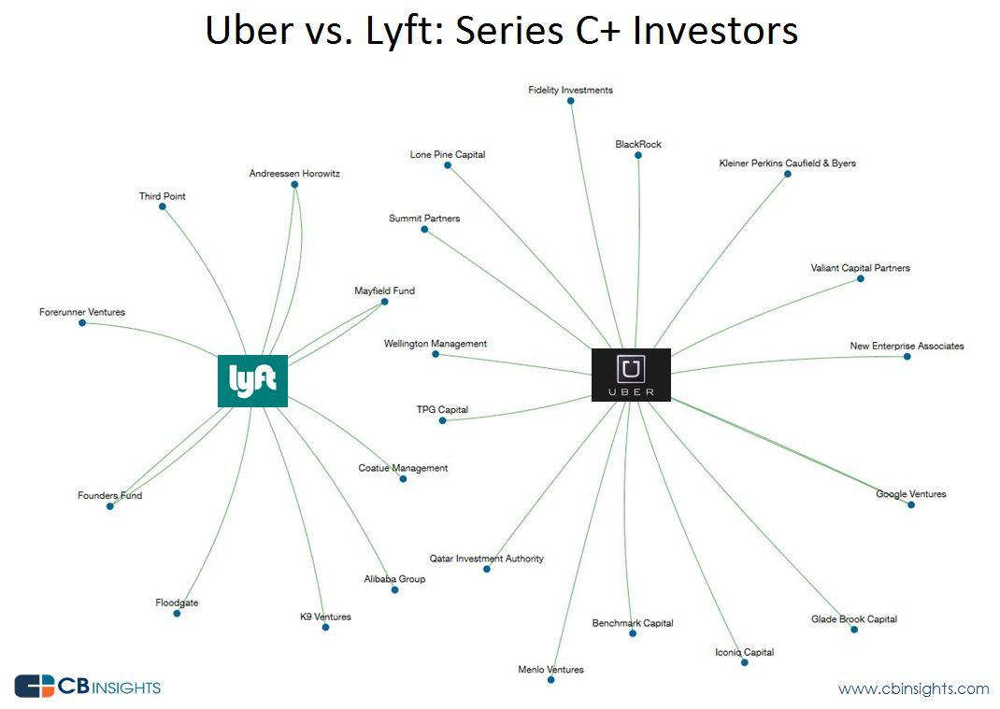

## Table of Contents

## What is Uber and what services do they provide?

Uber is a company that helps people get rides easily. They have an app on your phone that you can use to call a ride. When you want to go somewhere, you open the app, put in where you want to go, and a driver will come to pick you up. It's like calling a taxi, but it's usually faster and often cheaper.

Uber offers different types of services. They have UberX, which is their basic ride service. They also have UberPool, where you can share a ride with others going the same way, which can save you money. For bigger groups, there's UberXL, and if you want a fancier ride, you can choose Uber Black. They even have services for delivering food, called Uber Eats, so you can order food from restaurants and have it brought to your home.

## What is Lyft and how does it differ from Uber?

Lyft is another company that helps people get rides, just like Uber. You use an app on your phone to call a ride. When you need to go somewhere, you open the app, tell it where you want to go, and a driver will come to pick you up. It's very similar to Uber because it's also faster and often cheaper than a regular taxi.

The main difference between Lyft and Uber is that Lyft focuses more on being friendly and community-oriented. Lyft drivers often have a pink mustache on their car or a special sign, which makes them easy to spot. Lyft also has fewer types of services compared to Uber. They have Lyft, which is like UberX, and Lyft XL for bigger groups. They don't have as many luxury options as Uber, but they do have Lyft Lux for fancier rides. Both companies have services for delivering food, with Lyft's version called Lyft Pink.

In summary, while both Uber and Lyft provide similar ride services, Lyft tries to stand out by being more community-focused and having a friendlier vibe. Uber, on the other hand, offers more variety in its services, including more luxury options and different types of rides.

## Who were the initial investors in Uber?

When Uber first started, it needed money to grow. The first big investor was a man named Garrett Camp. He helped start Uber and put in some of his own money. Another early investor was Travis Kalanick, who later became the CEO of Uber. They also got money from a company called First Round Capital. This company gave Uber $1.25 million in 2010, which was a big help for the new company.

Later on, more investors came in to help Uber grow even bigger. In 2011, a company called Benchmark Capital invested $11 million. This money helped Uber expand to more cities. Another big investor was Google Ventures, which put in $258 million in 2013. All these early investments helped Uber become the big company it is today.

## Who were the initial investors in Lyft?

When Lyft started, it needed money to grow. The first big investor was a company called Floodgate. They gave Lyft $300,000 in 2008. This money helped Lyft get started. Another early investor was a man named Jeremy Stoppelman. He is the CEO of Yelp, and he also put in some money to help Lyft.

Later on, more investors came in to help Lyft grow bigger. In 2011, a company called Founders Fund invested $6 million. This money helped Lyft expand to more cities. Another big investor was Andreessen Horowitz, which put in $25 million in 2013. All these early investments helped Lyft become the big company it is today.

## How has the investment in Uber evolved over time?

When Uber started, it needed money to grow. The first big investor was Garrett Camp, who helped start Uber and put in some of his own money. Another early investor was Travis Kalanick, who later became the CEO of Uber. In 2010, a company called First Round Capital gave Uber $1.25 million. This was a big help for the new company and helped it get off the ground.

As Uber grew, more investors came in to help it expand. In 2011, Benchmark Capital invested $11 million, which helped Uber go into more cities. By 2013, Uber was getting a lot of attention, and Google Ventures put in $258 million. This big investment helped Uber become a global company. Over time, Uber kept getting more and more money from investors, which helped it grow into the big company it is today.

## How has the investment in Lyft evolved over time?

When Lyft started, it needed money to grow. The first big investor was a company called Floodgate, which gave Lyft $300,000 in 2008. This money helped Lyft get started. Another early investor was Jeremy Stoppelman, the CEO of Yelp, who also put in some money to help Lyft. These early investments were important because they helped Lyft begin its journey.

As Lyft grew, more investors came in to help it expand. In 2011, Founders Fund invested $6 million, which helped Lyft go into more cities. By 2013, Lyft was getting a lot of attention, and Andreessen Horowitz put in $25 million. This big investment helped Lyft become a bigger company. Over time, Lyft kept getting more money from investors, which helped it grow and compete with other ride-sharing companies like Uber.

## What are the major venture capital firms that have invested in Uber?

Uber got money from many big venture capital firms to help it grow. One of the first was First Round Capital. They gave Uber $1.25 million in 2010. This money helped Uber start and get bigger. Another important firm was Benchmark Capital. They invested $11 million in 2011. This helped Uber go into more cities and become more popular.

Later on, Google Ventures put in a lot of money. They gave Uber $258 million in 2013. This big investment helped Uber become a global company. Uber also got money from other big firms like Menlo Ventures and Lowercase Capital. All these investments helped Uber grow into the big company it is today.

## What are the major venture capital firms that have invested in Lyft?

Lyft got money from several big venture capital firms to help it grow. One of the first was Floodgate. They gave Lyft $300,000 in 2008. This money helped Lyft start and get bigger. Another important firm was Founders Fund. They invested $6 million in 2011. This helped Lyft go into more cities and become more popular.

Later on, Andreessen Horowitz put in a lot of money. They gave Lyft $25 million in 2013. This big investment helped Lyft become a bigger company. Lyft also got money from other big firms like Coatue Management and Rakuten. All these investments helped Lyft grow and compete with other ride-sharing companies like Uber.

## What role did SoftBank play in Uber's investment rounds?

SoftBank played a big role in helping Uber grow. In 2017, SoftBank led a big investment round for Uber. They put in a lot of money, about $1.25 billion, which helped Uber keep growing and getting bigger. This money was important because it came at a time when Uber was facing some problems and needed help to keep going strong.

SoftBank's investment also helped Uber make some changes. They helped Uber bring in new people to help run the company and make it better. This was good for Uber because it helped them fix some of their problems and become a stronger company. SoftBank's money and help were very important for Uber's future.

## How have Uber and Lyft's IPOs affected their investor base?

When Uber and Lyft went public with their IPOs, it changed who their investors were. Before the IPOs, most of their money came from big venture capital firms and private investors. After the IPOs, anyone could buy their stocks on the stock market. This meant that regular people, not just big investors, could own part of Uber and Lyft. It made the companies more open to the public and brought in a lot more investors.

The IPOs also helped Uber and Lyft raise a lot of money. Uber's IPO in 2019 raised about $8.1 billion, and Lyft's IPO in the same year raised about $2.3 billion. This money helped them grow even more and do new things. But, after the IPOs, the stock prices went up and down a lot. This made some investors happy and others worried. Overall, the IPOs made Uber and Lyft's investor base much bigger and more diverse.

## What are the key differences in investment strategies between Uber and Lyft?

Uber and Lyft have taken different paths when it comes to getting money from investors. Uber started by getting money from a few big investors like First Round Capital and Benchmark Capital. As it grew, Uber got more money from even bigger investors like Google Ventures and SoftBank. Uber's strategy was to keep getting bigger and bigger investments to help it expand all over the world and offer more services. They also used the money to fix problems and make the company stronger.

Lyft, on the other hand, started with smaller investments from firms like Floodgate and Founders Fund. They grew more slowly and focused on being friendly and community-oriented. Lyft's strategy was to get enough money to grow steadily and compete with Uber, but they didn't go after the huge investments that Uber did. Instead, Lyft used their money to expand in the U.S. and keep their service simple and easy to use.

Both companies went public with IPOs, but their approaches were different. Uber's IPO was much bigger, raising a lot more money to help them keep growing fast. Lyft's IPO was smaller, but it still helped them bring in new investors and grow. These different strategies show how Uber wanted to be a global giant, while Lyft focused on being a strong, friendly company in the U.S.

## How have geopolitical factors influenced investment decisions in Uber and Lyft?

Geopolitical factors have had a big impact on where Uber and Lyft decide to get money from and where they choose to grow. For Uber, going into different countries meant they had to think about local laws and how people felt about ride-sharing. For example, in some places like China, Uber had to deal with strict rules and strong competition from local companies. This made them think about how much money to spend there and how to keep investors happy. Uber's big investments from places like SoftBank, a Japanese company, also showed how global politics can affect where money comes from. SoftBank's investment helped Uber keep growing even when they faced problems in different countries.

Lyft, on the other hand, focused more on growing in the U.S. and didn't have to worry as much about international laws and politics. But even in the U.S., Lyft had to think about state and city rules about ride-sharing. These rules could change how much money they needed and where they could grow. Lyft's investors, like Andreessen Horowitz, were mostly from the U.S., so they didn't have to deal with as many global political issues. But both companies had to keep an eye on how laws and politics could change their plans and affect their investors.

## References & Further Reading

[1]: Stone, B. (2017). ["The Upstarts: How Uber, Airbnb, and the Killer Companies of the New Silicon Valley Are Changing the World."](https://www.amazon.com/Upstarts-Airbnb-Companies-Silicon-Changing/dp/0316388394) Little, Brown and Company.

[2]: ["Super Pumped: The Battle for Uber"](https://en.wikipedia.org/wiki/Super_Pumped_(TV_series)) by Mike Isaac

[3]: Lacy, S. (2015). ["A Kingdom of Their Own: How the Grab Generation Escaped HX-call and Upended the Ridesharing Wave."](https://quizlet.com/393189694/frankenstein-study-questions-ch-13-18-flash-cards/) Wiley.

[4]: Ritholtz, B., & Lopez de Prado, M. (2018). ["Advances in Financial Machine Learning."](https://books.google.com/books/about/Advances_in_Financial_Machine_Learning.html?id=oU9KDwAAQBAJ) Wiley.

[5]: ["Startup: A Silicon Valley Adventure"](https://www.amazon.com/Startup-Silicon-Valley-Adventure-Story/dp/0395711339) by Jerry Kaplan

[6]: Geradin, D. (2017). ["What Should Be the Relevant Market Be for Assessing Market Power in the Platform Economy?"](https://papers.ssrn.com/sol3/papers.cfm?abstract_id=2658603) SSRN Electronic Journal.