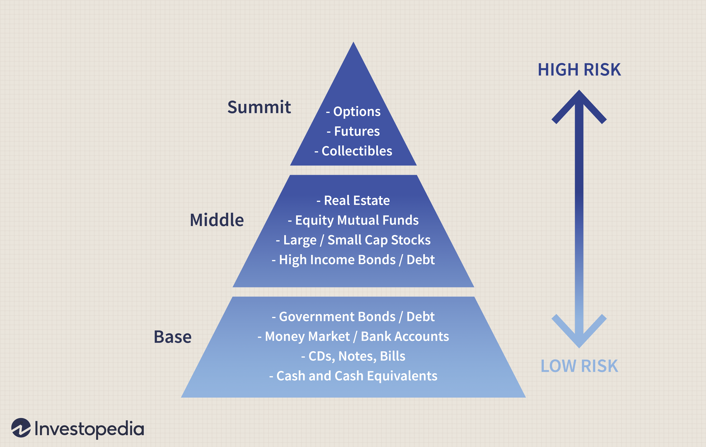

In recent years, algorithmic trading has significantly reshaped the financial markets, enabling investors to make decisions that are both data-driven and executed with remarkable precision and speed. Central to this evolution is the concept of Investors Intelligence, a pivotal element that influences the development and refinement of trading strategies. Investor sentiment, measured through various indices and tools, is essential for informing algorithmic trading decisions. Understanding how this sentiment affects market dynamics is crucial for investors seeking to enhance their strategic approaches.

A prominent example of how investor sentiment is quantified is the Investors Intelligence Sentiment Index. This index, among others, provides a valuable gauge of market mood by tracking the outlook of investment advisors. By analyzing fluctuations in sentiment, algorithmic traders can gain insights into potential market movements. These indices serve not only as indicators of current market conditions but also as predictors of future trends, offering traders an edge in decision-making.



The origins of the Investors Intelligence Sentiment Index also underscore its longstanding impact on trading practices. As trading techniques have evolved, the application of this index has adapted to modern needs, ensuring its relevance and utility. By leveraging insights from investor sentiment, traders can more effectively navigate the complexities of contemporary financial markets, increasing the likelihood of successful trading outcomes. The integration of such sentiment analysis into trading strategies is an essential step in harnessing the full potential of algorithmic trading.

## Table of Contents

## Understanding Investors Intelligence in Algo Trading

Investors Intelligence is an essential concept in algorithmic trading, referring to the collective ability of market participants to gauge and interpret the sentiment of the investing community. This understanding is critical as sentiment serves as a powerful driver of asset prices, influencing market trends and decision-making processes. The Investors Intelligence Sentiment Index stands as one of the key indicators employed to assess the prevailing mood among investment advisors, offering insights into both bullish and bearish tendencies.

In the context of algorithmic trading, the role of sentiment is particularly pronounced. Algorithms are designed to incorporate sentiment data, leveraging it to predict market movements and develop strategies that aim to capitalize on these insights. By integrating sentiment indicators like the Investors Intelligence Index, sophisticated trading models are able to capture the psychological underpinnings that often dictate market behavior.

Analyzing the balance between bullish and bearish sentiments is a crucial aspect of this process. A higher proportion of bullish sentiment may indicate an upward trend in the market, encouraging buy decisions, whereas a dominant bearish sentiment might suggest a forthcoming downturn, prompting sell actions. This analysis aids in refining trading strategies, ensuring they are aligned with the current market mood.

Algorithmic models use complex data analysis, sometimes supported by [machine learning](/wiki/machine-learning) and natural language processing techniques, to dissect sentiment data effectively. These models assess historical sentiment data to identify patterns and extrapolate future market shifts. For instance, an algorithm might use a time series analysis to forecast future sentiment trends based on past sentiment cycles.

```python
# Example Python code for a simple sentiment-based trading strategy
import pandas as pd

# Load sentiment data
sentiment_data = pd.read_csv('sentiment_data.csv')

# Calculate average sentiment
average_sentiment = sentiment_data['sentiment'].mean()

# Determine trading action based on sentiment
def trading_strategy(current_sentiment):
    if current_sentiment > average_sentiment:
        return "Buy"
    elif current_sentiment < average_sentiment:
        return "Sell"
    else:
        return "Hold"

# Example usage
current_sentiment = 0.75
action = trading_strategy(current_sentiment)
print(f"Trading Action: {action}")
```

Overall, Investors Intelligence within [algorithmic trading](/wiki/algorithmic-trading) offers a structured approach to incorporating sentiment analysis into automated trading processes. By systematically evaluating sentiment indices such as the Investors Intelligence Sentiment Index, algorithmic traders can enhance their strategies and improve their predictive capabilities regarding market movements.

## Historical Context of the Investors Intelligence Sentiment Index

The Investors Intelligence Sentiment Index, established in 1963 by AW Cohen, has been instrumental in market sentiment analysis. Initially, its primary purpose was to indicate when investors should adopt a long position in the market. However, it quickly became evident that the majority of market advisors were frequently incorrect at pivotal market inflection points. This insight laid the foundation for a contrarian approach, where traders often found success by taking positions contrary to the prevailing sentiment during extreme levels of bullishness or bearishness.

The contrarian nature of the index suggests that when a large percentage of advisors are bullish, the market may be nearing a peak, and conversely, when many are bearish, a market bottom might be approaching. This insight has been pivotal for both traditional and algorithmic trading strategies. Over the years, the index has continually demonstrated its utility in predicting significant market transitions, proving to be a reliable tool for assessing market conditions.

One of the key aspects of the Investors Intelligence Sentiment Index is its adaptability to various market conditions, which has been crucial for its longevity and continued relevance. As market environments have evolved, the index has maintained its efficacy as a barometer for market sentiment. This adaptability ensures its persistent applicability in the development and refinement of algorithmic trading models, which rely on accurate sentiment indicators to formulate trading decisions. The enduring impact of the Investors Intelligence Sentiment Index exemplifies how sentiment indicators can be harnessed effectively within dynamic market landscapes.

## Application of Investor Sentiment in Algorithmic Trading

Sentiment analysis has become a crucial element in constructing advanced trading algorithms. By utilizing sentiment indicators such as the Investors Intelligence Index, these algorithms are designed to capture the psychological drivers influencing market behavior. This psychological insight is essential as it aids in predicting market fluctuations by interpreting the collective mood and expectations of market participants.

Algorithms in trading environments leverage historical sentiment data to discern patterns and anticipate future market shifts. This involves sophisticated statistical methods to analyze past sentiment and its correlation with market movements. For instance, machine learning models, particularly those involving time-series analysis, are commonly employed to extract insights from sentiment data over time.

Natural Language Processing (NLP) significantly enhances sentiment analysis within algorithmic trading. NLP allows algorithms to interpret a vast and diverse array of text-based data sources, including news articles, financial reports, and social media updates. This capability is vital, as the financial markets are often swayed by news and opinions expressed in these platforms. NLP techniques such as sentiment scoring, entity recognition, and topic modeling enable trading systems to assess sentiment in real time.

For example, using Python, one could employ the `TextBlob` library for basic sentiment analysis or `transformers` from Hugging Face for more sophisticated applications involving models like BERT. Here’s a simple example of sentiment analysis using Python:

```python
from textblob import TextBlob

text = "The stock market shows a bullish pattern today."
blob = TextBlob(text)
sentiment_score = blob.sentiment.polarity

print("Sentiment Score:", sentiment_score)
```

This script determines the polarity of a given text, which is a fundamental attribute for assessing sentiment.

Advanced sentiment-driven algorithms are equipped to respond rapidly to changes in market sentiment, thus optimizing trade execution. By rapidly executing buy or sell orders in response to a shift in sentiment, these algorithms maintain a competitive advantage. This responsiveness is crucial in highly volatile markets where sentiment can change briskly.

Overall, the integration of sentiment analysis into trading algorithms marks a significant advancement in the field, providing traders with enhanced predictive capabilities and more efficient trade executions based on real-time sentiment data.

## Challenges and Opportunities in Leveraging Investors Intelligence

Investor sentiment is a pivotal component of algorithmic trading, providing critical insights that help shape trading strategies. However, capturing and applying sentiment for real-time decision-making presents several challenges. The dynamic nature of sentiment requires that algorithms must constantly evolve to reflect current market conditions. This necessitates the development of highly adaptive models capable of processing large volumes of data swiftly and accurately.

One major challenge is maintaining the accuracy of sentiment analysis. Sentiment indices and tools must filter through noise and distinguish between genuine market shifts and temporary fluctuations. This complexity is compounded by the varied sources from which sentiment data is derived, including social media, news reports, and financial analysis. Each source carries its inherent biases and uncertainties, making the precise interpretation of sentiment a critical task.

To address these challenges, the integration of Artificial Intelligence (AI) and machine learning technologies offers a significant opportunity. AI algorithms can process vast datasets, recognize patterns, and predict future market behaviors more accurately than traditional methods. Machine learning models, particularly those utilizing Natural Language Processing (NLP), are capable of extracting sentiment from diverse data sources, offering a more nuanced understanding of market psychology.

Advanced systems leverage these technologies to enhance decision-making processes by detecting subtle market signals that may go unnoticed by human traders. These systems continuously learn and adapt, improving their accuracy over time. For instance, a machine learning model might incorporate feedback mechanisms that allow it to update its predictions based on the outcomes of previous trades.

Algorithmic traders implementing such sophisticated tools stand to gain a competitive advantage. By harnessing the power of AI and machine learning, they can identify lucrative opportunities faster than their peers who rely on traditional methods. This competitive edge is crucial in markets where timely information processing and execution can significantly impact profitability.

Furthermore, as technology advances, the capacity to fine-tune sentiment analysis will only improve. Innovations in data processing and machine learning algorithms promise to enhance the speed and accuracy with which investor sentiment is captured and interpreted. As these tools become more refined, they will provide traders with an increasingly reliable basis for making trading decisions, further solidifying the role of investor sentiment in the future of algorithmic trading.

## Conclusion

Investors Intelligence holds significant importance in algorithmic trading, providing traders with critical sentiment insights that aid in crafting informed strategies. The landscape of sentiment analysis is constantly changing, presenting both challenges and opportunities. Traders who leverage these insights can optimize their strategies to respond adeptly to market dynamics.

By integrating sentiment data within trading algorithms, investors can improve their predictive capabilities concerning market movements. This integration empowers them to make well-timed decisions, capitalizing on sentiment-driven market fluctuations.

Technological advancements continuously enhance the capacity to exploit investor sentiment for profitable trading. As [artificial intelligence](/wiki/ai-artificial-intelligence) and machine learning technologies evolve, their application in sentiment analysis becomes increasingly sophisticated, enhancing the precision of these insights.

Looking ahead, innovations in sentiment analysis are set to further transform algorithmic trading. These advancements promise to refine the understanding of market psychology, providing traders with nuanced tools to develop strategies that align with underlying market sentiments. This evolution holds the potential to revolutionize how traders approach market analysis, driving greater accuracy and efficacy in identifying profitable opportunities.

## References & Further Reading

[1]: Fisher, L. A. (2014). ["The Investors Intelligence Weekly Sentiment Survey."](https://www.jstor.org/stable/4480229?googleloggedin=true) 

[2]: Kaminski, K. M. (2014). ["Systemic Risk and Sentiment: Agent-Based Interactions and Mispriced Insurance in the Financial Sector."](https://onlinelibrary.wiley.com/doi/10.1111/jori.12039) 

[3]: Lo, A. W. (2016). ["Adaptive Markets: Financial Evolution at the Speed of Thought."](https://www.jstor.org/stable/j.ctvc77k3n) Princeton University Press. 

[4]: Tetlock, P. C. (2007). ["Giving Content to Investor Sentiment: The Role of Media in the Stock Market."](https://onlinelibrary.wiley.com/doi/abs/10.1111/j.1540-6261.2007.01232.x) The Review of Financial Studies, 21(2), 867-889.

[5]: Shiller, R. J. (2000). ["Irrational Exuberance."](https://press.princeton.edu/books/paperback/9780691173122/irrational-exuberance) Princeton University Press. 

[6]: Sewell, M. (2011). ["Characterization of Financial Time Series."](http://www.cs.ucl.ac.uk/fileadmin/UCL-CS/research/Research_Notes/RN_11_01.pdf) Journal of Artificial Societies and Social Simulation, 14(3). 

[7]: Prechter, R. R. (1999). ["The Wave Principle of Human Social Behavior and the New Science of Socionomics."](https://www.unesdoc.unesco.org/ark:/48223/pf0000127979) New Classics Library.

[8]: Baker, M., & Wurgler, J. (2007). ["Investor Sentiment in the Stock Market."](https://www.hbs.edu/ris/Publication%20Files/InvestorSentiment_b8e0a9d0-e9d0-4da7-a4c8-39d7af86a0f2.pdf) Journal of Economic Perspectives, 21(2), 129-151.