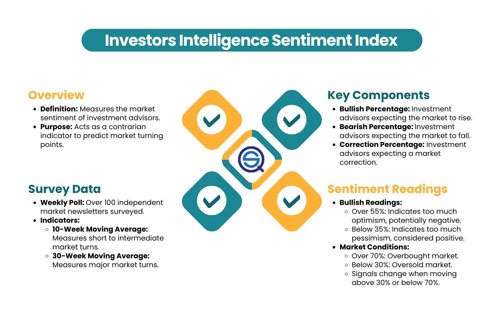

## Table of Contents

## What is the Investors Intelligence Sentiment Index?

The Investors Intelligence Sentiment Index is a measure that shows how bullish or bearish investors feel about the stock market. It is based on the opinions of investment newsletter writers and editors. If more writers are bullish, it means they think the market will go up. If more are bearish, they believe the market will go down. This index helps investors understand the general mood of the market, which can be useful for making investment decisions.

The index is calculated by looking at the number of bullish, bearish, and neutral newsletters each week. The ratio of bullish to bearish newsletters gives the sentiment reading. A high number of bullish newsletters suggests that many investors are optimistic, which might indicate the market is overbought and could soon fall. On the other hand, a high number of bearish newsletters can signal that the market is oversold and might soon rise. Investors use this information to gauge potential market movements and adjust their strategies accordingly.

## Who created the Investors Intelligence Sentiment Index and when?

The Investors Intelligence Sentiment Index was created by a man named Abe Cohen. He started it in 1963. Abe Cohen wanted to know what other people thought about the stock market, so he began looking at what investment newsletter writers were saying.

This index has been used by many people since then to understand how others feel about the market. It helps them decide if they should buy or sell stocks. By reading the newsletters, Abe Cohen found a way to measure the general mood of investors, which is still useful today.

## How is the Investors Intelligence Sentiment Index calculated?

The Investors Intelligence Sentiment Index is calculated by looking at investment newsletters each week. These newsletters are written by people who give advice about the stock market. The index counts how many of these newsletters are bullish, bearish, or neutral. Bullish means the writers think the market will go up. Bearish means they think it will go down. Neutral means they think it will stay the same.

To find the sentiment, the index uses a simple formula. It takes the number of bullish newsletters and divides it by the number of bearish newsletters. This gives a ratio that shows if more people are feeling positive or negative about the market. If the ratio is high, it means more people are bullish, which might mean the market is overbought and could fall soon. If the ratio is low, it means more people are bearish, which might mean the market is oversold and could rise soon.

## What are the main categories of sentiment measured by the Index?

The Investors Intelligence Sentiment Index measures three main categories of sentiment: bullish, bearish, and neutral. Bullish means that the people writing the newsletters think the stock market will go up. Bearish means they think the market will go down. Neutral means they think the market will stay the same. 

Each week, the index counts how many newsletters fall into each category. It then uses these counts to figure out the overall mood of the market. By looking at the ratio of bullish to bearish newsletters, the index gives a number that shows if more people are feeling hopeful or worried about the market.

## How can the Investors Intelligence Sentiment Index be used to gauge market sentiment?

The Investors Intelligence Sentiment Index helps people understand how others feel about the stock market. It does this by reading investment newsletters and counting how many are bullish, bearish, or neutral. Bullish means people think the market will go up, bearish means they think it will go down, and neutral means they think it will stay the same. By looking at the ratio of bullish to bearish newsletters, the index gives a number that shows if more people are feeling hopeful or worried about the market.

Investors can use this index to make better choices about buying or selling stocks. If the index shows a lot of bullish newsletters, it might mean the market is overbought and could fall soon. On the other hand, if there are a lot of bearish newsletters, it might mean the market is oversold and could rise soon. By knowing the general mood of the market, investors can decide if it's a good time to buy or sell, based on what other people are thinking.

## What is the significance of the bull/bear ratio in the Index?

The bull/bear ratio in the Investors Intelligence Sentiment Index is very important because it shows how many people think the stock market will go up compared to how many think it will go down. If the ratio is high, it means more people are feeling hopeful about the market, which is called being bullish. If the ratio is low, it means more people are feeling worried, which is called being bearish. This ratio helps investors understand the general mood of the market.

Investors use the bull/bear ratio to make decisions about buying or selling stocks. If the ratio is very high, it might mean the market is overbought and could fall soon, so some investors might decide to sell. If the ratio is very low, it might mean the market is oversold and could rise soon, so some investors might decide to buy. By looking at the bull/bear ratio, investors can get a sense of what other people are thinking and adjust their own strategies accordingly.

## How does the Investors Intelligence Sentiment Index correlate with market trends?

The Investors Intelligence Sentiment Index helps people understand if the stock market might go up or down by looking at what investment newsletter writers think. If lots of writers are feeling hopeful and think the market will go up, the index shows a high number of bullish newsletters. This can mean the market might be overbought, which means too many people have bought stocks and it might fall soon. On the other hand, if lots of writers are feeling worried and think the market will go down, the index shows a high number of bearish newsletters. This can mean the market might be oversold, which means too many people have sold stocks and it might rise soon.

Investors use the index to see if other people's feelings about the market match what is actually happening. If the index shows a lot of bullish sentiment and the market is going up, it might keep going up for a while. But if the index shows a lot of bullish sentiment and the market starts to go down, it could be a sign that the market is about to change direction. By looking at the index and comparing it to what the market is doing, investors can make smarter choices about when to buy or sell stocks.

## Can the Investors Intelligence Sentiment Index be used as a contrarian indicator?

Yes, the Investors Intelligence Sentiment Index can be used as a contrarian indicator. This means that if a lot of people are feeling very hopeful about the market, it might be a good time to sell. When the index shows a high number of bullish newsletters, it can mean the market is overbought and might fall soon. On the other hand, if a lot of people are feeling very worried about the market, it might be a good time to buy. When the index shows a high number of bearish newsletters, it can mean the market is oversold and might rise soon.

Investors who use the index as a contrarian indicator look for times when the general mood of the market is very strong in one direction. If everyone is feeling too hopeful, it might be a sign that the market is about to go down. If everyone is feeling too worried, it might be a sign that the market is about to go up. By going against what most people are thinking, these investors hope to make good choices about when to buy or sell stocks.

## What are some limitations or criticisms of the Investors Intelligence Sentiment Index?

One big problem with the Investors Intelligence Sentiment Index is that it only looks at what investment newsletter writers think. These writers might not always be right about the market, and their opinions might not match what regular investors think. Also, the index can be slow to change because it is based on weekly newsletters. If the market moves quickly, the index might not show the new mood of investors fast enough to be useful.

Another criticism is that the index can sometimes give false signals. Just because a lot of people feel hopeful or worried about the market does not always mean the market will go up or down right away. Sometimes the market can keep going in the same direction even if the index says it should change. This can make it hard for investors to use the index to make good choices about buying or selling stocks.

## How does the Investors Intelligence Sentiment Index compare to other sentiment indicators?

The Investors Intelligence Sentiment Index is one way to measure how people feel about the stock market, but there are other ways too. One common way is the American Association of Individual Investors (AAII) Sentiment Survey. This survey asks regular investors how they feel about the market, not just newsletter writers like the Investors Intelligence Index does. Another popular indicator is the CNN Money Fear and Greed Index, which looks at many things like stock price [momentum](/wiki/momentum), stock price strength, and market [volatility](/wiki/volatility-trading-strategies) to measure sentiment. Each of these indicators gives a different view of how people feel about the market.

The Investors Intelligence Sentiment Index is good because it focuses on what experts think, but it can be slow to update since it only looks at weekly newsletters. The AAII Sentiment Survey can change more quickly because it asks people every week, and it might be better at showing what regular investors think. The CNN Money Fear and Greed Index is even faster because it updates every day and looks at many different things. But all these indicators can sometimes give false signals, so it's important for investors to use them along with other information when making choices about buying or selling stocks.

## What historical data or case studies illustrate the effectiveness of the Investors Intelligence Sentiment Index?

One example that shows how the Investors Intelligence Sentiment Index can be useful happened in 1987. Before the big stock market crash in October, the index showed a very high number of bullish newsletters. This meant a lot of people thought the market would keep going up. But the market was actually overbought, and it crashed soon after. Investors who paid attention to the high bullish sentiment and used it as a contrarian signal might have sold their stocks before the crash and avoided losing a lot of money.

Another case was in 2008, before the financial crisis. The index started showing more bearish newsletters, which meant more people were worried about the market. This time, the index was right, and the market did go down a lot. Investors who saw the increasing bearish sentiment and decided to sell their stocks or buy safer investments might have protected their money better during the crisis. These examples show that the Investors Intelligence Sentiment Index can help investors understand when the market might be about to change direction, but it's not always perfect and should be used with other information.

## How can investors incorporate the Investors Intelligence Sentiment Index into their investment strategy?

Investors can use the Investors Intelligence Sentiment Index to help them decide when to buy or sell stocks by looking at the general mood of the market. If the index shows a lot of bullish newsletters, it means many people think the market will go up. This might be a sign that the market is overbought, so some investors might decide to sell their stocks before the market falls. On the other hand, if the index shows a lot of bearish newsletters, it means many people think the market will go down. This might be a sign that the market is oversold, so some investors might decide to buy stocks, hoping the market will rise soon. By using the index as a contrarian indicator, investors can go against what most people are thinking and try to make smart choices.

It's important for investors to not just rely on the Investors Intelligence Sentiment Index alone. They should use it along with other information like stock prices, economic news, and other sentiment indicators. The index can be slow to update because it only looks at weekly newsletters, so it's good to check it along with faster indicators like the CNN Money Fear and Greed Index. By looking at different sources of information, investors can get a better understanding of the market and make better decisions about their investments.

## References & Further Reading

[1]: Fisher, L. A. (2014). ["The Investors Intelligence Weekly Sentiment Survey."](https://www.jstor.org/stable/4480229?googleloggedin=true) 

[2]: Kaminski, K. M. (2014). ["Systemic Risk and Sentiment: Agent-Based Interactions and Mispriced Insurance in the Financial Sector."](https://onlinelibrary.wiley.com/doi/10.1111/jori.12039) 

[3]: Lo, A. W. (2016). ["Adaptive Markets: Financial Evolution at the Speed of Thought."](https://www.jstor.org/stable/j.ctvc77k3n) Princeton University Press. 

[4]: Tetlock, P. C. (2007). ["Giving Content to Investor Sentiment: The Role of Media in the Stock Market."](https://onlinelibrary.wiley.com/doi/abs/10.1111/j.1540-6261.2007.01232.x) The Review of Financial Studies, 21(2), 867-889.

[5]: Shiller, R. J. (2000). ["Irrational Exuberance."](https://press.princeton.edu/books/paperback/9780691173122/irrational-exuberance) Princeton University Press. 

[6]: Sewell, M. (2011). ["Characterization of Financial Time Series."](http://www.cs.ucl.ac.uk/fileadmin/UCL-CS/research/Research_Notes/RN_11_01.pdf) Journal of Artificial Societies and Social Simulation, 14(3). 

[7]: Prechter, R. R. (1999). ["The Wave Principle of Human Social Behavior and the New Science of Socionomics."](https://www.unesdoc.unesco.org/ark:/48223/pf0000127979) New Classics Library.

[8]: Baker, M., & Wurgler, J. (2007). ["Investor Sentiment in the Stock Market."](https://www.hbs.edu/ris/Publication%20Files/InvestorSentiment_b8e0a9d0-e9d0-4da7-a4c8-39d7af86a0f2.pdf) Journal of Economic Perspectives, 21(2), 129-151.