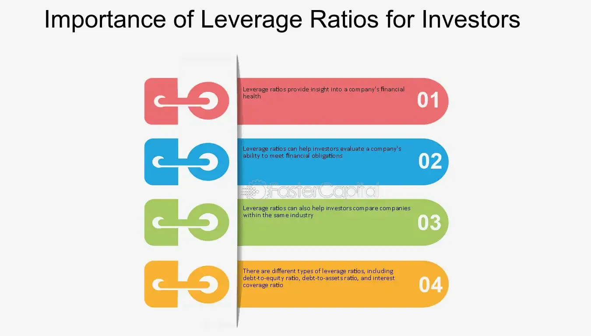

## Table of Contents

## What is a leverage ratio?

A leverage ratio is a way to measure how much debt a company uses to run its business compared to its own money. It shows if a company is using a lot of borrowed money or if it's mostly using its own money. Think of it like this: if you borrow money to buy a house, the leverage ratio would show how much of the house you bought with your own money and how much with the bank's money.

Leverage ratios are important because they help people understand the financial health of a company. If a company has a high leverage ratio, it means it has a lot of debt. This can be risky because the company needs to pay back the debt, and if it can't, it might get into trouble. On the other hand, a low leverage ratio means the company is not using much debt, which can be safer but might also mean it's not growing as fast as it could.

## Why do investors use leverage ratios to assess financial health?

Investors use leverage ratios to assess a company's financial health because they want to know how much debt the company is using to operate. Debt can be a useful tool for a company to grow, but too much debt can be dangerous. If a company has a high leverage ratio, it means it's using a lot of borrowed money. This can make investors worried because if the company can't pay back its loans, it might face serious problems or even go bankrupt.

On the other hand, a low leverage ratio shows that a company is not relying heavily on debt. This can make investors feel safer because the company is using more of its own money to run the business. However, a very low leverage ratio might also mean the company is not taking advantage of opportunities to grow by borrowing money. So, investors look at leverage ratios to find a balance – they want a company that uses debt wisely to grow but not so much that it becomes risky.

## What are the most common types of leverage ratios?

The most common types of leverage ratios are the debt-to-equity ratio, the debt ratio, and the equity ratio. The debt-to-equity ratio shows how much debt a company has compared to its own money. It's calculated by dividing the company's total debt by its total equity. A high debt-to-equity ratio means the company is using a lot of borrowed money, which can be risky. The debt ratio tells you what part of a company's assets are paid for with debt. It's found by dividing total debt by total assets. A high debt ratio means more of the company's assets are financed by debt.

The equity ratio is another important leverage ratio. It shows how much of a company's assets are paid for with its own money. You calculate it by dividing total equity by total assets. A high equity ratio means the company is using more of its own money to buy assets, which is generally safer. These three ratios help investors understand how a company is balancing debt and equity to run its business. By looking at these ratios, investors can decide if a company is using debt wisely or if it's taking on too much risk.

## How is the debt-to-equity ratio calculated and what does it indicate?

The debt-to-equity ratio is calculated by dividing a company's total debt by its total equity. Total debt includes all the money the company owes, like loans and bonds. Total equity is the money that belongs to the company's owners or shareholders. So, if a company has $100,000 in debt and $50,000 in equity, the debt-to-equity ratio would be 2. This means the company has twice as much debt as equity.

This ratio tells you how much the company is relying on borrowed money compared to its own money. A high debt-to-equity ratio means the company is using a lot of debt to run its business, which can be risky. If the company can't pay back its loans, it might get into trouble. On the other hand, a low debt-to-equity ratio means the company is not using much debt, which can be safer but might also mean it's not growing as fast as it could. Investors look at this ratio to see if a company is using debt wisely or if it's taking on too much risk.

## What does the debt-to-asset ratio tell investors about a company's financial health?

The debt-to-asset ratio tells investors how much of a company's assets are paid for with debt. You calculate it by dividing the company's total debt by its total assets. If the ratio is high, it means a big part of the company's things, like buildings or machines, were bought with borrowed money. If the ratio is low, it means the company used more of its own money to buy its things.

This ratio is important because it shows how risky a company might be. If a company has a high debt-to-asset ratio, it might be in trouble if it can't pay back its loans. But if the ratio is low, the company is safer because it's not relying too much on borrowed money. Investors look at this ratio to see if a company is using debt wisely or if it's taking on too much risk.

## How can the interest coverage ratio help in understanding a company's ability to manage debt?

The interest coverage ratio helps investors understand if a company can pay the interest on its debt. It's calculated by dividing a company's earnings before interest and taxes (EBIT) by its interest expenses. A high interest coverage ratio means the company is making enough money to easily pay its interest. A low ratio means the company might struggle to pay its interest, which can be risky.

This ratio is important because it shows how well a company is managing its debt. If a company has a high interest coverage ratio, it's in a good position because it can comfortably pay its interest and still have money left over. But if the ratio is low, it might mean the company is taking on too much debt and could have trouble paying it back. Investors use this ratio to decide if a company is using debt wisely or if it's too risky.

## What are the limitations of using leverage ratios in financial analysis?

Leverage ratios are useful, but they have some limitations. One big problem is that they don't tell the whole story about a company's financial health. For example, a company might have a high debt-to-equity ratio, but if it's making a lot of money, it might still be able to pay back its loans easily. So, looking at leverage ratios alone can be misleading because they don't show how well a company is doing overall.

Another limitation is that different industries have different norms for leverage. What might be a high leverage ratio in one industry could be normal in another. For example, utility companies often have high debt because they need a lot of money to build things like power plants. If you don't know the industry standards, you might think a company is too risky when it's actually doing fine. So, it's important to compare a company's leverage ratios with others in the same industry to get a better picture.

## How do leverage ratios differ across industries and why is this important for investors?

Leverage ratios can be very different from one industry to another. For example, companies in the utility sector, like those that provide electricity or water, often have high debt because they need a lot of money to build big things like power plants. On the other hand, tech companies might have lower debt because they don't need as much money to start up and grow. This means that what might seem like a high leverage ratio in one industry could be normal in another.

This difference is important for investors because it helps them understand if a company is using debt in a smart way or if it's taking on too much risk. If an investor looks at a company's leverage ratios without knowing the industry norms, they might make a wrong decision. For example, they might think a utility company is too risky because of its high debt, when really, that's just how things are in that industry. So, investors need to compare a company's leverage ratios with others in the same industry to get a true picture of its financial health.

## Can leverage ratios predict financial distress? If so, how?

Leverage ratios can give clues about whether a company might be heading towards financial trouble. They show how much debt a company is using compared to its own money. If a company has a high debt-to-equity ratio or a high debt-to-asset ratio, it means it's using a lot of borrowed money. This can be risky because if the company can't pay back its loans, it might face big problems. So, these ratios can help investors spot early signs that a company might be in trouble.

But leverage ratios alone can't predict financial distress perfectly. They need to be looked at along with other things, like how much money the company is making and how it's doing compared to other companies in the same industry. For example, a company might have a high debt-to-equity ratio but still be making enough money to pay back its loans easily. So, while leverage ratios can be a helpful warning sign, they're just one piece of the puzzle when it comes to understanding a company's financial health.

## How do changes in leverage ratios over time inform investors about a company's financial strategy?

Changes in leverage ratios over time can tell investors a lot about how a company is managing its money. If a company's debt-to-equity ratio is going up, it means they are using more borrowed money compared to their own money. This might mean the company is trying to grow fast by taking on more debt. On the other hand, if the ratio is going down, it could mean the company is paying off its debts or using less borrowed money. This might show that the company is being more careful with its money or focusing on being financially stable.

Looking at these changes helps investors see the big picture of a company's financial strategy. For example, if a company's debt-to-asset ratio keeps going up, it might be investing a lot in new projects or equipment. But if it's going down, the company might be selling off assets or paying down debt to become less risky. By watching these trends, investors can guess if the company is aiming to grow quickly, become more stable, or maybe even facing financial trouble.

## What advanced techniques can investors use to combine leverage ratios with other financial metrics for a more comprehensive analysis?

Investors can get a fuller picture of a company's financial health by combining leverage ratios with other financial metrics. One way to do this is by looking at profitability ratios like the return on equity (ROE) alongside leverage ratios. ROE shows how well a company is using the money its shareholders have invested to make a profit. If a company has a high debt-to-equity ratio but also a high ROE, it might mean the company is using its debt wisely to grow and make more money. But if the ROE is low, a high debt-to-equity ratio could be a warning sign that the company is taking on too much risk without the profits to back it up.

Another technique is to use cash flow analysis along with leverage ratios. Cash flow shows how much money is coming in and going out of a company. If a company has a high debt-to-asset ratio but strong cash flows, it might be able to pay back its loans easily. But if the cash flows are weak, a high debt-to-asset ratio could mean the company is in trouble. By looking at both leverage ratios and cash flow, investors can see if a company is managing its debt well or if it's at risk of not being able to pay back what it owes.

## How do global economic conditions affect the interpretation of leverage ratios in different markets?

Global economic conditions can change how investors look at leverage ratios in different markets. When the economy is doing well, companies might take on more debt because they think they can make more money to pay it back. This means a higher leverage ratio might not seem as risky. But if the economy is doing badly, like during a recession, a high leverage ratio can be a big problem. Companies might struggle to pay back their loans if they're not making as much money, so investors might see a high leverage ratio as a sign of trouble.

Different countries can also have different economic situations that affect how leverage ratios are seen. For example, in a country with low interest rates, borrowing money is cheaper, so companies might use more debt. This could make a high leverage ratio seem less risky in that country. But in a country with high interest rates, borrowing is more expensive, so a high leverage ratio might be seen as more dangerous. Investors need to think about these global and local economic conditions when they look at leverage ratios to understand if a company is using debt wisely or if it's taking on too much risk.

## What are Leverage Ratios and how do they serve as Key Indicators of Financial Health?

Leverage ratios are critical financial metrics that help investors analyze a company's financial health by assessing its capital structure and debt management. These ratios are essential for understanding how much debt a company utilizes relative to its equity, which can indicate the potential risk and return associated with investing in that company.

One of the most commonly used leverage ratios is the debt-to-equity ratio, which compares a company's total liabilities to its shareholder equity. It is expressed as:

$$
\text{Debt-to-Equity Ratio} = \frac{\text{Total Liabilities}}{\text{Shareholder Equity}}
$$

This ratio provides insight into how a company is financing its operations, either through debt or entirely relying on its equity. A higher debt-to-equity ratio suggests a company is heavily reliant on debt financing, potentially increasing its risk but also possibly amplifying returns on equity if used judiciously.

Another vital leverage ratio is the interest coverage ratio, which measures a company's ability to meet its interest payment obligations. It is calculated as:

$$
\text{Interest Coverage Ratio} = \frac{\text{Earnings Before Interest and Taxes (EBIT)}}{\text{Interest Expenses}}
$$

This ratio indicates how comfortably a company can service its debt with its current earnings. A higher interest coverage ratio suggests stronger financial stability as the company can efficiently manage its interest payments, thus reducing the risk of default.

Leverage ratios play a crucial role in understanding a company's capital structure. They reveal how a company balances its financing between debt and equity, which is pivotal for determining its growth potential and sustainability. A company with a high leverage ratio might experience rapid growth due to the increased capital availability but faces higher financial risk, especially in downturns where cash flow might reduce. Conversely, a low leverage ratio might indicate conservative financing, potentially limiting growth but increasing stability and reducing financial risk.

Investors employ leverage ratios to evaluate the risks associated with equities and fixed income investments. In equities, a company with high leverage might be attractive in high-growth industries where the potential returns outweigh the risks. In contrast, for fixed income investments, particularly bonds, lower leverage ratios generally signify a lower risk of default, making them attractive to conservative investors seeking stable returns.

In summary, leverage ratios, such as debt-to-equity and interest coverage ratios, are indispensable tools for investors. They serve as indicators of a company's ability to manage its debt and financial obligations, providing insights into both risk and growth potential. Understanding these ratios enables investors to make informed decisions, balancing between pursuing growth opportunities and managing potential financial risks.

## References & Further Reading

[1]: Bergstra, J., Bardenet, R., Bengio, Y., & Kégl, B. (2011). ["Algorithms for Hyper-Parameter Optimization."](https://dl.acm.org/doi/10.5555/2986459.2986743) Advances in Neural Information Processing Systems 24.

[2]: ["Advances in Financial Machine Learning"](https://www.amazon.com/Advances-Financial-Machine-Learning-Marcos/dp/1119482089) by Marcos Lopez de Prado

[3]: ["Evidence-Based Technical Analysis: Applying the Scientific Method and Statistical Inference to Trading Signals"](https://www.amazon.com/Evidence-Based-Technical-Analysis-Scientific-Statistical/dp/0470008741) by David Aronson

[4]: ["Machine Learning for Algorithmic Trading"](https://github.com/stefan-jansen/machine-learning-for-trading) by Stefan Jansen

[5]: ["Quantitative Trading: How to Build Your Own Algorithmic Trading Business"](https://www.amazon.com/Quantitative-Trading-Build-Algorithmic-Business/dp/1119800064) by Ernest P. Chan