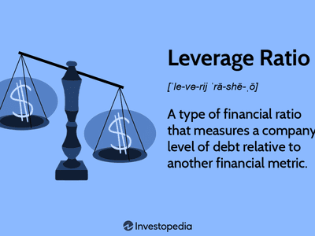

Understanding the financial health of a company is crucial for investors aiming to make informed decisions. Investors seek to evaluate a company's ability to generate profits, manage debt, and sustain growth. This involves analyzing key financial metrics, among which leverage ratios play a pivotal role. Leverage ratios, such as the debt-to-equity ratio and interest coverage ratio, are essential indicators that reveal insights into a company's capital structure and its capacity to manage debt obligations effectively. A high leverage ratio might suggest greater financial risk, whereas a low ratio could indicate conservative debt management.

In parallel, the rise of algorithmic trading has significantly transformed the landscape of financial markets. Algorithmic trading (or algo trading) employs computer algorithms to execute trades, replacing manual trading tasks with high-speed, data-driven decision-making processes. This technological advancement helps in executing complex trading strategies with improved accuracy and efficiency. By integrating financial metrics such as leverage ratios within algorithmic frameworks, investors can enhance their ability to react to market conditions swiftly.



This article explores the intersection of financial health, leverage ratios, and algorithmic trading, providing insights into how investors can utilize these tools together. By combining traditional financial analysis with cutting-edge technological strategies, investors can gain a comprehensive view of investment opportunities. Such an approach not only aids in identifying risks and potential returns but also equips investors with the ability to automate and optimize their investment strategies.

Our goal is to guide investors on effectively analyzing financial data and leveraging algorithmic strategies for improved investment decisions, ultimately leading to more informed, data-driven investment choices.

## Table of Contents

## Understanding Financial Health in Investment

Understanding financial health in investment involves analyzing several fundamental aspects of a company's performance: profitability, liquidity, and solvency. These factors collectively give investors a comprehensive view of the potential risks and returns associated with an investment.

Profitability refers to a company's ability to generate earnings relative to its expenses and other costs. Key metrics used to assess profitability include the net profit margin, return on assets (ROA), and return on equity (ROE). These metrics highlight how efficiently a company is managing its resources to produce profit. For instance, the net profit margin, calculated as $\text{Net Income} / \text{Revenue}$, indicates the percentage of revenue that translates into profit, showcasing the company's efficiency in cost management and pricing strategies.

Liquidity measures a company's capacity to meet its short-term obligations. It is crucial because even profitable companies can face financial distress if they lack sufficient liquid resources to cover outstanding liabilities. Common [liquidity](/wiki/liquidity-risk-premium) ratios include the current ratio, expressed as $\text{Current Assets} / \text{Current Liabilities}$, and the quick ratio, which further refines assessment by excluding inventory from current assets. These ratios provide insights into how well a company can convert its short-term assets to cash to settle immediate debts.

Solvency is the long-term counterpart to liquidity, focusing on a company's ability to meet long-term obligations. It is an indicator of financial stability and includes ratios such as the debt-to-equity ratio, which compares a company's total liabilities to its shareholder equity. Solvency assessments help investors understand the degree to which a company is using borrowed funds compared to owned funds, influencing long-term financial health and sustainability.

Financial statements serve as essential tools for evaluating these aspects by offering structured and detailed insights into a company's performance. The balance sheet provides a snapshot of the company's financial position, whereas the income statement reveals profitability over a specific period, and the cash flow statement clarifies cash origin and utilization. Together, these documents enable a thorough examination of financial health.

Understanding financial metrics and ratios is pivotal for investors. Not only do they allow for a detailed analysis of economic conditions, but they also enable comparisons across companies within the same industry. By systematically evaluating these metrics, investors can predict future performance trends, assess competitive positioning, and make informed investment decisions.

## Leverage Ratios: Key Indicators of Financial Health

Leverage ratios are critical financial metrics that help investors analyze a company's financial health by assessing its capital structure and debt management. These ratios are essential for understanding how much debt a company utilizes relative to its equity, which can indicate the potential risk and return associated with investing in that company.

One of the most commonly used leverage ratios is the debt-to-equity ratio, which compares a company's total liabilities to its shareholder equity. It is expressed as:

$$
\text{Debt-to-Equity Ratio} = \frac{\text{Total Liabilities}}{\text{Shareholder Equity}}
$$

This ratio provides insight into how a company is financing its operations, either through debt or entirely relying on its equity. A higher debt-to-equity ratio suggests a company is heavily reliant on debt financing, potentially increasing its risk but also possibly amplifying returns on equity if used judiciously.

Another vital leverage ratio is the interest coverage ratio, which measures a company's ability to meet its interest payment obligations. It is calculated as:

$$
\text{Interest Coverage Ratio} = \frac{\text{Earnings Before Interest and Taxes (EBIT)}}{\text{Interest Expenses}}
$$

This ratio indicates how comfortably a company can service its debt with its current earnings. A higher interest coverage ratio suggests stronger financial stability as the company can efficiently manage its interest payments, thus reducing the risk of default.

Leverage ratios play a crucial role in understanding a company's capital structure. They reveal how a company balances its financing between debt and equity, which is pivotal for determining its growth potential and sustainability. A company with a high leverage ratio might experience rapid growth due to the increased capital availability but faces higher financial risk, especially in downturns where cash flow might reduce. Conversely, a low leverage ratio might indicate conservative financing, potentially limiting growth but increasing stability and reducing financial risk.

Investors employ leverage ratios to evaluate the risks associated with equities and fixed income investments. In equities, a company with high leverage might be attractive in high-growth industries where the potential returns outweigh the risks. In contrast, for fixed income investments, particularly bonds, lower leverage ratios generally signify a lower risk of default, making them attractive to conservative investors seeking stable returns.

In summary, leverage ratios, such as debt-to-equity and interest coverage ratios, are indispensable tools for investors. They serve as indicators of a company's ability to manage its debt and financial obligations, providing insights into both risk and growth potential. Understanding these ratios enables investors to make informed decisions, balancing between pursuing growth opportunities and managing potential financial risks.

## The Role of Algorithmic Trading in Modern Investments

Algorithmic trading, commonly referred to as algo trading, is a method of executing orders using automated pre-programmed trading instructions. These instructions account for various variables like timing, price, and [volume](/wiki/volume-trading-strategy), with the primary aim of leveraging technology to execute trades at optimal conditions. In recent decades, algo trading has seen a significant rise in popularity, transforming the financial markets by offering unparalleled speed and precision in trade execution.

Algo trading is particularly advantageous due to several key benefits:

1. **Speed and Efficiency**: Algorithms can process vast amounts of market data and perform calculations much faster than a human trader. This speed allows trades to be executed at a fraction of a second, capitalizing on even the smallest market movements that may arise due to news announcements or economic data releases.

2. **Accuracy and Reduction of Human Error**: By compiling pre-set rules into trading algorithms, the potential for human error—driven by emotions or fatigue—is significantly minimized. Traders can program their strategies with precision and consistency, ensuring uniform application across high volumes of trades.

3. **Backtesting Capabilities**: One of the notable advantages of algo trading is the ability to backtest trading strategies on historical data. This process involves simulating the trading strategy on past data to evaluate its effectiveness. It provides insights into potential future performance, enabling traders to refine their strategies before deploying them in live markets.

Incorporating financial health analysis and leverage ratio evaluations into algorithmic strategies can enhance decision-making and risk assessment. Leverage ratios, such as the debt-to-equity ratio and interest coverage ratio, can be useful indicators when baked into algos. For instance, an algorithm could be designed to only execute trades for equities that maintain a specific leverage ratio threshold, thereby incorporating a layer of fundamental financial health analysis into fast-paced trading scenarios.

However, algo trading is not without its challenges:

- **Technology Dependence**: The reliance on technology means that any technical issues such as connectivity problems, coding errors, or hardware failures can lead to significant financial losses. It is essential for traders to ensure robust infrastructure and have contingency plans in place.

- **Market Volatility**: While volatility can create opportunities, it can also pose risks. During periods of high market volatility, algorithmic models based solely on historical data might not perform as expected. Thus, continuous monitoring and updating of algorithms are essential to adapt to changing market conditions.

Despite its complexities, algo trading has fundamentally reshaped modern investment strategies. By integrating sophisticated algorithms with comprehensive financial analysis tools, investors can make more informed decisions, optimize their trading outcomes, and potentially improve their returns.

## Integrating Financial Health Analysis with Algorithmic Trading

Integrating financial health analysis with [algorithmic trading](/wiki/algorithmic-trading) involves the strategic combination of financial metrics and automated systems to optimize investment decisions. This approach aims to leverage technological advancements in trading algorithms while capitalizing on the insights provided by a thorough examination of financial health, particularly leverage ratios, of companies.

Strategies for combining these elements start with the application of leverage ratios as inputs for algorithmic trading processes. Leverage ratios, such as the debt-to-equity ratio and interest coverage ratio, offer vital insights into a company's financial obligations relative to its equity and ability to meet interest payments. By automating trading signals based on these ratios, investors can create responsive and data-driven strategies. For instance, an algorithm could be programmed to trigger buy or sell orders when a company's debt-to-equity ratio exceeds a predetermined threshold, signaling potential over-leveraging and increased financial risk.

One practical method to incorporate leverage ratios within algorithmic frameworks is through the use of Python libraries such as Pandas and NumPy. These tools facilitate the collection, analysis, and interpretation of financial data, enabling seamless integration of financial metrics into trading algorithms. A simple implementation could involve setting up conditional statements within a trading strategy code, such as:

```python
import numpy as np
import pandas as pd

def trading_signal(debt_to_equity):
    threshold = 1.5
    return "SELL" if debt_to_equity > threshold else "HOLD"

# Example usage
companies_df = pd.DataFrame({'Company': ['A', 'B', 'C'],
                             'DebtToEquityRatio': [1.2, 2.0, 0.8]})

companies_df['Signal'] = companies_df['DebtToEquityRatio'].apply(trading_signal)
print(companies_df)
```

Such practices ensure that trading decisions are grounded in robust financial analysis, enhancing risk management.

The efficacy of integrating financial analysis with algorithmic systems can be evidenced by case studies, which illustrate the potential for improved decision-making outcomes. For example, investment firms employing these integrated systems demonstrated enhanced portfolio performance by dynamically adjusting positions based on real-time financial metric evaluations.

Selecting the appropriate algorithms and software tools is pivotal for successful integration. Investors should prioritize platforms that support comprehensive data analysis and offer flexibility in algorithm customization. Popular choices often include MetaTrader and QuantConnect, known for their extensive libraries and [backtesting](/wiki/backtesting) capabilities, allowing users to simulate strategies on historical data to assess performance potential before live deployment.

In conclusion, merging financial health analysis with algorithmic trading provides a formidable approach for contemporary investors. It combines the precision of quantitative techniques with the depth of financial insight, paving the way for more informed and strategic investment decisions.

## Investors' Considerations and Best Practices

When integrating leverage ratio analysis into algorithmic trading, it is essential for investors to be aware of several key factors to ensure a coherent and effective trading strategy. Leverage ratios serve as critical financial indicators that reflect a company's ability to meet its financial obligations. By incorporating these ratios into algorithmic trading, investors can optimize their decision-making process.

### Key Factors to Consider

1. **Accuracy of Financial Data**: Ensure that the financial data used to compute leverage ratios, such as debt-to-equity or interest coverage ratios, is accurate and updated regularly. Discrepancies in financial data can lead to inaccurate calculations and potentially flawed trading strategies.

2. **Quality of Algorithms**: Algorithms must be designed to accurately interpret financial metrics and leverage ratios consistently. Their capability to adapt to changes in data quality and quantity is crucial for robust trading signals.

3. **Regulatory Environment**: Monitor any changes in financial market regulations that could impact leverage ratio thresholds or algorithm trading rules. Compliance with current laws is mandatory to avoid legal issues.

### Best Practices for Sustainable Investment Strategies

- **Balanced Methodologies**: Employ a hybrid approach that combines both manual and automated strategies. This allows investors to leverage the speed and accuracy of algorithms while retaining the intuitive analysis skills of experienced traders.

- **Regular Backtesting**: Continuously backtest trading algorithms using historical data to measure their performance across different market conditions. This practice helps validate the effectiveness of algorithms before deployment in live trading environments.

- **Dynamic Adjustment**: Cultivate the ability to adjust trading strategies in response to changing financial metrics. Algorithms should support dynamic inputs to accommodate evolving leverage scenarios.

### Risk Management Techniques

1. **Diversification**: Spread investments across different asset classes and sectors to mitigate risks associated with high-leverage companies. This reduces reliance on any single leverage-heavy entity that could pose a significant risk to the portfolio.

2. **Stop Loss Mechanisms**: Implement stop-loss orders to limit potential losses on high-leverage trades. Automated systems can automatically execute such orders when predefined conditions are met.

3. **Stress Testing**: Conduct regular stress tests to evaluate the resilience of trading algorithms under extreme market scenarios, including high volatility or liquidity constraints. This process identifies potential vulnerabilities that could arise due to leverage-related risks.

### Continuous Learning and Adaptation

In the rapidly evolving landscape of finance and technology, continuous education is indispensable. Investors must stay informed about the latest developments in algorithmic trading technologies, financial instruments, and market trends. This involves:

- **Engaging in Professional Development**: Attend industry conferences, webinars, and workshops focused on the latest advancements in finance and trading technologies.

- **Staying Technologically Up-to-Date**: Regularly update algorithm platforms and software tools to capitalize on improvements in speed, functionality, and security.

- **Community Engagement**: Participate in professional trading and finance communities to exchange knowledge and strategies with peers, fostering a culture of collaborative learning.

By carefully integrating leverage ratio analysis with algorithmic systems, investors can enhance their investment strategies, reducing risks and maximizing returns. This strategic synthesis requires a thoughtful blend of modern technological tools with timeless financial principles, allowing investors to thrive in today’s complex financial markets.

## Conclusion

Understanding the financial health of a company is a cornerstone for assessing its investment potential. Key elements of this evaluation are leverage ratios, critical indicators that help investors gauge a company's debt management and capital structure. They provide essential insights into the company's ability to sustain operations and grow, balancing risk with opportunity. Leverage ratios, such as the debt-to-equity ratio and interest coverage ratio, illuminate financial stability and risk exposure, offering investors concrete metrics to inform their decision-making process.

Algorithmic trading stands as a transformative force in modern investment strategies, providing tools that enhance market engagement through speed and precision. Algorithmic trading integrates complex data analysis and trading executions, enabling investors to efficiently process and act on financial health metrics, including leverage ratios. Through technology, trading algorithms can swiftly incorporate these metrics into trading strategies, allowing for the automated generation of trading signals based on financial analytical models. This intersection of traditional financial analysis and technology democratizes access to sophisticated investment strategies once reserved for large financial institutions.

Investors are encouraged to merge these technological tools with traditional financial analysis to harness the full potential of available data and trading opportunities. By doing so, they can craft more informed and responsive investment strategies, balancing the wealth of algorithmic capabilities alongside foundational financial insights.

In conclusion, the integration of financial health analysis, leverage ratios, and algorithmic trading systems is not merely beneficial but essential for a well-rounded investment strategy. Leveraging these tools in tandem enables investors to remain agile in the fast-paced world of financial markets, ensuring strategies are both robust and adaptive to changing market conditions. This synthesis of traditional and modern investment approaches positions investors to more effectively manage risk and optimize investment outcomes.

## References & Further Reading

[1]: Bergstra, J., Bardenet, R., Bengio, Y., & Kégl, B. (2011). ["Algorithms for Hyper-Parameter Optimization."](https://dl.acm.org/doi/10.5555/2986459.2986743) Advances in Neural Information Processing Systems 24.

[2]: ["Advances in Financial Machine Learning"](https://www.amazon.com/Advances-Financial-Machine-Learning-Marcos/dp/1119482089) by Marcos Lopez de Prado

[3]: ["Evidence-Based Technical Analysis: Applying the Scientific Method and Statistical Inference to Trading Signals"](https://www.amazon.com/Evidence-Based-Technical-Analysis-Scientific-Statistical/dp/0470008741) by David Aronson

[4]: ["Machine Learning for Algorithmic Trading"](https://github.com/stefan-jansen/machine-learning-for-trading) by Stefan Jansen

[5]: ["Quantitative Trading: How to Build Your Own Algorithmic Trading Business"](https://www.amazon.com/Quantitative-Trading-Build-Algorithmic-Business/dp/1119800064) by Ernest P. Chan