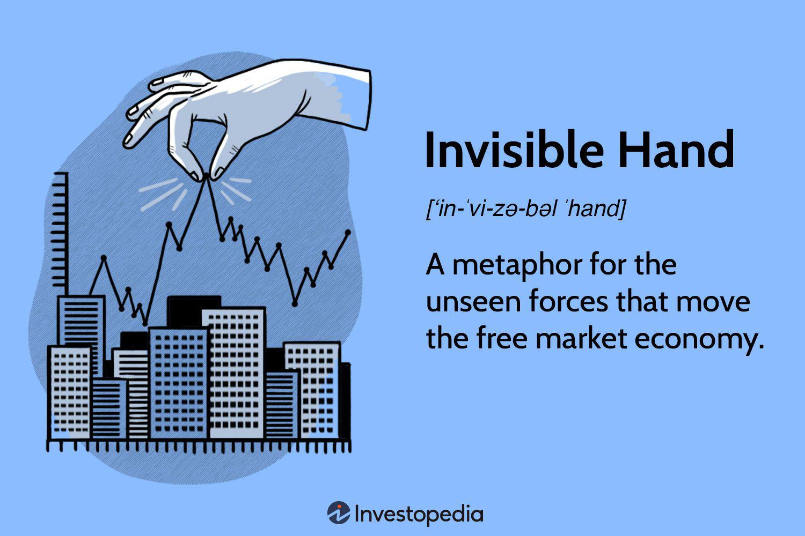

The concept of the 'invisible hand' was introduced by the Scottish economist Adam Smith in his seminal work, "The Wealth of Nations" (1776). The metaphor refers to the self-regulating nature of the marketplace, where individuals pursuing their self-interests inadvertently contribute to the economic well-being of society. Smith argued that through competition and the innate human desire to better one's condition, resources are allocated efficiently, leading to societal benefits even though individuals do not intentionally seek this outcome. The invisible hand has since become a foundational principle of free-market economics and continues to influence economic thought globally.

Adam Smith is often hailed as the father of modern economics due to his profound contributions that laid the groundwork for classical economic theory. His ideas on free markets, division of labor, and competition have significantly shaped contemporary economic policies and practices. Smith's impact extends beyond economics into moral philosophy, where he examined the role of self-interest and morality in commerce.

In contrast, algorithmic trading, or algo trading, represents a modern innovation in financial markets, leveraging mathematical models and automated decision-making processes to execute trades. Typically implemented through complex computer algorithms, this form of trading has gained prominence due to its ability to process substantial volumes of data and execute orders at speeds unattainable by human traders. Algo trading enhances market liquidity, improves price efficiency, and reduces transaction costs, thus playing a critical role in today's finance sector.

The interplay between Adam Smith's 'invisible hand' and algorithmic trading is a fascinating convergence of classical economic principles with cutting-edge technology. This article explores how algo trading, with its automated, self-regulating mechanisms, offers a contemporary illustration of Smith's theory. Readers will gain insights into how these algorithms contribute to market efficiency, mirroring the capitalist ideals endorsed by Smith. However, this relationship is not without complexities, as the ethical implications and potential pitfalls of algo trading challenge the idealized outcomes of the invisible hand.

In exploring these connections, the article illuminates the relevance of Smith's economic philosophy in the context of modern technological advancements. It investigates into the implications of algorithmic trading for market dynamics and examines how traditional economic theories align or clash with current innovations.

## Table of Contents

## Understanding the Invisible Hand

Adam Smith's concept of the "invisible hand" is a foundational theory in classical economics, articulating how individual self-interest in competitive markets can lead to societal benefits. Introduced in Smith's seminal work, "The Wealth of Nations" (1776), the invisible hand metaphor suggests that even when individuals act based on personal gain, the collective interactions within a competitive market can result in optimal outcomes for society.

**Theory of the Invisible Hand**

At its core, the invisible hand describes the unintentional social benefits resulting from individual actions. When individuals pursue their self-interest, they are guided as if by an invisible hand to promote the public good, even without intending to do so. This mechanism shows how personal decisions concerning production, consumption, and economic exchange inadvertently lead to resource allocation that benefits society as a whole.

For instance, consider a butcher or a baker acting out of self-interest to make a profit. While their primary intention is personal economic gain, their actions contribute to society by providing food products to consumers. Moreover, in pursuing their interests, they must operate efficiently and competitively, which naturally tends to enhance product quality and lower prices, benefiting the consumer.

**Historical and Modern Contexts**

Historically, the invisible hand has been observed in various economic systems and periods. During the Industrial Revolution, for example, the entrepreneurial pursuits of individuals like inventors and industrialists led to innovations and efficiencies that propelled economic growth and improved living standards globally. Their motivations were profit-driven, yet their contributions undeniably advanced societal welfare.

In a modern context, technology provides new illustrations of the invisible hand at work. The proliferation of tech companies competing to develop the best software or hardware solutions has not only provided individual organizations with substantial profits but also driven innovation, lower prices, and increased access to technology for consumers worldwide. Companies like Apple and Microsoft exemplify how competitive self-interest can lead to technological advancements that benefit society by enhancing connectivity and productivity.

**Foundation of Free-Market Economics**

The invisible hand is a pivotal element in the foundation of free-market economics, underpinning theories that advocate for minimal government intervention and assert that markets, when left alone, are capable of self-regulation. This concept champions the belief that economic efficiency is best achieved through the decentralized decisions of individual market participants rather than centralized control.

Smith's theory suggests that self-regulating markets naturally adjust supply and demand through price mechanisms. When demand for a product increases, prices tend to rise, encouraging sellers to produce more, which eventually balances the market. Conversely, if a surplus occurs, prices fall, prompting producers to decrease output and restoring equilibrium.

The importance of the invisible hand lies in its ability to explain how decentralized decision-making in free markets can lead to order and prosperity, a principle that continues to drive contemporary economic policies and debates.

In summary, Adam Smith's invisible hand theory portrays an elegant narrative of self-interest leading to societal good, a principle that persists as a cornerstone in understanding the dynamics of free-market economies, both historically and today.

## The Rise of Algorithmic Trading

Algorithmic trading, often referred to as algo trading, is the process of executing orders using pre-programmed trading instructions that consider variables such as time, price, and [volume](/wiki/volume-trading-strategy). The primary function of [algorithmic trading](/wiki/algorithmic-trading) is to enhance decision-making speed and precision in financial markets, leveraging advanced mathematical models and high-speed computation to capitalize on market opportunities that human traders might miss. This approach has significantly transformed traditional trading methods by increasing efficiency and reducing transaction costs.

### History and Evolution

The origins of algorithmic trading can be traced back to the early 1970s with the development of financial markets' electronic communication networks (ECNs). These networks allowed traders to execute stock orders electronically, paving the way for automation. The major turning point came in the late 1980s and early 1990s with the advent of sophisticated computer technologies and the deregulation of financial markets, which facilitated the use of algorithms in trading strategies. The Securities and Exchange Commission’s (SEC) introduction of Regulation National Market System (Reg NMS) in 2005 further accelerated the adoption of algo trading by promoting equal access to market data, ensuring that algorithmic strategies could operate more effectively.

Over the last two decades, algorithmic trading has gained prominence, accounting for a significant proportion of trades in many advanced economies. Today, it is estimated that algorithmic trading constitutes over 60% of all trades in the U.S. stock markets.

### Key Technologies and Practices

Several key technologies and practices have driven the proliferation of algorithmic trading:

1. **High-Frequency Trading (HFT):** A subset of algorithmic trading characterized by rapid execution of a large number of orders within very short time frames. HFT leverages direct market access, co-location services, and high-speed networks.

2. **Machine Learning and AI:** Recent advancements in machine learning and artificial intelligence have enabled the development of sophisticated models that can analyze vast datasets and learn to make predictions, enhancing the adaptability and accuracy of trading algorithms.

3. **Big Data Analytics:** The ability to process and analyze large volumes of data has empowered traders to uncover insights and develop strategies based on real-time information, historical trends, and market sentiment.

4. **Quantitative Trading Strategies:** These involve developing mathematical models that utilize complex statistical methods to identify trading opportunities and manage risks, thus optimizing the decision-making process.

### Impact on Market Efficiency and Liquidity

Algorithmic trading has had significant effects on market efficiency and [liquidity](/wiki/liquidity-risk-premium). By facilitating faster order executions and reducing transaction costs, algorithmic trading enhances liquidity, ensuring that buy and sell orders are fulfilled quickly and at better prices. This increased liquidity contributes to tighter bid-ask spreads and improves market depth.

Moreover, algorithmic trading contributes to market efficiency by continuously arbitraging price discrepancies across different markets and securities. This helps align prices with their fair values and reduces opportunities for market manipulation.

However, while the benefits of algo trading are well-documented, they are not without challenges. Algorithmic trading can lead to unintended market [volatility](/wiki/volatility-trading-strategies), as evidenced by events like the 2010 Flash Crash, where rapid, automated trades triggered a sudden market plunge.

In conclusion, algorithmic trading represents a significant evolution in how financial markets operate, providing both opportunities and challenges. Its continued development and integration within financial markets underscore the necessity of ongoing advancements in technology and regulation to balance innovation with market integrity and stability.

## Connecting Adam Smith's Invisible Hand to Algo Trading

Adam Smith's concept of the invisible hand epitomizes a self-regulating market mechanism driven by individual self-interest that inadvertently promotes societal benefits. In contemporary financial markets, algorithmic trading embodies a similar principle through the use of computer algorithms to automate and optimize trading decisions based on pre-defined criteria. 

Algorithmic trading seeks to emulate Smith's notion of self-regulating markets by employing complex algorithms that execute trades with minimal human intervention. These algorithms are designed to exploit market inefficiencies and capitalize on brief [arbitrage](/wiki/arbitrage) opportunities, thus contributing to overall market efficiency. Similar to the way individual traders in Smith's time were guided by the invisible hand to make profit-maximizing decisions that benefit society, algorithms operate by systematically processing vast amounts of data to make optimal trading decisions quickly and accurately. By doing so, algorithmic trading enhances market liquidity, reduces transaction costs, and narrows bid-ask spreads, which are essential characteristics of efficient markets. 

The effectiveness of algorithmic trading in driving market efficiency can be likened to the benefits attributed to the invisible hand. The algorithms' ability to process information at speeds unattainable by human traders allows them to react to market changes almost instantaneously, thus facilitating price discovery and reducing volatility. One prominent example of algorithmic trading's impact is its role in high-frequency trading ([HFT](/wiki/high-frequency-trading-strategies)), where trades are executed within microseconds. HFT practitioners utilize algorithms to identify and exploit fleeting price discrepancies across different trading platforms, thereby aligning prices more closely with true market values. This constant adjustment and refinement of prices by algorithms acts as an efficient self-regulating mechanism, similar to the invisible hand posited by Smith.

However, the relationship between algorithmic trading and traditional free-market theories is nuanced. On one hand, the automated decision-making in algo trading aligns with free-market principles by fostering competition and improving market dynamics. On the other hand, it poses challenges and potential conflicts. The rapid pace and complexity of algorithmic trading can lead to unintended consequences, such as market manipulation and the exacerbation of systemic risks like flash crashes. These issues raise questions about whether algo trading truly enhances market self-regulation or if it necessitates additional oversight and regulatory intervention to mitigate adverse outcomes. 

In summary, while algorithmic trading can reflect the self-regulating functions described by Adam Smith's invisible hand by enhancing market efficiency and liquidity, it also challenges traditional free-market theories by introducing complexities and risks that require careful management and potential regulation. This duality underscores the evolving nature of modern financial systems and the need to balance technological advancements with foundational economic principles.

## Challenges and Criticisms

Algorithmic trading, while a potent force in modern financial markets, faces substantial criticisms and challenges. A primary concern is market manipulation, where traders use algorithms to create unfair advantages. This manipulation can take various forms, such as spoofing, where orders are placed with no intention of execution to create misleading market demand or supply, only to cancel them once prices have moved in a beneficial direction for the manipulator.

Flash crashes present another significant issue. These are sudden, severe price drops followed by a swift recovery, often triggered by automated trading systems. A notable example occurred on May 6, 2010, when the U.S. markets experienced a rapid downturn, wiping nearly $1 trillion off stock values within minutes. Such incidents raise questions about market stability and the robustness of the algorithms employed.

Ethically, algorithmic trading is often examined against Adam Smith's notion of the invisible hand, which suggests that individuals acting in their self-interest within competitive markets inadvertently contribute to societal benefits. Unlike the natural self-regulation Smith envisioned, algorithmic trading operates with speed and complexity that surpass human capacity, potentially distorting this self-regulatory mechanism. Algorithms act on predefined logic, which may prioritize profit maximization over equitable market participation or the long-term health of financial ecosystems.

The potential negative impacts on financial markets from algorithmic trading must be considered. These technologies can exacerbate volatility, making markets less predictable and potentially deterring long-term investment. In contrast to the controlled chaos of human-driven markets, where deliberate decisions might stabilize prices, algorithms execute trades in microseconds based on exact conditions, sometimes leading to feedback loops and runaway effects.

Concentrated algorithmic activities have led to notable market disruptions. Besides flash crashes, events like the Knight Capital incident in 2012, where a software glitch resulted in a $440 million loss, illustrate how technical errors can propagate through interconnected systems, amplifying risks. In such cases, the concentrated and automated nature of algo trading contrasts starkly with the diverse and distributed decision-making processes typical of human traders that ideally align with the principles of the invisible hand.

In conclusion, while algorithmic trading enhances market efficiency and liquidity, its challenges and criticisms highlight a need to reconcile these innovations with ethical considerations and traditional economic theories. Balancing innovations with robust regulation and oversight will be essential to ensuring that algorithmic trading contributes positively to global financial markets.

## The Future of Economic Thought and Trading

The future relationship between economic theory and advanced trading technologies is poised to be both transformative and complex. As algorithmic trading continues to evolve, it presents a fascinating intersection where traditional economic principles, such as Adam Smith's invisible hand, might be increasingly interpreted through a technological lens. This convergence suggests an evolving financial ecosystem where new interactions and dynamics necessitate reconsideration and potentially even a reinvention of longstanding economic concepts.

Technological advancements, particularly in [artificial intelligence](/wiki/ai-artificial-intelligence), [machine learning](/wiki/machine-learning), and high-frequency trading, are reshaping our understanding of Smith's principles. The notion of the invisible hand as a mechanism of self-regulation through individual self-interest may be reimagined in a landscape where algorithms execute trades at lightning speed based on complex decision-making processes, often with little direct human intervention. These technologies potentially enhance market efficiency and liquidity, akin to the societal benefits Smith ascribed to competitive markets. However, they also introduce unique challenges that question the adequacy of traditional models. 

In response to these advancements, economists and financial theorists are exploring new models that integrate and adapt traditional economic thought to better fit modern trading environments. Concepts such as behavioral economics and network theory are being harnessed to account for the fact that markets driven by algorithmic trading may not strictly follow traditional assumptions of rationality or independence. These models aim to provide a more nuanced understanding of market dynamics that can account for the rapid and interconnected nature of modern financial transactions. 

Regulation emerges as a critical [factor](/wiki/factor-investing) in balancing innovation with market stability. While technological advancements push the boundaries of what is possible, they also pose risks such as increased volatility and systemic vulnerabilities, illustrated by phenomena like flash crashes. Thus, regulatory frameworks must evolve in tandem, promoting innovation while ensuring that markets remain stable and fair. This involves not only stricter oversight and real-time monitoring of trading activities but also promoting transparency and ethical considerations in the design and application of trading algorithms. 

Overall, the future of economic thought and trading will likely require an adaptive and interdisciplinary approach, blending economic theories with technological insights. This synthesis promises not only to refine our understanding of foundational principles like Smith's invisible hand but also to potentially develop new paradigms that are better suited to navigating the complexities of tomorrow's financial markets.

## Conclusion

Throughout this article, we have examined the intriguing interplay between Adam Smith's concept of the invisible hand and the modern phenomenon of algorithmic trading. The invisible hand, a metaphor introduced by Smith, suggests that individuals pursuing their self-interest inadvertently contribute to the overall good of society through the self-regulating nature of competitive markets. This principle has been foundational in shaping economic theory and its enduring relevance is now being tested against the backdrop of today's digital trading landscape.

Algorithmic trading, with its capacity to process vast volumes of data at incredible speeds, represents a technological advancement that echoes the self-regulating functions Smith described. By leveraging complex algorithms, financial markets can achieve greater efficiency and liquidity, aligning with the beneficial outcomes Smith envisioned. However, this alignment is not without its challenges and contradictions. The potential for market manipulation and episodic economic disruptions, such as flash crashes, highlight the need for a careful fusion of economic theory with technological prowess.

The importance of integrating time-honored economic principles with technological innovation cannot be overstated in the endeavor to shape future markets. As technology continues to evolve, so too must our economic models and regulatory frameworks. This evolution requires a nuanced understanding of how Smith's principles can be applied in new contexts to maintain market stability and promote equitable growth.

Ultimately, the interplay between foundational economic principles and contemporary financial innovations invites further exploration. Such inquiry promises to enrich our understanding of market dynamics and guide the development of more robust, efficient, and ethical financial systems. As we continue to marry older economic ideas with modern technological capabilities, there is a rich landscape of opportunity awaiting those who venture into this intersection.

## References & Further Reading

[1]: Smith, Adam. (1776). ["The Wealth of Nations."](https://archive.org/details/inquiryintonatur01smit_0/) Project Gutenberg.

[2]: Biais, B., Foucault, T., & Moinas, S. (2015). ["Equilibrium Fast Trading."](https://www.sciencedirect.com/science/article/pii/S0304405X15000288) The Review of Financial Studies, 28(7), 1899-1935.

[3]: Harris, L. (2003). "Trading and Exchanges: Market Microstructure for Practitioners." Oxford University Press.

[4]: Aldridge, I. (2013). ["High-Frequency Trading: A Practical Guide to Algorithmic Strategies and Trading Systems."](https://www.ahmetbeyefendi.com/wp-content/uploads/2020/07/High-Frequency-Trading-Irene-Aldridge.pdf) Wiley.

[5]: Hendershott, T. & Riordan, R. (2013). ["Algorithmic Trading and the Market for Liquidity."](https://www.cambridge.org/core/journals/journal-of-financial-and-quantitative-analysis/article/abs/algorithmic-trading-and-the-market-for-liquidity/C1A34D3767436529EA4F23DB1780273C) Journal of Finance, 68(1).