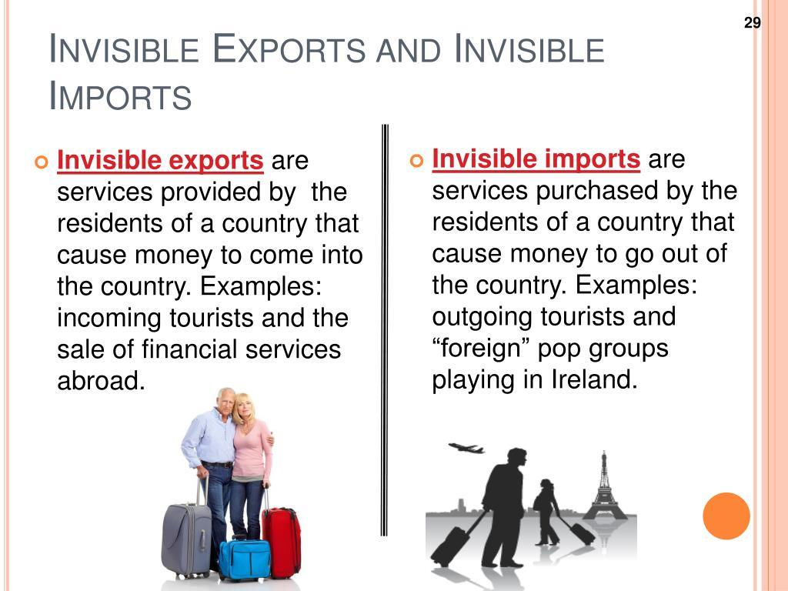

Economic trade encompasses a vast array of transactions that form the backbone of the global economy. Among the different facets of trade, invisible trade, services trade, and algorithmic trading stand out as crucial components, each contributing uniquely to economic dynamism.

Invisible trade refers to the exchange of intangible goods and services, distinguishing itself from visible trade, which involves the physical movement of goods. It includes activities such as banking, insurance, and technology services, reflecting an era where the value lies not in physical assets but in expertise and innovation. These elements of invisible trade are becoming increasingly pivotal due to globalization and technological advancement, transforming how countries engage economically.

Services trade, forming a significant part of invisible trade, underscores this transformation. It comprises industries ranging from finance to education, representing a substantial portion of global GDP. The digital revolution has only amplified the importance of services trade, given that digital platforms enable seamless international commerce in services, expanding market reach and enhancing economic interactions. Services trade is vital not only for economic growth but also for fostering innovation and employment across borders.

Parallel to these developments, algorithmic trading has revolutionized financial markets. It leverages sophisticated algorithms to execute trades at speeds and volumes impossible for humans. This technological advancement ensures greater efficiency, reduced costs, and decreased reliance on human intervention, reshaping modern economic exchanges. Algorithmic trading is intertwined with other forms of trade through the provision of liquidity and market stability, although it introduces challenges such as market volatility and regulatory concerns.

These types of economic trade are interconnected, influencing and shaping global economic landscapes. Their growing significance calls for a comprehensive understanding of how they operate and interact. This article explores the nuances of invisible trade, services trade, and algorithmic trading, underscoring their impact on the future of global commerce. As the world becomes increasingly digital and interconnected, recognizing and adapting to these trade types is essential for sustaining economic growth and stability.

## Table of Contents

## Understanding Invisible Trade

Invisible trade refers to the exchange of intangible services across borders, distinguishing it from visible trade which encompasses the transfer of physical goods between nations. While visible trade covers commodities such as electronics, food products, and raw materials, invisible trade involves services like banking, insurance, and technology-driven sectors. This branch of trade has grown significantly, with advancements in technology and globalization heavily contributing to its expansion.

Key areas of invisible trade include sectors such as financial services, insurance, telecommunications, and intellectual property. These services are pivotal in the global economy, fostering connectivity and efficiency. For instance, the banking sector facilitates international transactions and provides capital flow between countries, while insurance services mitigate risks associated with investments and large-scale enterprises.

Invisible trade also includes burgeoning sectors like customer service outsourcing and medical tourism. Outsourcing customer services to countries with lower labor costs allows businesses to operate more efficiently and maintain competitiveness. Similarly, medical tourism—where patients travel to other nations for medical services—leverages lower costs and access to specialized care, creating significant economic activity in host countries.

The impact of invisible trade on a country's trade balance cannot be overstated. It contributes to the balance of payments, an economic indicator that summarizes a nation's transactions with the rest of the world. A positive balance in invisible trade can offset deficits in visible trade, stabilizing a country's overall trade balance and enhancing economic resilience. For example, a nation proficient in tech services or with a robust financial sector might experience trade surpluses, despite importing more goods than it exports.

Given the intricacies and non-tangible nature of services, measuring invisible trade often presents challenges. Calculating its impact requires not only tracking cross-border service transactions but also assessing intangibles such as intellectual property rights and digital services. As technology continues to evolve, invisible trade is likely to play an increasingly crucial role in shaping economic dynamics worldwide.

## The Role of Services Trade

Services trade represents a substantial component of invisible trade, playing an increasingly vital role in global economic activities. Unlike tangible goods, services are intangible, encompassing activities that do not result in ownership of physical products. Significant varieties of services within this domain include financial services, tourism, and education, each contributing to the economic well-being of nations.

The economic impact of services trade can be considerable. Financial services, for example, underpin the functioning of both domestic and international markets by providing mechanisms for savings, investments, and risk management. These services contribute to the [liquidity](/wiki/liquidity-risk-premium) and stability of markets and facilitate international trade by offering credit and payment services. Tourism, as a significant service sector, injects foreign exchange into local economies, often providing substantial revenue for countries with natural and cultural attractions. Education, particularly higher education and skill development programs, attracts international students whose fees and living expenses support host economies.

Services trade is inherently global, often transcending national borders through cross-border delivery mechanisms like the internet. This global characteristic enhances the contribution of services trade to the Gross Domestic Product (GDP) of many countries. Nations are increasingly integrating services into their economic structures, reflecting a shift from manufacturing to service-oriented economies. For example, the export of software services from India has significantly contributed to its GDP, illustrating the indispensable role of services in economic growth.

Intellectual property and consultancy services also play prominent roles within services trade. The creation and protection of intellectual property, such as patents and copyrights, stimulate innovation and creativity, leading to new products and processes that can be traded globally. Consultancy services provide expert insights across various industries, enhancing efficiency and effectiveness and often leading to increased competitiveness in the global market.

Services trade can substantially support economic growth and development by creating jobs, fostering innovation, and enhancing the quality of life. It provides employment opportunities across diverse sectors, often leading to higher wages and better career prospects. Furthermore, by fostering an environment conducive to innovation and knowledge exchange, services trade can stimulate technological advancements and productivity gains.

In summary, services trade is a crucial driver of the contemporary economy, influencing GDP, promoting development, and facilitating international cooperation. Its significance is amplified in an increasingly digital world, where technological advancements continue to broaden the scope and impact of services exchanged globally.

## Algorithmic Trading in Modern Markets

Algorithmic trading, often synonymous with automated trading, refers to the use of computer algorithms to manage orders for the purposes of trading financial assets. This approach has become integral to modern financial markets due to its ability to process vast amounts of data at speeds impossible for human traders. Algorithms can execute strategies based on quantitative models, and their significance is underscored by their predominant role in various markets.

Technological advancements have significantly revolutionized trading practices. With the advent of high-frequency trading ([HFT](/wiki/high-frequency-trading-strategies)), algorithms can execute transactions in fractions of a second, allowing traders to capitalize on minute price movements that would be imperceptible without such technology. This capability is underpinned by sophisticated infrastructure, including co-located servers near stock exchanges to minimize latency and employ advanced data analytics to interpret market trends.

One of the primary benefits of [algorithmic trading](/wiki/algorithmic-trading) is speed. Algorithms can identify, analyze, and act upon market events faster than any human can. Efficiency is another key advantage, as these systems can manage large volumes of trades consistently while also monitoring multiple markets simultaneously. Furthermore, the reduction of human error is a notable benefit, as automated systems can eliminate biases and emotional decision-making that can affect trading outcomes.

However, algorithmic trading also has profound implications for market dynamics. For instance, it has changed the traditional liquidity landscape by providing liquidity to the markets, albeit sometimes exacerbating [volatility](/wiki/volatility-trading-strategies) during periods of instability. The flash crash of May 2010 is a stark reminder of how these systems can, under certain conditions, contribute to extreme market behavior.

Potential risks and challenges associated with automated trading systems include the occurrence of "rogue algorithms" that may execute unintended trades due to programming errors or unforeseen market conditions. Furthermore, the complexity of these systems can make it difficult to detect and mitigate faults in real time. Regulatory bodies face significant challenges in catching up with the rapid pace of technological change to ensure these systems operate transparently and responsibly.

In conclusion, while algorithmic trading offers numerous advantages, including speed and efficiency, it also poses several risks that require careful management. Properly balancing these considerations is essential for maintaining stable and fair financial markets. As innovations continue, the need for robust regulatory frameworks and adaptive trading strategies will remain pivotal in navigating the evolving landscape of algorithmic trading.

## Economic Impact and Regulatory Considerations

Invisible trade and algorithmic trading play significant roles in shaping global economic landscapes. Invisible trade, encompassing non-tangible exchanges like services, can significantly impact national trade balances and GDP figures. For example, countries with a robust service sector often see a positive impact on their economic performance. Algorithmic trading, on the other hand, has brought a transformative change to financial markets by improving transaction speeds and reducing costs.

**Regulatory Challenges**

With the rise of invisible trade and algorithmic trading, regulatory challenges have emerged. Invisible trade, by its intangible nature, makes it difficult to monitor and regulate. Countries face challenges related to taxation, cross-border regulations, and ensuring fair competition. Similarly, algorithmic trading poses challenges in terms of market fairness and stability. High-frequency trading, a form of algorithmic trading, could potentially lead to market manipulation or flash crashes, necessitating thorough oversight.

**Policy Frameworks for Risk Management**

Effective policy frameworks are essential to mitigate the risks associated with these sectors. For invisible trade, such frameworks could include harmonized international taxation rules and standards for cross-border service exchanges. Algorithmic trading requires regulations that ensure transparency and limit market abuse. These might involve implementing circuit breakers to prevent flash crashes and requiring detailed audits of trading algorithms.

**International Cooperation**

The regulation of invisible trade particularly benefits from international cooperation. As services cross borders, countries need to coordinate their regulatory efforts to prevent tax evasion and protect local industries from unfair competition. Initiatives like the World Trade Organization (WTO) can facilitate such cooperation by promoting global standards for service trades.

**Regulatory Mechanisms for Algorithmic Trading**

Specific mechanisms are already in place to govern algorithmic trading. Authorities like the Securities and Exchange Commission (SEC) in the United States and the Financial Conduct Authority (FCA) in the UK enforce regulations aimed at maintaining market integrity. These include requirements for algorithm testing, obligatory reporting of trading activities, and provisions to manage the risks associated with high-frequency trading.

In conclusion, while invisible trade and algorithmic trading offer substantial economic benefits, they also pose significant challenges that require effective regulatory approaches. International cooperation and robust policy frameworks are paramount to harness their advantages while minimizing potential risks.

## Future Trends and Predictions

As global economies evolve, future trends in invisible trade, services trade, and algorithmic trading indicate significant transformations driven by technological advancements and globalization.

Technological innovations such as blockchain, [artificial intelligence](/wiki/ai-artificial-intelligence) (AI), and [machine learning](/wiki/machine-learning) (ML) are paving the way for enhanced efficiency and innovation in services trade. Blockchain technology, for instance, offers secure and transparent transaction processes that can streamline cross-border services such as financial services, legal consulting, and more. This could lead to a more integrated global market, allowing businesses of all sizes to participate more actively in international trade.

Artificial intelligence and machine learning are reshaping service delivery models, offering predictive insights and automation capabilities that improve customer experiences. In sectors like healthcare, AI-driven diagnostic tools and telemedicine services are expanding access to medical expertise across borders, suggesting a trend towards the globalization of healthcare services. Similarly, educational services are experiencing a transformation through e-learning platforms, enabling international access to courses and instructors, further integrating global education systems.

Algorithmic trading continues to grow in sophistication, driven by advances in computational power and data analytics. The increasing adoption of algorithmic solutions in trading activities enhances the speed and accuracy of trades, influencing market dynamics worldwide. High-frequency trading, enabled by rapid advancements in internet speed and computational performance, allows traders to execute millions of transactions per second, leveraging minute price differentials for profit. This capability underscores the critical role of technology in modern financial markets, where the competitive edge increasingly lies in algorithms' efficiency and speed.

The proliferation of big data analytics provides another catalyst for growth. By analyzing vast amounts of market data, algorithms can identify trends and opportunities with precision, facilitating more informed decision-making. This trend highlights the growing dependency on data scientists and analysts in the financial sector, a shift that introduces new skill requirements and job roles within the industry.

As global trade moves further into the digital era, the convergence of these technologies promises continued expansion and innovation within invisible trade, services, and algorithmic trading. Companies and countries that adapt to these changes stand to benefit significantly, positioning themselves as leaders in a rapidly evolving economic landscape. However, this evolution also calls for updated regulatory frameworks to manage potential risks and ensure equitable growth across regions. The future landscape of global trade will likely reflect a digital ecosystem where technology-driven solutions inform and shape economic interactions on a global scale.

## Conclusion

In summarizing the exploration of economic trade, particularly invisible trade, services trade, and algorithmic trading, it becomes evident that these components are integral to the fabric of the modern global economy. Invisible trade, encompassing a variety of intangible services, plays a crucial role in national and international trade balances, contrasting with the exchange of physical goods. The growing prominence of services trade, including sectors like finance, tourism, and intellectual property, signifies its substantial contribution to GDP and economic development.

Algorithmic trading, driven by technological advancements, has transformed financial markets by enhancing speed, efficiency, and accuracy in trading operations. However, the reliance on algorithms presents unique challenges, including potential systemic risks that necessitate comprehensive regulatory frameworks. It is essential to balance fostering innovation with the need for stability and risk management.

There is a compelling need for ongoing research and understanding of these economic areas to navigate the complexities of global trade dynamics. Policymakers, businesses, and investors are called to adapt and remain vigilant to the evolving landscape, ensuring that regulations are aligned with growth objectives while safeguarding against potential disruptions. As the digital era progresses, the interplay between these trade types will undoubtedly shape future economic paradigms, prompting a proactive approach in policy and strategic planning.

## References & Further Reading

[1]: ["International Trade in Services and Intangibles in the Era of Globalization"](https://www.nber.org/books-and-chapters/international-trade-services-and-intangibles-era-globalization) by Marshall Reinsdorf and Matthew J. Slaughter

[2]: ["Globalization of Services: Some Implications for Theory and Practice"](https://www.taylorfrancis.com/books/mono/10.4324/9780203465363/globalization-services-lilach-nachum-yair-aharoni) by Yair Aharoni and Lilach Nachum

[3]: DeLuca, L. (2018). ["The Impact of Algorithmic Trading on the Financial Markets."](https://www.researchgate.net/publication/378548435_Algorithmic_Trading_and_AI_A_Review_of_Strategies_and_Market_Impact) Master's Thesis, Sacred Heart University.

[4]: Hendershott, T., Jones, C. M., & Menkveld, A. J. (2011). ["Does Algorithmic Trading Improve Liquidity?"](https://onlinelibrary.wiley.com/doi/full/10.1111/j.1540-6261.2010.01624.x) The Journal of Finance, 66(1), 1-33.

[5]: ["Algorithmic and High-Frequency Trading"](https://www.cambridge.org/us/universitypress/subjects/mathematics/mathematical-finance/algorithmic-and-high-frequency-trading) by Alvaro Cartea, Sebastian Jaimungal, and José Penalva