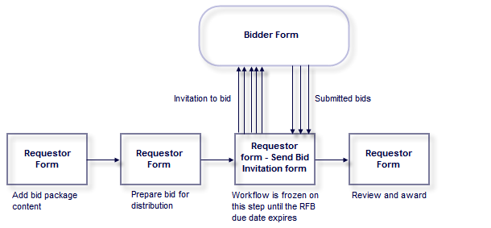

## Table of Contents

## What is an Invitation for Bid (IFB)?

An Invitation for Bid (IFB) is a type of document used by organizations, often government agencies, to invite companies to submit bids for providing specific goods or services. It is a formal way to ask businesses to compete for a contract by offering their best price and terms. The IFB includes detailed information about what the organization needs, the rules for bidding, and the deadline for submitting bids.

Once companies receive the IFB, they prepare and submit their bids, which are then evaluated based on the criteria set out in the document. The main goal of an IFB is to ensure a fair and transparent process where the contract is awarded to the bidder who offers the best value, usually the lowest price that meets all the requirements. This method helps organizations get the best deal and maintain fairness in the bidding process.

## Why is an Invitation for Bid important in procurement?

An Invitation for Bid is important in procurement because it helps organizations find the best deal for what they need. When a government agency or a company needs to buy something or hire someone for a job, they use an IFB to ask different businesses to offer their best price. This way, the organization can compare all the offers and choose the one that gives them the most value for their money. It's like shopping around to find the best deal, but in a more formal and organized way.

Using an IFB also makes the procurement process fair and transparent. Everyone who wants to bid knows exactly what the rules are and what they need to do. This means that all businesses have an equal chance to win the contract, as long as they meet the requirements. It helps prevent favoritism and corruption because the decision is based on clear criteria, usually the lowest price that meets all the needs. This fairness builds trust in how the organization handles its buying and hiring.

## What are the key components of an IFB?

An Invitation for Bid (IFB) has several important parts that help make the bidding process clear and fair. The first part is a detailed description of what the organization needs. This can be a list of goods, like computers or desks, or services, like cleaning or building something. The description needs to be very clear so that all the companies know exactly what they are bidding on. The IFB also includes the rules for bidding. These rules tell companies how to submit their bids, what information they need to include, and any other requirements they must follow.

Another key part of an IFB is the deadline for submitting bids. This tells companies when they need to have their bids in by, so everyone has the same amount of time to prepare. The IFB also explains how the bids will be evaluated. Usually, the contract goes to the company that offers the lowest price, but the bid must meet all the requirements listed in the IFB. This part helps make sure the process is fair and that the organization gets the best deal.

Lastly, the IFB includes any special terms and conditions that the winning company must agree to. These can be things like how long the contract will last, how payments will be made, and any penalties for not doing the job right. Having all these parts in an IFB helps make sure that the bidding process is organized, clear, and fair for everyone involved.

## How does the IFB process work step-by-step?

When an organization needs to buy something or hire someone for a job, they start the IFB process by making a document called an Invitation for Bid. This document tells companies what the organization needs, the rules for bidding, and the deadline for submitting bids. The organization then sends out the IFB to different companies, inviting them to offer their best price for the job or goods. Companies that want to bid read the IFB carefully and prepare their bids according to the rules. They make sure their bids include everything the IFB asks for, like the price, how long the job will take, and any other details.

Once the deadline passes, the organization collects all the bids that were submitted on time. They then start evaluating the bids based on the criteria in the IFB, usually looking for the lowest price that meets all the requirements. The organization might have a team of people who go through each bid carefully to make sure it follows all the rules. After they decide which bid is the best, they announce the winner and start the process of making a contract with that company. The whole process is designed to be fair and transparent, giving every company an equal chance to win the contract.

## Who can participate in an IFB?

Anyone who wants to can participate in an Invitation for Bid, as long as they meet the rules set out in the IFB. This means that any company or business that can provide the goods or services the organization needs can submit a bid. They just need to make sure they follow all the instructions and requirements in the IFB document.

The IFB is open to everyone who qualifies, so it's a fair chance for all businesses to compete. This includes small businesses, big companies, and even new businesses that have never worked with the organization before. As long as they can meet the needs described in the IFB and submit their bid on time, they can take part in the bidding process.

## What are the differences between an IFB and a Request for Proposal (RFP)?

An Invitation for Bid (IFB) and a Request for Proposal (RFP) are both ways organizations ask businesses to offer their services or goods, but they are used for different situations. An IFB is used when the organization knows exactly what it needs and wants the lowest price. The IFB is very clear about what the organization wants, and the companies that bid just need to offer their best price to meet those needs. The winner of an IFB is usually the company that offers the lowest price while still meeting all the requirements.

On the other hand, an RFP is used when the organization isn't sure about all the details of what it needs, and it wants companies to come up with their own ideas and solutions. An RFP asks companies to propose how they would solve a problem or meet a need, and it's not just about the price. The organization looks at the ideas, the quality of the proposal, and how well the company can do the job. The winner of an RFP is the company that offers the best solution overall, not just the lowest price.

## How should one prepare an effective IFB document?

To prepare an effective Invitation for Bid (IFB) document, start by clearly describing what you need. This means listing all the goods or services you want to buy in detail. Make sure the description is easy to understand so that all the companies know exactly what you are asking for. Next, include the rules for bidding. These rules should tell companies how to submit their bids, what information they need to include, and any other requirements they must follow. It's important to make these rules clear and fair for everyone.

Also, set a deadline for submitting bids and include it in the IFB. This deadline gives all the companies the same amount of time to prepare their bids. After that, explain how you will evaluate the bids. Usually, you will choose the lowest price that meets all your needs, so make sure to say this in the IFB. Finally, include any special terms and conditions that the winning company must agree to. These can be things like how long the contract will last or how payments will be made. By including all these parts, your IFB will be clear and help you get the best deal in a fair way.

## What are common mistakes to avoid when creating an IFB?

When creating an IFB, one common mistake is not being clear about what you need. If your description of the goods or services is confusing, companies might not know what to bid on. This can lead to bids that don't meet your needs or companies not bidding at all. Make sure to write a clear and detailed description so everyone understands exactly what you want.

Another mistake is not setting clear rules for bidding. If the rules are vague or missing, companies might not know how to submit their bids or what information to include. This can cause confusion and make the process unfair. Always include clear rules and a deadline so everyone has the same chance to bid.

Lastly, forgetting to explain how you will evaluate the bids can cause problems. If companies don't know how you will choose the winner, they might not know how to make their bid stand out. Always say in the IFB that you will choose the lowest price that meets all your needs. This helps keep the process fair and transparent.

## How can transparency be ensured during the IFB process?

Transparency during the IFB process can be ensured by making sure the Invitation for Bid document is clear and detailed. This means writing down exactly what you need, the rules for bidding, and how you will pick the winner. When everyone can see all the information, it helps keep the process fair. Also, share the IFB with as many companies as possible so that everyone has a chance to bid. This way, no one feels left out and everyone knows the same information.

Another way to ensure transparency is by sticking to the rules and deadlines in the IFB. Make sure all bids are opened at the same time and in front of people if needed. This shows that you are not favoring any company. After choosing the winner, let everyone know who won and why. This helps build trust because companies can see that the process was fair and that the best bid was chosen.

## What role does the evaluation criteria play in an IFB?

The evaluation criteria in an IFB are very important because they tell companies how their bids will be judged. Usually, the main thing the organization looks at is the price. They want to find the lowest price that still meets all their needs. By having clear evaluation criteria, the organization makes sure everyone knows what is important. This helps keep the bidding process fair and open because all companies know what they need to do to win the contract.

Having clear evaluation criteria also helps the organization make a good decision. When everyone knows the rules, the bids that come in are more likely to meet the organization's needs. This means the organization can pick the best bid and get the best value for their money. It also builds trust because companies can see that the process is fair and that the winner was chosen based on clear and fair rules.

## How do you handle bid protests or disputes in an IFB?

When a company doesn't agree with how the winner of an IFB was chosen, they can file a bid protest or dispute. This means they tell the organization that they think something was done wrong or unfairly. The organization then looks at the protest carefully. They check to make sure they followed all the rules in the IFB and that the winner was chosen fairly. If they find a mistake, they might need to change their decision or start the bidding process over.

Handling bid protests well is important for keeping the IFB process fair and trusted. The organization needs to listen to the company's concerns and look into them seriously. They should also keep everything open and clear, so everyone can see that they are being fair. If the protest is about something that can be fixed, the organization should fix it. This helps make sure that the best bid wins and that everyone feels the process was fair.

## What advanced strategies can enhance the success of an IFB?

One advanced strategy to enhance the success of an IFB is to use pre-bid meetings. These meetings let companies ask questions about the IFB before they submit their bids. This helps clear up any confusion and makes sure everyone understands what the organization needs. It also shows that the organization wants to be fair and open, which can encourage more companies to bid. Another strategy is to use a two-step bidding process. In the first step, companies show that they can do the job without giving a price. In the second step, only the companies that passed the first step give their prices. This helps the organization find the best companies before they look at the prices.

Another strategy is to use technology to make the IFB process easier and more transparent. Online bidding platforms can help companies submit their bids more easily and let the organization manage the bids better. These platforms can also show all the bids to everyone at the same time, which helps keep the process fair. Finally, always keep good records of everything in the IFB process. This means writing down all the steps, the bids, and any decisions made. Good records help if there is a bid protest, and they show that the organization was fair and open throughout the process.

## What is Bid Algo Trading: The Technological Edge?

Bid algo trading employs advanced algorithms that enable the automation and execution of bids within financial markets. These algorithms process vast datasets in real time, optimizing bid strategies by adapting to ever-changing market conditions. This technological integration allows traders to navigate complex financial landscapes with efficiency and precision.

At the core of bid algo trading is its ability to process data and react swiftly to market signals. This capability is crucial, as the financial markets are characterized by rapid and often unpredictable changes. Through [algorithmic trading](/wiki/algorithmic-trading), traders can exploit inefficiencies and price discrepancies, allowing for improved market outcomes. For instance, algorithmic models are adept at identifying [arbitrage](/wiki/arbitrage) opportunities, where an asset might be underpriced in one market and overpriced in another, thus providing a chance to simultaneously buy low and sell high for profit. Mathematically, this can be represented as:

$$
P_{\text{buy}} < P_{\text{sell}}
$$

where $P_{\text{buy}}$ and $P_{\text{sell}}$ are the asset prices in two different market conditions.

A key feature enhancing the efficiency of bid algo trading is the 'Bid Wanted in Competition' (BWIC) mechanism. BWIC is a process where institutional traders invite bids for a specific inventory of assets, thus fostering transparency and competitive pricing. It enables sellers, often large financial firms, to gauge market interest and secure favorable transaction terms by comparing multiple bids with similar parameters.

Moreover, the continuous adaptation of these algorithms allows for strategic modifications based on historical and real-time data. By leveraging [machine learning](/wiki/machine-learning) techniques, algorithms can learn from previous trading patterns and outcomes, tweaking their operations to suit current market environments. For example, a simple moving average crossover strategy in Python might be implemented as follows:

```python
import pandas as pd

def moving_average_crossover(data, short_window=40, long_window=100):
    signals = pd.DataFrame(index=data.index)
    signals['price'] = data['price']
    signals['short_mavg'] = data['price'].rolling(window=short_window, min_periods=1, center=False).mean()
    signals['long_mavg'] = data['price'].rolling(window=long_window, min_periods=1, center=False).mean()
    signals['signal'] = 0.0
    signals['signal'][short_window:] = np.where(signals['short_mavg'][short_window:] 
                                                  > signals['long_mavg'][short_window:], 1.0, 0.0)
    signals['positions'] = signals['signal'].diff()
    return signals

# Sample usage
# data = pd.read_csv('market_data.csv')  # Assumed market data with a 'price' column
# signals = moving_average_crossover(data)
```

This code snippet illustrates a basic strategy where buy and sell signals are generated based on the crossing of short-term and long-term moving averages, which the algorithm can use to optimize bid placements.

Adopting bid algo trading is vital for participants aiming to maintain a competitive edge in the fast-paced financial markets. This approach not only enhances decision-making but also offers a scalable method for handling large volumes of transactions without sacrificing accuracy or speed. As markets continue to evolve with technological advancements, embracing algorithmic trading remains a key [factor](/wiki/factor-investing) in achieving success and capitalizing on financial opportunities.

## References & Further Reading

[1]: ["Advances in Financial Machine Learning"](https://www.amazon.com/Advances-Financial-Machine-Learning-Marcos/dp/1119482089) by Marcos Lopez de Prado

[2]: ["Evidence-Based Technical Analysis: Applying the Scientific Method and Statistical Inference to Trading Signals"](https://www.amazon.com/Evidence-Based-Technical-Analysis-Scientific-Statistical/dp/0470008741) by David Aronson

[3]: ["Machine Learning for Algorithmic Trading: Predictive models to extract signals from market and alternative data for systematic trading strategies with Python"](https://www.amazon.com/Machine-Learning-Algorithmic-Trading-alternative/dp/1839217715) by Stefan Jansen

[4]: ["Quantitative Trading: How to Build Your Own Algorithmic Trading Business"](https://www.amazon.com/Quantitative-Trading-Build-Algorithmic-Business/dp/1119800064) by Ernest P. Chan

[5]: [Bergstra, J., Bardenet, R., Bengio, Y., & Kégl, B. (2011). "Algorithms for Hyper-Parameter Optimization."](https://dl.acm.org/doi/10.5555/2986459.2986743) Advances in Neural Information Processing Systems 24.