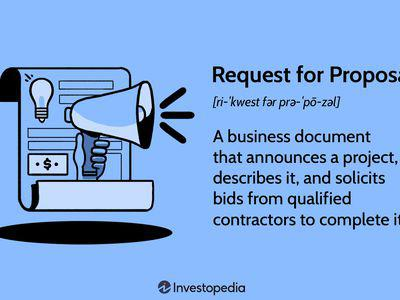

In the world of modern finance, bidding processes and algorithmic trading have become central components of market operations. These mechanisms ensure that transactions are executed efficiently across a variety of sectors. Bidding occurs on various platforms and industries, such as real estate, stock exchanges, and government contracts. This explains its pivotal role in modern economic activities. In the context of real estate, for instance, bids determine property prices in competitive markets, while on stock exchanges, bidding processes facilitate the dynamic determination of asset prices, allowing for efficient market functioning.

Algorithmic trading has significantly changed how bids are structured and executed, enhancing precision, speed, and efficiency. By utilizing complex algorithms, traders can analyze vast amounts of data, executing trades within fractions of a second. This development in technology provides traders with a substantial advantage, particularly in highly competitive environments where reaction times are crucial.



The integration of bidding examples, bid processes, and algorithmic trading illustrates their interactions and impacts. For instance, algorithmic trading can optimize the bid process by using predictive analytics and real-time market data. This allows market participants to stay competitive and make informed decisions based on current market trends. Algorithmic strategies also help identify pricing inefficiencies and opportunities, further enhancing market dynamics.

The evolution of these systems demonstrates the growing complexity and interdependence of modern financial markets. Understanding these interactions allows for the exploration of the profound impacts they have on market efficiency and the overall economic landscape. As a result, staying informed about advancements in these areas is paramount for market participants aiming to thrive in an evolving financial landscape.

## Table of Contents

## What is an Invitation For Bid (IFB)?

An Invitation For Bid (IFB) is a formal procurement process primarily utilized when selecting a provider based on price. It serves as a method for organizations to solicit bids from prospective suppliers or contractors, particularly when detailed specifications for a project are available. The objective is to identify the lowest-priced bid that meets the predetermined criteria. 

In an IFB, the procuring entity provides comprehensive details about the project requirements, including technical specifications, scope of work, and any necessary certifications or qualifications. These specifications ensure that bidders have a clear understanding of the project, facilitating a competitive environment where the price is the key differentiator among bids.

The IFB process is prominently used for large-scale projects, notably in infrastructure and transportation sectors. When extensive construction, public works, or transportation projects are planned, IFBs enable the contracting authorities to efficiently assess bids, assuring that the most cost-effective and compliant bid is selected. This is particularly important in government contracts, where fiscal responsibility and adherence to public procurement laws are paramount.

The structured nature of the IFB process reinforces transparency in the bidding process. By openly publishing the specifications and criteria, all potential bidders receive the same information, mitigating any perceived favoritism or bias. Furthermore, by clearly defining project requirements, the potential for quality risks is minimized, ensuring that the selected bid is not only price-competitive but also capable of delivering the required outcomes as per the stipulated standards.

In summary, an Invitation For Bid streamlines the procurement of services and projects by establishing a clear and competitive framework where price is the primary [factor](/wiki/factor-investing) in bid selection, fostering an equitable process that aligns with both fiscal and quality assurance goals.

## Understanding the Bid Process

The bid process is an integral component of procurement and business development strategies, ensuring the acquisition of goods or services at the best possible price under specific conditions. It typically encompasses several stages, sequentially organized to streamline the decision-making process and enhance efficiency.

The first stage is pre-qualification, a crucial filtering mechanism that determines which candidates possess the requisite capabilities and resources necessary to fulfill contract obligations. This stage often involves a review of the bidder's technical competence, financial stability, and past performance. Only those who meet the defined criteria are invited to submit formal bids, thereby ensuring that the competitive process is both manageable and meaningful.

Following pre-qualification is bid preparation. During this phase, potential suppliers or contractors create their proposals, focusing on offering competitive pricing and demonstrating their ability to meet the project's specifications and deadlines. This stage requires a comprehensive understanding of the invitation for bid (IFB) or request for proposal (RFP) documents, which outline the project requirements and terms of the contract.

Once bids are prepared, they proceed to submission. Depending on the nature of the bid process—be it sealed bidding or an open auction format—bidders must adhere to deadlines and ensure their offers are complete and compliant with submission guidelines. Auction-style bids, for instance, may require real-time submissions where offers are adjusted dynamically in response to market conditions or competitor pricing.

The evaluation phase follows submission, where submitted bids are rigorously assessed based on pre-determined criteria such as price, technical capability, delivery schedules, and risk management strategies. This stage often involves a panel or committee that systematically reviews each proposal to ensure objectivity and fairness. The evaluation may employ quantitative scoring systems to rank offers, facilitating a transparent comparison of competing bids.

Finally, the process culminates in the contract award. Here, the successful bidder is formally notified, and contractual negotiations, if necessary, finalize the terms of engagement. The award decision is typically guided by the principle of obtaining the best value, balancing cost with quality and performance assurances. Upon awarding the contract, the selected bid transitions from a proposal into a formal contractual agreement, marking the commencement of the project's execution phase.

Understanding and effectively navigating these stages is essential for both procurers and suppliers, as each stage presents unique challenges and opportunities to optimize competitive advantage.

## Bid Algo Trading: The Technological Edge

Bid algo trading employs advanced algorithms that enable the automation and execution of bids within financial markets. These algorithms process vast datasets in real time, optimizing bid strategies by adapting to ever-changing market conditions. This technological integration allows traders to navigate complex financial landscapes with efficiency and precision.

At the core of bid algo trading is its ability to process data and react swiftly to market signals. This capability is crucial, as the financial markets are characterized by rapid and often unpredictable changes. Through [algorithmic trading](/wiki/algorithmic-trading), traders can exploit inefficiencies and price discrepancies, allowing for improved market outcomes. For instance, algorithmic models are adept at identifying [arbitrage](/wiki/arbitrage) opportunities, where an asset might be underpriced in one market and overpriced in another, thus providing a chance to simultaneously buy low and sell high for profit. Mathematically, this can be represented as:

$$
P_{\text{buy}} < P_{\text{sell}}
$$

where $P_{\text{buy}}$ and $P_{\text{sell}}$ are the asset prices in two different market conditions.

A key feature enhancing the efficiency of bid algo trading is the 'Bid Wanted in Competition' (BWIC) mechanism. BWIC is a process where institutional traders invite bids for a specific inventory of assets, thus fostering transparency and competitive pricing. It enables sellers, often large financial firms, to gauge market interest and secure favorable transaction terms by comparing multiple bids with similar parameters.

Moreover, the continuous adaptation of these algorithms allows for strategic modifications based on historical and real-time data. By leveraging [machine learning](/wiki/machine-learning) techniques, algorithms can learn from previous trading patterns and outcomes, tweaking their operations to suit current market environments. For example, a simple moving average crossover strategy in Python might be implemented as follows:

```python
import pandas as pd

def moving_average_crossover(data, short_window=40, long_window=100):
    signals = pd.DataFrame(index=data.index)
    signals['price'] = data['price']
    signals['short_mavg'] = data['price'].rolling(window=short_window, min_periods=1, center=False).mean()
    signals['long_mavg'] = data['price'].rolling(window=long_window, min_periods=1, center=False).mean()
    signals['signal'] = 0.0
    signals['signal'][short_window:] = np.where(signals['short_mavg'][short_window:] 
                                                  > signals['long_mavg'][short_window:], 1.0, 0.0)
    signals['positions'] = signals['signal'].diff()
    return signals

# Sample usage
# data = pd.read_csv('market_data.csv')  # Assumed market data with a 'price' column
# signals = moving_average_crossover(data)
```

This code snippet illustrates a basic strategy where buy and sell signals are generated based on the crossing of short-term and long-term moving averages, which the algorithm can use to optimize bid placements.

Adopting bid algo trading is vital for participants aiming to maintain a competitive edge in the fast-paced financial markets. This approach not only enhances decision-making but also offers a scalable method for handling large volumes of transactions without sacrificing accuracy or speed. As markets continue to evolve with technological advancements, embracing algorithmic trading remains a key factor in achieving success and capitalizing on financial opportunities.

## Examples of Algo Trading in Bidding

Predictive algorithms are a cornerstone of algorithmic trading in the bidding process. They are engineered to anticipate market trends, enabling traders to adjust bids in an anticipatory manner, thereby maintaining competitive edges. These algorithms analyze historical data and real-time market signals to generate forecasts of asset prices. For example, a machine learning model might utilize regression techniques to model and predict the price movements of stocks or other financial instruments. This forecast capacity allows traders to optimize bid timings and values to align with future price movements, enhancing profitability.

Real-time competitor analysis is another vital function enabled by algo trading. By collecting and examining data on competitor activity, such systems position bids strategically to outmaneuver competitors. The algorithms can assess variables such as bid frequency, [volume](/wiki/volume-trading-strategy), and pricing strategies of peers in the marketplace. This type of analysis may involve sophisticated data visualization and statistical programming to transform raw data into actionable insights, providing traders with a clear view of the competitive landscape. 

Machine learning models further refine bidding strategies through continuous learning from enormous amounts of historical and current data. These models leverage supervised and unsupervised learning approaches to detect patterns and anomalies within market data. For instance, [reinforcement learning](/wiki/reinforcement-learning) algorithms allow trading models to learn optimal bidding strategies by simulating millions of trading scenarios. This learning capability supports improved forecasting and bid adjustments, especially in volatile markets where traditional trading strategies might lag.

The integration and application of these advanced technologies offer significant benefits, such as enhancing decision-making and improving the precision of executions in competitive trading environments. For instance, traders can use predictive modeling to adjust their bids before market movements occur. Meanwhile, machine learning optimizes strategy formulation and execution timing, creating a dynamic process for maximizing returns and minimizing risks. As a result, financial entities employing these solutions often observe enhanced workflow efficiency and superior decision-making capabilities compared to traditional methods.

## Challenges and Considerations

Market [volatility](/wiki/volatility-trading-strategies) is an inherent characteristic of financial markets, presenting significant challenges for algorithmic trading. Algorithms must be designed to quickly adapt to fluctuating market conditions to mitigate potential risks. Volatility can lead to rapid price changes, which, if not anticipated, might result in unfavorable trades. To address this, algorithms should incorporate real-time data analysis and predictive modeling, allowing them to react quickly and effectively.

Technological errors also pose considerable risks. A minor glitch in code can result in erroneous trades, leading to substantial financial losses. This underscores the importance of comprehensive testing procedures. Implementing strategies such as unit testing, integration testing, and stress testing can help ensure algorithm reliability. For example, Python's `unittest` framework can be employed to test individual components of a trading algorithm:

```python
import unittest

class TestAlgo(unittest.TestCase):
    def test_trade_decision(self):
        # Simulated test for a decision-making function
        result = trade_decision(market_data)
        self.assertNotEqual(result, "error", "Trade decision function failed with error.")

if __name__ == '__main__':
    unittest.main()
```

Regulatory compliance is a critical aspect of algorithmic trading, requiring continuous updates to align with legal standards. Regulations can vary across regions and markets, mandating that algorithms be audited regularly to maintain compliance. Failing to adhere to legal requirements can lead to penalties and reputation damage, thus affecting an organization’s market standing.

Despite these challenges, significant opportunities exist in leveraging advanced technologies such as Artificial Intelligence (AI) and blockchain. AI can enhance trading algorithms by improving data processing capabilities and predictive accuracy. Machine learning models, for example, can refine trading strategies based on historical data trends and patterns. Meanwhile, blockchain offers transparency and security benefits, which are pivotal in ensuring data integrity and trust in trading systems.

The integration of AI can be illustrated by employing machine learning libraries like Scikit-learn in Python to develop predictive models for trading:

```python
from sklearn.model_selection import train_test_split
from sklearn.ensemble import RandomForestRegressor

# Sample dataset
X_train, X_test, y_train, y_test = train_test_split(features, target, test_size=0.2)

# Training a Random Forest model
model = RandomForestRegressor()
model.fit(X_train, y_train)

# Predicting and evaluating
predictions = model.predict(X_test)
```

In summary, while algorithmic trading faces challenges such as market volatility, technological errors, and regulatory hurdles, the strategic use of AI and blockchain technologies offers pathways to enhance performance and maintain competitiveness in the financial markets. These technologies not only address the challenges but also provide mechanisms to leverage market opportunities more effectively.

## Conclusion

Understanding the intricacies of bid processes and algorithmic trading is crucial for modern market participants. Algorithmic trading has revolutionized the way bids are executed by providing unmatched speed, efficiency, and precision. These capabilities allow traders to capitalize on fleeting opportunities in financial markets, responding rapidly to shifting conditions with finely tuned strategies.

Algorithmic trading deploys algorithms capable of processing vast datasets to make real-time decisions, which is essential in today's dynamic markets. For example, Python libraries such as NumPy and pandas offer powerful tools for data analysis, enabling traders to build and refine complex trading algorithms with relative ease. Here is a simple implementation in Python for calculating moving averages, a common technique used in trading algorithms:

```python
import pandas as pd

def moving_average(data, window_size):
    return data.rolling(window=window_size).mean()

# Example usage with a pandas DataFrame
price_data = pd.DataFrame({'Price': [10, 20, 30, 40, 50, 60]})
ma = moving_average(price_data['Price'], 3)
print(ma)
```

Staying informed about emerging technologies and strategies is vital for maintaining competitiveness. Technologies like [artificial intelligence](/wiki/ai-artificial-intelligence) and blockchain are increasingly being integrated into trading systems, offering new tools for enhancing algorithmic trading capabilities. AI can refine trading algorithms by learning from historical data, while blockchain can provide additional security and transparency in transactions.

Navigating the challenges associated with algorithmic trading, such as market volatility and technological errors, requires robust algorithm designs and thorough testing. Adhering to regulatory standards is also critical, necessitating continuous updates of algorithms in response to evolving legal landscapes. Despite these challenges, successfully leveraging algorithmic trading can confer significant advantages, propelling market participants to achieve superior performance and secure their positions in the rapidly changing financial ecosystem.

## References & Further Reading

[1]: ["Advances in Financial Machine Learning"](https://www.amazon.com/Advances-Financial-Machine-Learning-Marcos/dp/1119482089) by Marcos Lopez de Prado

[2]: ["Evidence-Based Technical Analysis: Applying the Scientific Method and Statistical Inference to Trading Signals"](https://www.amazon.com/Evidence-Based-Technical-Analysis-Scientific-Statistical/dp/0470008741) by David Aronson

[3]: ["Machine Learning for Algorithmic Trading: Predictive models to extract signals from market and alternative data for systematic trading strategies with Python"](https://www.amazon.com/Machine-Learning-Algorithmic-Trading-alternative/dp/1839217715) by Stefan Jansen

[4]: ["Quantitative Trading: How to Build Your Own Algorithmic Trading Business"](https://www.amazon.com/Quantitative-Trading-Build-Algorithmic-Business/dp/1119800064) by Ernest P. Chan

[5]: [Bergstra, J., Bardenet, R., Bengio, Y., & Kégl, B. (2011). "Algorithms for Hyper-Parameter Optimization."](https://dl.acm.org/doi/10.5555/2986459.2986743) Advances in Neural Information Processing Systems 24.