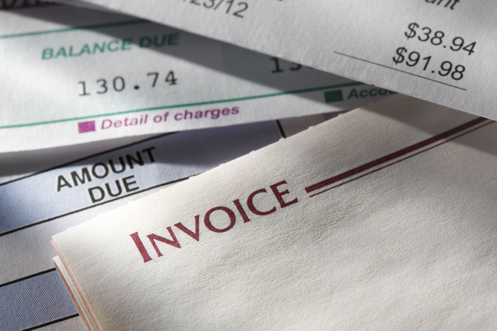

In this article, the intersection of invoicing and business accounting is examined, emphasizing the essential components of an invoice and its role in algorithmic trading. An invoice serves as a foundational document in accounting, detailing financial transactions between buyers and sellers. Its precise structure and content are crucial not only for traditional accounting but also for modern algorithmic trading systems.

Understanding the basics of an invoice is fundamental in both accounting and trading contexts. The clarity and accuracy of invoices ensure that financial data is recorded and conveyed correctly, facilitating effective decision-making. This accuracy is vital for maintaining compliance with financial regulations and for enhancing the transparency and reliability of business operations.

The integration of invoicing within algorithmic trading strategies marks a critical innovation in financial technology. Algorithmic trading, which involves automated trading decisions based on pre-set criteria and financial data, depends heavily on the timeliness and precision of such data. Invoices, as comprehensive records of financial exchanges, provide essential inputs for trading algorithms to evaluate market positions and make informed trading decisions.

This article aims to bridge traditional accounting methods with modern, technology-driven trading strategies. By highlighting how automated invoicing systems contribute to financial accuracy and compliance, it demonstrates the synergies between conventional business accounting practices and advanced algorithmic trading systems. As we explore these intersections, readers will gain a comprehensive understanding of how invoicing practices not only impact financial reporting and compliance but also enhance the efficiency of automated trading environments. This knowledge is essential for developing robust financial management strategies and ensuring seamless integration across accounting and trading platforms.

## Table of Contents

## The Basics of Business Invoicing

An invoice is a critical accounting document that plays a fundamental role in documenting transactions between a buyer and a seller. This document typically outlines essential details such as the date of the transaction, a comprehensive description of the goods or services provided, and the agreed-upon payment terms. These components ensure that both parties have a clear and formal record of the exchange, which is vital for managing accounts receivable and payable effectively.

Invoices not only serve as a transactional record but also support financial reporting and enhance transaction accuracy. Proper invoicing practices help businesses maintain precise financial records, which are crucial for preparing accurate financial statements and conducting audits. Invoices provide the necessary data for reconciling accounts, tracking payments, and identifying outstanding balances, thereby ensuring that financial reporting reflects the true financial position of the company.

The transition from manual to electronic invoicing systems offers significant advantages, primarily in terms of efficiency. Electronic invoicing automates many aspects of the invoicing process, reducing the likelihood of human error and streamlining workflow. This method allows for quicker processing and handling of invoices, facilitates smoother data integration with accounting systems, and enhances the timeliness and accuracy of financial data. Moreover, electronic invoices are easier to store, retrieve, and manage, contributing to better organization and compliance with financial regulations. 

Embracing electronic invoicing also supports sustainability efforts by reducing the need for paper and physical storage space. Businesses that shift to electronic invoicing often report improved cash flow management due to faster invoice delivery and payment processing. These efficiencies enable organizations to allocate resources more effectively, focus on strategic initiatives, and respond promptly to financial data demands, ultimately supporting better decision-making processes.

## Crucial Components of an Invoice

An invoice is a critical document used in business transactions, serving both as a request for payment and a record of a sale. It typically comprises several key components, each serving a specific purpose to ensure clarity and compliance.

**Invoice Number:** The invoice number is a unique identifier assigned to each invoice, facilitating tracking and referencing. This number helps both the seller and the buyer maintain organized records, streamlining processes such as accounts receivable management and tax filing. For instance, a company may use a structured format for invoice numbers, such as "INV-2023-001," where "INV" indicates an invoice, "2023" represents the year, and "001" is the serial number.

**Seller and Buyer Details:** Comprehensive details of the seller and the buyer are crucial for maintaining accurate records. This information generally includes names, addresses, and contact information. Accurate details ensure that the invoice is directed to the correct party, facilitating smoother communication and transaction processes.

**Description of Goods/Services:** A detailed description of the goods or services provided is essential for avoiding misunderstandings and disputes. This section typically includes each item's name, quantity, unit price, and total cost, providing the buyer with a clear understanding of what they are being charged for.

**Payment Terms:** Payment terms outline the conditions under which the payment should be made. This includes due dates and any penalties that may be incurred for late payments. Clear payment terms prevent disputes and ensure timely payments. For example, "Net 30" indicates that the payment is due within 30 days of the invoice date.

**Total Amount Due:** This is the sum of all charges, including itemized costs, applicable taxes, and any discounts offered. The total amount due must be calculated accurately to ensure fairness and compliance. The formula for calculating the total amount is as follows:

$$
\text{Total Amount Due} = (\sum \text{Item Cost} + \text{Taxes}) - \text{Discounts}
$$

**Payment Instructions:** Payment instructions specify how and where the payment should be made. This includes details such as bank account numbers for wire transfers, mailing addresses for checks, and any preferred payment methods. Providing clear payment instructions reduces confusion and facilitates prompt payments.

These components are integral to the function of an invoice, ensuring that all necessary information is communicated effectively between the seller and the buyer. Proper invoicing practices support financial accuracy and compliance, contributing to a smoother operation of business transactions.

## How Invoicing Integrates with Algorithmic Trading

Algorithmic trading is increasingly reliant on precise and timely financial data to function effectively. Invoices, as formal records of transactions, play a pivotal role in supplying this data. They provide essential cost and revenue information — such as transaction amounts, dates, and involved parties — which are critical inputs for trading algorithms to determine financial positions accurately.

### Importance of Accurate and Timely Data

The speed at which trading decisions must be made necessitates high-quality data feeding into the algorithms. Even slight inaccuracies can lead to suboptimal decisions, affecting profitability. Automated invoicing systems come into play by offering improved data integration capabilities, thus ensuring trading platforms have access to the most current and precise financial data.

### Enhancing Data Integration

Automated systems facilitate seamless data flow between invoicing software and trading platforms. This integration is crucial for real-time decision-making, as trading algorithms depend on instantaneous updates to execute trades efficiently. For instance, APIs (Application Programming Interfaces) enable different software systems to communicate, ensuring that invoices and financial data are always up-to-date.

### Impact on Trading Efficiency and Profitability

Precision in invoicing directly influences the efficiency and profitability of [algorithmic trading](/wiki/algorithmic-trading) strategies. When an algorithm processes accurate financial data, it can make more informed trading decisions, minimizing risks and maximizing returns. Conversely, erroneous invoicing can introduce discrepancies in financial assessments, potentially leading to losses.

### Synchronization with Trading Platforms

Effective synchronization between invoicing systems and trading platforms is vital. This coordination ensures that invoices reflect the real-time changes in financial positions, such as executed trades and resulting fees. Advanced data synchronization reduces latency, thereby enhancing the response time of trading algorithms to market conditions.

In conclusion, the integration of invoicing systems with algorithmic trading platforms signifies a crucial step toward optimizing trading efficiency and financial data accuracy. By harnessing technology to synchronize and automate invoicing processes, businesses can substantially improve the robustness and responsiveness of their trading strategies.

## The Role of Invoices in Business Accounting and Internal Controls

Invoices serve as a cornerstone in business accounting and internal controls, providing a systematic approach to managing financial data and ensuring compliance. These documents are essential for establishing a reliable audit trail, helping businesses maintain transparency and accuracy in their financial activities.

One of the primary functions of invoices is to uphold financial compliance. By meticulously documenting each transaction, invoices provide a clear paper trail that can be audited to verify financial statements and tax filings. This documentation is crucial during financial statement preparation, as invoices substantiate the reported revenues and expenses, ensuring that the financial statements accurately reflect the company's economic activities.

Tax compliance is another critical aspect supported by invoices. As governments require precise documentation for tax purposes, invoices act as proof of transactional legitimacy and aid in calculating VAT, GST, or other sales taxes. The absence of detailed invoicing can lead to discrepancies and potential liabilities during tax audits.

Invoice matching and reconciliation processes are vital for detecting and correcting discrepancies. Matching involves comparing invoices with purchase orders and delivery receipts to ensure consistency across these documents. This process helps identify and resolve errors, such as incorrect pricing or quantities, thereby preventing unnecessary financial losses and enhancing financial integrity.

E-invoicing significantly amplifies accountability and transparency in business operations. By automating the invoicing process, businesses can reduce human errors and improve the speed and efficiency of financial transactions. Electronic invoicing systems offer real-time tracking and validation, making invoice processing more transparent and traceable. This automation not only streamlines operations but also supports sustainability by reducing paper usage.

In conclusion, invoices play an integral role in maintaining robust business accounting and internal controls. They support compliance, enhance financial reporting accuracy, and enable effective reconciliation processes. With the advent of e-invoicing, businesses are better equipped to ensure accountability and transparency, fostering a more efficient and compliant financial environment.

## Conclusion

Invoicing plays a vital role in modern business operations by influencing core areas such as accounting, trading, and compliance. An efficient invoicing process is essential for maintaining financial accuracy and transparency, which are particularly important in algorithmic trading. Algorithms rely on precise data for optimal trading decisions, and robust invoicing ensures data integrity, directly impacting trading effectiveness and profitability.

The transition to electronic invoicing systems markedly enhances operational efficiency by minimizing manual errors and expediting transaction processing. This switch supports businesses in achieving seamless financial integration, crucial for syncing with complex algorithmic trading platforms. Electronic invoices streamline data sharing across systems, ensuring that real-time financial insights are accessible, which is invaluable for strategy development and execution in trading environments.

Grasping the components of invoices, such as invoice numbers, payment terms, and total amounts due, and understanding their implications across different systems, empowers businesses to better manage their finances. This comprehensive understanding aids in making informed decisions that align financial operations with broader strategic goals.

Looking ahead, the integration of business accounting and algorithmic trading necessitates automated invoicing solutions. These solutions will enhance financial operation efficiency and accuracy, enabling businesses to respond swiftly to market changes while maintaining compliance and transparent reporting. The continued advancement of invoicing technology will be foundational in supporting the evolving needs of businesses operating in fast-paced, tech-driven markets.

## FAQs

1. **What is the main purpose of an invoice?**

An invoice primarily serves as a document that outlines a transaction between a buyer and a seller. It provides a detailed account of the goods or services provided and specifies the payment terms. This document is essential for accurately recording transactions for both parties and serves as a basis for accounts receivable for the seller and accounts payable for the buyer. Invoices are crucial for financial documentation, enabling businesses to track revenue and expenses, thus playing a pivotal role in financial reporting and tax compliance.

2. **How does electronic invoicing differ from traditional invoicing?**

Electronic invoicing (e-invoicing) replaces paper-based invoices with digital formats, facilitating automation and integration with financial systems. Unlike traditional invoicing, which requires manual entry and handling, e-invoicing allows for the transmission of invoices electronically, improving speed and accuracy. It reduces the likelihood of errors, enhances data accuracy through automatic synchronization with accounting software, and expedites payment processing by providing secure, direct communication between trading partners. This system also supports greater efficiency in managing large volumes of invoices, which is particularly beneficial for businesses engaging in algorithmic trading.

3. **Can invoices impact algorithmic trading strategies?**

Invoices provide vital financial data that can significantly impact algorithmic trading strategies. The cost and revenue data embedded in invoices allow trading algorithms to assess financial positions accurately, contributing to informed decision-making processes. The precision and timeliness of invoicing affect the quality of data fed into trading algorithms, influencing their efficiency and profitability. Automated invoicing systems ensure seamless integration with algorithmic trading platforms, enabling real-time data updates essential for executing trades based on current financial standings.

4. **What are the common challenges in manual invoicing?**

Manual invoicing often encounters several challenges, including high error rates due to manual data entry, time consumption in processing invoices, and difficulties in tracking and storing paper invoices. These challenges can lead to delayed payments and disputes between trading partners. Manual invoicing also complicates compliance with regulatory requirements due to the lack of standardized formats and processes. The inefficiencies in manual invoicing can detract from a business's operational efficiency and financial accuracy, impacting overall business performance.

5. **How can businesses ensure compliance using invoices?**

Businesses can ensure compliance by adopting standardized invoicing practices that align with legal and regulatory requirements. This involves including all necessary information on invoices such as invoice numbers, detailed descriptions of goods or services, payment terms, and tax information. Implementing electronic invoicing systems can enhance compliance by providing automated verification and validation processes, maintaining audit trails, and ensuring secure data storage. Consistent invoice matching and reconciliation also help in identifying discrepancies early, enabling timely resolution and promoting financial transparency.

## References & Further Reading

[1]: ["Advances in Financial Machine Learning"](https://www.amazon.com/Advances-Financial-Machine-Learning-Marcos/dp/1119482089) by Marcos Lopez de Prado

[2]: ["Evidence-Based Technical Analysis: Applying the Scientific Method and Statistical Inference to Trading Signals"](https://www.amazon.com/Evidence-Based-Technical-Analysis-Scientific-Statistical/dp/0470008741) by David Aronson

[3]: ["Machine Learning for Algorithmic Trading"](https://github.com/stefan-jansen/machine-learning-for-trading) by Stefan Jansen

[4]: ["Quantitative Trading: How to Build Your Own Algorithmic Trading Business"](https://www.amazon.com/Quantitative-Trading-Build-Algorithmic-Business/dp/1119800064) by Ernest P. Chan

[5]: ["The Basics of Electronic Invoicing"](https://en.wikipedia.org/wiki/Electronic_invoicing) - SFS Finance

[6]: ["Developments in Electronic Invoicing"](https://kpmg.com/kpmg-us/content/dam/kpmg/pdf/2023/e-invoicing-developments-timeline.pdf) - PwC Global