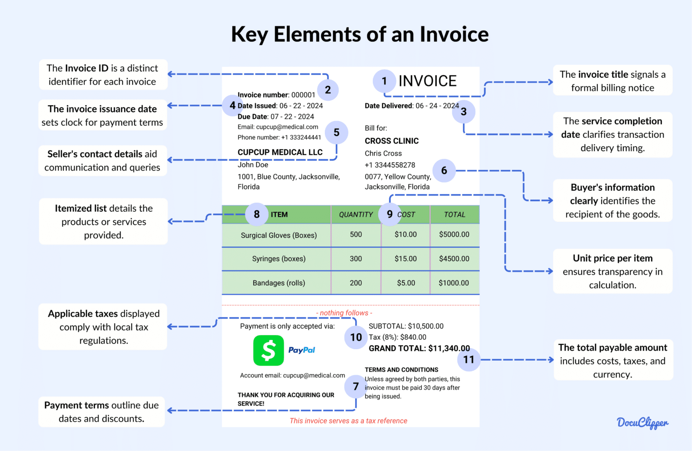

## Table of Contents

## What is an invoice?

An invoice is a document that a seller sends to a buyer. It lists the products or services that were sold, how much they cost, and when the buyer needs to pay. It's like a bill that helps keep track of what was bought and what is owed.

Invoices are important for both the seller and the buyer. For the seller, it's a way to ask for payment and keep a record of sales. For the buyer, it's a reminder of what they need to pay and helps them keep track of their expenses. Invoices can be sent in many ways, like by mail, email, or through special software.

## What are the basic components of an invoice?

An invoice has several important parts that help make it clear and useful. The first part is the basic information about who is selling and who is buying. This includes the name and address of the seller and the buyer. It also has a unique invoice number and the date the invoice was made. This helps keep track of the invoice and makes sure it's easy to find later.

The next part of an invoice lists what was sold. This includes a description of the products or services, how many were sold, and the price for each one. It's important to be clear about what was bought so there's no confusion. The invoice also shows the total amount that needs to be paid, including any taxes or extra fees. This part helps both the seller and the buyer know exactly how much money is involved.

The last part of an invoice tells the buyer how and when to pay. It includes the payment due date and the ways to pay, like by check, credit card, or bank transfer. Sometimes, it also has the seller's bank details. This part is important because it makes sure the buyer knows how to complete the payment on time.

## Why is it important to include a unique invoice number?

Including a unique invoice number on an invoice is important because it helps keep track of each transaction. When every invoice has its own special number, it's easy to find and sort them. This is helpful for both the seller and the buyer. The seller can quickly see which invoices have been paid and which ones are still waiting for payment. The buyer can also use the invoice number to match the invoice with their records and make sure they pay the right amount for the right purchase.

Another reason a unique invoice number is important is that it helps avoid confusion and mistakes. If two invoices look the same but have different numbers, it's clear they are for different transactions. This makes it easier to talk about specific invoices when there's a question or a problem. It also helps when working with accountants or tax people, because they can easily find the right invoice by its number. So, using a unique invoice number makes everything more organized and less confusing.

## How does the date of issue affect an invoice?

The date of issue on an invoice is important because it tells when the invoice was made. This date helps both the seller and the buyer know when to start counting the time until the payment is due. For example, if the invoice says payment is due in 30 days, the date of issue is when you start counting those 30 days. It also helps keep track of when things were bought and sold, which can be useful for keeping records and doing taxes.

The date of issue also helps in case there are any problems or questions about the invoice. If someone needs to talk about a specific invoice, the date can help find it quickly. It's also important for legal reasons. Some laws say that invoices need to be paid within a certain time after they are issued. So, the date of issue makes sure everyone follows these rules and knows when the payment should happen.

## What role does the 'due date' play in invoice management?

The 'due date' on an invoice tells the buyer when they need to pay the money they owe. It's like a deadline that helps both the buyer and the seller know when the payment should be made. If the buyer pays on or before the due date, it keeps things smooth and helps the seller plan their money better. If the buyer doesn't pay by the due date, it might cause problems like late fees or even damage the business relationship.

The due date is also important for keeping good records. It helps the seller keep track of which invoices have been paid and which ones are still waiting. This can be really helpful when it's time to do taxes or check how the business is doing. For the buyer, knowing the due date helps them plan their money and make sure they have enough to pay their bills on time. So, the due date is a key part of managing invoices well.

## Why is it crucial to list detailed descriptions of goods or services on an invoice?

It's really important to list detailed descriptions of goods or services on an invoice because it helps everyone understand exactly what was bought or sold. When the invoice clearly says what the product or service is, how many were sold, and the price for each one, it avoids confusion. The buyer can check that they got what they paid for, and the seller can make sure they charged the right amount. This helps keep things clear and stops arguments about what was bought or sold.

Detailed descriptions also help with keeping records and doing taxes. When everything is written down clearly on the invoice, it's easy to keep track of what was sold and how much money came in. This makes it easier for businesses to see how they're doing and for accountants to do their job. It also helps when it's time to do taxes because clear descriptions make it easy to know which expenses or sales to report. So, having detailed descriptions on an invoice makes everything run smoother for both the buyer and the seller.

## How can the tax information on an invoice impact a business?

The tax information on an invoice can have a big impact on a business. It shows how much tax the buyer needs to pay on what they bought. This helps the business know how much money they will get after taxes. If the tax information is wrong, it can cause problems with the tax office. The business might have to pay fines or extra taxes if they make mistakes. So, it's important to make sure the tax information on the invoice is correct.

Having the right tax information also helps with keeping good records. When the invoice shows the correct tax amount, the business can easily add it up at the end of the year for tax reports. This makes it easier to know how much tax the business owes or how much they can get back. If the tax information is wrong or missing, it can make the tax reports harder to do and might lead to more problems with the tax office. So, correct tax information on invoices helps the business stay organized and avoid trouble.

## What are the legal requirements for invoices in different jurisdictions?

In different countries, the rules for what needs to be on an invoice can be different. In many places, an invoice must have the seller's and buyer's names and addresses, a unique invoice number, the date it was made, a description of what was sold, the price for each item, the total amount to pay, and the tax details. Some countries also need the seller's tax ID number on the invoice. These rules help make sure that businesses follow the law and pay the right amount of taxes.

In the European Union, for example, there are some common rules for invoices. They must include the date the goods or services were supplied, the VAT (Value Added Tax) rate and amount, and the reason for any zero-rated or exempt VAT. Each country in the EU might have its own extra rules, too. In the United States, the rules can be different from state to state. Some states need invoices to show the sales tax, while others do not. Knowing the rules in your area is important to make sure your invoices are correct and legal.

## How can payment terms on an invoice influence cash flow?

Payment terms on an invoice can really affect a business's cash flow. Cash flow is all about the money coming in and going out of a business. If the payment terms say the buyer has to pay quickly, like in 15 days, the business will get its money sooner. This helps keep the cash flow strong because the business can use that money to pay its own bills or buy more things to sell. But if the payment terms are longer, like 60 days, the business has to wait longer to get paid. This can make cash flow tight because the business might run out of money before the payment comes in.

Sometimes, businesses offer discounts for paying early to help with cash flow. For example, they might say "2/10, net 30," which means the buyer can take a 2% discount if they pay within 10 days, but the full amount is due in 30 days. This can encourage buyers to pay sooner, which helps the business get money faster. But, if the payment terms are too strict or too loose, it can cause problems. Strict terms might push buyers away, while loose terms might make it hard for the business to keep enough cash on hand. So, choosing the right payment terms is important for managing cash flow well.

## What advanced features can be included in an invoice for better business management?

Adding advanced features to an invoice can really help with managing a business better. One helpful feature is the ability to track invoices online. This means both the seller and the buyer can see the status of the invoice anytime. They can check if it's been sent, viewed, or paid. This makes it easier to keep track of payments and know when money is coming in. Another useful feature is automatic reminders. If a payment is due soon or already late, the system can send a reminder to the buyer. This helps make sure payments are made on time and keeps the cash flow steady.

Another advanced feature is the option to accept different ways to pay. Some invoices can let buyers pay with a credit card, through a bank transfer, or even with a mobile payment app. This makes it easier for buyers to pay how they want, which can help get payments faster. Also, having a system that can create reports from invoice data is very useful. These reports can show how much money is coming in, what's selling well, and where there might be problems. This helps business owners make better decisions and keep their business running smoothly.

## How do electronic invoices compare to paper invoices in terms of efficiency and compliance?

Electronic invoices, or e-invoices, are much more efficient than paper invoices. They can be sent and received instantly through email or special software, which saves a lot of time. With e-invoices, businesses can track payments easily and get automatic reminders when payments are due. This helps keep the cash flow smooth. E-invoices also make it easy to store and find invoices because they can be saved on a computer or in the cloud. This means less paper to keep track of and less chance of losing important documents. Plus, e-invoices can be made to fit special needs, like adding different ways to pay or making reports from the data.

When it comes to following the rules, or compliance, e-invoices have some advantages over paper invoices. Many countries are starting to ask businesses to use e-invoices because they are easier to check and keep track of. E-invoices can have special codes or numbers that make them easier to verify. This helps make sure that businesses are following the tax laws and other rules. With paper invoices, it can be harder to make sure everything is right because they can get lost or damaged. But with e-invoices, everything is digital, so it's easier to keep everything in order and follow the rules.

## What are the best practices for maintaining invoice accuracy and preventing fraud?

To keep invoices accurate and prevent fraud, businesses should always double-check their invoices before sending them out. This means making sure all the details like the names, addresses, prices, and taxes are correct. Using special software can help because it can catch mistakes automatically. It's also a good idea to have more than one person look at the invoice before it goes out. This way, if someone makes a mistake or tries to do something wrong, another person can catch it. Keeping good records and saving copies of all invoices, both sent and received, helps too. If there's ever a question about an invoice, it's easy to look back and see what really happened.

Another important thing to do is to keep an eye on how invoices are being used. This means watching for any strange patterns, like if someone is always asking for changes to the invoice or if payments are often late. Having strong rules about who can change invoices and making sure only certain people can do it helps stop fraud. Using electronic invoices can also make things safer because they can have special codes or numbers that make them hard to fake. And if a business ever thinks something fishy is going on, they should look into it right away and maybe even talk to the police or other experts to keep their money safe.

## What are the crucial components of an invoice?

An invoice is a critical document used in business transactions, serving both as a request for payment and a record of a sale. It typically comprises several key components, each serving a specific purpose to ensure clarity and compliance.

**Invoice Number:** The invoice number is a unique identifier assigned to each invoice, facilitating tracking and referencing. This number helps both the seller and the buyer maintain organized records, streamlining processes such as accounts receivable management and tax filing. For instance, a company may use a structured format for invoice numbers, such as "INV-2023-001," where "INV" indicates an invoice, "2023" represents the year, and "001" is the serial number.

**Seller and Buyer Details:** Comprehensive details of the seller and the buyer are crucial for maintaining accurate records. This information generally includes names, addresses, and contact information. Accurate details ensure that the invoice is directed to the correct party, facilitating smoother communication and transaction processes.

**Description of Goods/Services:** A detailed description of the goods or services provided is essential for avoiding misunderstandings and disputes. This section typically includes each item's name, quantity, unit price, and total cost, providing the buyer with a clear understanding of what they are being charged for.

**Payment Terms:** Payment terms outline the conditions under which the payment should be made. This includes due dates and any penalties that may be incurred for late payments. Clear payment terms prevent disputes and ensure timely payments. For example, "Net 30" indicates that the payment is due within 30 days of the invoice date.

**Total Amount Due:** This is the sum of all charges, including itemized costs, applicable taxes, and any discounts offered. The total amount due must be calculated accurately to ensure fairness and compliance. The formula for calculating the total amount is as follows:

$$
\text{Total Amount Due} = (\sum \text{Item Cost} + \text{Taxes}) - \text{Discounts}
$$

**Payment Instructions:** Payment instructions specify how and where the payment should be made. This includes details such as bank account numbers for wire transfers, mailing addresses for checks, and any preferred payment methods. Providing clear payment instructions reduces confusion and facilitates prompt payments.

These components are integral to the function of an invoice, ensuring that all necessary information is communicated effectively between the seller and the buyer. Proper invoicing practices support financial accuracy and compliance, contributing to a smoother operation of business transactions.

## References & Further Reading

[1]: ["Advances in Financial Machine Learning"](https://www.amazon.com/Advances-Financial-Machine-Learning-Marcos/dp/1119482089) by Marcos Lopez de Prado

[2]: ["Evidence-Based Technical Analysis: Applying the Scientific Method and Statistical Inference to Trading Signals"](https://www.amazon.com/Evidence-Based-Technical-Analysis-Scientific-Statistical/dp/0470008741) by David Aronson

[3]: ["Machine Learning for Algorithmic Trading"](https://github.com/stefan-jansen/machine-learning-for-trading) by Stefan Jansen

[4]: ["Quantitative Trading: How to Build Your Own Algorithmic Trading Business"](https://www.amazon.com/Quantitative-Trading-Build-Algorithmic-Business/dp/1119800064) by Ernest P. Chan

[5]: ["The Basics of Electronic Invoicing"](https://en.wikipedia.org/wiki/Electronic_invoicing) - SFS Finance

[6]: ["Developments in Electronic Invoicing"](https://kpmg.com/kpmg-us/content/dam/kpmg/pdf/2023/e-invoicing-developments-timeline.pdf) - PwC Global