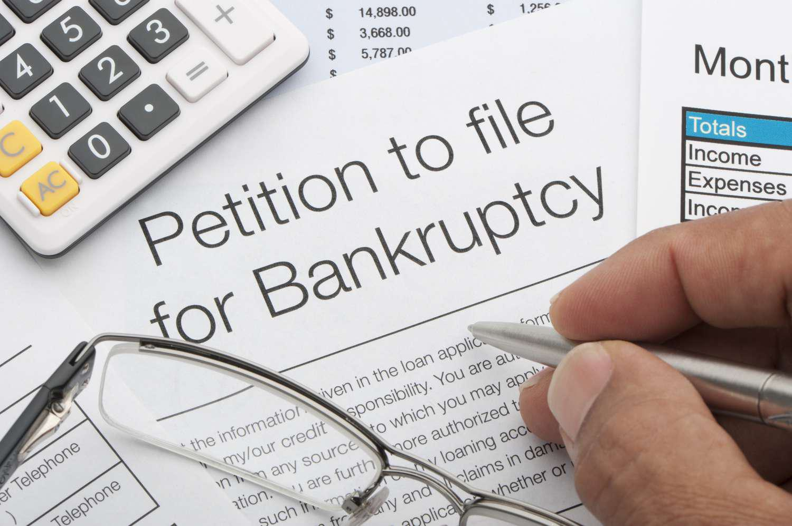

This article explores two complex topics: involuntary bankruptcy and algorithmic trading. These subjects, while seemingly unrelated, play significant roles in today's financial landscape. Understanding both is essential for businesses and investors aiming to navigate the intricacies of modern financial systems.

Involuntary bankruptcy is a legal process initiated by creditors rather than debtors to recoup unpaid debts. It serves as a critical safeguard for creditors seeking to address significant and often uncontested debts. This process, governed by specific legal prerequisites, can have profound implications for both creditors and debtors. By examining the framework of involuntary bankruptcy, this article highlights its impact on the financial stability of businesses and individual debtors alike.

Algorithmic trading, on the other hand, employs computer software to execute trades based on predefined rules. Its growing prominence in financial markets has fundamentally altered market dynamics due to its speed and efficiency. Algorithmic trading's ability to detect and respond to market signals, including financial distress and bankruptcy events, underscores its relevance in evaluating bankruptcy scenarios. As a result, it is crucial for market participants to understand how algorithmic strategies interact with events of financial distress.

The integration of technology in finance and the evolution of trading strategies necessitate a comprehensive understanding of these processes. This article aims to provide an overview beneficial to investors, creditors, and anyone interested in the interplay between involuntary bankruptcy and algorithmic trading, enabling them to tackle the challenges and opportunities presented by these financial phenomena effectively.

## Table of Contents

## Understanding Involuntary Bankruptcy

Involuntary bankruptcy is a legal mechanism initiated by creditors, rather than debtors, to recover unpaid debts. This process is typically reserved for situations where significant, undisputed debts are at stake, and serves as a tool for creditors to compel a debtor into bankruptcy court proceedings. The procedure for filing an involuntary bankruptcy is governed by specific legal standards, and it is crucial that these requirements are met meticulously to avoid dismissal of the petition or potential legal repercussions.

The Bankruptcy Code in the United States specifies that involuntary bankruptcy petitions can only be filed under Chapters 7 or 11. Chapter 7 involves the liquidation of a debtor's assets to satisfy creditor claims, whereas Chapter 11 allows for reorganization of the debtor’s business affairs, debts, and assets. 

To initiate an involuntary bankruptcy, creditors must meet several criteria. Minimum thresholds of aggregate debt owed must be established, ensuring that the filing is not based on trivial or contested claims. If a debtor has fewer than 12 creditors, a single creditor with qualifying claims is sufficient to file the petition. However, if the debtor has 12 or more creditors, at least three creditors must collectively file the petition. This requirement helps prevent the misuse of involuntary bankruptcy proceedings by a single creditor in a competitive industry to gain an undue advantage over others.

The rarity of involuntary bankruptcy filings stems from the complex nature of the process and the potential risks involved for creditors. A filing must be based on solid and uncontested claims, as any flaws could result in the dismissal of the case. Courts scrutinize these petitions rigorously, and any indication of bad faith can lead to significant liabilities for the petitioning creditors, including attorney fees and damages. Consequently, creditors are advised to consider alternatives to bankruptcy, such as negotiations or voluntary settlements, before resorting to an involuntary bankruptcy filing.

## The Creditor Petition Process

To initiate an involuntary bankruptcy, creditors must adhere to a specific legal framework and meet certain criteria. The process begins with the filing of a petition in the appropriate bankruptcy court. This petition is a formal request to commence bankruptcy proceedings against a debtor who has defaulted on their financial obligations.

The threshold for filing an involuntary bankruptcy involves meeting an aggregate debt requirement that is not contingent and remains undisputed. This means that the debts in question must be legitimate, concrete, and acknowledged by all parties involved. If the debtor in question has fewer than 12 creditors, a petition filed by a single creditor is sufficient to proceed. However, in cases where a debtor is indebted to 12 or more creditors, at least three creditors, holding undisputed claims that meet the statutory minimum, must join forces to file the petition collectively.

The process is strictly regulated to avoid misuse and ensure fairness in the adjudication of debts. If the petition meets all necessary requirements and is not successfully contested by the debtor, the court will issue an order for relief. This legal mandate effectively places the debtor into bankruptcy, initiating the structured process of debt settlement as per the provisions of the Bankruptcy Code.

In these proceedings, creditors must meticulously ensure that their claims are legitimate and adequately documented. Failing to present sufficient evidence to support the petition might lead to dismissal, which could further complicate the creditors' efforts to recuperate their dues. As such, understanding the intricacies of filing an involuntary bankruptcy petition is crucial for creditors seeking to use this mechanism to recover debts.

## Challenges and Risks for Creditors

Creditors initiating an involuntary bankruptcy face significant challenges and risks, with potential legal and financial consequences if the process does not proceed as anticipated. One of the primary risks occurs when the bankruptcy court dismisses the case. In such instances, creditors may be held liable for attorneys' fees and damages, particularly if the court determines the filing was made in bad faith. This underscores the necessity for creditors to ensure that their petitions are grounded in valid, uncontested claims. Failure to meet these criteria can result in costly penalties.

When petitioning for involuntary bankruptcy, creditors must meticulously verify their claims to avoid dismissal and subsequent liabilities. The claims should be significant and undisputed to fulfill the legal thresholds required for filing. Any ambiguity or contention regarding the debt may weaken the case and increase the risk of dismissal. In such situations, courts are empowered to impose penalties, reinforcing the need for creditors to proceed with caution.

Before embarking on an involuntary bankruptcy filing, creditors should consider alternatives such as negotiating with the debtor. Negotiation may offer a more efficient and cost-effective means of debt recovery compared to the complex and uncertain bankruptcy process. Alternatives like restructuring agreements or mediation can sometimes achieve favorable outcomes for both parties without the necessity for legal proceedings.

In summary, creditors must weigh the potential benefits of involuntary bankruptcy against the risks and challenges involved. Ensuring the legitimacy and solidity of their claims, exploring alternative dispute resolution methods, and evaluating the potential for negotiation are critical steps in minimizing legal and financial exposure. These precautions can help creditors navigate the complexities of the bankruptcy process more effectively, potentially avoiding the pitfalls associated with this legal remedy.

## Algorithmic Trading and Bankruptcy

Algorithmic trading involves the use of complex software to automatically execute trading orders at speeds and frequencies that are beyond the capacity of human traders. This form of trading can significantly influence market dynamics, especially during periods of financial distress. The speed and efficiency of algorithms allow them to react instantaneously to market conditions, which can lead to increased [volatility](/wiki/volatility-trading-strategies) during financial downturns.

One of the key advantages of [algorithmic trading](/wiki/algorithmic-trading) is its ability to analyze vast amounts of data and execute trades based on predefined rules. These algorithms can be programmed to detect financial distress signals, including bankruptcy filings. For instance, algorithms might be programmed to short stocks of companies that have recently filed for bankruptcy, anticipating a decline in their stock price.

Algorithmic trading's impact during financial distress can be observed through sudden fluctuations in asset prices. When a company faces the possibility of bankruptcy, algorithms can quickly assess financial reports, market sentiment, and other indicators to make trading decisions. This could involve selling off assets to minimize losses or exploiting [arbitrage](/wiki/arbitrage) opportunities that arise from fluctuating prices.

The relationship between algorithmic trading and bankruptcy is complex, as the swift actions of algorithms can both mitigate and exacerbate market movements. For investors and creditors, understanding this interplay is crucial. Algorithmic trades executed in response to distress signals can create a feedback loop, where market movements trigger further algorithmic actions, leading to increased market volatility.

For example, consider a situation where a large corporation is rumored to be on the brink of bankruptcy. Algorithms monitoring news feeds and social media might detect increased mentions of the company's financial troubles. As a result, these algorithms could initiate trades that drive the company's stock price down, simultaneously triggering stop-loss orders and causing further decline in price. This illustrates how algorithmic trading can intensify the effects of financial distress.

Investors and creditors need to remain vigilant and continuously update their understanding of how algorithmic trading strategies may impact asset valuations during financial distress. By doing so, they can develop strategies to navigate the challenges posed by the rapid trading actions triggered by algorithms, and potentially use these tools to their advantage in assessing risks and opportunities associated with distressed assets.

## The Future of Bankruptcy and Trading

Involuntary bankruptcy continues to be a critical mechanism for creditors aiming to recover debts when debtors fail to meet their obligations. The process, which allows creditors to compel a debtor into bankruptcy proceedings, is crucial in today's financial landscape, where unpaid debts can lead to significant financial implications for businesses. As businesses navigate this complex process, creditors must remain informed about the legal criteria and potential challenges associated with involuntary bankruptcy filings. This tool enables creditors to safeguard their financial interests and recover outstanding debts.

On the other hand, algorithmic trading stands at the forefront of technological advancements reshaping financial markets. This trading method utilizes sophisticated algorithms to execute trades at unprecedented speeds, significantly influencing market dynamics. These algorithms not only execute trades based on pre-programmed criteria but also analyze vast datasets to anticipate market movements and respond to financial distress signals, including potential bankruptcy filings. The proliferation of algorithmic trading has introduced both opportunities and challenges, necessitating a reevaluation of market strategies and risk management practices for investors.

The rapid integration of technology into the financial sector underscores the necessity for updated legal and regulatory frameworks. Existing regulations may not adequately address the nuances introduced by advanced trading technologies and the increasing complexity of financial transactions. Regulators are tasked with ensuring that new frameworks adequately protect market participants while fostering innovation. This includes addressing issues related to market stability, transparency, and fair trading practices in an era dominated by electronic and algorithmic trading.

Stakeholders within the financial ecosystem—comprising creditors, investors, regulators, and market participants—must remain proactive and adaptable. This involves continuously educating themselves about emerging trends in both bankruptcy and trading practices, as well as understanding the evolving legal environment. As technological advancements and regulatory responses unfold, stakeholders must be prepared to adjust their strategies to effectively manage risks and leverage opportunities in a dynamic financial landscape.

In conclusion, involuntary bankruptcy and algorithmic trading, while seemingly disparate, are influential components of contemporary finance. Each plays a pivotal role in shaping the financial markets of today and tomorrow. By staying informed and adapting to ongoing changes, stakeholders can navigate the complexities of these domains, ultimately enhancing their financial decision-making and ensuring their participation in a stable and efficient market environment.

## Conclusion

Involuntary bankruptcy and algorithmic trading are essential components of contemporary financial practices. For creditors, ensuring comprehensive knowledge of the legal framework surrounding involuntary bankruptcy is crucial. This process involves not only understanding the specific criteria and procedures required to effectively file a petition but also recognizing the potential risks and liabilities that may arise, such as the possibility of a court dismissing the case if it is deemed unwarranted or conducted in bad faith. Successfully navigating involuntary bankruptcy requires creditors to have a thorough grasp of legal stipulations and strategic considerations to optimize their debt recovery efforts.

On the other hand, algorithmic trading provides significant opportunities within financial markets. This method leverages sophisticated software and algorithms to execute trades at lightning speeds, often capitalizing on minute market inefficiencies or patterns that are imperceptible to human traders. Nonetheless, it demands a profound understanding of market mechanics and the capability to program or utilize systems that can respond dynamically to fluctuating market conditions.

Remaining informed about both involuntary bankruptcy and algorithmic trading is imperative for creditors and investors alike. As financial environments continue to evolve, characterized by technological advancements and complex regulatory landscapes, staying abreast of these processes equips stakeholders with the tools necessary to address and manage financial challenges effectively. By maintaining an awareness of the legal intricacies of bankruptcy and the technical nuances of trading algorithms, stakeholders can optimize their strategies and better protect their financial interests.

## References & Further Reading

[1]: ["Bankruptcy Code"](https://www.law.cornell.edu/uscode/text/11) - Legal Information Institute, Cornell Law School.

[2]: Hull, J. C. (2014). ["Options, Futures, and Other Derivatives"](https://books.google.com/books/about/Options_Futures_and_Other_Derivatives_eB.html?id=2iopDwAAQBAJ). Pearson Education Limited.

[3]: De Filippi, P., & Wright, A. (2018). ["Blockchain and the Law: The Rule of Code"](https://www.jstor.org/stable/j.ctv2867sp) - Harvard University Press.

[4]: Hull, J. C. (2007). ["Risk Management and Financial Institutions"](https://books.google.com/books/about/Risk_Management_and_Financial_Institutio.html?id=1J1QDwAAQBAJ) - Wiley.

[5]: Menkveld, A. J. (2013). ["High Frequency Trading and the New Market Makers"](https://www.sciencedirect.com/science/article/pii/S1386418113000281) - The Review of Financial Studies.

[6]: "Algorithmic Trading: Pros and Cons" - Investopedia. [Link](https://www.investopedia.com/terms/a/algorithmictrading.asp) 

[7]: MacKenzie, D. (2019). ["Trading at the Speed of Light: How Ultrafast Algorithms Are Transforming Financial Markets"](https://ieeexplore.ieee.org/abstract/document/9647710) - Princeton University Press.