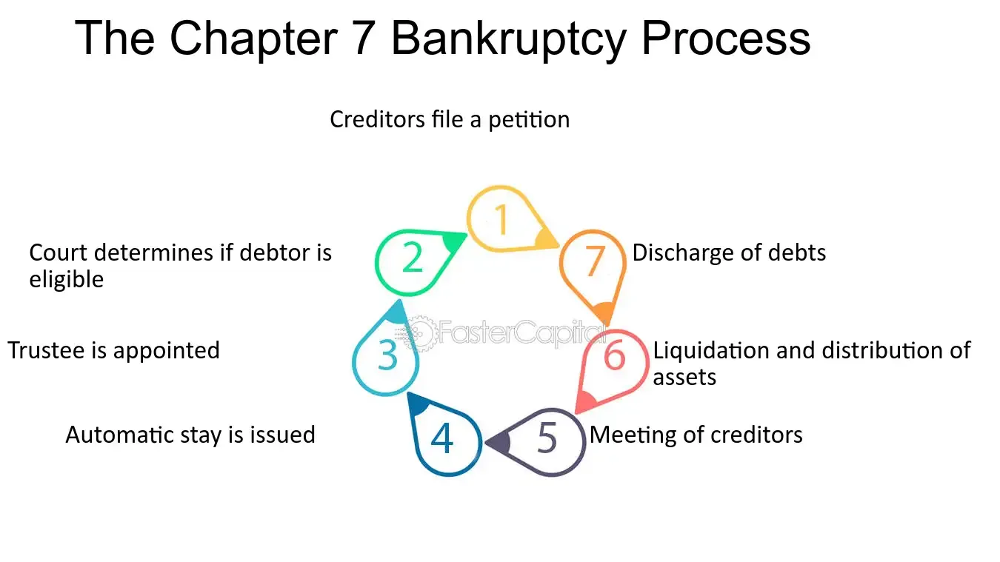

## Table of Contents

## What is involuntary bankruptcy?

Involuntary bankruptcy is when creditors force a person or business into bankruptcy. This happens when the creditors believe that the debtor is not paying their debts and is not likely to start paying soon. The creditors file a petition in court to start the bankruptcy process. This is different from voluntary bankruptcy, where the debtor chooses to file for bankruptcy themselves.

To start an involuntary bankruptcy, a certain number of creditors must agree to file the petition. The exact number depends on how many creditors the debtor has and how much money they owe. If the court agrees with the creditors, it will declare the debtor bankrupt. This means the debtor's assets can be sold to pay off the debts. Involuntary bankruptcy is less common than voluntary bankruptcy and can be a difficult process for everyone involved.

## Who can file for involuntary bankruptcy?

Involuntary bankruptcy can be filed by creditors who are owed money by a person or a business. These creditors believe that the debtor is not paying their debts and will not start paying soon. To file for involuntary bankruptcy, a certain number of creditors must agree to do it. The number of creditors needed depends on how many creditors the debtor has and how much money is owed.

The process starts when these creditors file a petition in court. If the court agrees with the creditors, it will declare the debtor bankrupt. This means the debtor's assets can be sold to pay off the debts. Involuntary bankruptcy is not as common as voluntary bankruptcy, where the debtor chooses to file for bankruptcy themselves. It can be a difficult process for everyone involved.

## What are the criteria for filing an involuntary bankruptcy petition?

To file an involuntary bankruptcy petition, a certain number of creditors must agree to do it. If the debtor has 12 or more creditors, at least three of them must join the petition. These three creditors together must be owed at least $16,750. If the debtor has fewer than 12 creditors, then just one creditor can file the petition, as long as they are owed at least $16,750. The amount of money owed is important because it shows that the debtor has a significant debt problem.

The creditors must also show that the debtor is not paying their debts. This means the debtor must generally not be paying their bills as they come due. The creditors need to prove this to the court. If the court agrees that the debtor is not paying and is not likely to start paying soon, it will accept the involuntary bankruptcy petition. This starts the bankruptcy process, where the debtor's assets can be sold to pay off the debts.

## How does the process of involuntary bankruptcy begin?

The process of involuntary bankruptcy starts when creditors who are owed money by a person or a business decide to take action. These creditors believe that the debtor is not paying their debts and will not start paying soon. To begin the process, a certain number of creditors must agree to file a petition in court. If the debtor has 12 or more creditors, at least three of them must join the petition, and they must be owed at least $16,750 together. If the debtor has fewer than 12 creditors, just one creditor can file the petition, as long as they are owed at least $16,750.

Once the petition is filed, the court will review it to see if the creditors have a good reason for filing. The creditors need to show that the debtor is not paying their bills as they come due. If the court agrees that the debtor is not paying and is not likely to start paying soon, it will accept the involuntary bankruptcy petition. This starts the bankruptcy process, where the debtor's assets can be sold to pay off the debts. Involuntary bankruptcy is less common than voluntary bankruptcy, where the debtor chooses to file for bankruptcy themselves, and it can be a difficult process for everyone involved.

## What happens after an involuntary bankruptcy petition is filed?

After an involuntary bankruptcy petition is filed, the court will look at it to see if the creditors have a good reason for filing. The creditors need to show that the debtor is not paying their bills as they come due. If the court agrees that the debtor is not paying and is not likely to start paying soon, it will accept the petition. This starts the bankruptcy process.

Once the petition is accepted, the debtor has a chance to respond. They can agree to the bankruptcy or they can fight it. If the debtor fights it, there will be a court hearing where both sides can explain their case. The court will then decide if the bankruptcy should go forward. If it does, the debtor's assets can be sold to pay off the debts. This can be a hard process for everyone involved.

## What are the debtor's options upon receiving an involuntary bankruptcy petition?

When a debtor gets an involuntary bankruptcy petition, they have a few choices. They can agree to the bankruptcy. This means they accept that they can't pay their debts and let the bankruptcy process start. Their assets can be sold to pay off what they owe.

If the debtor doesn't agree, they can fight the petition. They will go to court and explain why they think the bankruptcy shouldn't happen. The court will listen to both sides and decide if the bankruptcy should go forward. If the court agrees with the debtor, the bankruptcy won't happen. If it agrees with the creditors, the debtor's assets can be sold to pay off the debts.

## How is the validity of an involuntary bankruptcy petition determined?

When creditors file an involuntary bankruptcy petition, the court looks at it to see if it's valid. The creditors need to show that the debtor isn't paying their bills and won't start paying soon. The court checks if the right number of creditors filed the petition. If the debtor has 12 or more creditors, at least three of them must join the petition and be owed at least $16,750 together. If the debtor has fewer than 12 creditors, just one creditor can file if they are owed at least $16,750.

If the court thinks the petition is valid, it will accept it and start the bankruptcy process. The debtor then has a chance to respond. They can agree to the bankruptcy or fight it in court. If they fight it, there will be a hearing where both sides explain their case. The court will then decide if the bankruptcy should go forward. If it does, the debtor's assets can be sold to pay off the debts.

## What are the potential outcomes of an involuntary bankruptcy case?

When a court looks at an involuntary bankruptcy case, there are a few things that can happen. If the court thinks the creditors are right and the debtor isn't paying their bills, it will say the bankruptcy can go forward. This means the debtor's things can be sold to pay off what they owe. The debtor might agree to this and let it happen, or they might fight it in court.

If the debtor fights the bankruptcy, there will be a hearing. Both the debtor and the creditors will explain their side of the story. The court will then decide if the bankruptcy should happen. If the court agrees with the debtor, the bankruptcy won't go forward, and the debtor won't have to sell their things. But if the court agrees with the creditors, the bankruptcy will happen, and the debtor's things will be sold to pay off the debts.

## What are the implications of involuntary bankruptcy for the debtor's business operations?

When a business faces involuntary bankruptcy, it can have big effects on how it runs. If the court says the bankruptcy can go forward, the business might have to stop working normally. This is because the court will take control of the business's things to sell them and pay off the debts. The business might have to close or change how it works a lot. This can be hard for everyone who works there and for the people who buy things from the business.

Even if the debtor fights the bankruptcy and wins, the process can still hurt the business. It can take a lot of time and money to fight the bankruptcy in court. This can make it hard for the business to keep running well. Also, people might not want to do business with a company that is in bankruptcy, so the business might lose customers. In the end, involuntary bankruptcy can make it very hard for a business to keep going.

## How does involuntary bankruptcy affect creditors and their claims?

When a business or person goes through involuntary bankruptcy, it changes things for the creditors. The creditors are the ones who said the debtor wasn't paying them. If the court agrees and the bankruptcy happens, the creditors might get some of their money back. The court will sell the debtor's things and use the money to pay the creditors. But, they might not get all the money they are owed. It depends on how much the debtor's things are worth and how many other creditors there are.

If the debtor fights the bankruptcy and wins, the creditors won't get any money from the bankruptcy. They will have to keep trying to get paid in other ways. This can be hard and take a long time. Also, the creditors had to spend time and money to start the bankruptcy process. If they lose, they won't get that time and money back. So, involuntary bankruptcy can be risky for creditors too.

## What are the key differences between voluntary and involuntary bankruptcy?

Voluntary bankruptcy happens when a person or business decides to file for bankruptcy themselves. They think they can't pay their debts and want to start over. They go to court and ask for help. The court will look at their money and things and decide how to help them. This can mean selling some of their things to pay off what they owe. Voluntary bankruptcy is more common because the person or business chooses to do it.

Involuntary bankruptcy is different because it's started by the creditors, not the debtor. The creditors think the debtor isn't paying them and won't start paying soon. They go to court and ask for the debtor to be forced into bankruptcy. If the court agrees, the debtor's things can be sold to pay off the debts. Involuntary bankruptcy is less common and can be harder for everyone involved. The debtor might fight it in court, which can take a lot of time and money.

## What strategic considerations should creditors take into account before filing for involuntary bankruptcy?

Before creditors decide to file for involuntary bankruptcy, they need to think about a few important things. First, they should check if they meet the rules for filing. They need to have enough creditors and be owed enough money. If they don't meet these rules, the court won't accept their petition. They also need to be sure that the debtor isn't paying their bills and won't start paying soon. If they can't prove this, they might lose the case and waste time and money.

Another thing creditors should consider is the risk involved. Filing for involuntary bankruptcy can be expensive and take a long time. If the debtor fights the bankruptcy and wins, the creditors won't get any money back from the bankruptcy. They will have spent time and money for nothing. Also, even if they win, they might not get all the money they are owed. It depends on how much the debtor's things are worth and how many other creditors there are. So, creditors need to think carefully before deciding to file for involuntary bankruptcy.

## References & Further Reading

[1]: ["Bankruptcy Code"](https://www.law.cornell.edu/uscode/text/11) - Legal Information Institute, Cornell Law School.

[2]: Hull, J. C. (2014). ["Options, Futures, and Other Derivatives"](https://books.google.com/books/about/Options_Futures_and_Other_Derivatives_eB.html?id=2iopDwAAQBAJ). Pearson Education Limited.

[3]: De Filippi, P., & Wright, A. (2018). ["Blockchain and the Law: The Rule of Code"](https://www.jstor.org/stable/j.ctv2867sp) - Harvard University Press.

[4]: Hull, J. C. (2007). ["Risk Management and Financial Institutions"](https://books.google.com/books/about/Risk_Management_and_Financial_Institutio.html?id=1J1QDwAAQBAJ) - Wiley.

[5]: Menkveld, A. J. (2013). ["High Frequency Trading and the New Market Makers"](https://www.sciencedirect.com/science/article/pii/S1386418113000281) - The Review of Financial Studies.

[6]: "Algorithmic Trading: Pros and Cons" - Investopedia. [Link](https://www.investopedia.com/terms/a/algorithmictrading.asp) 

[7]: MacKenzie, D. (2019). ["Trading at the Speed of Light: How Ultrafast Algorithms Are Transforming Financial Markets"](https://ieeexplore.ieee.org/abstract/document/9647710) - Princeton University Press.