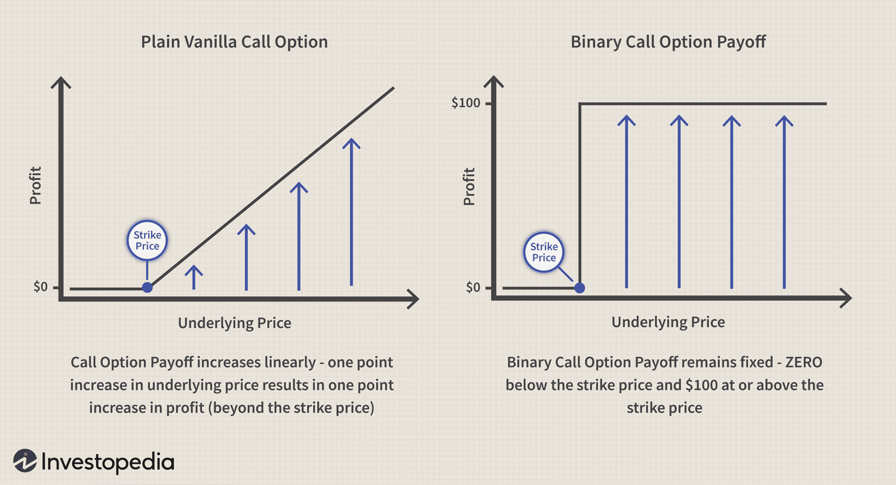

Inward arbitrage currency trade represents a sophisticated financial strategy employed by banks to optimize fund management. This method leverages discrepancies in interest rates across various global markets to secure profits. By borrowing capital in a market exhibiting lower interest rates and reinvesting it in another market with higher rates, banks can exploit these differences to enhance their financial returns. The fundamental principle is based on capturing the spread between these divergent interest rates, often resulting in minimal risk due to the relatively stable nature of interest rate differentials. 

To execute inward arbitrage trades with high accuracy and speed, algorithmic trading, or algo trading, plays an integral role. This type of trading employs complex algorithms to automate the decision-making processes involved in identifying and executing trades, thus minimizing human errors and the influence of emotional biases. The efficiency and rapid execution facilitated by these algorithms are crucial, as favorable market conditions for arbitrage can be both transient and highly competitive.



In this article, we will examine inward arbitrage and its integration into currency trading. We will delve into how algorithmic trading optimizes this advanced financial strategy, offering insights into the mechanisms and benefits of combining these elements. Understanding these aspects enables financial professionals to harness automated systems to maximize returns while mitigating potential risks effectively.

## Table of Contents

## Understanding Inward Arbitrage

Inward arbitrage is a sophisticated financial strategy that allows banks and financial institutions to exploit discrepancies in global interest rates to enhance their earnings. The fundamental concept involves borrowing money in a currency from countries or regions where interest rates are low and then investing the borrowed funds in markets offering higher interest rates. This process allows institutions to benefit from the difference, or spread, between the two interest rates.

To illustrate, consider a scenario where a bank borrows funds in the Japanese yen at a low-interest rate, due to Japan's typically low interest policies, and then converts the funds into another currency like the Australian dollar that offers higher interest rates. This practice seeks to secure a return that exceeds the cost of borrowing, thereby generating a profit. The potential profits hinge on the effective management and timing of transactions to lock in favorable rates before market conditions shift. 

The process is largely viewed as risk-free due to the secured interest rate spread; however, it requires astute strategic analysis to navigate the complexities of international financial markets. A proficient understanding of interest rate movements and the accompanying economic indicators is essential. Market timing is critical, as fluctuations in interest rates or foreign exchange rates can affect the profitability of the arbitrage.

Examples from the global banking sector highlight the effectiveness of inward [arbitrage](/wiki/arbitrage) under optimal market conditions. For instance, during periods of economic stability where [interest rate](/wiki/interest-rate-trading-strategies) spreads are predictable and currency fluctuations are minimal, banks can effectively execute these trades. Alternatively, economic disruptions or unexpected changes in fiscal policy can introduce risks, necessitating robust risk management strategies to mitigate potential losses.

In practical terms, successful inward arbitrage demands not only financial acumen but also an infrastructure equipped with advanced data analytics and real-time market monitoring tools to seize opportunities quickly as they arise.

## Inward Arbitrage and Currency Trading

Currency trade represents a critical element of the global financial ecosystem, facilitating leverage and profit through various strategic methodologies. Inward arbitrage in the context of currency trading involves the strategic employment of interbank market loans in one currency to invest in another currency offering higher yields. This process is primarily driven by the disparities in interest rates between different currencies, which banks can exploit for financial gain.

The structure of the foreign exchange ([forex](/wiki/forex-system)) market is pivotal in swiftly capitalizing on profitable spreads. The forex market operates as a decentralized global platform where currencies are traded, showcasing a daily trading [volume](/wiki/volume-trading-strategy) exceeding $6 trillion, according to the Bank for International Settlements (BIS). This vast and liquid market allows rapid execution of trades, an essential feature when inward arbitrage is combined with [algorithmic trading](/wiki/algorithmic-trading) technologies. Algorithmic trading, or automated trading systems, expedite the identification and exploitation of spreads by employing pre-defined algorithms that react to market movements at high speeds.

The potential to maximize profits through inward arbitrage is significantly enhanced by the strategic pairing of currencies and optimal timing. Traders can meticulously analyze currency pairs to determine which present the most opportunistic spreads based on current and anticipated interest rates. For example, if the interest rate in Japan is significantly lower than that in the United States, an investor could borrow in Japanese Yen and invest in U.S. Dollars to benefit from the interest rate differential.

Understanding currency rate fluctuations and the various economic factors that influence these rates is fundamental to identifying inward arbitrage opportunities. Factors such as central bank policies, geopolitical events, and macroeconomic indicators all play crucial roles in shaping currency values. For instance, interest rate announcements by central banks can lead to immediate and substantial market reactions, providing or eliminating arbitrage opportunities almost instantaneously.

In practice, sophisticated trading algorithms can monitor numerous data streams and market indicators simultaneously, making split-second decisions to execute trades at the most advantageous moments. This not only enhances the efficiency of inward arbitrage strategies but also helps mitigate risks associated with market [volatility](/wiki/volatility-trading-strategies) and unforeseen economic shifts. 

Inward arbitrage, combined with the advanced capabilities of algorithmic trading, offers traders a potent approach to leverage interest rate discrepancies globally, translating them into profitable endeavors within the forex market.

## Algorithmic Trading: An Essential Tool

Algorithmic trading, often abbreviated as algo trading, represents a pivotal evolution in financial markets, characterized by the deployment of complex algorithms to automate trading transactions. This transformation has come to define the precision and speed with which trades are executed, reducing latency and enhancing market efficiency. At its core, algorithmic trading leverages technology to align transaction processes with pre-defined criteria, thereby minimizing the impact of human errors and psychological biases that typically accompany manual trading.

A fundamental advantage of algorithmic trading lies in its capacity for rapid analysis and execution. This is particularly beneficial for strategies like inward arbitrage, which necessitate the swift examination of global interest rate differentials and instantaneous trade enactment across various markets. The ability to process vast quantities of data in real-time enables traders to exploit transient market opportunities that might otherwise be missed.

The technological infrastructure supporting algorithmic trading is critical to its success. High-speed computing platforms, coupled with real-time data feeds, constitute essential components. These systems not only facilitate immediate data processing but also ensure that trades are executed in milliseconds, maintaining a competitive advantage in the fast-paced financial markets.

Algorithmic trading encompasses a diverse array of strategies designed to capitalize on different market conditions. Two widespread strategies are [trend following](/wiki/trend-following) and arbitrage. Trend following exploits the [momentum](/wiki/momentum) in market prices, betting that securities that have been increasing in value will continue to do so. This strategy uses algorithms to identify and trade on emerging trends efficiently. In contrast, arbitrage involves identifying and exploiting price discrepancies between correlated or equivalent financial instruments. This might involve, for instance, purchasing an asset on one exchange while simultaneously selling it at a higher price on another.

The following Python snippet illustrates a simplified version of a trend-following strategy:

```python
import numpy as np
import pandas as pd
import matplotlib.pyplot as plt

def simple_moving_average(data, window):
    return data.rolling(window=window).mean()

# Example data: closing prices for a given time-period
prices = pd.Series([100, 101, 102, 103, 105, 107, 106, 108, 110, 112])

# Calculate a 3-day simple moving average
sma = simple_moving_average(prices, window=3)

plt.plot(prices, label='Prices')
plt.plot(sma, label='3-Day SMA', linestyle='--')
plt.legend()
plt.show()
```

In a more sophisticated environment, algorithms would integrate advanced statistical models and [machine learning](/wiki/machine-learning) to enhance forecasts and refining timing for trade execution. As financial markets continue to evolve, the reliance on advanced computing and data-driven strategies in algorithmic trading is poised to grow, reflecting a continual interplay between technological capability and financial acumen. This reinforces the critical role of algorithmic trading as an indispensable tool for modern traders seeking to optimize inward arbitrage and other nuanced trading strategies.

## The Synergy of Inward Arbitrage and Algo Trading

Combining inward arbitrage with algorithmic trading significantly enhances the efficiency of currency trades. By leveraging algorithms, financial institutions can swiftly detect and capitalize on discrepancies in interest rates across different markets. This capability offers timely advantages and profit opportunities by ensuring that trades are executed rapidly and precisely, a necessity in the fast-paced forex market.

Algorithmic trading systems continuously scan multiple financial markets to identify the most favorable conditions, thereby optimizing trade execution to maximize returns. These systems employ complex mathematical models and high-frequency trading algorithms capable of processing vast amounts of data in real-time. For instance, an algorithm may monitor interest rate changes, currency fluctuations, and geopolitical events to determine the optimal moments for executing trades.

Despite the substantial benefits, certain limitations and risks persist. One major concern is the reliance on technology, which introduces potential vulnerabilities such as system failures, latency issues, or cybersecurity threats. Another risk is market volatility, which can lead to unanticipated losses if not adequately managed by the algorithms. Therefore, robust risk management protocols and backup systems are essential components of any algo-trading strategy.

Successful case studies and simulations provide valuable insights into the practical benefits of integrating inward arbitrage with algorithmic trading. For example, a simulation might demonstrate how an algorithm-based strategy outperforms a traditional manual approach by minimizing transaction costs and exploiting fleeting arbitrage opportunities that human traders might miss. Additionally, real-world case studies often highlight how financial institutions have successfully implemented these strategies to achieve sustained profit growth.

As [liquidity](/wiki/liquidity-risk-premium) and trading velocity continue to increase in global financial markets, the synergy between inward arbitrage and algorithmic trading will likely play an increasingly crucial role in financial strategies. By effectively combining these approaches, traders and institutions can navigate complex market dynamics and optimize their financial performance.

## Conclusion

Inward arbitrage currency trading, augmented by algorithmic execution, provides a robust strategy for traders aiming to exploit global interest rate differentials effectively. This method enables the identification of profitable opportunities by leveraging disparities in interest rates across various financial markets. The integration of algorithmic trading facilitates the swift and accurate execution of trades, reducing the latency that manual trading might incur. High-speed computational capabilities coupled with real-time data analytics allow for the precise timing and execution necessary for success in this volatile environment.

As financial markets continuously transform and technological advancements emerge, keeping abreast of these strategies is critical for maintaining a competitive edge. The dynamic nature of global markets requires traders and financial institutions to engage in constant learning and adaptation of their strategies to sustain profitability. Algorithmic trading serves as a pivotal tool in this context, not only enhancing decision-making processes but also mitigating some inherent risks associated with market operations.

Despite the sophistication of these strategies, the financial landscape is fraught with complexities and risks, such as unforeseen economic events or technological failures. The strategic application of algorithmic solutions in executing inward arbitrage offers a significant enhancement of financial outcomes, promoting efficiency and effectiveness in trade executions. This advantage underscores the necessity for continued development and refinement of trading algorithms to ensure resilience against market unpredictability and to exploit emerging opportunities swiftly.

Encouraging ongoing education and adaptability in financial practices is indispensable for traders and institutions aiming to navigate the challenges and opportunities presented by evolving market conditions. This continuous learning approach enables stakeholders to adjust to new technologies and methodologies that redefine traditional trading paradigms.

In conclusion, integrating automated solutions into trading frameworks is not merely an option but a necessity for sustained success in the dynamic sphere of global finance. By adopting a strategic blend of inward arbitrage and algorithmic trading, financial professionals can position themselves advantageously to harness the potential of global interest rate variations, achieving superior financial outcomes while navigating future market developments.

## References & Further Reading

[1]: ["Algorithmic Trading: Winning Strategies and Their Rationale"](https://books.google.com/books/about/Algorithmic_Trading.html?id=WAlFDwAAQBAJ) by Ernie Chan

[2]: ["High-Frequency Trading: A Practical Guide to Algorithmic Strategies and Trading Systems"](https://www.amazon.com/High-Frequency-Trading-Practical-Algorithmic-Strategies/dp/0470563761) by Irene Aldridge

[3]: ["Interest Rate Swaps and Other Derivatives"](https://cupola.columbia.edu/3c8e3f.pdf) by Howard Corb

[4]: Bank for International Settlements (2019). ["Triennial Central Bank Survey of Foreign Exchange and OTC Derivatives Markets."](https://www.bis.org/statistics/rpfx19.htm)

[5]: ["Algorithmic and High-Frequency Trading"](https://www.amazon.com/Algorithmic-High-Frequency-Trading-Mathematics-Finance/dp/1107091144) by Álvaro Cartea, Sebastian Jaimungal, and José Penalva