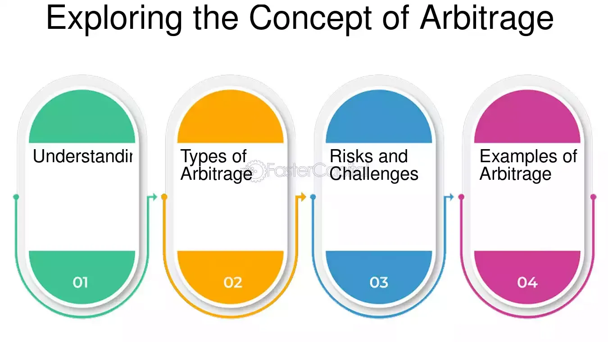

## Table of Contents

## What is inward arbitrage?

Inward arbitrage is a financial strategy where a company takes advantage of different prices for the same thing in different places. Imagine you can buy a toy for $10 in one country and sell it for $15 in another country. The company would buy the toy where it's cheaper and sell it where it's more expensive, making a profit from the price difference.

This strategy is often used by big companies that operate in many countries. They look for products or services that cost less in one place and more in another. By moving these items or services from the low-price area to the high-price area, they can earn more money. It's like shopping smartly on a global scale.

## How does inward arbitrage differ from outward arbitrage?

Inward arbitrage and outward arbitrage are two ways companies make money by using price differences in different places. Inward arbitrage happens when a company buys something in a place where it's cheaper and then sells it in another place where it's more expensive. For example, if a toy costs $10 in one country and $15 in another, the company would buy the toy in the first country and sell it in the second country, making a $5 profit per toy.

Outward [arbitrage](/wiki/arbitrage) is the opposite. It's when a company sells something in a place where it's cheaper and then buys it back in another place where it's more expensive. This might sound strange, but it can work if the company can use the money they get from selling in the cheaper place to buy something more valuable in the expensive place. It's like a clever trick to make money by moving things or money around smartly.

## What are the basic steps to perform inward arbitrage?

To do inward arbitrage, first, you need to find a product or service that is cheaper in one place and more expensive in another. This means you have to look at prices in different countries or areas. You might use the internet or talk to people who know about prices in those places. Once you find something that has a big enough price difference, you know you can make money by buying it where it's cheap.

Next, you buy the product or service in the place where it's cheaper. This could mean buying a lot of the item if it's something you can store and ship. After you have bought it, you need to move it to the place where it's more expensive. This might mean paying for shipping or finding a way to deliver the service in the new place. Once it's there, you sell it for the higher price and make a profit from the difference.

## What are the key factors to consider before engaging in inward arbitrage?

Before you start inward arbitrage, you need to think about a few important things. First, you should check if the price difference between the two places is big enough to cover all your costs and still make a profit. This means looking at the cost of buying the product, shipping it, any taxes or fees, and even the time it takes to do everything. If the price difference isn't big enough, you might not make any money, or you might even lose money.

Another thing to consider is the rules and laws in the places where you are buying and selling. Some countries have rules about importing and exporting goods, and you need to make sure you follow them. You also need to think about how long it will take to move the product from one place to another. If it takes too long, the price might change, and you could lose your chance to make a profit. Make sure you understand all these things before you start.

## Can you explain the concept of currency conversion in inward arbitrage?

In inward arbitrage, currency conversion is important because you often have to buy something in one country with one type of money and sell it in another country with a different type of money. For example, if you buy a toy in Japan with yen and sell it in the United States with dollars, you need to change your yen into dollars. The price you get for your yen can affect how much profit you make. If the exchange rate is good, you might make more money, but if it's bad, you might make less.

You need to keep an eye on the exchange rates between the two countries' currencies. Exchange rates can change every day, and sometimes they can change a lot. If the rate changes while you are moving your product from one country to another, it could mean you make more or less profit than you expected. So, it's a good idea to check the exchange rates often and maybe even use tools that help you predict how they might change. This way, you can plan better and try to make as much profit as possible.

## What are the common markets or sectors where inward arbitrage is applied?

Inward arbitrage is often used in markets where there are big price differences between different places. One common sector is electronics. Companies might buy gadgets like smartphones or laptops in countries where they are cheaper and then sell them in countries where people are willing to pay more for them. Another sector is fashion, where clothes and accessories can be bought at a lower price in one country and sold at a higher price in another. These markets work well for inward arbitrage because the products are easy to ship and there is a big demand for them around the world.

Another area where inward arbitrage is used is in the commodities market, like oil, gold, or agricultural products. For example, a company might buy oil where it's cheaper and sell it where it's more expensive. This can be tricky because commodities can be heavy and hard to move, but the price differences can be big enough to make it worth it. Also, the pharmaceutical industry uses inward arbitrage, buying medicines or medical supplies in one country and selling them in another where they can get a higher price. These sectors show how inward arbitrage can be used in many different kinds of markets to make money from price differences.

## How do regulatory environments affect inward arbitrage strategies?

Regulatory environments can have a big impact on inward arbitrage strategies. Different countries have different rules about what you can buy, sell, and move across their borders. For example, some countries might have strict rules about importing certain goods, like electronics or medicines. If you want to do inward arbitrage, you need to know these rules well. If you break them, you could get in trouble, have to pay fines, or even have your goods taken away. So, before you start, you should check the laws in both the country where you are buying and the country where you are selling.

Also, taxes and tariffs can change how much profit you make from inward arbitrage. Some countries put high taxes on goods that come from other places. This can make the price difference between the two countries smaller, which means less profit for you. Sometimes, the rules can change quickly, and what was a good arbitrage opportunity one day might not be so good the next. Keeping up with these changes and understanding how they affect your costs and profits is really important for anyone trying to use inward arbitrage to make money.

## What are the risks associated with inward arbitrage and how can they be mitigated?

Inward arbitrage can be risky. One big risk is that prices might change while you are moving your product from one place to another. If the price goes down in the place where you want to sell, you might not make as much money as you hoped. Another risk is that the cost of moving the product, like shipping and taxes, might be higher than you expected. This can eat into your profit or even make you lose money. Also, if the currency exchange rates change a lot, it can affect how much money you make when you change your money from one country's currency to another's.

To lower these risks, you need to do your homework. First, keep a close eye on the prices in both places where you are buying and selling. Use tools that help you predict how prices might change. Second, plan your costs carefully. Look at all the possible costs like shipping, taxes, and fees, and make sure you have a good idea of what they might be. Finally, watch the exchange rates between the two countries' currencies. You might want to use tools that help you predict how these rates might change. By doing these things, you can make smarter choices and try to keep your risks low.

## Can you provide a case study of successful inward arbitrage?

A good example of successful inward arbitrage is the story of a company called Arbitrage Electronics. They noticed that smartphones were much cheaper in South Korea than in the United States. So, they bought a lot of smartphones in South Korea and shipped them to the US. After paying for shipping and other costs, they still made a good profit because the price difference was big enough. They kept an eye on the exchange rates between the Korean won and the US dollar to make sure they were getting the best deal when they changed their money.

Arbitrage Electronics did well because they planned carefully. They looked at all the costs, like shipping and taxes, and made sure the price difference was big enough to cover everything and still make money. They also checked the rules about importing electronics into the US to make sure they were following the law. By doing their homework and keeping a close watch on prices and exchange rates, Arbitrage Electronics was able to make a lot of money from inward arbitrage.

## How do technological tools and platforms facilitate inward arbitrage?

Technological tools and platforms make inward arbitrage easier by helping people find and use price differences between different places. Websites and apps let you check prices in many countries quickly. This means you can see where something is cheaper and where it is more expensive without having to go to those places. Also, there are tools that help you keep track of how prices and exchange rates change over time. These tools can even predict how prices might change in the future, which helps you plan your arbitrage better.

Another way technology helps is by making it easier to buy and sell things across borders. Online marketplaces and e-commerce platforms let you buy products from one country and sell them in another without leaving your home. They handle a lot of the shipping and payment details for you. Plus, there are software programs that can help you figure out all the costs, like taxes and shipping fees, so you know if an arbitrage opportunity will really make you money. By using these tools, you can do inward arbitrage more easily and with less risk.

## What advanced strategies can be used to optimize inward arbitrage?

To make inward arbitrage even better, you can use some smart tricks. One trick is to use computer programs that look at a lot of data to find the best times to buy and sell. These programs can check prices and exchange rates all the time and tell you when it's a good time to move your products. Another trick is to buy things in big amounts when the price is really low. This way, you can keep the products until the price goes up in the place where you want to sell them. You can also work with other people or companies in different countries to help you buy and sell things more easily and cheaply.

Another way to do inward arbitrage better is to use special ways to move money around. For example, you can use something called hedging to protect yourself from big changes in exchange rates. This means you can make deals that will help you if the exchange rate goes against you. Also, you can use online tools to find out about new rules and taxes in different countries. This helps you plan better and avoid surprises that could cost you money. By using these advanced strategies, you can make more money and lower your risks when doing inward arbitrage.

## How does global economic policy impact the effectiveness of inward arbitrage?

Global economic policy can change how well inward arbitrage works. When countries change their rules about trade, like taxes or limits on what you can bring in and out, it can make the price difference between places smaller or bigger. If a country puts a high tax on things coming in, it might not be worth it to buy something cheap in one place and sell it in that country. Also, if countries make deals with each other to lower taxes, it can make arbitrage easier because the costs go down. Keeping an eye on these changes is important because they can make a big difference in how much money you can make.

Exchange rates are another big part of global economic policy that affects inward arbitrage. When the value of one country's money goes up or down compared to another country's money, it can change how much profit you make. If the money you are using to buy things gets weaker, you might have to pay more for the same thing. On the other hand, if the money you are selling in gets stronger, you can make more money when you change it back. Understanding how these policies work and how they might change can help you plan better and find the best times to do arbitrage.

## References & Further Reading

[1]: ["Algorithmic Trading: Winning Strategies and Their Rationale"](https://books.google.com/books/about/Algorithmic_Trading.html?id=WAlFDwAAQBAJ) by Ernie Chan

[2]: ["High-Frequency Trading: A Practical Guide to Algorithmic Strategies and Trading Systems"](https://www.amazon.com/High-Frequency-Trading-Practical-Algorithmic-Strategies/dp/0470563761) by Irene Aldridge

[3]: ["Interest Rate Swaps and Other Derivatives"](https://cupola.columbia.edu/3c8e3f.pdf) by Howard Corb

[4]: Bank for International Settlements (2019). ["Triennial Central Bank Survey of Foreign Exchange and OTC Derivatives Markets."](https://www.bis.org/statistics/rpfx19.htm)

[5]: ["Algorithmic and High-Frequency Trading"](https://www.amazon.com/Algorithmic-High-Frequency-Trading-Mathematics-Finance/dp/1107091144) by Álvaro Cartea, Sebastian Jaimungal, and José Penalva