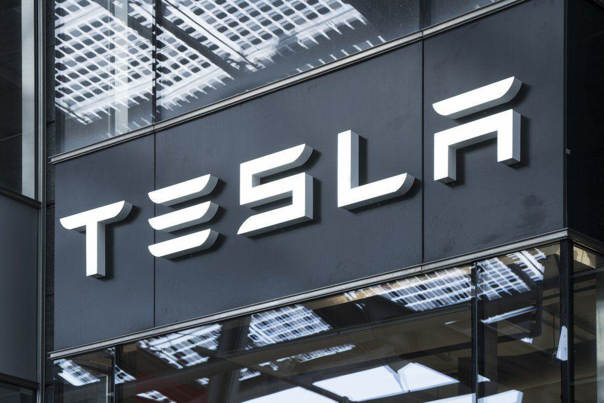

ION Group is a prominent enterprise in the financial technology sector, delivering proprietary software solutions that substantially enhance trading and execution, risk management, and connectivity across diverse financial markets. Established in 1999, ION has grown from its headquarters in Dublin, Ireland to operate globally in major financial cities. The company has strategically placed itself as a cornerstone in the financial industry, addressing the intricate demands of financial institutions, corporations, central banks, and governments around the world.

ION Group's comprehensive suite of technological offerings demonstrates an adept understanding of market requirements and challenges. The firm's software products cover an extensive array of functionalities, essential for optimizing operations in the financial ecosystem. By facilitating enhanced trading mechanisms and efficient risk management, ION aids its clients in achieving superior market performance and adheres to industry standards. 



A notable highlight of ION's offerings is its algorithmic trading capabilities. This article will focus on exploring how ION's advanced algo trading solutions leverage technology to provide high-speed trading execution while minimizing manual intervention. Through innovative integration of AI, ION ensures that its trading solutions remain at the forefront of technological advancements, essential for maintaining a competitive edge in the global financial markets.

## Table of Contents

## Overview of ION Group

ION Group was founded in 1999 and has since developed into a prominent entity within the financial technology sector, extending its services to international financial institutions, corporations, central banks, and governments. The company has a workforce exceeding 1,000 employees and maintains a substantial presence in major financial hubs including Dublin, London, New York, among others.

ION Group's offerings are distinguished by their comprehensive software solutions that cater to various aspects of trading operations. The software is structured to support front-office activities such as trading and execution, middle-office functions like risk management and reporting, and back-office processes including settlement and compliance. This integrated approach ensures seamless functionality across different operational areas, enhancing the efficiency and efficacy of financial market operations for its clients.

By incorporating a range of sophisticated functionalities, ION's software enables users to optimize their trading strategies and improve transaction outcomes. The company's continuous innovation and commitment to technology advancement have been pivotal in providing solutions that address the complex demands of today's financial markets.

## Financial Technology Software Solutions

ION Group offers a robust suite of automation software aimed at enhancing the efficiency and effectiveness of financial market operations. Their solutions cater to a wide range of functions within trading systems, risk management, pricing, and market connectivity across various asset classes.

A key component of ION's offerings is its trading systems. These systems are designed to streamline the process of trade execution and management, providing market participants with the tools necessary to execute trades across a variety of markets efficiently. This is achieved through sophisticated automation capabilities that reduce manual intervention, thereby increasing execution speed and accuracy.

In the realm of risk management, ION's software solutions play a crucial role in identifying, assessing, and mitigating financial risks. The integration of real-time data analytics allows for the constant monitoring of market conditions, ensuring that financial institutions can respond swiftly to any adverse changes. This is pivotal in maintaining the financial stability of institutions operating in today's fast-paced markets.

ION Group also offers innovative pricing solutions that assist in the valuation of financial instruments. These tools leverage advanced algorithms and analytics to deliver accurate pricing, crucial for trading and risk management activities. By ensuring precise valuation, ION helps its clients optimize their trading strategies and portfolio management practices.

The company further enhances market connectivity by providing seamless integration with global financial markets. This connectivity ensures that ION's clients have access to a broad range of trading venues and data sources, allowing them to make informed decisions based on comprehensive market insights. Such integration supports the growing demand for cross-asset trading capabilities and enables users to engage with a diverse array of financial products.

Overall, ION Group's financial technology software solutions underscore its commitment to improving market operations through automation and advanced technology. These solutions not only support automated trading but also empower financial institutions with the tools needed for effective risk management, accurate pricing, and robust market connectivity, facilitating their efforts to navigate the complexities of global financial markets.

## Algorithmic Trading Capabilities

Algorithmic trading, also known as algo trading, involves using advanced algorithms to automate trading strategies and decision-making processes. This approach leverages mathematical models, complex algorithms, and high-speed computing to execute trades with high efficiency and minimal human intervention. Algo trading is widely used in various markets, including equities, [forex](/wiki/forex-system), and derivatives, because of its ability to capitalize on price discrepancies and market inefficiencies swiftly.

ION Group provides comprehensive [algorithmic trading](/wiki/algorithmic-trading) solutions designed to enhance decision-making accuracy and execution speed. By integrating AI, these solutions minimize manual intervention, ensuring traders can operate with enhanced precision and reliability. AI technologies employed by ION facilitate the rapid analysis of market data, enabling traders to make informed decisions based on real-time information.

ION's FI EMS (Fixed Income Execution Management System) and SENSOR are standout products that exemplify its excellence in algorithmic trading. The FI EMS is recognized for its proficiency in smart order routing, an essential feature that maximizes execution quality by intelligently directing trades to different market venues based on predefined parameters. This system ensures optimal order execution, reduces latency, and increases the likelihood of achieving the best prices available in the market.

SENSOR, another advanced solution offered by ION, specializes in options trading. It provides traders with the tools needed to formulate and execute complex trading strategies effectively. The system supports sophisticated options analytics and risk management techniques, enabling users to manage their portfolios with greater accuracy and confidence.

Moreover, the integration of AI in ION's trading systems allows for continuous learning and adaptation to evolving market conditions. This capability ensures that trading strategies remain robust and relevant, even as markets shift and new patterns emerge. The use of [machine learning](/wiki/machine-learning) models in algorithmic trading can involve techniques such as:

```python
from sklearn.ensemble import RandomForestClassifier
from sklearn.model_selection import train_test_split
from sklearn.metrics import accuracy_score
import numpy as np

# Sample dataset for trade signals
X = np.random.rand(1000, 10)  # Features: market indicators
y = np.random.randint(2, size=1000)  # Labels: Buy (1) or Sell (0)

# Split data into training and testing sets
X_train, X_test, y_train, y_test = train_test_split(X, y, test_size=0.3, random_state=42)

# Initialize and train the model
model = RandomForestClassifier(n_estimators=100, random_state=42)
model.fit(X_train, y_train)

# Predicted labels
predictions = model.predict(X_test)

# Evaluate the model
accuracy = accuracy_score(y_test, predictions)
print(f"Model Accuracy: {accuracy:.2f}")
```

In this simplistic example, a Random Forest classifier is employed to predict trading signals based on historical market data. This type of model can be expanded and refined using more complex data and algorithms to optimize trading performance.

Overall, ION Group's algorithmic trading capabilities demonstrate the firm's commitment to leveraging cutting-edge technology to support sophisticated trading strategies. The integration of AI enhances these capabilities, offering traders the tools needed to navigate complex financial markets with agility and insight.

## AI and Innovation in Algo Trading

The incorporation of Artificial Intelligence (AI) in algorithmic trading significantly enhances the ability to analyze large volumes of data, transforming them into actionable trading insights with heightened predictive accuracy. AI-driven systems utilize machine learning models, including neural networks and [reinforcement learning](/wiki/reinforcement-learning), to identify patterns in market data. These patterns assist traders in making data-driven decisions that optimize trade executions and improve profitability.

ION Group employs cloud computing alongside AI to democratize access to algorithmic trading solutions for both retail and institutional investors. This integration enables the utilization of scalable infrastructure for real-time data processing and complex model computations. The elasticity of cloud resources allows for rapid adaptation to varying market conditions, thus providing a competitive edge to users. For instance, AI models can be deployed in a cloud environment to swiftly process tick-by-tick market data, ensuring minimal latency in execution.

Despite its advantages, AI in trading introduces complexities, notably 'black-box' models. These models offer limited transparency in decision-making processes, posing challenges in risk management and compliance with regulatory frameworks. As such, explainable AI (XAI) becomes essential, providing insights into how models reach specific trading outcomes. Explaining model behavior helps mitigate risks by enabling more effective monitoring and auditing of automated systems. XAI approaches, such as SHAP (Shapley Additive Explanations) and LIME (Local Interpretable Model-agnostic Explanations), are utilized to dissect AI decisions and offer clarity to stakeholders.

Additionally, regulatory bodies demand transparency and accountability in trading algorithms. Regulatory compliance mandates that trading firms ensure their AI systems are interpretable and aligned with financial regulations. As AI continues to evolve, balancing innovative capabilities with risk and compliance management remains a critical task for financial technology providers like ION Group.

## Future Outlook and Industry Impact

As [artificial intelligence](/wiki/ai-artificial-intelligence) (AI) technology progresses, its implications for the financial markets are expected to be substantial, particularly through advancements such as explainable AI and natural language processing (NLP). Explainable AI aims to make algorithmic decisions more transparent and understandable, which is crucial in financial trading where accountability and regulatory compliance are paramount. It allows traders and institutions to comprehend the rationale behind AI-driven trading decisions, delivering insights into risk factors and market movements.

Natural language processing, on the other hand, enables the analysis of unstructured data such as news articles, social media feeds, and financial reports, which can substantially augment trading strategies. By processing this data, NLP tools can detect market sentiment, emerging trends, and potential market shocks before these are reflected in traditional market metrics, thus providing traders with a competitive edge.

ION Group, by maintaining its focus on technological investment and innovation, is poised to help clients face future market challenges. The company's commitment is demonstrated through its continuous enhancement and expansion of its suite of financial technology solutions. By integrating advanced technologies such as AI and cloud computing, ION ensures its clients have access to the tools needed for agility and responsiveness in the ever-evolving markets.

The need for agility in financial markets is underscored by the unpredictable nature of global economic conditions and market volatilities. ION's solutions are designed to offer robustness and flexibility, providing clients with the ability to adapt to rapid changes and to make informed decisions with speed and efficiency. As AI continues to develop, potential breakthroughs will likely further increase the efficiency of trading operations, offering clients opportunities for improved performance and competitive advantage.

In sum, the integration of cutting-edge technologies by ION Group not only improves current trading operations but also positions the company as a leader prepared to navigate and shape the future trading landscape. This readiness to adopt and adapt to technological advancements ensures that ION and its clients remain at the forefront of the financial services industry.

## Conclusion

ION Group has solidified its position as a key contributor to advancements in the financial technology sector by delivering innovative solutions aimed at optimizing trading operations and risk management processes. The company's diverse range of algo trading products highlights its dedication to enhancing both market efficiency and accuracy in trade execution. This is particularly evident in their AI-driven tools, which facilitate the automation of complex trading strategies, making them accessible and effective for users across the financial spectrum. The integration of AI not only allows for improved decision-making but also boosts execution speed, significantly reducing the need for manual intervention.

To maintain a competitive edge, ION Group's ongoing adaptation to emerging technologies, such as artificial intelligence and machine learning, is crucial. These advancements offer new capabilities, such as predictive analytics and improved data processing, which are vital in today's fast-paced financial markets. The company’s forward-thinking approach and substantial investment in technology ensure that its solutions remain at the forefront of innovation, helping clients tackle the challenges posed by ever-evolving market conditions. This adaptability underscores ION's commitment to enabling agile and responsive operations in a rapidly changing industry, positioning it well to support its clients as they navigate future transformations in the financial landscape.

## References & Further Reading

[1]: Bergstra, J., Bardenet, R., Bengio, Y., & Kégl, B. (2011). ["Algorithms for Hyper-Parameter Optimization."](https://proceedings.neurips.cc/paper/2011/file/86e8f7ab32cfd12577bc2619bc635690-Paper.pdf) Advances in Neural Information Processing Systems 24.

[2]: ["Advances in Financial Machine Learning"](https://www.amazon.com/Advances-Financial-Machine-Learning-Marcos/dp/1119482089) by Marcos Lopez de Prado

[3]: ["Evidence-Based Technical Analysis: Applying the Scientific Method and Statistical Inference to Trading Signals"](https://books.google.com/books/about/Evidence_Based_Technical_Analysis.html?id=MeoJAQAAMAAJ) by David Aronson

[4]: ["Machine Learning for Algorithmic Trading"](https://github.com/stefan-jansen/machine-learning-for-trading) by Stefan Jansen

[5]: ["Quantitative Trading: How to Build Your Own Algorithmic Trading Business"](https://www.amazon.com/Quantitative-Trading-Build-Algorithmic-Business/dp/1119800064) by Ernest P. Chan