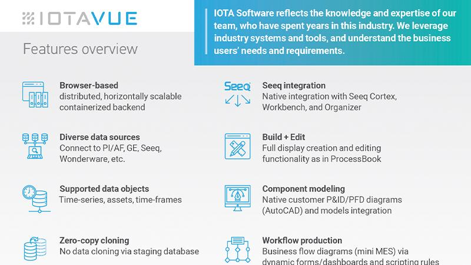

Blockchain technology has had a profound impact on various industries by providing secure, transparent, and decentralized infrastructures. A notable innovation within this field is IOTA, which is tailored to serve as a foundational framework for the Internet of Things (IoT). IOTA distinguishes itself through its use of the Tangle, a distinct form of distributed ledger technology. Unlike conventional blockchain structures, the Tangle offers high scalability and zero transaction fees, facilitating seamless machine-to-machine communications. This makes IOTA a pivotal player in advancing IoT capabilities.

In parallel with blockchain advancements, algorithmic trading, or algo trading, has gained prominence in financial markets. This approach leverages intricate mathematical models to conduct trades at speeds and volumes that traditional methods cannot achieve. The integration of algo trading with innovative technologies like blockchain enhances the efficiency and effectiveness of financial ecosystems.

This article examines IOTA's framework and its native token, MIOTA, including the importance of the Tangle network. Additionally, it discusses the role of algo trading in utilizing blockchain technology within financial market infrastructures.

## Table of Contents

## Understanding IOTA and MIOTA

IOTA is a revolutionary distributed ledger technology specifically crafted to facilitate seamless transactions within the Internet of Things (IoT) ecosystem. At its core, IOTA utilizes a unique cryptocurrency known as MIOTA, which serves as the accounting unit for transactions conducted on the network. A defining feature of IOTA is its Tangle network, which diverges from traditional blockchain architectures by employing a directed acyclic graph (DAG) structure.

The Tangle's DAG structure offers a significant advantage over conventional blockchains in two primary areas: fee-less transactions and scalability. Traditional blockchains typically organize data in blocks, requiring miners to validate and secure transactions. This process can introduce bottlenecks and incur transaction fees to incentivize the miners. However, IOTA's Tangle network obviates the need for miners. Instead, each transaction directly verifies two previous transactions, facilitating a mechanism where the network self-validates. This approach not only enhances efficiency but also ensures that transactions are conducted without fees, which is crucial for supporting the high-frequency microtransactions inherent to IoT devices.

The genesis of IOTA can be traced back to its goal of addressing the limitations of existing blockchain technologies with regard to IoT applications. IOTA's design resolves scalability issues by allowing an unlimited number of transactions to be confirmed simultaneously, as there is no central bottleneck. Its proof-of-work mechanism is lightweight, aligning with the energy requirements of IoT devices, unlike the computationally intensive processes utilized by many blockchain systems.

The operational mechanics of IOTA further set it apart. As a device performs a transaction, it participates in the network's consensus process, thus contributing to its security. This concept of 'paying' for a transaction with computational work rather than currency exemplifies IOTA's innovative approach. By empowering every participant to contribute to verification, the network grows more robust and resilient with each transaction added to the Tangle.

With these key features, IOTA positions itself as a pivotal technology poised to transform how IoT ecosystems manage and record data exchanges. Its Tangle network offers a scalable and efficient alternative to conventional blockchains, facilitating an expansive range of IoT applications that demand rapid, low-cost data transmission and processing.

## The IOTA Tangle System

The IOTA Tangle System represents a fundamental shift in distributed ledger technology, meticulously crafted to meet the needs of the Internet of Things (IoT) landscape. Unlike conventional blockchains that organize transactions in a linear sequence, the Tangle utilizes a Directed Acyclic Graph (DAG) structure. This decentralizes transaction validation across a network of nodes, allowing transactions to be verified simultaneously by multiple participants. 

The innovative DAG architecture eliminates the need for miners, typical in blockchain networks, thereby ensuring zero fees and enhancing scalability. Every transaction in the Tangle inherently validates two other transactions, promoting parallel processing and efficient resource utilization. This arrangement significantly reduces transaction times, supporting seamless execution of microtransactions, which are essential to IoT operations where frequent, low-value exchanges are common.

The technical function of the Tangle system is rooted in its ability to handle vast numbers of operations concurrently and without costs, surpassing the capabilities of traditional blockchains. One pivotal aspect of the Tangle is its consensus mechanism, which relies on the confirmation of transactions by following nodes. Each participant in the network aids in maintaining the integrity of the ledger, reducing the bottleneck typically encountered in blockchain mining processes.

Key benefits of the Tangle architecture, alongside zero fees and enhanced scalability, include its robustness against transaction spam and reduced energy consumption compared to proof-of-work systems. The security model hinges on a unique cumulative weight mechanism, where transaction validity is reinforced as more subsequent connections verify it, creating a self-sustaining trust network.

Industries adopting the Tangle technology can expect future implications that foster innovation and efficiency. The potential impacts extend to sectors where rapid, secure microtransactions are crucial, such as autonomous vehicles, smart cities, and healthcare IoT devices. By eschewing the limitations of blockchain's linear structure, the Tangle offers a scalable, adaptable solution for the burgeoning IoT ecosystem.

## Algo Trading and Blockchain

Algorithmic trading, commonly known as algo trading, uses sophisticated software and algorithms to establish and execute trading strategies automatically based on pre-defined criteria. This technology enables rapid and high-frequency trading by reacting to market conditions faster than any human trader. At its core, algo trading relies on complex mathematical models and formulas to make decisions and execute trades efficiently.

The union of blockchain technology with algo trading presents notable synergies. Blockchains are renowned for their transparency and immutability, properties that enhance the reliability and security of automated trading systems. Traditional trading systems often deal with data inconsistencies and potential manipulations. However, integrating blockchain into these systems mitigates these issues by ensuring data integrity and offering an unalterable transaction ledger.

IOTA, with its distinct architecture known as the Tangle, is particularly advantageous for algo trading. The Tangle facilitates real-time, cost-effective data transactions, enabling algo trading systems to access broad datasets without latency or cost barriers. This efficiency is paramount in executing profitable trades, especially in high-frequency trading where milliseconds can make a significant difference.

The benefits of using blockchain in algo trading include improved transparency, security, and the elimination of intermediaries, which traditionally lead to cost reductions and faster transaction times. Moreover, it provides a comprehensive audit trail that is invaluable for regulatory compliance and performance analysis.

However, there are risks associated with algo trading and its integration with blockchain technology. The primary risks involve system failures, algorithmic errors, and cybersecurity threats. A malfunction in trading algorithms can lead to substantial financial losses, while blockchain systems, although secure, are not immune to sophisticated cyber-attacks.

In conclusion, the integration of blockchain technology like IOTA with [algorithmic trading](/wiki/algorithmic-trading) harnesses the strengths of both fields, promising enhanced efficiency and security. Yet, trading platforms must remain vigilant and robust against potential technical snafus and external threats to leverage these combined benefits fully.

## Case Study: IOTA and Smart Trading Platforms

Several trading platforms are now increasingly integrating IOTA’s Tangle technology to leverage its unique characteristics such as high scalability and zero transaction costs. The Tangle, a form of directed acyclic graph (DAG), provides a mechanism for data transactions that is particularly useful for high-frequency and low-latency trading environments. This section explores practical implementations of IOTA in smart trading platforms and analyzes the resulting performance improvements and market feedback.

Incorporating IOTA's Tangle technology allows trading platforms to execute transactions rapidly and securely. The decentralized nature of the Tangle eliminates bottlenecks typically associated with traditional blockchains, where miners validate transactions sequentially. Instead, the Tangle enables transactions to be performed simultaneously across various nodes, thus minimizing latency and ensuring transactions are processed at near-instant speeds. This is crucial for trading strategies that require swift execution to capitalize on market fluctuations effectively.

For instance, the implementation of IOTA in smart trading platforms facilitates microtransactions without incurring fees, a critical [factor](/wiki/factor-investing) for automated trading systems. These systems often process numerous small transactions where traditional transaction fees could render the trades unprofitable. By eliminating fees, IOTA allows for more frequent and flexible trading strategies that can respond dynamically to market conditions.

A notable application of IOTA’s technology in trading platforms is its use in cross-border transactions. By exploiting the zero-fee structure and rapid confirmation times, trading platforms have successfully lowered operational costs and enhanced transaction efficiency, thereby gaining a competitive edge. IOTA's Tangle supports the secure transfer of value and data, broadening the scope of automated trading strategies by integrating real-time data feeds from IoT devices into decision-making algorithms.

In analyzing the performance impact, platforms employing IOTA have reported increased transaction throughput and reduced execution times, which are paramount for maintaining competitiveness in fast-paced trading environments. Furthermore, market reception has generally been positive, given the technological advantages and cost savings introduced by integrating IOTA. However, some concerns remain regarding the long-term scalability and security aspects, which are ongoing focus areas in IOTA's development.

Overall, the utilization of IOTA in smart trading platforms underscores its potential to transform financial services by providing an efficient and scalable framework for executing high-frequency trading tasks. As more platforms continue to adopt innovative technologies like IOTA, the broader financial sector could witness substantial shifts towards decentralized and cost-effective trading solutions.

## Challenges and Future Prospects for IOTA

IOTA, with its pioneering Tangle technology, has attracted attention for its potential to revolutionize IoT operations and beyond. However, it faces notable challenges typical of emerging technologies. A significant concern revolves around security, particularly because IOTA's unique structure, while innovative, requires rigorous testing and validation to ensure its resilience against threats like double-spending and attack vectors that exploit its partially centralized coordinator mechanism. The IOTA Foundation's ongoing Coordicide project aims to eliminate this coordinator, catalyzing a move towards complete decentralization, which is crucial for building trust in its system.

The pace of adoption is another hurdle. Although IOTA's zero-fee transactions and scalability are attractive attributes, achieving widespread recognition among businesses and developers is necessary to drive integration. The platform must demonstrate reliability, particularly in handling high-throughput scenarios typical of IoT environments. This means ensuring transaction speeds and system integrity even as the network scales.

Looking forward, several key developments could shape the future of IOTA. The Coordicide initiative is central to these, promising improvements that could remove barriers to entry for new participants and enhance the overall security of the network. Also, efforts to expand the IOTA ecosystem through strategic partnerships and community engagement can stimulate interest and innovation.

IOTA's ability to handle vast networks of IoT devices without traditional bottlenecks paves the way for its adoption in large-scale industrial and smart city applications. However, this potential can only be realized if stakeholders see clear, demonstrable benefits over existing technologies. Moreover, aligning with regulatory standards and addressing concerns around data privacy and transaction security will be vital as adoption grows.

In the broader context of blockchain technology, IOTA's integration could redefine algorithmic trading and data markets, given its capacity for real-time data processing and microtransactions. It presents opportunities for financial markets to leverage decentralized data streams for decision-making and execution.

As technological advancements unfold, the success of IOTA will depend not only on overcoming these immediate challenges but also on its adaptability and continued innovation, securing its position in IoT and beyond.

## Conclusion

IOTA represents a significant advancement in blockchain technology, particularly within the Internet of Things (IoT) sector, due to its core attributes of zero-fee transactions and scalability. These features are crucial for enabling seamless machine-to-machine interactions, which are projected to become increasingly central as IoT applications proliferate. By eliminating transaction fees, IOTA fosters an environment conducive to microtransactions, which are essential for many IoT processes where frequent, low-value exchanges are common. The architecture of IOTA, built on the Tangle, a distributed ledger that adopts a directed acyclic graph (DAG) approach, ensures high throughput and efficiency, meeting the demands of a connected IoT network.

The integration of IOTA technology with algorithmic trading platforms highlights the transformative potential for financial markets, providing enhanced efficiency and opening up new avenues for strategic operations. Blockchain's transparency and security, coupled with IOTA's real-time data transaction capabilities, empower algo trading systems to benefit from reduced operational costs and increased speed of execution. This creates a robust framework where substantial data sets can be processed efficiently, elevating the quality of decision-making and execution in financial markets.

As blockchain technology continues to evolve, the future success of platforms like IOTA will be contingent on addressing current challenges and harnessing opportunities for growth through sustained innovation and increased market adoption. The Coordicide project represents a pivotal initiative aiming to enhance the decentralization and scalability of the IOTA network, thereby bolstering its ability to serve as a foundational platform for IoT infrastructure. Overcoming these hurdles will not only fortify IOTA's position in the blockchain ecosystem but also expand its applicability across varying domains reliant on cost-effective and scalable transaction solutions.

IOTA's capacity to seamlessly connect IoT devices and facilitate microtransactions without the constraints typical of traditional blockchain models positions it uniquely in both IoT and financial sectors. Its successful deployment could redefine how interconnected devices operate and transact, highlighting its role as a catalyst for innovation in these rapidly growing fields. Consequently, keeping pace with technological advancements and market requirements will be critical for IOTA as it seeks to maintain its pioneering status and fully capitalize on its strategic advantages.

## References & Further Reading

[1]: Popov, S. (2018). ["The Tangle"](https://www.semanticscholar.org/paper/The-Tangle-Popov/43586b34b054b48891d478407d4e7435702653e0). IOTA Foundation.

[2]: Bashir, I. (2017). ["Mastering Blockchain"](https://books.google.com/books/about/Mastering_Blockchain.html?id=3ZlUDwAAQBAJ). Packt Publishing.

[3]: López de Prado, M. (2018). ["Advances in Financial Machine Learning"](https://www.amazon.com/Advances-Financial-Machine-Learning-Marcos/dp/1119482089). Wiley.

[4]: Narayanan, A., Bonneau, J., Felten, E., Miller, A., & Goldfeder, S. (2016). ["Bitcoin and Cryptocurrency Technologies: A Comprehensive Introduction"](https://press.princeton.edu/books/hardcover/9780691171692/bitcoin-and-cryptocurrency-technologies). Princeton University Press.

[5]: Olson, K. P. (2019). ["Learn Algorithmic Trading"](https://www.packtpub.com/en-us/product/learn-algorithmic-trading-9781789348347). Packt Publishing.

[6]: Schiener, D. (2019). ["Coordicide: The Road to Full Decentralization of IOTA's Tangle"](https://files.iota.org/papers/20200120_Coordicide_WP.pdf). IOTA Foundation.

[7]: Zohar, A. (2015). ["Bitcoin: under the hood"](https://dl.acm.org/doi/10.1145/2701411). Annals of Telecommunications, 70, 429-437.