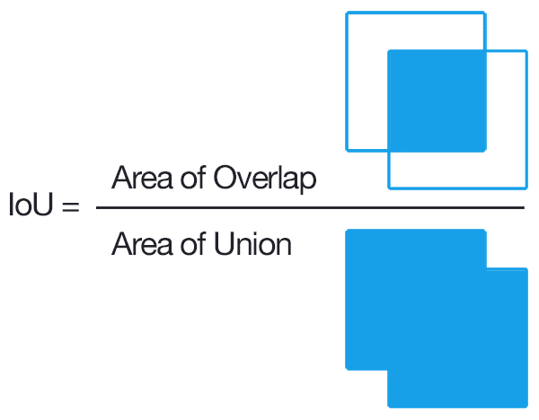

## Table of Contents

## What is IOU in the context of machine learning?

In the context of machine learning, IOU stands for Intersection over Union. It is a commonly used metric to measure the accuracy of an object detection algorithm. IOU is used to compare the predicted bounding box of an object with its actual bounding box. The value of IOU ranges from 0 to 1, where a higher value indicates a better match between the predicted and actual bounding boxes.

To calculate IOU, you first find the area of intersection between the predicted and actual bounding boxes. Then, you find the area of the union, which is the total area covered by both bounding boxes. The IOU is then calculated by dividing the area of intersection by the area of union. Mathematically, it can be expressed as $$ \text{IOU} = \frac{\text{Area of Intersection}}{\text{Area of Union}} $$. If the IOU value is close to 1, it means the predicted bounding box closely matches the actual one, indicating a high accuracy in the object detection task.

## How is IOU calculated in object detection tasks?

IOU, or Intersection over Union, is a way to see how well a computer program finds objects in pictures. Imagine you have a picture and you want the computer to draw a box around an object, like a car. The computer tries to guess where the car is and draws its own box. The real box around the car is already known. IOU helps us check how close the computer's guess is to the real box.

To find the IOU, you first look at the parts where the computer's box and the real box overlap. This overlapping part is called the intersection. Then, you look at the total area covered by both boxes, which is called the union. The IOU is calculated by dividing the size of the intersection by the size of the union. If the IOU is close to 1, it means the computer's guess was very good. If it's close to 0, the guess was not good. The formula for IOU is $$ \text{IOU} = \frac{\text{Area of Intersection}}{\text{Area of Union}} $$.

## Why is IOU important for evaluating object detection models?

IOU, or Intersection over Union, is really important for checking how good a computer is at finding things in pictures. When a computer tries to draw a box around an object, like a dog, we want to know if it's doing a good job. IOU helps us see how close the computer's box is to the real box around the dog. If the IOU is high, it means the computer's guess was pretty accurate. This is useful because it tells us if the computer is learning the right way to find objects.

Using IOU also helps us compare different computer programs that find objects. If one program has a higher IOU than another, it's usually better at guessing where objects are. This can help us pick the best program for our needs. The formula for IOU is $$ \text{IOU} = \frac{\text{Area of Intersection}}{\text{Area of Union}} $$. By using this simple calculation, we can easily understand and improve how well computers find things in pictures.

## What is a good IOU threshold for considering a detection as correct?

In object detection, deciding if a computer's guess is good enough is important. A common way to do this is by setting an IOU threshold. If the IOU, which is calculated as $$ \text{IOU} = \frac{\text{Area of Intersection}}{\text{Area of Union}} $$, is above this threshold, we say the detection is correct. A popular threshold that many people use is 0.5. This means that if the computer's box overlaps with the real box by at least half, we think it's a good guess.

However, what counts as a "good" threshold can change depending on what you're trying to do. For some tasks, like finding small objects or when you need very accurate results, you might want to use a higher threshold, like 0.75 or even 0.9. This makes sure the computer's guesses are really close to the real boxes. But if you're okay with less accurate guesses, a lower threshold like 0.3 might work. It's all about finding the right balance for your specific needs.

## How does IOU differ from other metrics like precision and recall?

IOU, or Intersection over Union, is a way to measure how well a computer finds objects in pictures by comparing the computer's guess to the real thing. It looks at how much the computer's box around an object overlaps with the actual box. If the overlap is big, the IOU is high, and that means the computer did a good job. The formula for IOU is $$ \text{IOU} = \frac{\text{Area of Intersection}}{\text{Area of Union}} $$. IOU is great for seeing how accurate each guess is, but it doesn't tell us how many guesses were correct or how many objects were missed.

Precision and recall are different because they look at the overall performance of the computer's guesses. Precision is about how many of the computer's guesses were right. If the computer says it found 10 dogs and 8 of them were really dogs, the precision is high. Recall is about how many of the actual objects the computer found. If there were 10 dogs in the picture and the computer found 8 of them, the recall is high. These metrics give us a broader view of how well the computer is doing, but they don't tell us about the accuracy of each individual guess like IOU does.

In short, IOU focuses on how well each individual guess matches the real thing, while precision and recall give us a bigger picture of how many guesses were right and how many objects were found. Both types of metrics are important, but they answer different questions about the computer's performance in finding objects.

## Can IOU be used for tasks other than object detection?

Yes, IOU, or Intersection over Union, can be used for tasks other than object detection. It's a useful way to measure how similar two areas are, no matter what those areas represent. For example, in image segmentation, where a computer tries to label different parts of a picture, IOU can be used to see how well the computer's labels match the real labels. If the computer labels a part of the sky as "sky" and the real label is also "sky," IOU helps us check how much those labeled areas overlap.

IOU is also helpful in tasks like semantic segmentation, where the goal is to classify each pixel in an image. Here, IOU can measure how well the computer's pixel-by-pixel classification matches the actual classification. The formula for IOU, $$ \text{IOU} = \frac{\text{Area of Intersection}}{\text{Area of Union}} $$, works the same way in these tasks, comparing the overlap between the computer's guess and the real thing. So, while IOU is very popular in object detection, it's a versatile tool that can be used in many different areas where comparing areas or regions is important.

## What are the limitations of using IOU as a performance metric?

IOU, or Intersection over Union, is a helpful way to see how good a computer's guess is at finding things in pictures. But it has some problems. One big problem is that IOU only looks at how much the computer's box overlaps with the real box. It doesn't care about how many guesses were right or how many things were missed. So, if a computer guesses a lot of boxes, but only a few are right, IOU might still say it did a good job on those few guesses. This can be confusing because it doesn't give us the full picture of how well the computer is doing.

Another issue with IOU is that it can be hard to use when the things in the picture are very small or when the guesses are not very accurate. If the computer's box is just a little off, the IOU might be very low, even if the guess was close. This can make it seem like the computer did a bad job when it was actually pretty close. Also, IOU doesn't tell us anything about how confident the computer is in its guesses. So, we might need to use other ways to measure performance along with IOU to get a better idea of how well the computer is finding things in pictures. The formula for IOU is $$ \text{IOU} = \frac{\text{Area of Intersection}}{\text{Area of Union}} $$.

## How can IOU be optimized in model training?

To make IOU better when training a computer model, you can use it as part of what the model is trying to get right. This means you can change the model's goal to include making the IOU as high as possible. When the model is learning, it tries to make its guesses match the real boxes more closely. You can do this by adding IOU to the loss function, which is like a score that tells the model how well it's doing. If the loss function includes IOU, the model will work harder to make its guesses overlap more with the real boxes. The formula for IOU is $$ \text{IOU} = \frac{\text{Area of Intersection}}{\text{Area of Union}} $$. By using this in the loss function, the model can learn to make better guesses.

Another way to improve IOU is by using special tricks during training. For example, you can use something called [data augmentation](/wiki/data-augmentation), which means changing the pictures a little bit to make the model see different versions of the same thing. This can help the model learn to find objects even if they look a bit different. Also, you can use techniques like hard example mining, where you focus on the guesses that were really bad and try to make them better. By paying more attention to the hard cases, the model can get better at making its guesses match the real boxes more closely. These methods can help the model improve its IOU and make better predictions overall.

## What advanced techniques can improve IOU in complex scenarios?

In complex scenarios, improving IOU can be tricky, but there are some advanced techniques that can help. One technique is using anchor boxes, which are pre-defined boxes of different sizes and shapes that the model uses to guess where objects might be. By using many different anchor boxes, the model can better match the real boxes, especially for objects that are different shapes or sizes. Another technique is called non-maximum suppression (NMS), which helps the model get rid of extra guesses that are too similar to each other. This makes the model's guesses more accurate and can improve the IOU by focusing on the best guesses.

Another advanced method is using attention mechanisms, which help the model focus on the most important parts of the picture when making guesses. This can be especially helpful in crowded scenes where there are many objects close together. By paying more attention to the right areas, the model can make better guesses and improve its IOU. The formula for IOU is $$ \text{IOU} = \frac{\text{Area of Intersection}}{\text{Area of Union}} $$. Also, using [deep learning](/wiki/deep-learning) models like Mask R-CNN can help, as they not only predict boxes but also segment objects more precisely, which can lead to higher IOU values. These techniques can make a big difference in complex scenarios where simple methods might not be enough.

## How does IOU handle overlapping or nested object detections?

When objects in a picture overlap or are inside each other, IOU can still help us see how good the computer's guesses are. Imagine there's a picture with a dog inside a car. The computer tries to draw a box around the dog and another around the car. IOU looks at how much the computer's box for the dog overlaps with the real box for the dog, and the same for the car. If the computer's box for the dog is inside the car's box, IOU will still tell us how well the dog's box matches the real dog's box. The formula for IOU is $$ \text{IOU} = \frac{\text{Area of Intersection}}{\text{Area of Union}} $$. So, even with overlapping or nested objects, IOU works the same way, focusing on each guess separately.

However, when objects overlap a lot, it can be harder for the computer to guess right, and this can make IOU lower. If the computer's box for the dog also covers part of the car, the IOU for the dog might be lower because the guess isn't just for the dog anymore. To handle this, we can use special techniques like non-maximum suppression (NMS), which helps the computer pick the best guess when there are many overlapping guesses. This can make the IOU better by focusing on the most accurate guesses. So, while IOU can handle overlapping or nested objects, using other methods can help improve the results in these tricky situations.

## What are some common pitfalls when interpreting IOU scores?

One common pitfall when interpreting IOU scores is focusing too much on the number without considering the context. IOU, calculated as $$ \text{IOU} = \frac{\text{Area of Intersection}}{\text{Area of Union}} $$, tells us how well a computer's guess matches the real thing. But if the computer guesses a lot of boxes and only a few are right, the IOU might look good for those few guesses, even though the overall performance is not great. So, it's important to look at other metrics like precision and recall to get the full picture of how well the computer is doing.

Another pitfall is not understanding how small changes can affect IOU. If the computer's guess is just a little off, the IOU might drop a lot, even if the guess was pretty close. This can make it seem like the computer did a bad job when it was actually close. Also, IOU doesn't tell us how confident the computer is in its guesses. So, while IOU is a useful metric, it's important to use it along with other ways to measure performance to really understand how well the computer is finding things in pictures.

## How is IOU used in state-of-the-art object detection frameworks?

In state-of-the-art object detection frameworks, IOU, or Intersection over Union, is a key metric used to evaluate how well the model detects objects. The formula for IOU is $$ \text{IOU} = \frac{\text{Area of Intersection}}{\text{Area of Union}} $$. Modern frameworks like YOLO (You Only Look Once) and Faster R-CNN use IOU during both training and evaluation to fine-tune their predictions. During training, IOU can be part of the loss function, helping the model learn to make its bounding boxes more accurate. For example, if a model predicts a box around a car, IOU helps measure how well that box matches the real car's position and size, guiding the model to improve its guesses.

These frameworks also use IOU to filter and refine detections during the inference stage. Techniques like non-maximum suppression (NMS) rely on IOU to remove overlapping detections, keeping only the most accurate ones. For instance, if a model detects multiple boxes around the same object, NMS will use IOU to decide which box is the best fit and discard the others. This helps in achieving higher precision and recall, making the overall detection performance better. By incorporating IOU in such ways, state-of-the-art object detection frameworks can significantly enhance their ability to accurately identify and locate objects in images.

## References & Further Reading

[1]: Everingham, M., Eslami, S. M. A., Van Gool, L., Williams, C. K. I., Winn, J., & Zisserman, A. (2015). ["The Pascal Visual Object Classes Challenge: A Retrospective."](https://link.springer.com/article/10.1007/s11263-014-0733-5) International Journal of Computer Vision, 111(1), 98-136.

[2]: Redmon, J., Divvala, S., Girshick, R., & Farhadi, A. (2016). ["You Only Look Once: Unified, Real-Time Object Detection."](https://ieeexplore.ieee.org/document/7780460) Proceedings of the IEEE Conference on Computer Vision and Pattern Recognition (CVPR).

[3]: Ren, S., He, K., Girshick, R., & Sun, J. (2015). ["Faster R-CNN: Towards Real-Time Object Detection with Region Proposal Networks."](https://ieeexplore.ieee.org/document/7485869) Advances in Neural Information Processing Systems (NeurIPS).

[4]: He, K., Gkioxari, G., Dollár, P., & Girshick, R. (2017). ["Mask R-CNN."](https://ieeexplore.ieee.org/document/8237584) Proceedings of the IEEE International Conference on Computer Vision (ICCV).

[5]: Jaccard, P. (1912). ["The distribution of the flora in the alpine zone."](https://nph.onlinelibrary.wiley.com/doi/abs/10.1111/j.1469-8137.1912.tb05611.x) New Phytologist, 11(2), 37-50. (Original source for the Jaccard index, related to IOU).

[6]: Huang, J., Rathod, V., Sun, C., Zhu, M., Korattikara, A., Fathi, A., ... & Murphy, K. (2017). ["Speed/accuracy trade-offs for modern convolutional object detectors."](https://arxiv.org/abs/1611.10012) Proceedings of the IEEE Conference on Computer Vision and Pattern Recognition (CVPR).

[7]: Girshick, R. (2015). ["Fast R-CNN."](https://arxiv.org/abs/1504.08083) Proceedings of the IEEE International Conference on Computer Vision (ICCV).