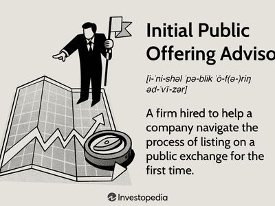

Initial Public Offerings (IPOs) signify a pivotal transformation in a company's lifecycle, marking the shift from private ownership to public trading on stock exchanges. This transition is not merely an internal restructuring but a strategic maneuver to secure capital investment for expansion, enhance credibility, and gain visibility in the financial markets. By offering shares to the public, companies can tap into a larger pool of investors, thereby raising substantial funds critical for growth and scaling operations.

Concurrently, algorithmic trading—or algo trading—has gained prominence within financial markets due to its ability to employ sophisticated algorithms to automate and refine trading decisions. These algorithms analyze vast volumes of market data at unprecedented speeds, identifying optimal trading opportunities with precision and agility. In today's markets, where speed and accuracy are paramount, algorithmic trading facilitates transactions that far surpass human capabilities in both volume and efficiency.

This article investigates the complex interplay between IPO advisors, who guide companies through the initial public offering process, and the impact of algorithmic trading on these IPOs. It examines how these factors collectively shape the IPO landscape and influence stock market behaviors. As IPO advisors provide crucial strategic insights on timing, pricing, and share volume, the rise of algorithmic trading introduces new dynamics. These include rapid market reactions and potential volatility, which must be carefully navigated to ensure a successful transition to public status. Through this exploration, the article aims to elucidate how the synergy between human expertise and technological innovation can optimize IPO outcomes in the contemporary financial environment.

## Table of Contents

## Understanding IPO Advisors

Initial Public Offerings (IPOs) represent a pivotal phase in a company's progression, facilitating its transition from a privately held entity to a publicly traded corporation. Guiding businesses through this complex procedure are IPO advisors, typically specialized investment banks, whose expertise is indispensable. These advisors are equipped with deep industry knowledge, strategic insight, and a robust understanding of market dynamics essential for a successful IPO.

The primary role of IPO advisors involves assisting companies in determining the optimal timing for their public offerings, which can significantly influence the success of the IPO. Such timing decisions are based on various factors, including market conditions, investor sentiment, and economic indicators. Moreover, IPO advisors are responsible for assessing the number of shares a company should offer. This involves a meticulous analysis of the company's financial standing, market potential, and growth prospects to ensure a balance between supply and demand in the open market.

Setting an appropriate price range for the shares is another critical task for IPO advisors. This pricing strategy must accurately reflect the company's intrinsic value while remaining attractive to potential investors. Advisors utilize various valuation methods such as discounted cash flow (DCF) analysis, comparable company analysis (CCA), and precedent transactions to establish a fair and competitive price range.

After the IPO, advisors play a crucial role in analyzing key success metrics to gauge how well the market received the newly listed stock. Two primary indicators of success are the stock's price appreciation and trading volumes. Price appreciation reflects the increase in the stock's market price over time, indicating positive investor sentiment and confidence in the company's performance. Trading volumes, on the other hand, provide insight into the [liquidity](/wiki/liquidity-risk-premium) of the stock and the level of investor interest. Analyzing these metrics helps advisors and the company understand and address any post-IPO [volatility](/wiki/volatility-trading-strategies), ensuring sustained growth and stability in the public market.

Thus, IPO advisors are instrumental in navigating the multifaceted process of taking a company public, employing their expertise to optimize timing, share offerings, and pricing strategies, while also assessing post-IPO performance to drive long-term success.

## The Rise of Algorithmic Trading

Algorithmic trading, commonly known as algo trading, has transformed the landscape of financial markets over the past few decades. Characterized by its reliance on complex algorithms and high-speed data processing, this trading method allows for executing large orders with minimal human intervention. The advent of algo trading has ushered in a new era where trades can be executed at fractions of a second, thereby facilitating transactions at speeds and volumes that human traders cannot achieve.

At its core, algo trading systems utilize advanced algorithms to analyze vast quantities of market data. These systems are designed to identify trends, detect patterns, and optimize entry and [exit](/wiki/exit-strategy) points for trades, thus executing transactions with high precision. A typical algorithm might look for price discrepancies, buy or sell signals based on technical indicators, or liquidity conditions before executing a trade. The primary advantage of algo trading lies in its ability to perform these operations more efficiently and quickly than manual trading processes.

However, the introduction of [algorithmic trading](/wiki/algorithmic-trading) into financial markets raises several challenges. One major concern is the potential for increased market volatility. Since algotrading systems can execute vast numbers of trades in a very short time, they can exacerbate price movements and contribute to market swings. This is particularly true for high-frequency trading ([HFT](/wiki/high-frequency-trading-strategies)), a subset of algorithmic trading, where strategies attempt to profit from transient market inefficiencies.

Moreover, regulatory concerns have arisen alongside the rise of algorithmic trading. The rapid and high-[volume](/wiki/volume-trading-strategy) nature of these trades introduces the risk of market manipulation and the potential for system-induced flash crashes—sudden, deep crashes in stock prices caused by automated trades. Regulators around the world are continually trying to ensure that algorithmic trading does not compromise market fairness or integrity.

Despite these challenges, the trend towards algorithmic trading continues to grow, driven by advancements in technology and data processing capabilities. As [machine learning](/wiki/machine-learning) and [artificial intelligence](/wiki/ai-artificial-intelligence) evolve, they are expected to integrate further into algotrading systems, potentially offering even more sophisticated strategies and applications.

Overall, while algorithmic trading presents significant advantages in terms of efficiency and precision, it also necessitates careful consideration of its implications for market stability and regulatory oversight. The ongoing evolution of financial technology promises both opportunities and challenges in this dynamic field.

## Impact of Algotrading on IPOs

Algorithmic trading plays a crucial role in shaping IPO valuations by swiftly reacting to market data and conducting market sentiment analysis—a process that profoundly impacts investor confidence. In the context of IPOs, market sentiment can significantly influence initial stock prices, as algorithms scan social media platforms, news articles, and financial reports to gauge public opinion and forecast demand. This rapid assessment can lead to algorithm-driven adjustments in stock valuations, affecting traders' and investors' perceptions of a company's worth.

High-frequency trading (HFT) algorithms add another layer of complexity to the IPO landscape. These algorithms operate at exceptionally high speeds, executing a large number of trades in fractions of a second. The inherent speed and volume of HFT can lead to significant price fluctuations once a stock is listed. Such volatility might be perceived as instability, potentially deterring risk-averse investors.

The impact of HFT on IPOs can be quantified by examining phenomena such as the magnitude of price variability and the volume of trades conducted immediately after an IPO. For instance, HFT algorithms can exacerbate short-term volatility through rapid buy-sell cycles, leading to wide bid-ask spreads that destabilize stock prices. This instability can diminish the perceived reliability of the newly listed stock, which IPO advisors and companies must manage carefully.

Understanding and predicting these dynamics is vital for companies aiming to maintain a strong market presence post-IPO. Companies can implement strategies to mitigate volatility by working closely with IPO advisors and leveraging algorithmic insights. These strategies may include setting stabilization policies, such as lock-up agreements, to prevent large shareholders from selling too soon, thus alleviating downward pressure on the stock price.

In conclusion, algorithmic trading's influence on IPOs is multifaceted, with potential benefits and challenges. Algorithms can offer valuable insights into market sentiment and efficient trading opportunities. However, their capacity to cause rapid price swings necessitates a strategic approach by companies to harness their potential benefits while minimizing risks.

## Strategies Enhanced by Algotrading

Market sentiment analysis is a critical component of the IPO process, and algorithmic trading significantly enhances its effectiveness. By employing sophisticated algorithms, traders can analyze vast datasets to interpret investor moods and anticipation levels around IPO events. These insights allow companies to make informed decisions about timing and pricing to maximize the success of their public offerings. For instance, machine learning techniques, such as natural language processing, can evaluate news articles, social media posts, and other textual data to gauge market sentiment. This information helps IPO advisors and companies tailor their strategies to current investor sentiment, improving decision-making processes.

Peer comparison and benchmarking are other strategies that benefit from the analytical capacity of algorithmic trading. By automating the analysis of a company's financial metrics against its industry peers, algorithms can provide accurate stock valuations. This process often employs statistical models that consider multiple variables, ensuring a comprehensive assessment. For instance, a Python implementation could utilize libraries like `pandas` and `numpy` to perform data analysis and visualization, enabling quick comparisons across many companies. This analytical rigor ensures that new stocks are priced fairly upon issuing, reducing the risk of mispricing and enhancing market confidence.

Statistical [arbitrage](/wiki/arbitrage), another domain strengthened by algotrading, uses complex algorithms to identify and exploit price inefficiencies across related financial instruments. By processing real-time market data, these algorithms can rapidly execute trades, capitalizing on minor deviations to generate profits. For example, implementing a [statistical arbitrage](/wiki/statistical-arbitrage) strategy may involve computing z-scores to determine when a stock is relatively overvalued or undervalued compared to its historical relationships with other stocks. This quantitative analysis helps investors make timely investment decisions, particularly in the volatile environment following an IPO.

Volatility analysis is also crucial in optimizing IPO investment strategies. Algorithms designed to study and predict market volatility can identify short-term price movements, providing opportunities for tactical asset allocation. By leveraging historical volatility data and applying techniques such as GARCH (Generalized Autoregressive Conditional Heteroskedasticity) models, traders can forecast expected variations in stock prices. This predictive capability allows investors to adjust their portfolios dynamically, optimizing returns based on anticipated market conditions. In the context of IPOs, such insights are invaluable, enabling companies and investors to navigate post-IPO trading with heightened confidence and efficiency.

Through these enhanced strategies, algorithmic trading not only aids in accurate stock valuations and effective market positioning but also supports proactive risk management. As technology continues to evolve, the role of algorithmic trading in the IPO landscape will expand, offering even greater precision and agility in the face of complex market dynamics.

## Challenges and Future Outlook

As algorithmic trading continues to evolve, the increased regulatory scrutiny aims to ensure that such technologies do not undermine market fairness. Concerns about potential market manipulation have amplified as high-frequency trading algorithms execute an overwhelming number of transactions within fractions of a second. These concerns stem from the algorithms' ability to detect and respond to market signals much faster than human traders, sometimes resulting in artificially induced price fluctuations and perceived unfair advantages.

Complex trading strategies, such as latency arbitrage, can exploit minor differences in prices across exchanges, sparking debates about whether such activities border on manipulation. To address these challenges, regulatory bodies have intensified their focus on algorithmic activities. For instance, the Securities and Exchange Commission (SEC) and the European Securities and Markets Authority (ESMA) have introduced stringent guidelines to monitor algorithmic trade executions and ensure transparency in the market.

Despite these regulatory challenges, technological advancements in machine learning and data analytics hold the promise of enhancing trading strategies and investment opportunities. These technologies enable traders to analyze vast data sets, facilitating more informed decision-making processes. The use of artificial intelligence (AI) in algorithmic trading can improve predictions about stock price movements, optimize trade execution, and better manage risks.

The future of algorithmic trading within IPOs combines embracing technological advancements while maintaining robust regulatory measures. The challenge is to strike a balance between harnessing technology for improved efficiency and enforcing comprehensive frameworks to prevent abuses and preserve market integrity. Continual dialogue between regulators and market participants is essential to adapt regulations that encourage innovation yet protect investors.

The intersection of technology and regulation will shape the future landscape of IPOs, with algorithmic trading acting as both a tool for trading precision and a subject of regulatory discourse. To guarantee fair play, ongoing discussions will need to address nuances in trade execution practices and algorithmic transparency, ensuring that enhancements in trading technologies benefit the broader financial ecosystem rather than a select few.

## Conclusion

The intersection of IPO advisors and algorithmic trading provides a crucial framework for understanding the complexities within the modern IPO landscape. As companies transition from private to public entities, the strategic guidance of IPO advisors becomes indispensable. These professionals offer insights into market conditions, optimal timing, and pricing strategies that align with both regulatory requirements and market expectations. Algorithmic trading, on the other hand, complements these efforts by leveraging data analytics and automated processes to refine and implement trading strategies at an unprecedented speed and scale.

By integrating the analytical capabilities of algorithmic trading with the expertise of IPO advisors, firms are empowered to develop robust IPO strategies. Algorithmic trading systems can swiftly interpret market sentiment and trends, providing real-time feedback that influences strategic decision-making. The rapid execution capabilities of these systems often help stabilize initial market reactions, ensuring that newly issued stocks are priced fairly in response to the dynamic conditions of the market. This synergy not only enhances the precision of stock valuations but also fosters investor confidence by demonstrating a company's adeptness in navigating market complexities.

The future landscape of IPOs will likely be shaped by this symbiotic relationship. While the fast-paced technological advancements afford significant opportunities, they also necessitate a meticulous approach to regulation and risk management. Ensuring market fairness and preventing exploitation will remain paramount as regulatory bodies work to keep pace with financial innovations. Ultimately, the synthesis of strategic foresight from IPO advisors and technological efficiency from algorithmic trading stands to create a resilient framework for future IPO success, optimizing outcomes for all stakeholders involved.

## References & Further Reading

[1]: ["The Intelligent Investor"](https://en.wikipedia.org/wiki/The_Intelligent_Investor) by Benjamin Graham

[2]: ["Flash Boys: A Wall Street Revolt"](https://en.wikipedia.org/wiki/Flash_Boys) by Michael Lewis

[3]: Malloy, C. J., & Zhu, N. (2009). "Strategic IPO Timing, Information Asymmetry, and underpricing." Review of Financial Studies, 22(4), 1597-1626.

[4]: Hendershott, T., Jones, C. M., & Menkveld, A. J. (2011). "Does Algorithmic Trading Improve Liquidity?" Journal of Finance, 66(1), 1-33.

[5]: "Algorithmic and High-Frequency Trading" by Álvaro Cartea, Sebastian Jaimungal, and José Penalva.