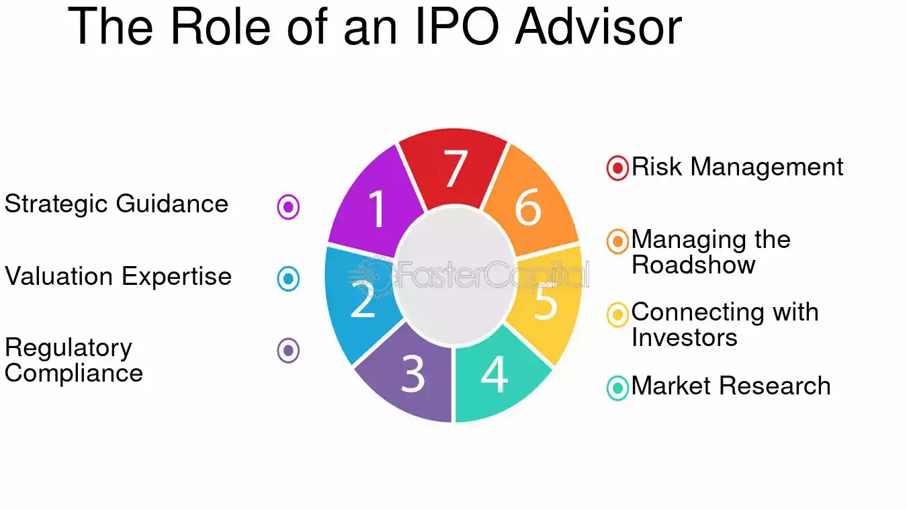

## Table of Contents

## What is an IPO?

An IPO, or Initial Public Offering, is when a company first sells its stock to the public. This is a big step for a company because it means they are moving from being private, where only a few people own the company, to being public, where anyone can buy shares. When a company does an IPO, it's trying to raise money. It does this by selling pieces of the company, called shares, to investors. These investors can be regular people like you and me, or big institutions like banks and investment firms.

The process of an IPO can be exciting but also complicated. First, the company works with investment banks to decide how much money they want to raise and how many shares they will sell. They also set a price for these shares. Then, they go through a lot of paperwork and rules to make sure everything is legal and fair. Once everything is ready, the company's shares start trading on a stock exchange, like the New York Stock Exchange or Nasdaq. This is when the public can start buying and selling the company's stock. If the IPO goes well, the company gets the money it needs, and the investors who bought the shares early might see their value go up.

## Who is an IPO advisor?

An IPO advisor is someone who helps a company get ready to sell its stock to the public for the first time. This person knows a lot about the rules and steps a company needs to follow to do an IPO. They work closely with the company to make sure everything is done right, from figuring out how much money the company wants to raise to setting the price for the shares.

The IPO advisor also helps the company talk to investors and tell them why they should buy the company's stock. They help make a plan to show the company in the best way possible. This can include making presentations, writing reports, and even helping the company's leaders practice what they will say to investors. The goal is to make sure the IPO goes smoothly and the company gets the money it needs.

## What are the basic roles of an IPO advisor?

An IPO advisor helps a company get ready to sell its stock to the public for the first time. They guide the company through the whole process, making sure they follow all the rules and do everything right. This includes figuring out how much money the company wants to raise and how many shares they need to sell. The advisor also helps set the right price for these shares so that the company can get the money it needs.

The IPO advisor also plays a big role in talking to investors. They help the company tell its story in a way that makes people want to buy the stock. This can mean making presentations, writing reports, and even helping the company's leaders practice what they will say to investors. The goal is to make the company look good and get people excited about the IPO. By doing all this, the IPO advisor helps make sure the IPO goes smoothly and the company gets the money it needs to grow.

## How does an IPO advisor assist in the preparation phase of an IPO?

An IPO advisor helps a company get ready for its first time selling stock to the public. They start by figuring out how much money the company wants to raise and how many shares they need to sell. The advisor also helps set a good price for the shares. They make sure the company follows all the rules and does everything right. This means a lot of paperwork and working with lawyers and banks.

The advisor also helps the company talk to investors. They help the company tell its story in a way that makes people want to buy the stock. This can include making presentations, writing reports, and even helping the company's leaders practice what they will say to investors. The goal is to make the company look good and get people excited about the IPO. By doing all this, the IPO advisor helps make sure the IPO goes smoothly and the company gets the money it needs to grow.

## What are the key responsibilities of an IPO advisor during the IPO process?

An IPO advisor helps a company get ready to sell its stock to the public for the first time. They start by figuring out how much money the company wants to raise and how many shares they need to sell. The advisor also helps set a good price for the shares. They make sure the company follows all the rules and does everything right. This means a lot of paperwork and working with lawyers and banks to make sure the IPO is legal and fair.

The advisor also plays a big role in talking to investors. They help the company tell its story in a way that makes people want to buy the stock. This can include making presentations, writing reports, and even helping the company's leaders practice what they will say to investors. The goal is to make the company look good and get people excited about the IPO. By doing all this, the IPO advisor helps make sure the IPO goes smoothly and the company gets the money it needs to grow.

## How does an IPO advisor help in setting the IPO price?

An IPO advisor helps a company figure out how much to charge for its stock when it goes public. They do this by looking at a lot of information about the company, like how much money it makes and how fast it is growing. They also look at what other similar companies are worth. The advisor talks to big investors to see how much they might be willing to pay for the stock. All this helps them decide on a price that will make people want to buy the stock but also raise enough money for the company.

Setting the right price is really important. If the price is too high, people might not want to buy the stock, and the IPO could fail. If the price is too low, the company might not raise as much money as it could, and the people who buy the stock early might not be happy if the price goes up a lot right away. The IPO advisor works hard to find a good balance so that the company gets the money it needs and the investors feel like they got a good deal.

## What role does an IPO advisor play in marketing the IPO?

An IPO advisor helps a company tell people about its stock when it goes public. They make sure the company's story is exciting and clear so that people want to buy the stock. This includes making presentations and writing reports that show why the company is a good investment. The advisor also helps the company's leaders practice what they will say to investors, so they can explain the company's plans and goals well.

The advisor also works to get the word out about the IPO. They talk to big investors and try to get them interested in buying the stock. They might set up meetings or events where the company can meet these investors and answer their questions. By doing all this, the IPO advisor helps make sure a lot of people know about the IPO and are excited to buy the company's stock.

## How does an IPO advisor ensure compliance with regulatory requirements?

An IPO advisor makes sure a company follows all the rules when it wants to sell its stock to the public. They know a lot about the laws and what the company needs to do to meet them. This means helping the company fill out a lot of paperwork and working with lawyers to make sure everything is legal. The advisor also helps the company talk to the people who make the rules, like the Securities and Exchange Commission (SEC), to make sure the company is doing everything right.

The advisor also keeps an eye on everything the company does during the IPO process. They make sure the company's ads and talks to investors are honest and follow the rules. If the company says something wrong or doesn't follow the rules, it could get in big trouble. So, the IPO advisor helps the company stay on the right path and avoid problems. By doing this, they help the company have a successful IPO and keep everyone happy and safe.

## What are the advanced strategies an IPO advisor uses to maximize IPO success?

An IPO advisor uses several smart strategies to make sure the IPO goes well. They start by doing a lot of research to find out who might want to buy the company's stock. This helps them target the right investors, like big banks or investment firms, who can buy a lot of shares. The advisor also looks at other companies that are similar to see what worked for them during their IPOs. This helps them set a good price for the shares, one that will make people want to buy but also raise enough money for the company. They might also use special pricing strategies, like setting a range for the price at first and then adjusting it based on how much interest there is from investors.

Another important strategy is making the company's story exciting and easy to understand. The advisor helps the company make presentations and reports that show why it's a good investment. They also help the company's leaders practice what they will say to investors, so they can explain the company's plans and goals well. The advisor might also set up meetings or events where the company can meet big investors and answer their questions. By doing all this, the advisor helps get a lot of people interested and excited about the IPO. This can lead to more people wanting to buy the stock, which can make the IPO a big success.

## How does an IPO advisor manage post-IPO activities?

After the IPO, an IPO advisor helps the company keep in touch with the people who bought its stock. They make sure the company talks to these investors regularly and tells them how the business is doing. This can mean writing reports or having meetings where the company shares its latest news and plans. The advisor also helps the company follow all the rules that come with being a public company, like making sure they report their money numbers on time.

The advisor also keeps an eye on the stock price and what investors are saying about the company. If the stock price goes down a lot or if investors have questions, the advisor helps the company figure out what to do. They might suggest new ways to talk to investors or even help the company make changes to its business to make the stock price go up. By doing all this, the IPO advisor helps the company stay strong and keep its investors happy after the IPO.

## What are the challenges faced by IPO advisors and how do they overcome them?

IPO advisors face many challenges when helping a company go public. One big challenge is setting the right price for the stock. If the price is too high, people might not want to buy it, and the IPO could fail. If it's too low, the company might not raise as much money as it could, and early investors might be unhappy if the price goes up a lot right away. Another challenge is making sure the company follows all the rules. There are a lot of laws and paperwork that need to be done right, and if the company makes a mistake, it could get in big trouble. Also, getting investors excited about the IPO can be hard, especially if the market is not doing well or if there are other big IPOs happening at the same time.

To overcome these challenges, IPO advisors use a lot of research and planning. They look at other companies that are similar to see what worked for them and use that information to set a good price for the shares. They also work closely with lawyers and other experts to make sure the company follows all the rules and fills out all the paperwork correctly. To get investors excited, the advisor helps the company tell its story in a way that makes people want to buy the stock. They might set up meetings or events where the company can meet big investors and answer their questions. By doing all this, the IPO advisor helps the company have a successful IPO and avoid problems.

## How can an IPO advisor adapt to emerging trends and technologies in the IPO market?

An IPO advisor needs to keep up with new trends and technologies to help companies go public successfully. One big trend is using social media and online platforms to reach more investors. The advisor can help the company use these tools to tell its story and get people excited about the IPO. They might also use new technology like data analytics to understand what investors want and set the right price for the stock. By staying up to date with these trends, the advisor can make the IPO process smoother and more effective.

Another way an IPO advisor can adapt is by using new ways to raise money, like direct listings or SPACs (Special Purpose Acquisition Companies). These methods can be faster and less expensive than a traditional IPO. The advisor needs to understand how these work and when they might be a good choice for a company. They also need to keep learning about new rules and regulations that come with these new methods. By being flexible and ready to use new tools and strategies, the IPO advisor can help companies take advantage of the latest opportunities in the market.

## References & Further Reading

[1]: ["The Intelligent Investor"](https://en.wikipedia.org/wiki/The_Intelligent_Investor) by Benjamin Graham

[2]: ["Flash Boys: A Wall Street Revolt"](https://en.wikipedia.org/wiki/Flash_Boys) by Michael Lewis

[3]: Malloy, C. J., & Zhu, N. (2009). "Strategic IPO Timing, Information Asymmetry, and underpricing." Review of Financial Studies, 22(4), 1597-1626.

[4]: Hendershott, T., Jones, C. M., & Menkveld, A. J. (2011). "Does Algorithmic Trading Improve Liquidity?" Journal of Finance, 66(1), 1-33.

[5]: "Algorithmic and High-Frequency Trading" by Álvaro Cartea, Sebastian Jaimungal, and José Penalva.